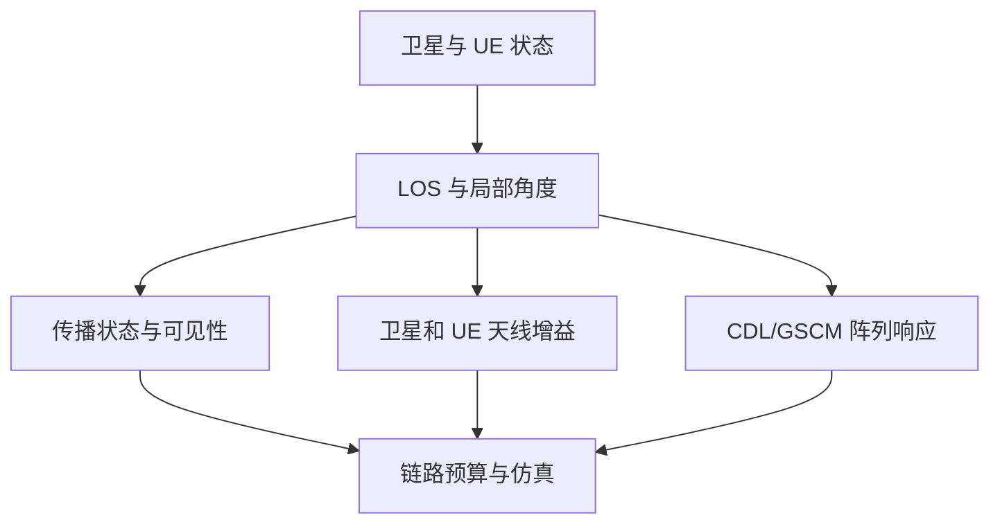
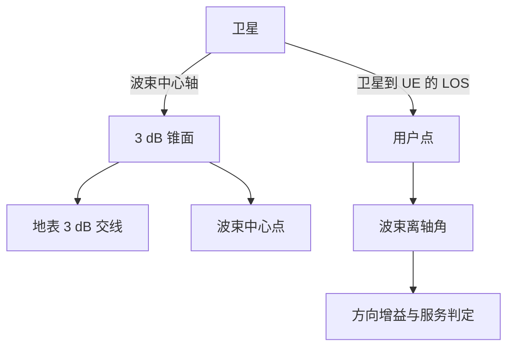
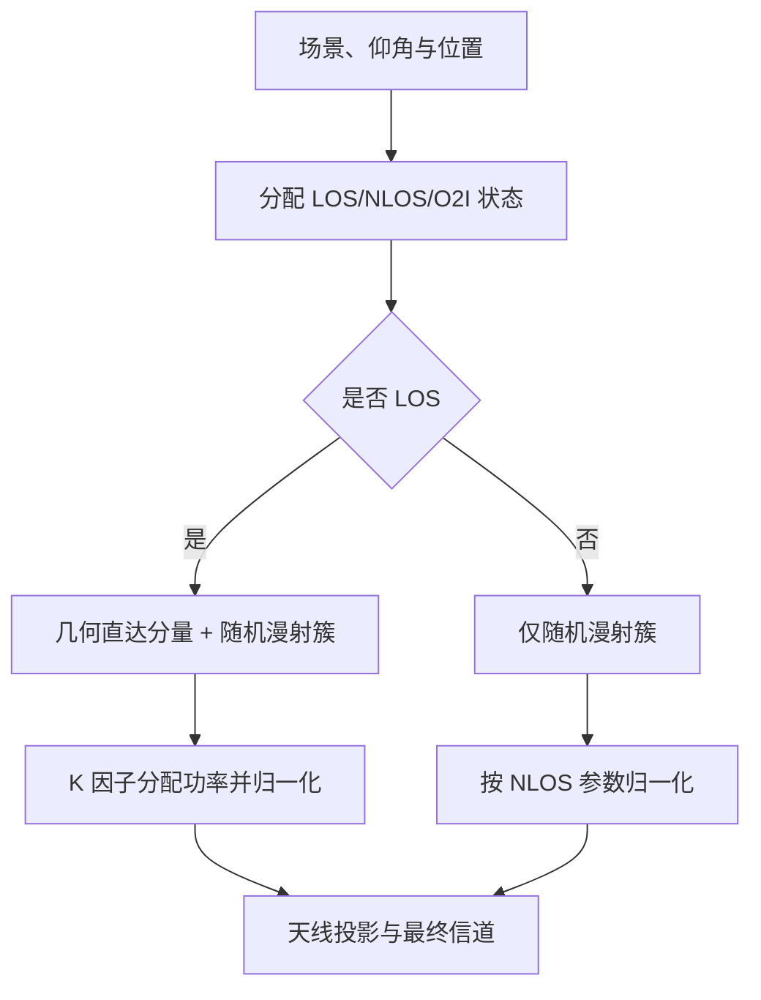
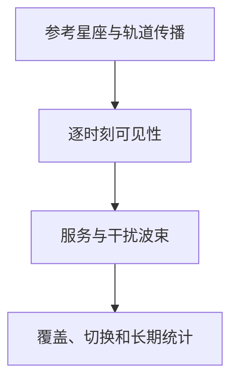
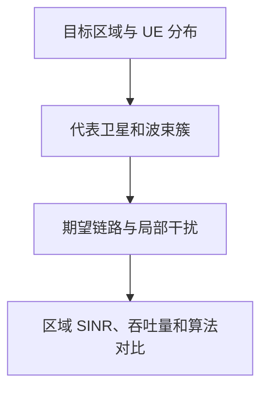

# NTN 系统学习笔记（合订版）

> 本合订版面向已经具备通信基础、希望系统掌握非地面网络（Non-Terrestrial Network，NTN）的读者。全文以第三代合作伙伴计划（3rd Generation Partnership Project，3GPP）的技术报告和相关新空口（New Radio，NR）规范为主线，按“系统对象怎样逐层变成可计算、可配置、可仿真的状态”组织。六篇单稿仍可独立查阅；本文件负责连续阅读和全文检索。

技术报告（Technical Report，TR）用于记录研究背景、影响分析、候选方案与评估结果；技术规范（Technical Specification，TS）用于规定已经规范化的字段和行为。正文中的工程解释、推导和数值例子服务于理解与复现，不自动升级为标准强制机制。

| 主章节 | 核心对象 | 主要来源 |
|---|---|---|
| 1 系统架构与部署场景 | 节点、链路、载荷与参考部署 | TR 38.811、TR 38.821 |
| 2 轨道、时间与链路几何 | 历元、坐标、斜距、时延与多普勒 | 轨道力学、IERS/EOP、TR 38.811 |
| 3 天线、波束与覆盖组织 | 方向图、离轴角、波束足迹与资源映射 | TR 38.811、TR 38.821、TR 38.901 |
| 4 传播损耗与信道模型 | 路损、附加损耗、GSCM、CDL 与 TDL | TR 38.811、TR 38.901、ITU-R P 系列 |
| 5 空口时频与协议适配 | 同步、接入、反馈重传与移动性 | TR 38.811、TR 38.821、TS 38.2xx/38.3xx |
| 6 链路、系统与多星仿真 | 波形试验、链路抽象、调度与统计 | TR 38.811、TR 38.821、前五篇接口 |

## 0 总册导航

全文主线为：

\[
\boxed{
\begin{aligned}
\text{系统与场景}
&\rightarrow \text{轨道、时间与几何}\\
&\rightarrow \text{天线、波束与覆盖}\\
&\rightarrow \text{传播损耗与信道}\\
&\rightarrow \text{空口与协议适配}\\
&\rightarrow \text{链路、系统与多星仿真}
\end{aligned}
}
\]

| 篇章 | 核心问题 | 主要输入 | 稳定输出 |
|---|---|---|---|
| [第一篇](#part-1) | NTN 中有哪些节点、链路、载荷和参考场景 | 业务与部署需求 | 系统对象与场景参数集 |
| [第二篇](#part-2) | 如何在统一时刻得到卫星与 UE 的相对几何 | 星历、历元与地面位置 | 方向、斜距、时延与公共多普勒 |
| [第三篇](#part-3) | 几何方向如何变成天线增益、波束足迹与资源关系 | LOS、姿态与天线配置 | 增益、候选波束与资源映射 |
| [第四篇](#part-4) | 平均功率与局部多径怎样共同形成时变信道 | 几何、方向图与传播环境 | 路径增益、GSCM/CDL/TDL 与抽象输入 |
| [第五篇](#part-5) | NTN 物理状态怎样影响同步、接入、反馈和移动性 | 时延、多普勒、波束与信道 | 带有效期的空口和 RRM 状态 |
| [第六篇](#part-6) | 怎样把前述状态装配成可校准的仿真 | 前五篇输出与业务算法 | BLER、吞吐、覆盖、切换与干扰统计 |

### 0.1 阅读与引用约定

- 六篇单稿保留各自的篇内编号；合订版采用“篇号.章号.节号”的全局编号，并把跨文件链接转换为内部锚点。
- 绝对传播时延、定时提前量、逻辑时序偏移和局部超额时延分别记账；公共、差分、残余多普勒与局部多普勒扩展分别记账。
- 天线方向增益、路径损耗、极化损耗、天气余量与接收合并只在其所属参考点计入一次。
- 公式附近给出变量、单位与适用条件；来源事实、工程解释、推导例子和未决问题使用不同措辞。
- PDF 目录按“篇 → 章 → 节”展开；Markdown 中可由上表进入各篇，并使用正文内部链接跳转到共享概念的所有者章节。

```{=latex}
\clearpage
```

<a id="part-1"></a>

## 1 第一篇：NTN 系统架构与部署场景

> **篇章接口：** 本篇从平台、载荷、链路和业务边界出发，建立后续全部计算共享的系统对象。它输出链路端点、场景和终端配置，但不在此求解轨道、传播或协议状态。 独立文件：[Markdown](./01_NTN系统架构与部署场景_学习笔记.md)。

| 输入 | 核心处理 | 输出 | 下游 |
|---|---|---|---|
| 业务与部署需求 | 节点、链路、载荷和参考场景建模 | 系统对象、链路端点与参数集 | 第二至第六篇 |

| 主章节 | 核心对象 | 主要来源 |
|---|---|---|
| 体系架构与业务 | 接入、节点、链路、载荷 | TR 38.811 Clauses 4.1-4.8 |
| 参考部署与终端 | D1-D5、频段、终端能力 | TR 38.811 Clauses 5.1-5.2 |
| 仿真场景入口 | 终端与平台假设 | TR 38.821 Clause 6 |
| 模块接口 | 后续五篇的输入与边界 | 本文归纳 |

### 1.1 NTN 体系架构与业务形态

Clause 4 首先回答 NTN 中“谁接入谁、信号经过哪些链路、NR 功能终止在哪里”。业务用途、直连/回传、透明/再生载荷、平台轨道和波束并不是分散概念，而是共同决定一个 NTN 系统的控制闭环、覆盖方式与移动性边界。

#### 1.1.1 业务定位与接入方式

##### 1.1.1.1 NTN 定位与用途

非地面网络（Non-Terrestrial Network，NTN）利用卫星或空中平台承载接入、中继或基站功能。它并不是简单替代地面网络，而是扩展 5G 的覆盖范围、网络韧性和大范围分发能力。

- 覆盖扩展：偏远地区、海洋、航线、荒漠、矿区等地面网络难以经济覆盖的区域。
- 网络韧性：地震、洪水、火灾等事件破坏地面设施后提供补充链路。
- 移动平台连接：飞机、船舶、列车和长途车辆。
- 广播与多播：公共预警、地图与软件更新、媒体分发。
- 广域物联网：农业、能源管线、物流和资产追踪。
- 临时覆盖：大型活动、救灾现场和临时作业区。

卫星长传播时延可能不适合某些超低时延业务，但其广覆盖和高可用性仍适合公共安全等关键通信。因此，critical communication 不能直接等同于 URLLC。

> **原文定位：**Clause 4.1；Clause 4.2.1；Table 4.2.1-1、Table 4.2.1-2。

##### 1.1.1.2 卫星接入方式

判断一个 NTN 场景时，首先要看普通 UE 的无线接口终止在哪里。

**直连接入**中，普通 UE、IoT 设备或车载终端直接通过非地面平台接入网络：

\[
\text{UE}
\rightarrow \text{非地面平台}
\rightarrow \text{Gateway/Core Network}
\]

此时普通终端本身需要面对长传播时延、大多普勒、低接收功率和波束移动。手机或 IoT 终端发射功率低、天线增益有限，上行链路更容易成为覆盖瓶颈。

**回传接入**中，普通 UE 先接入附近的地面、机载或船载小区，再由该节点通过卫星连接核心网：

\[
\text{普通 UE}
\rightarrow \text{地面/机载/船载小区}
\rightarrow \text{非地面平台}
\rightarrow \text{Gateway/Core Network}
\]

普通 UE 的第一跳仍是常规蜂窝接入；真正承担卫星链路的是基站、Relay Node 或专用卫星终端。这类节点可以配置更高功率和更强方向性的天线。

| 对比项 | 直连接入 | 回传接入 |
|---|---|---|
| 卫星直接服务对象 | 普通 UE、IoT 或车载终端 | 基站、Relay Node、机载或船载小区 |
| 普通 UE 是否向卫星发射 | 是 | 否 |
| 卫星链路终端条件 | 低功率、低增益、姿态不确定 | 可使用高功率、定向高增益天线 |
| 主要问题 | 终端上行覆盖、同步、随机接入和移动性 | 回传容量、网络架构和长控制环路 |
| D1-D5 对应 | D2、D3、D5 | D1、D4 |

Service link 表示 NTN Terminal 与卫星或空中平台之间的无线链路，并不必然等于“手机直连卫星”。NTN Terminal 既可能是普通 UE，也可能是承担小区回传的 Relay Node。

> **原文定位：**Clause 4.2.1、Clause 4.3、Clause 4.7；Figures 4.7-1-4.7-4；Table 4.7-1。

#### 1.1.2 网络组成与链路

| 组成 | 含义 | 关键关系 |
|---|---|---|
| NTN Terminal | 使用 NTN 的终端 | 可以是普通 UE、专用终端或 Relay Node |
| Service link | 终端与卫星或空中平台之间的无线链路 | 直接决定用户侧覆盖、多普勒和传播时延 |
| Space/Airborne Platform | 卫星或空中平台 | 承载透明或再生载荷 |
| Feeder link | 平台与地面 Gateway 之间的无线链路 | 网络侧馈电链路，不是普通 UE 的接入链路 |
| Gateway | 非地面接入与地面网络的连接点 | 透明载荷下，gNB 通常位于 Gateway 一侧 |
| Core Network | 5G 核心网 | 负责会话、移动性、策略和业务连接 |
| ISL/IAL | 星间或空中平台间链路 | 将业务转发到其他平台或可用 Gateway |

ISL（Inter-Satellite Link）连接卫星与卫星，IAL（Inter-Aerial Link）连接空中平台与空中平台。两者属于网络内部转发链路，不是 UE 接入链路。TR 38.811 在此建立架构概念，并未规定 ISL 的具体无线接口实现。

> **原文定位：**Clause 4.3；Figures 4.3-1、4.3-2、4.3-3A/B、4.3-4、4.3-4B/C。

#### 1.1.3 载荷处理与协议终止

##### 1.1.3.1 透明载荷

透明载荷（bent-pipe payload）主要完成射频滤波、频率变换和功率放大，然后转发信号。它不终止完整的 NR 基带与协议处理，可以把平台理解成空中的射频中继器。

- 星上处理相对简单，载荷复杂度和软件更新压力较低。
- gNB 位于地面 Gateway 一侧。
- UE 与 gNB 的控制环路同时经过 service link 和 feeder link。
- 两段无线传播共同进入一程时延和链路预算。

“透明”不表示信号完全不变。星上滤波、频率变换、相位噪声、功放非线性和转发增益仍会影响信号。

##### 1.1.3.2 再生载荷

再生载荷（regenerative payload）可以在星上完成解调、译码、交换或路由、重新编码和调制，相当于把全部或部分 gNB/Relay Node 功能放到平台上。

- service link 可以在星上终止，用户侧空口控制环路不必完整穿过 feeder link。
- 更适合结合 ISL 完成星间路由和业务转发。
- 网络自主性和灵活性更强。
- 星上处理、功耗、散热、可靠性和软件升级要求更高。

#### 1.1.4 A1-A4 架构组合

| 架构 | 直接服务对象 | 平台功能 | gNB 主要位置 | 直观理解 |
|---|---|---|---|---|
| A1 | UE | 透明转发 | 地面 | 卫星把 UE 与地面 gNB 连接起来 |
| A2 | UE | 再生处理 | 星上全部或部分 | UE 接入星上 gNB 或星上处理节点 |
| A3 | Relay Node | 透明转发 | 地面 | 卫星为地面或移动小区提供回传 |
| A4 | Relay Node | 再生处理 | 星上全部或部分 | 星上处理面向 Relay Node 的接入 |

四种架构由两个判断维度组合而成：平台直接服务普通 UE 还是 Relay Node；平台只转发射频信号，还是终止并再生 NR 信号。

> **原文定位：**Clause 4.3、Clause 4.7；Figures 4.7-1-4.7-4；Table 4.7-1。

#### 1.1.5 平台与轨道

| 平台 | 典型高度或位置 | 地面观察到的运动 | 主要优势 | 主要限制 |
|---|---:|---|---|---|
| GEO | 赤道上空约 35,786 km | 近似固定 | 覆盖稳定、单星覆盖大、切换压力小 | 时延和路径损耗大 |
| LEO | 约 600-1,500 km（报告参考） | 相对地面高速移动 | 时延和路损较低，适合终端直连 | 星座规模、切换和多普勒压力大 |
| MEO | 约 7,000-20,000 km（报告参考） | 相对地面移动 | 覆盖、时延和星座规模居中 | 仍有明显时延和移动性问题 |
| UAS/HAPS | 约 8-50 km | 可驻留，也会漂移或移动 | 链路短、局部部署灵活、时延小 | 覆盖较小，受姿态、续航和天气影响 |

GEO 与地球同步轨道不能完全互换。GEO 是赤道平面内的圆形同步轨道，从地面看近似静止；其他同步轨道若存在倾角或偏心，并不一定对地静止。NGSO 是非地球静止轨道的总称，通常包括 LEO 和 MEO。

平台高度主要影响传播时延、路径损耗、单星覆盖范围和星座规模；平台运动主要影响多普勒及其变化率、卫星可见时间、波束或小区切换和同步稳定性。

> **原文定位：**Clause 4.5；Table 4.5-1；时延和多普勒量化见 Clause 5.3。

#### 1.1.6 波束足迹、小区与波束运动

##### 1.1.6.1 波束、波束足迹与小区

| 概念 | 含义 |
|---|---|
| Beam | 天线在三维空间中的辐射方向图 |
| Beam footprint | 波束与地表相交形成的覆盖区域，常译为波束足迹或波束地面覆盖区 |
| Cell | 网络和协议层定义的小区 |

Beam footprint 通常近似为椭圆，尤其在波束斜照低仰角区域时更明显。覆盖边缘不是功率突然变为零的硬边界，可按天线增益下降、最低接收功率、最低业务可用率或最低仰角定义。

| 平台 | 典型波束足迹直径 |
|---|---:|
| GEO | 约 200-1,000 km |
| NGSO | 约 100-500 km |
| 空中平台 | 约 5-200 km |

##### 1.1.6.2 对地移动波束与对地固定波束

移动波束随平台运动扫过地面。即使 UE 静止，也会经历进入波束、靠近波束中心和离开波束，因此可能发生波束、小区或卫星切换。

对地固定波束通过机械或电子波束控制补偿平台运动，使 footprint 在一段时间内相对地面固定。它并不表示卫星静止，也不表示 UE 到卫星的传播距离和多普勒不再变化。对于 LEO，同一地理区域还可能在不同卫星之间交接。

> **原文定位：**Clause 4.6；Table 4.6-1；Figure 4.6-1。

### 1.2 参考部署与链路条件

Clause 5 的 D1-D5 把架构、平台、频段、波束和终端组合成可计算的参考部署。阅读这些场景时，应把“部署参数”和“链路能力”放在一起：轨道和载荷决定传播路径，频段和终端决定可用带宽、EIRP 与接收品质，最终共同形成时延、多普勒和覆盖约束。

#### 1.2.1 D1-D5 参考场景

Clause 5.1 将前述架构、平台、频段、波束和终端组合成五个参考部署。D1-D5 是研究与评估用的场景标签，不是五种彼此排斥的商用网络产品。

| 场景 | 平台与高度 | 频段 | 波束 | 架构与接入 | 终端与带宽 |
|---|---|---|---|---|---|
| D1 | GEO，35,786 km | Ka：DL 约 20 GHz，UL 约 30 GHz | 对地固定 | A3，Relay Node 回传 | VSAT；最高 \(2\times800\) MHz |
| D2 | GEO，35,786 km | S：DL/UL 约 2 GHz | 对地固定 | A1，普通 UE 直连、透明载荷 | 3GPP Class 3 UE；最高 \(2\times20\) MHz |
| D3 | NGSO，最低约 600 km | S：DL/UL 约 2 GHz | 对地移动 | A2，普通 UE 直连、星上处理 | 3GPP Class 3 UE；最高 \(2\times20\) MHz |
| D4 | NGSO，最低约 600 km | Ka：DL 约 20 GHz，UL 约 30 GHz | 对地固定 | A4，Relay Node 回传、星上处理 | VSAT；最高 \(2\times800\) MHz |
| D5 | UAS/HAPS，8-50 km | 低于或高于 6 GHz | 对地固定 | A2，普通 UE 直连 | Class 3 UE/VSAT；移动用最高 \(2\times80\) MHz，固定用最高 \(2\times1800\) MHz |

五个场景均采用 FDD。D1-D4 的 NTN Terminal 参考速度最高为 1,000 km/h，D5 最高为 500 km/h。D1-D4 假设终端位于室外，D5 同时考虑室内和室外。

> **原文定位：**Clause 5.1-5.2；Table 5.1-1。

#### 1.2.2 场景分类与主要矛盾

从接入对象看：

- D1、D4：卫星为地面小区或移动平台提供回传，卫星链路终端是 VSAT/Relay Node。
- D2、D3：普通 Class 3 UE 直接连接卫星。
- D5：空中平台为普通 UE 提供低时延、按需覆盖。

从平台运动看：

- D1、D2：GEO 覆盖稳定，突出超长传播时延。
- D3：低轨卫星与移动波束同时扫过地面，突出多普勒、切换和服务连续性。
- D4：低轨卫星高速运动，但通过波束控制形成对地固定覆盖；卫星切换和多普勒仍然存在。
- D5：高度低，传播时延和平台多普勒都接近地面系统量级。

从频段与终端看：

- D2、D3 使用 S 波段和 Class 3 UE，主要矛盾是普通终端的覆盖、同步和随机接入。
- D1、D4 使用 Ka 波段和 VSAT，以大带宽和定向高增益天线支持宽带或回传。
- D5 同时覆盖低于和高于 6 GHz 的移动或固定用例。

#### 1.2.3 频段与业务带宽

##### 1.2.3.1 S 波段与 Ka 波段

| 波段 | 参考频率 | 典型终端或业务 | 主要特点 |
|---|---|---|---|
| S 波段 | DL 2170-2200 MHz；UL 1980-2010 MHz | 手持 UE、IoT、移动卫星业务 | 路损和雨衰较小，对遮挡与指向误差较宽容；连续宽带频谱较少 |
| Ka 波段 | DL 19.7-21.2 GHz；UL 29.5-30.0 GHz | VSAT、卫星宽带、回传 | 可用带宽大，相同口径下易获得高天线增益；雨衰、大气损耗、相位噪声和指向误差更突出 |

手持 UE/IoT 功率低、天线近似全向，通常与较低频段匹配；VSAT 使用定向高增益天线，更适合 Ka 波段宽带接入或回传。Ka 波段可以提供更大带宽，但同时需要更严格的链路预算、射频实现和波束指向。

> **原文定位：**Clause 4.4、Clause 4.8；具体参考频率见 Clause 5.2。

##### 1.2.3.2 频谱带宽与业务速率

带宽不能直接等同于单用户速率。更完整的数量级关系是：

\[
R_{\mathrm{user}}
\approx B\,\eta\,(1-\alpha_{\mathrm{OH}})\,\rho_{\mathrm{UE}},
\]

其中，\(B\) 是分配带宽，\(\eta\) 是实际频谱效率，\(\alpha_{\mathrm{OH}}\) 表示参考信号、控制、保护间隔和重传等开销，\(\rho_{\mathrm{UE}}\) 是该用户获得的资源份额。调制编码、MIMO 层数、SNR、覆盖增强和多用户调度都会改变最终速率。

“\(2\times20\ \mathrm{MHz}\)”表示 FDD 下行和上行各有最多 20 MHz，而不是一个可任意合并的 40 MHz 单向载波。同理，\(2\times800\ \mathrm{MHz}\) 表示下行和上行分别最多 800 MHz。

所有 D1-D5 参考部署均选择 FDD。报告将其作为场景假设；从工程上看，FDD 还避免了超长传播时延下 TDD 上下行切换所需的大保护间隔。

> **原文定位：**Clause 5.1-5.2；Table 5.1-1。

#### 1.2.4 终端射频能力与链路预算

##### 1.2.4.1 终端射频能力

TR 38.811 用两类终端建立量级：定向高增益的 VSAT，以及低功率、近似全向的手持 UE/IoT。

| 指标 | VSAT | 手持 UE/IoT | 工程含义 |
|---|---:|---:|---|
| 发射功率 | 33 dBm（2 W） | 23 dBm（200 mW） | 影响上行链路预算 |
| 天线 | 60 cm 等效口径、定向高增益 | 0 dBi、近似全向 | 决定能量是否集中到卫星方向 |
| 接收噪声系数 | 1.2 dB | 9 dB | 决定接收机引入的额外噪声 |
| 极化 | 圆极化 | 线极化 | 两端组合可能产生极化失配 |

> **原文定位：**Clause 4.4；Table 4.4-1。

### 1.3 参考场景与终端类型

Clause 6.1 主要使用以下场景：

| 场景 | 轨道与载荷 | 服务链路特征 | 评估意义 |
|---|---|---|---|
| Scenario A | GEO、透明转发载荷 | 卫星相对地面近似静止，RTT 长 | GEO 覆盖、长时延和链路预算 |
| Scenario C2 | LEO、透明转发载荷、移动波束 | gNB 位于地面，卫星转发波形 | LEO 多普勒、时变覆盖与馈电链路 |
| Scenario D2 | LEO、再生载荷、移动波束 | 部分或全部 gNB 功能位于星上 | LEO 服务链路及星上处理 |

S-band 基线终端是手持 UE，载频约 2 GHz，发射功率 23 dBm、天线增益约 0 dBi；Ka-band 基线终端是 60 cm 等效口径 VSAT，下行 20 GHz、上行 30 GHz，发射功率 33 dBm，收发天线增益约 40 dBi。比较两种频段结果时，实际比较的是“频段 + 终端 + 天线 + 带宽”的整体配置，不能把差异只归因于载频。

系统级仿真用 Set-1 和 Set-2 表示两套卫星能力假设。Set-1 通常具有更大口径、更窄波束、更高 EIRP 密度和更高 G/T；Set-2 的波束更宽，但链路预算更弱。它们是参数集合，不是两种算法。

### 1.4 链路预算量的系统入口

系统场景给出发射端、传播路径和接收端，因而也确定等效全向辐射功率（Equivalent Isotropically Radiated Power，EIRP）、接收品质因数（gain-to-noise-temperature ratio，\(G/T\)）以及载噪密度比（carrier-to-noise-density ratio，\(C/N_0\)）的参考点。EIRP 描述发射功率和发射天线增益的合成能力，\(G/T\) 描述接收天线增益相对系统噪声温度的能力，\(C/N_0\) 则是传播损耗、附加损耗和接收品质共同作用后的端到端结果。终端类别决定这些量的典型范围，但不能用单一典型值替代具体链路预算。

完整公式、单位换算、Coupling Loss 和 SINR 装配见[第四篇](#part-4); 本篇只负责明确这些量属于哪一节点和哪一链路。

> **原文定位：**3GPP TR 38.811 V15.4.0，Clauses 4.2、4.3、5.2；Tables 5.2.1-1、5.2.2-1。

### 1.5 系统对象到后续建模输入的接口

| 本篇确定的对象 | 输出 | 后续主归属 |
|---|---|---|
| 平台、历元与 UE 位置 | 轨道/位置输入、链路端点 | [轨道、时间与几何](#part-2) |
| 卫星/HAPS、载荷和链路类型 | 发射端、接收端、协议终止位置 | [几何](#part-2)、[协议适配](#part-5) |
| 波束、波束足迹与小区入口 | 空间覆盖对象及管理上下文 | [天线、波束与覆盖](#part-3) |
| 场景、频段和终端 | 天线、传播、噪声与功率参数 | [传播损耗与信道](#part-4) |
| D1-D5 和业务假设 | drop、业务、负载与统计边界 | [链路、系统与多星仿真](#part-6) |

本篇不输出具体卫星位置、波束增益、路径损耗、TA 或 BLER；这些量分别由第二至第六篇计算。这个边界避免把“场景选择”与“模型求值”混成同一步。

```{=latex}
\clearpage
```

<a id="part-2"></a>

## 2 第二篇：卫星轨道、时间与链路几何

> **篇章接口：** 本篇接收第一篇给出的平台、链路端点和场景假设，把历元、轨道状态与地面位置统一到同一时间和坐标基准，输出方向、斜距、传播时延及公共多普勒。 独立文件：[Markdown](./02_卫星轨道时间与链路几何_学习笔记.md)。

| 输入 | 核心处理 | 输出 | 下游 |
|---|---|---|---|
| 轨道/星历、历元、UE位置和链路端点 | 轨道传播、坐标变换与相对几何 | 位置、LOS、斜距、时延与公共多普勒 | 第三至第六篇 |

| 主章节 | 核心对象 | 主要来源 |
|---|---|---|
| 轨道状态 | 六根数、传播、位置和速度 | 轨道力学资料 |
| 坐标与方向 | PQW、ECI、ECEF、LLA、ENU、星体坐标 | 轨道/大地测量资料 |
| 时间与链路 | 历元、传播时刻、时延、多普勒 | TR 38.811 Clause 5.3 |
| 计算接口 | 输入、更新周期和输出 | 本文归纳 |

### 2.1 六根数与卫星状态

#### 2.1.1 轨道、位置与状态的关系

“卫星在某条轨道上”和“卫星此刻位于哪里”是两个不同问题：

- 轨道的大小、形状和空间朝向决定卫星可能经过的空间曲线；
- 卫星在轨道上的相位决定卫星在给定时刻的具体位置；
- 卫星位置和速度共同构成该时刻的轨道状态。

因此，完整确定卫星状态至少需要：

1. 一组六根数，用来描述轨道和卫星在参考时刻的位置；
2. 轨道根数对应的历元 \(t_0\)；
3. 从历元传播到目标时刻 \(t\) 的轨道模型；
4. 明确的参考坐标系和时间尺度。

如果只有“轨道高度为 600 km”，只能近似确定圆轨道半径，不能确定轨道倾角、轨道平面方向以及卫星此刻所在的位置。

#### 2.1.2 经典开普勒六根数

经典开普勒六根数可以写成：

\[
\left\{a_{\mathrm{orb}},e,i,\Omega,\omega,\nu_0\right\}
\]

其中：

| 轨道根数 | 名称 | 物理作用 |
|---|---|---|
| \(a_{\mathrm{orb}}\) | 半长轴 | 决定轨道尺度和轨道周期 |
| \(e\) | 偏心率 | 决定轨道形状，\(e=0\) 为圆轨道 |
| \(i\) | 轨道倾角 | 决定轨道平面相对赤道面的倾斜程度 |
| \(\Omega\) | 升交点赤经 | 决定升交线在赤道面内的方向 |
| \(\omega\) | 近地点幅角 | 决定近地点在轨道平面内的方向 |
| \(\nu_0\) | 历元处真近点角 | 决定卫星在历元 \(t_0\) 时位于轨道上的哪个位置 |

前三个量 \(a_{\mathrm{orb}},e,i\) 主要描述轨道的大小、形状和倾斜程度；\(\Omega,\omega\) 确定轨道在三维空间中的朝向；最后的 \(\nu_0\) 确定卫星在该轨道上的瞬时相位。

在轨道传播中，第六个量经常改用历元处的平均近点角 \(M_0\)：

\[
\left\{a_{\mathrm{orb}},e,i,\Omega,\omega,M_0;t_0\right\}
\]

这种写法更适合从 \(t_0\) 传播到任意时刻 \(t\)。因此，“六根数”并不意味着不需要历元；没有 \(t_0\)，就不能解释 \(M_0\) 或 \(\nu_0\) 对应的是哪个时刻。

#### 2.1.3 六根数确定轨道的几何过程

可以将六根数的作用理解为连续完成四件事。

##### 2.1.3.1 确定轨道椭圆

半长轴和偏心率决定椭圆的大小与形状。半通径为：

\[
p=a_{\mathrm{orb}}\left(1-e^2\right)
\]

当卫星真近点角为 \(\nu\) 时，地心距为：

\[
r=\frac{p}{1+e\cos\nu}
\]

对于半径近似不变的圆轨道，\(e\approx 0\)，于是 \(r\approx a_{\mathrm{orb}}\)。若地球平均半径为 \(R_{\mathrm E}\)，圆轨道高度近似为：

\[
h\approx a_{\mathrm{orb}}-R_{\mathrm E}
\]

##### 2.1.3.2 确定轨道平面

轨道倾角 \(i\) 和升交点赤经 \(\Omega\) 共同确定轨道平面：

- \(i\) 表示轨道平面相对赤道面的倾斜角；
- \(\Omega\) 表示卫星从南向北穿过赤道时，升交点相对参考方向的位置。

仅给出倾角不能唯一确定轨道平面，因为具有相同倾角的轨道可以绕地轴旋转到不同方向。

##### 2.1.3.3 确定近地点方向

近地点幅角 \(\omega\) 从升交点开始，在轨道平面内量到近地点。它确定椭圆长轴在轨道平面中的方向。

对于严格圆轨道，近地点不存在唯一方向，此时 \(\omega\) 和 \(\nu\) 会退化。工程上常使用纬度幅角：

\[
u=\omega+\nu
\]

直接描述卫星相对升交点的轨道内角位置。

##### 2.1.3.4 确定卫星轨道相位

真近点角 \(\nu\) 或平均近点角 \(M\) 确定卫星当前位于轨道的哪个位置。前五个根数相同而第六个根数不同的两颗卫星，可以位于同一轨道的不同位置。

星座设计中的相位配置，本质上就是为多颗卫星安排不同的轨道平面和轨道内位置。

#### 2.1.4 从历元传播到目标时刻

在二体模型下，平均角速度为：

\[
n=\sqrt{\frac{\mu}{a_{\mathrm{orb}}^3}}
\]

其中 \(\mu\) 为地球标准引力参数。目标时刻 \(t\) 的平均近点角为：

\[
M(t)=M_0+n(t-t_0)
\]

对椭圆轨道，平均近点角 \(M\)、偏近点角 \(E\) 和真近点角 \(\nu\) 之间满足：

\[
M=E-e\sin E
\]

\[
\nu=2\operatorname{atan2}\!\left(
\sqrt{1+e}\sin\frac{E}{2},
\sqrt{1-e}\cos\frac{E}{2}
\right)
\]

计算时通常先由 \(M\) 数值求解开普勒方程得到 \(E\)，再得到 \(\nu\) 和地心距 \(r\)。对于 NTN 基础仿真，牛顿迭代即可完成开普勒方程求解。

#### 2.1.5 轨道近焦坐标系中的位置和速度

轨道近焦坐标系 PQW 固定在轨道平面内：

- \(P\) 轴指向近地点；
- \(Q\) 轴位于轨道平面内，与 \(P\) 轴正交；
- \(W\) 轴沿轨道角动量方向。

卫星在 PQW 坐标系中的位置为：

\[
\boldsymbol r_{\mathrm{PQW}}
=
\frac{p}{1+e\cos\nu}
\begin{bmatrix}
\cos\nu\\
\sin\nu\\
0
\end{bmatrix}
\]

速度为：

\[
\boldsymbol v_{\mathrm{PQW}}
=
\sqrt{\frac{\mu}{p}}
\begin{bmatrix}
-\sin\nu\\
e+\cos\nu\\
0
\end{bmatrix}
\]

这一步只在轨道自身的二维平面内计算，不涉及地球经纬度。

#### 2.1.6 从轨道平面到地固坐标：为什么需要 ECI

由开普勒方程得到的位置和速度首先在轨道近焦坐标系 PQW 中表达。PQW 只服务于当前轨道平面，不能直接与固定在地球表面的 UE、其他轨道平面或地球自转统一比较。地心惯性坐标系（Earth-Centered Inertial，ECI）提供共同的三维惯性参考，使轨道平面的姿态和速度传播可以在同一框架下描述；地面用户通常固定在地心地固坐标系（Earth-Centered Earth-Fixed，ECEF）中，因此还必须依据计算时刻把 ECI 状态变换到 ECEF，才能形成卫星—UE 相对几何。

这里不是把卫星从一个物理空间“搬到”另一个空间，而是让**同一个卫星状态先在便于求解轨道运动的 PQW 中表达，再旋转到便于统一描述三维惯性运动的 ECI，最后依据地球自转表达为 ECEF**。


在本文采用的旋转约定下，位置和速度使用同一个变换：

\[
\boldsymbol r_{\mathrm{ECI}}
=
\boldsymbol C_{\mathrm{ECI}\leftarrow\mathrm{PQW}}
\boldsymbol r_{\mathrm{PQW}}
\]

\[
\boldsymbol v_{\mathrm{ECI}}
=
\boldsymbol C_{\mathrm{ECI}\leftarrow\mathrm{PQW}}
\boldsymbol v_{\mathrm{PQW}}
\]

其中：

\[
\boldsymbol C_{\mathrm{ECI}\leftarrow\mathrm{PQW}}
=
\boldsymbol R_3(\Omega)
\boldsymbol R_1(i)
\boldsymbol R_3(\omega)
\]

旋转顺序对应：先在轨道平面内确定近地点方向，再设置轨道倾角，最后将升交线旋转到升交点赤经 \(\Omega\) 对应的方向。

令纬度幅角 \(u=\omega+\nu\)，位置分量也可以直接写成：

\[
\begin{aligned}
x_{\mathrm I}
&=r\left(\cos\Omega\cos u-\sin\Omega\sin u\cos i\right),\\
y_{\mathrm I}
&=r\left(\sin\Omega\cos u+\cos\Omega\sin u\cos i\right),\\
z_{\mathrm I}
&=r\sin u\sin i.
\end{aligned}
\]

这组公式直观地表明：\(u\) 决定卫星沿轨道运动的位置，\(i\) 和 \(\Omega\) 决定该位置如何嵌入三维空间。

不同资料对基本旋转矩阵 \(\boldsymbol R_1,\boldsymbol R_3\) 的主动/被动旋转定义可能不同，因而会出现矩阵转置、符号或相乘次序差异。实现时必须统一约定，并用一个已知轨道点同时检查位置和速度，不能只比较公式外观。

卫星的物理位置本身不天然属于某个坐标系。同一个空间点可以用 ECI、ECEF 或其他坐标系表示。轨道状态通常先在 ECI 或近似惯性坐标系中计算，原因是：

1. 二体引力方程在惯性系中形式最简单；
2. ECI 不随地球表面共同旋转，便于描述轨道平面；
3. 由开普勒根数构造的 PQW 状态可以直接旋转到惯性系。

因此，准确说法应是：**轨道传播通常选择在惯性参考系中完成，而不是卫星位置天然处于 ECI。**

还需要注意，SGP4 根据 TLE 输出的常见参考系为 TEME（True Equator, Mean Equinox），它是惯性型参考系，但不能在高精度处理中无条件等同于 J2000、GCRF 或笼统的“ECI”。NTN 教学仿真可以把它作为惯性状态入口，但坐标转换必须采用与 SGP4/TEME 匹配的实现。

#### 2.1.7 TLE 与 SGP4 的使用边界

TLE 中保存的是与 SGP4 模型配套的平均轨道根数，不是可以任意代入纯二体开普勒公式的瞬时密切根数。其平均运动、阻力相关参数和其他字段共同服务于 SGP4 传播。

实际 NTN 仿真建议采用两条路线之一：

- **理论路线：**人为设置圆轨道或经典六根数，使用二体模型传播，用于理解几何、时延和多普勒；
- **实际星历路线：**读取 TLE，使用经过验证的 SGP4 库得到卫星位置和速度，再进行坐标变换和链路计算。

不建议读取 TLE 后只取出几个字段，再使用简单开普勒公式长期外推。TLE 的生成和使用都与 SGP4 模型相关。

---

### 2.2 坐标变换与卫星—UE 几何

#### 2.2.1 坐标变换的总体计算链

第 2.1 章已经从六根数得到了卫星在惯性空间中的位置和速度：

\[
\left(\boldsymbol r_{s,\mathrm I}(t),
\boldsymbol v_{s,\mathrm I}(t)\right)
\]

但这两个状态量还不能直接回答通信链路中的问题。地面 UE 通常用经纬高表示，并随地球共同旋转；卫星波束又定义在卫星本体或天线坐标系中。只有把不同对象统一到适合的坐标系，才能进一步得到：

- 卫星是否在 UE 的可见范围内；
- 卫星—UE 的斜距和传播时延；
- UE 观察卫星的方位角和仰角；
- UE 位于哪个卫星波束内，以及对应的离轴增益；
- 卫星—UE 距离变化多快，以及由此产生多大的多普勒频移。

因此，坐标变换不是单纯为了改变一组三维数字的表达形式，而是把“轨道状态”转换成“通信链路所需的几何量”。对于给定卫星、UE 和计算时刻 \(t\)，地面链路几何可以按以下主链计算：

\[
\boxed{
\text{轨道根数与历元}
\rightarrow
\left(\boldsymbol r_{s,\mathrm I},\boldsymbol v_{s,\mathrm I}\right)
\rightarrow
\left(\boldsymbol r_{s,\mathrm E},\boldsymbol v_{s,\mathrm E}\right)
\rightarrow
\boldsymbol\rho_{u\rightarrow s,\mathrm E}
\rightarrow
\boldsymbol\rho_{u\rightarrow s,\mathrm{ENU}}
}
\]

其中下标 \(s\) 表示卫星，\(u\) 表示 UE，\(\mathrm I\) 表示 ECI，\(\mathrm E\) 表示 ECEF。这条链依次完成：

1. 将卫星轨道状态传播到目标时刻；
2. 将卫星位置转换到随地球旋转的 ECEF；
3. 将 UE 的经纬高转换到同一个 ECEF；
4. 在共同坐标系中构造卫星—UE 视距向量；
5. 转到 UE 局部 ENU，得到方位角、仰角和斜距。

若还要判断 UE 落在哪个卫星波束中，则需要进一步引入卫星姿态和波束指向：

\[
\boldsymbol\rho_{s\rightarrow u}
\rightarrow
\text{卫星本体坐标系}
\rightarrow
\text{与各波束中心方向比较}
\]

最终得到的几何量与通信模型之间具有直接对应关系：

| 几何量 | 获得方式 | 后续用途 |
|---|---|---|
| 斜距 \(d\) | 卫星与 UE 的位置差 | 传播时延、自由空间损耗、链路预算 |
| 方位角 \(A\) | LOS 转到 UE 局部 ENU | UE 天线指向、可见卫星跟踪 |
| 仰角 \(\varepsilon\) | LOS 转到 UE 局部 ENU | 可见性、最低仰角、大气损耗和场景参数选择 |
| 离轴角 \(\alpha_k\) | LOS 转到卫星本体坐标系 | 波束归属、卫星天线方向增益 |
| 距离变化率 \(\dot d\) | LOS 上的相对速度投影 | 多普勒频移和多普勒变化率 |

后续各小节按照这条链展开，每一次坐标变换都对应一个明确的通信输出量。

#### 2.2.2 ECI 与 ECEF

ECI 的坐标轴不随地球表面共同旋转，适合轨道传播。ECEF 与地球固连，地面固定 UE 的 ECEF 坐标在忽略板块运动时近似不变。

这里首先进行 ECI 到 ECEF 的变换，是因为第 2.1 章得到的卫星状态通常位于惯性系，而 UE、网关、服务区边界和地面波束脚印通常用经纬度或 ECEF 表示。把卫星转换到 ECEF 后，卫星和地面对象才能在同一幅“随地球旋转的地图”上比较。

在仅考虑地球自转的简化模型中，ECI 到 ECEF 的位置变换可写为：

\[
\boldsymbol r_{\mathrm E}(t)
=
\boldsymbol C_{\mathrm E\leftarrow\mathrm I}(t)
\boldsymbol r_{\mathrm I}(t)
\]

本文显式采用：

\[
\boldsymbol C_{\mathrm E\leftarrow\mathrm I}(t)
=
\begin{bmatrix}
\cos\theta(t) & \sin\theta(t) & 0\\
-\sin\theta(t) & \cos\theta(t) & 0\\
0 & 0 & 1
\end{bmatrix}
\]

其中 \(\theta(t)\) 为计算时刻对应的地球自转角。显式写出矩阵可以避免不同教材对 \(\boldsymbol R_3(\theta)\) 正负号定义不同造成的混淆。

速度不能只套用同一个旋转矩阵。由于 ECEF 自身在旋转，有：

\[
\boldsymbol v_{\mathrm E}
=
\boldsymbol C_{\mathrm E\leftarrow\mathrm I}
\left(
\boldsymbol v_{\mathrm I}
-\boldsymbol\omega_{\mathrm E}\times\boldsymbol r_{\mathrm I}
\right)
\]

其中 \(\boldsymbol\omega_{\mathrm E}\) 为地球自转角速度向量。位置变换的输出用于计算卫星相对 UE 的斜距和观察角；速度变换的输出用于计算距离变化率和多普勒。若只关心某一时刻的静态覆盖，可以先计算位置；若要分析多普勒，则位置和速度必须同时保持坐标系一致。

高精度 ECI/ECEF 转换还会包括岁差、章动、极移和地球定向参数。普通 NTN 链路级仿真可先采用“地球绕固定 \(z\) 轴旋转”的简化模型；若使用 TLE/SGP4 或高精度星历，应直接调用与数据参考系匹配的坐标转换库。

#### 2.2.3 LLA 到 ECEF

卫星已经转换到 ECEF，但 UE 的原始输入通常是纬度 \(\phi\)、经度 \(\lambda\) 和椭球高 \(h_u\)。经纬高是便于描述地理位置的曲线坐标，不能直接与卫星的三维笛卡尔坐标相减。因此，需要先把 UE 也转换到 ECEF。

采用 WGS-84 椭球时，定义卯酉圈曲率半径：

\[
N(\phi)
=
\frac{a_{\mathrm E}}
{\sqrt{1-e_{\mathrm E}^2\sin^2\phi}}
\]

其中 \(a_{\mathrm E}\) 为地球椭球长半轴，\(e_{\mathrm E}\) 为地球椭球第一偏心率。UE 的 ECEF 坐标为：

\[
\begin{aligned}
x_u&=\left[N(\phi)+h_u\right]\cos\phi\cos\lambda,\\
y_u&=\left[N(\phi)+h_u\right]\cos\phi\sin\lambda,\\
z_u&=\left[N(\phi)(1-e_{\mathrm E}^2)+h_u\right]\sin\phi.
\end{aligned}
\]

这些公式来自参考椭球几何：赤道方向和极轴方向的曲率不同，因此不能简单地把地球半径 \(R_{\mathrm E}\) 同时乘到三个球坐标分量上。

需要区分两个容易混淆的量：

- \(a_{\mathrm{orb}}\)：卫星轨道半长轴；
- \(a_{\mathrm E}\)：WGS-84 地球椭球长半轴。

二者在部分教材中都写成 \(a\)，但物理含义完全不同。

#### 2.2.4 UE 到卫星的相对向量

完成卫星 ECI 到 ECEF 的转换，并把 UE 的 LLA 转换为 ECEF 后，两者处于同一坐标系。UE 指向卫星的视距向量为：

\[
\boldsymbol\rho_{u\rightarrow s,\mathrm E}
=
\boldsymbol r_{s,\mathrm E}
-
\boldsymbol r_{u,\mathrm E}
\]

斜距为：

\[
 d
=
\left\|\boldsymbol\rho_{u\rightarrow s,\mathrm E}\right\|
\]

相对向量是后续几何计算的共同入口：向量长度给出斜距，单位方向给出 LOS，位置差随时间的变化给出距离变化率。斜距进一步决定最基本的传播量：

\[
\tau_{\mathrm{abs}}=\frac{d}{c}
\]

\[
L_{\mathrm{FS}}
=
\left(\frac{4\pi d}{\lambda_c}\right)^2
\]

其中 \(\tau\) 为单程自由空间传播时延，\(L_{\mathrm{FS}}\) 为自由空间路径损耗的线性值，\(\lambda_c\) 为载波波长。因此，同一个斜距同时进入时间模型和链路预算。

这里并不需要“先构造 \(\boldsymbol\rho_{\mathrm{ECI}}\)”才能计算 UE 几何。只要卫星和 UE 处于同一个参考系，相对向量就可以直接相减。对于地面观察角，ECEF 是最自然的中间坐标系。

也可以先把 UE 从 ECEF 转到 ECI，再在 ECI 中相减，但这通常会增加不必要的转换步骤。两种方法理论上等价，前提是使用相同的时刻和一致的坐标定义。

#### 2.2.5 ECEF 到 UE 局部 ENU

ECEF 适合做全球位置相减，但不便于直接解释“卫星在 UE 的哪个方向”。UE 侧的天线指向、最低仰角和可见性判断都以当地水平面为参考，因此要把 LOS 转换到 UE 的局部 ENU 坐标系：

\[
\boldsymbol\rho_{u\rightarrow s,\mathrm{ENU}}
=
\boldsymbol C_{\mathrm{ENU}\leftarrow\mathrm E}
\boldsymbol\rho_{u\rightarrow s,\mathrm E}
\]

其中：

\[
\boldsymbol C_{\mathrm{ENU}\leftarrow\mathrm E}
=
\begin{bmatrix}
-\sin\lambda & \cos\lambda & 0\\
-\sin\phi\cos\lambda & -\sin\phi\sin\lambda & \cos\phi\\
\cos\phi\cos\lambda & \cos\phi\sin\lambda & \sin\phi
\end{bmatrix}
\]

令：

\[
\boldsymbol\rho_{u\rightarrow s,\mathrm{ENU}}
=
\begin{bmatrix}E&N&U\end{bmatrix}^{\mathrm T}
\]

则方位角和仰角分别为：

\[
A=\operatorname{atan2}(E,N)
\]

\[
\varepsilon
=
\operatorname{atan2}
\left(U,\sqrt{E^2+N^2}\right)
\]

方位角通常从正北方向开始顺时针计量，计算后可映射到 \([0,2\pi)\)。方位角用于 UE 天线或跟踪机构的水平指向；仰角用于判断卫星是否可见，并进一步选择与仰角相关的大气损耗、阴影衰落和信道参数。当 \(\varepsilon\) 小于系统设定的最小仰角时，即使不存在纯几何地球遮挡，链路也可能不被纳入可服务范围。

#### 2.2.6 UE 仰角与卫星波束方向

UE 观察卫星时使用：

\[
\boldsymbol\rho_{u\rightarrow s}
=
\boldsymbol r_s-\boldsymbol r_u
\]

卫星向 UE 发射或接收波束时使用相反方向：

\[
\boldsymbol\rho_{s\rightarrow u}
=
\boldsymbol r_u-\boldsymbol r_s
=
-\boldsymbol\rho_{u\rightarrow s}
\]

这两个向量长度相同，但方向相反：

- 计算 UE 的方位角和仰角，应使用 UE 指向卫星的向量；
- 判断 UE 位于卫星哪个波束内，应使用卫星指向 UE 的向量。

因此，波束判定不是简单复用 UE 的 ENU 角度，而是需要把卫星到 UE 的 LOS 方向转换到卫星本体坐标系或卫星天线坐标系。

#### 2.2.7 Nadir、卫星姿态与多个波束

UE 侧 ENU 已经给出了“UE 如何看到卫星”，但波束判定需要回答相反的问题：“卫星天线如何看到 UE”。因此需要一个随卫星姿态运动的本体坐标系，把卫星到 UE 的 LOS 与各个波束中心方向放在同一个坐标系中比较。

Nadir 是从卫星指向地心附近的方向：

\[
\hat{\boldsymbol z}_{\mathrm{nadir}}
=
-\frac{\boldsymbol r_s}{\|\boldsymbol r_s\|}
\]

“卫星采用 nadir pointing”通常表示卫星平台或天线参考轴大致保持对地，而不是所有波束都指向地心。多波束卫星可以通过馈源阵列或相控阵，在 nadir 周围形成多个不同离轴方向的波束：

- 中心波束的波束中心可能接近 nadir；
- 其他波束具有不同的离轴角和方位；
- 电子扫描可以使波束脚印随星移动，也可以近似保持对地固定；
- 卫星本体姿态、天线安装矩阵和电子波束权值共同决定实际波束方向。

在简化的对地姿态模型中，可以构造一个卫星局部本体坐标系。例如：

\[
\hat{\boldsymbol z}_{\mathrm B}
=
-\frac{\boldsymbol r_s}{\|\boldsymbol r_s\|}
\]

\[
\hat{\boldsymbol y}_{\mathrm B}
=
-\frac{\boldsymbol r_s\times\boldsymbol v_s}
{\|\boldsymbol r_s\times\boldsymbol v_s\|}
\]

\[
\hat{\boldsymbol x}_{\mathrm B}
=
\hat{\boldsymbol y}_{\mathrm B}
\times
\hat{\boldsymbol z}_{\mathrm B}
\]

在近圆轨道下，\(\hat{\boldsymbol x}_{\mathrm B}\) 近似沿飞行方向，\(\hat{\boldsymbol z}_{\mathrm B}\) 指向地面，三者构成右手坐标系。具体工程项目可能采用不同的本体轴定义，因此仿真配置中必须明确轴方向。

<a id="geometry-los-rate"></a>

#### 2.2.8 LOS 距离变化率与方向变化率

斜距回答“卫星离 UE 多远”，距离变化率回答“这个距离变化得多快”，LOS 单位向量变化率回答“视线方向转得多快”。前者决定公共径向多普勒和传播时延变化率，后者决定方位角、仰角、离轴角和波束指向的更新速率。

所有位置和速度必须在**同一坐标系、同一参考时刻**下计算。定义

\[
\boldsymbol\rho=\boldsymbol r_s-\boldsymbol r_u,
\qquad
\boldsymbol v_{\mathrm{rel}}=\boldsymbol v_s-\boldsymbol v_u,
\qquad
d=\|\boldsymbol\rho\|,
\qquad
\hat{\boldsymbol\ell}_{u\rightarrow s}=\frac{\boldsymbol\rho}{d}.
\]

对距离求导：

\[
\dot d
=
\frac{\boldsymbol\rho^{\mathsf T}\dot{\boldsymbol\rho}}{\|\boldsymbol\rho\|}
=
\hat{\boldsymbol\ell}_{u\rightarrow s}^{\mathsf T}\boldsymbol v_{\mathrm{rel}}.
\]

这一步只保留相对速度的径向分量。再对单位 LOS 向量使用商法则：

\[
\dot{\hat{\boldsymbol\ell}}_{u\rightarrow s}
=
\frac{1}{d}
\left(
\boldsymbol I-
\hat{\boldsymbol\ell}_{u\rightarrow s}
\hat{\boldsymbol\ell}_{u\rightarrow s}^{\mathsf T}
\right)
\boldsymbol v_{\mathrm{rel}}.
\]

投影矩阵 \(\boldsymbol I-\hat{\boldsymbol\ell}\hat{\boldsymbol\ell}^{\mathsf T}\) 去掉径向速度，只保留横向速度。两类导数的职责因此不同：

| 相对速度分量 | 直接输出 | 主要下游影响 |
|---|---|---|
| 径向分量 | \(\dot d\) | 距离、绝对传播时延、公共多普勒 |
| 横向分量 | \(\dot{\hat{\boldsymbol\ell}}\) | 方位角/仰角、天底角、波束离轴角、波束跟踪速率 |

对于载频 \(f_c\)，采用“距离增大为正”的约定时，多普勒频移可以写为：

\[
f_{D,\mathrm{common}}
=
-\frac{f_c}{c}\dot d
\]

如果 \(\dot d<0\)，卫星与 UE 接近，接收频率升高；如果 \(\dot d>0\)，两者远离，接收频率降低。由此可见，轨道速度不能直接代入多普勒公式，必须先投影到 LOS 方向。不同通信模型可能采用相反的多普勒符号约定，实现时应同时检查复指数定义。

---

### 2.3 UE 仰角、天底角与地心角

同一条星地射线会产生三个不同顶点的角度：

| 几何量 | 顶点 | 两条边 | 工程含义 |
|---|---|---|---|
| 地面仰角 \(\varepsilon\) | 地面点 \(P\) | 当地水平线与 \(P\rightarrow S\) | UE 看卫星有多高 |
| 天底角 \(\theta_{\mathrm{nadir}}\) | 卫星 \(S\) | \(S\rightarrow O\) 与 \(S\rightarrow P\) | LOS 相对天底方向偏离多少 |
| 地心角 \(\psi\) | 地心 \(O\) | \(O\rightarrow N\) 与 \(O\rightarrow P\) | 地面点离星下点 \(N\) 多远 |

这三个角不能互换。特别是“地面仰角为 \(45^\circ\)”并不表示卫星天线偏离天底 \(45^\circ\)。

完整 NTN 模型中的角度进入不同计算层，并非只有仰角有用：

| 角度 | 参考方向 | 主要影响 | 可弱化的条件 |
|---|---|---|---|
| UE 仰角 \(\varepsilon\) | UE 局部水平面 | 可见性、斜距、LOS 概率、阴影衰落和 LSP 选择 | NTN 几何与传播模型中不能整体省略 |
| UE 方位角 | UE 局部北/东轴 | UE 阵列响应、极化、本地散射方向和波束扫描 | UE 为各向同性标量天线时 |
| 天底角 \(\theta_{\mathrm{nadir}}\) | 卫星指向地心/星下点方向 | 覆盖几何、地面交点和天底波束关系 | 已有等价一般波束轴描述时 |
| 波束离轴角 \(\theta_{\mathrm{off},k}\) | 第 \(k\) 个波束中心轴 | 波束增益、3 dB 轮廓、服务判定和邻波束干扰 | 把卫星增益简化为常数时 |
| 地心夹角 \(\psi\) | 地心处两条半径 | 地表距离、覆盖范围和可见弧段 | 已知等价地表几何量时 |
| AOA/AOD/ZOA/ZOD | 收发端局部阵列坐标 | CDL/GSCM 阵列响应、空间相关、极化和 MIMO 信道 | 纯 SISO/TDL 等效模型时 |



```{=latex}
\begin{figure}[htbp]
\centering
\begin{tikzpicture}[>=Stealth,scale=0.93]
  \coordinate (O) at (0,0);
  \coordinate (N) at (0,2.2);
  \coordinate (S) at (0,5.0);
  \coordinate (P) at (1.62,1.49);
  \coordinate (T1) at (0.92,2.25);
  \coordinate (T2) at (2.32,0.73);
  \draw[fill=softblue,draw=deepblue,thick] (O) circle (2.2);
  \draw[deepblue!45,dashed] (O) -- (S);
  \draw[deepblue!65,thick] (O) -- (P);
  \draw[very thick,accentorange] (S) -- (P) node[midway,right=3pt,black] {$d$};
  \draw[gray!75,dashed] (T1) -- (T2);
  \fill[deepblue] (O) circle (2pt) node[below left] {地心 $O$};
  \fill[deepblue] (N) circle (2pt) node[above left=2pt] {星下点 $N$};
  \fill[accentorange] (S) circle (2.6pt) node[above] {卫星 $S$};
  \fill[deepblue] (P) circle (2.6pt);
  \node[deepblue,anchor=west] at (1.92,1.78) {地面点 $P$};
  \pic[draw=accentorange,thick,"$\theta_{\mathrm{nadir}}$",angle eccentricity=1.35,angle radius=8mm] {angle=O--S--P};
  \pic[draw=tealblue,thick,"$\psi$",angle eccentricity=1.35,angle radius=8mm] {angle=P--O--N};
  \pic[draw=accentorange,thick,"$\varepsilon$",angle eccentricity=1.45,angle radius=7mm] {angle=S--P--T1};
  \node[font=\small,anchor=west] at (2.30,0.74) {当地水平线};
  \node[anchor=west,align=left,font=\small] at (3.15,3.55) {$R_E=OP=ON$\\$R_s=OS=R_E+h$};
\end{tikzpicture}
\caption{球形地球上的星地几何：UE 仰角、天底角和地心角。图形不按 GEO 高度比例绘制。}
\end{figure}
```

令从地面点 \(P\) 指向卫星的单位向量为 \(\widehat{\mathbf l}\)。由于仰角 \(\varepsilon\) 是视线相对当地水平面的夹角，地面径向量与视线的点积为

\[
\mathbf r_p^{\mathsf T}\widehat{\mathbf l}
=R_E\sin\varepsilon.
\]

卫星位置可写为 \(\mathbf r_s=\mathbf r_p+d\widehat{\mathbf l}\)。令 \(R_s=R_E+h\)，对其模平方可得

\[
R_s^2
=\|\mathbf r_p+d\widehat{\mathbf l}\|^2
=R_E^2+d^2+2R_Ed\sin\varepsilon.
\]

这是关于 \(d\) 的二次方程。取能够给出 \(d>0\) 的根，斜距为

\[
d
=-R_E\sin\varepsilon
+\sqrt{R_s^2-R_E^2\cos^2\varepsilon},
\]

所以根号前的 \(-R_E\sin\varepsilon\) **不是笔误**。它来自二次方程求根；若改成正号，会把卫星沿视线方向的位置重复加上一段地球半径投影。两个极端情况也能校验该符号：当 \(\varepsilon=90^\circ\) 时，\(d=R_s-R_E=h\)；当 \(\varepsilon=0^\circ\) 时，\(d=\sqrt{R_s^2-R_E^2}\)，正好是地平线切线距离。

并有

\[
\sin\theta_{\mathrm{nadir}}=\frac{R_E}{R_s}\cos\varepsilon,
\qquad
\psi=90^\circ-\varepsilon-\theta_{\mathrm{nadir}}.
\]

以 GEO 基线为例，取 \(R_E=6371\ \mathrm{km}\)、\(R_s=42157\ \mathrm{km}\)、地面目标仰角 \(\varepsilon=45^\circ\)，则

\[
d\approx37411\ \mathrm{km},
\qquad
\theta_{\mathrm{nadir}}\approx6.13^\circ,
\qquad
\psi\approx38.87^\circ.
\]

于是中心波束在 UV 平面中的径向坐标为

\[
\sqrt{u_0^2+v_0^2}=\sin\theta_{\mathrm{nadir}}\approx0.1069.
\]

若选择 \(u\) 轴朝向该地面目标，则得到 TR 38.821 Table 6.1.1.1-6 中的 \((u_0,v_0)=(0.107,0)\)。这说明表中的 \(0.107\) 是方向余弦，\(45^\circ\) 是 UE 仰角，\(6.13^\circ\) 是相对天底方向的 \(\theta_{\mathrm{nadir}}\)。只有当该波束中心轴指向天底时，它才同时等于波束离轴角；LEO 天底波束面向星下点时 \(\theta_{\mathrm{nadir}}=0\)，中心坐标为 \((0,0)\)。

### 2.4 NTN 相关时间

#### 2.4.1 时间作为几何状态的共同索引

第 2.2 章说明了如何在某一个时刻得到斜距、方位角、仰角、波束离轴角和距离变化率。但 LEO 卫星持续高速运动，这些量都不是固定参数，而是随时间变化的函数：

\[
\left\{
\boldsymbol r_s(t),
\boldsymbol v_s(t),
d(t),
A(t),
\varepsilon(t),
\alpha_k(t),
\dot d(t)
\right\}
\]

因此，时间的首要作用是把轨道传播、地球旋转和链路几何放到同一个时刻上。具体包括：

1. **确定卫星状态：**由轨道历元 \(t_0\) 传播到目标时刻 \(t\)，得到 \(\boldsymbol r_s(t)\) 和 \(\boldsymbol v_s(t)\)；
2. **确定地球姿态：**根据同一个 \(t\) 计算地球自转角，完成 ECI/ECEF 转换；
3. **确定链路几何：**在 \(t\) 时刻计算卫星与 UE 的相对位置、波束归属和距离变化率；
4. **描述信号传播：**区分信号离开发射端的 \(t_{\mathrm{tx}}\)、到达接收端的 \(t_{\mathrm{rx}}\) 以及二者之差 \(\tau\)。

这四个过程共同解释了为什么 NTN 几何模型不能只有轨道和坐标，还必须具有统一的时间基准。若不同步骤使用了不一致的时刻，即使每个空间公式本身正确，最终得到的波束、时延和多普勒仍可能错误。

#### 2.4.2 NTN 几何需要的时间尺度

| 时间尺度 | 是否连续 | NTN 中的主要用途 | 学习深度 |
|---|---|---|---|
| TAI | 连续 | 连续原子时间基准 | 知道其与 UTC 的关系即可 |
| UTC | 含闰秒调整 | 星历时间戳、日志和跨系统时间交换 | 必须掌握 |
| GPS/GNSS 系统时间 | 通常连续，不插入 UTC 闰秒 | GNSS 定位、时间辅助和设备内部计算 | 必须掌握 |
| UT1 | 反映地球实际自转 | 高精度 ECI/ECEF 变换 | 理解用途，简单仿真可近似 |
| TT | 连续理论时间尺度 | 精密星历和天文学计算 | 普通 NTN 仿真不展开 |

##### 2.4.2.1 UTC、TAI 与 GNSS 时间

TAI 是连续的原子时间尺度。UTC 以原子秒为基础，但通过闰秒保持与地球自转时间接近，因此 UTC 时间轴可能出现闰秒。

GPS Time 等 GNSS 系统时间通常保持连续，不随 UTC 插入闰秒。GNSS 接收机通过导航消息或系统提供的参数获得 GNSS 时间与 UTC 的当前偏移关系。

工程实现中不应在代码里长期写死“GPS 时间与 UTC 固定相差多少秒”。正确做法是由时间库、导航数据或有效配置提供当前偏移量。

##### 2.4.2.2 UT1 与地球自转

UT1 根据地球的实际自转确定。严格的地球自转角以及高精度 ECI/ECEF 变换需要 UT1 和地球定向参数。

对于以链路预算、毫秒级时延和大尺度多普勒为主的 NTN 基础仿真，可以使用 UTC 近似生成地球自转角，或者直接使用成熟库完成转换。对于窄波束精确指向、长时间轨道预测和高精度定位，应使用与 UT1/EOP 一致的坐标转换模型。

#### 2.4.3 轨道历元、计算时刻与星历有效性

轨道数据总是在某个历元 \(t_0\) 下给出。给定目标时刻 \(t\)，首先计算：

\[
\Delta t=t-t_0
\]

然后使用二体模型、SGP4 或其他轨道传播器得到：

\[
\left(
\boldsymbol r_s(t),
\boldsymbol v_s(t)
\right)
\]

这要求 \(t\) 和 \(t_0\) 使用一致的时间尺度。把本地时区时间、UTC、GPS Time 或 Unix 时间戳直接相减，而不先统一定义，会导致固定秒偏差甚至闰秒附近的不连续。

对 NTN 而言，星历误差会进一步转化为通信误差。若卫星位置误差为 \(\delta\boldsymbol r_s\)，其 LOS 投影引起的时延误差近似为：

\[
\delta\tau
\approx
\frac{1}{c}
\hat{\boldsymbol\ell}_{u\rightarrow s}^{\mathrm T}
\delta\boldsymbol r_s
\]

若速度误差为 \(\delta\boldsymbol v_s\)，其引起的多普勒误差近似为：

\[
\delta f_{\mathrm D}
\approx
-\frac{f_c}{c}
\hat{\boldsymbol\ell}_{u\rightarrow s}^{\mathrm T}
\delta\boldsymbol v_s
\]

因此，星历不仅用于显示卫星轨迹，还直接影响波束指向、传播时延预测和多普勒预测精度。

#### 2.4.4 计算时刻与 ECI/ECEF 转换

卫星惯性坐标转换到地固坐标时，必须明确“在哪个时刻旋转地球”。正确关系是：

\[
\boldsymbol r_{s,\mathrm E}(t)
=
\boldsymbol C_{\mathrm E\leftarrow\mathrm I}(t)
\boldsymbol r_{s,\mathrm I}(t)
\]

位置状态和旋转矩阵必须对应同一个计算时刻 \(t\)。常见错误包括：

- 使用目标时刻的卫星 ECI 位置，却使用历元时刻的地球旋转角；
- 卫星位置使用 UTC，地球旋转角使用未经转换的 GPS Time；
- 只更新时间而没有重新传播卫星位置；
- 将经度角直接当作地球自转角。

对系统级仿真，可以统一设置一个仿真绝对起始时刻 \(t_{\mathrm{start}}\)，再用仿真时间 \(t_{\mathrm{sim}}\) 推进：

\[
t=t_{\mathrm{start}}+t_{\mathrm{sim}}
\]

每个仿真步使用同一个 \(t\) 更新轨道状态、地球旋转、UE 几何、波束归属、时延和多普勒。

<a id="geometry-light-time"></a>

#### 2.4.5 发射时刻、接收时刻与传播时延

在最简单的同时刻几何模型中，单程传播时延为：

\[
\tau(t)
=
\frac{\|\boldsymbol r_s(t)-\boldsymbol r_u(t)\|}{c}
=
\frac{d(t)}{c}
\]

它适合多数 NTN 链路预算、时延曲线和系统级抽象。

更严格地说，信号在发射时刻 \(t_{\mathrm{tx}}\) 离开发射端，在接收时刻 \(t_{\mathrm{rx}}\) 到达接收端：

\[
t_{\mathrm{rx}}=t_{\mathrm{tx}}+\tau
\]

对于卫星发射、UE 接收的链路，应写成：

\[
\tau
=
\frac{
\left\|
\boldsymbol r_u(t_{\mathrm{rx}})
-
\boldsymbol r_s(t_{\mathrm{tx}})
\right\|
}{c}
\]

由于 \(t_{\mathrm{tx}}=t_{\mathrm{rx}}-\tau\)，可以迭代求解。这个处理有时称为发射时刻修正或迟滞时间计算。

例如，若某一时刻斜距为 1200 km，则单程传播时延约为：

\[
\tau\approx\frac{1200\times10^3}{3\times10^8}=4\ \mathrm{ms}
\]

若 LEO 卫星速度约为 \(7.5\ \mathrm{km/s}\)，4 ms 内卫星移动约 30 m。这对一般覆盖分析影响有限，但在高精度波束指向、多普勒预测或定位中可能需要考虑。

#### 2.4.6 用户链路、馈电链路与总时延

NTN 时延取决于网络架构。

##### 2.4.6.1 再生载荷

如果卫星上集成 gNB 或具有再生处理能力，UE 与卫星之间的用户链路传播时延是无线接入侧的主要空间传播项：

\[
\tau_{\mathrm{service}}
=
\frac{d_{\mathrm{UE-SAT}}}{c}
\]

业务端到端时延还可能包括星间链路、核心网传输和处理时延，但这些不应全部混入“用户链路传播时延”。

##### 2.4.6.2 透明转发载荷

如果卫星进行透明转发，gNB 位于地面，空口信号路径通常包含用户链路和馈电链路：

\[
\tau_{\mathrm{space}}
\approx
\frac{d_{\mathrm{UE-SAT}}}{c}
+
\frac{d_{\mathrm{SAT-GW}}}{c}
\]

还需要叠加卫星转发、网关和地面网络处理时延。上下行路径相似时，RTT 近似为两个方向空间传播及处理时延之和，但不能在所有架构中简单写成某一条用户链路时延的两倍。

至此，单个时刻的空间链路时延已经可以由用户链路、馈电链路和处理环节组合得到。接下来只需要让计算时刻持续推进，就能得到这些物理量的时间演化。

#### 2.4.7 时延与多普勒的时间演化

第 2.2 章得到的斜距 \(d\) 和距离变化率 \(\dot d\) 都以计算时刻 \(t\) 为索引。卫星持续运动，因此距离、时延和多普勒都是时间函数：

\[
d=d(t),\qquad
\tau_{\mathrm{abs}}(t)=\frac{d(t)}{c},\qquad
f_{D,\mathrm{common}}(t)=-\frac{f_c}{c}\dot d(t)
\]

多普勒变化率为：

\[
\dot f_{\mathrm D}(t)
=
-\frac{f_c}{c}\ddot d(t)
\]

“时延误差”必须先说明采用了哪一种状态更新或预测方法，不能用同一个公式覆盖不同问题。距离的泰勒展开为：

\[
d(t+\Delta t)
=d(t)+\dot d(t)\Delta t
+\frac{1}{2}\ddot d(t)\Delta t^2
+O(\Delta t^3),
\qquad
\tau_{\mathrm{abs}}(t)=\frac{d(t)}{c}.
\]

若系统在整个更新间隔内零阶保持旧时延 \(\tau_{\mathrm{abs}}(t)\)，则

\[
e_\tau^{(0)}
=\tau_{\mathrm{abs}}(t+\Delta t)-\tau_{\mathrm{abs}}(t)
\approx\frac{\dot d(t)\Delta t}{c}.
\]

若已经使用 \(d(t)+\dot d(t)\Delta t\) 做一阶距离预测，残差从二阶项开始：

\[
e_\tau^{(1)}
\approx\frac{\ddot d(t)\Delta t^2}{2c}.
\]

星历或定位状态误差属于另一类问题，其一阶时延误差为

\[
\delta\tau
\approx
\frac{\hat{\boldsymbol\ell}_{u\rightarrow s}^{\mathsf T}
(\delta\boldsymbol r_s-\delta\boldsymbol r_u)}{c}.
\]

| 误差来源 | 一阶或主导近似 | 工程含义 |
|---|---|---|
| 更新间隔内保持旧时延 | \(e_\tau^{(0)}\approx\dot d\Delta t/c\) | 零阶保持造成的时延漂移 |
| 一阶距离预测后的残差 | \(e_\tau^{(1)}\approx\ddot d\Delta t^2/(2c)\) | 忽略加速度项 |
| 卫星/UE 位置状态误差 | \(\delta\tau\approx\hat{\boldsymbol\ell}^{\mathsf T}(\delta\boldsymbol r_s-\delta\boldsymbol r_u)/c\) | 星历或定位误差在 LOS 上的投影 |
| 发射/接收时间标记不同 | 光行时方程迭代 | 高速运动下的迟滞时间问题 |

发射与接收时刻不一致时应使用第 2.4.5 节的光行时方程，而不应并入“更新间隔误差”。同理，多普勒零阶保持的漂移为 \(\Delta f_D\approx\dot f_D(t)\Delta t\)。这些关系解释了为什么时延、多普勒和波束归属需要周期性更新。更新周期应根据：

- 卫星轨道高度与角速度；
- UE 位置和运动；
- 载频；
- 星历误差；
- 仿真或接收机允许的时延和频偏误差；
- 波束覆盖和切换策略；

共同确定。

<a id="geometry-full-flow"></a>

#### 2.4.8 NTN 几何与时间的完整计算流程

前述轨道与坐标部分解决“卫星在什么位置”和“如何从位置得到通信几何量”，本节补充“在哪个时刻计算这些量”。三者合在一起，一个不过度复杂、但物理链条完整的 NTN 几何模块可以按以下顺序实现。

##### 2.4.8.1 输入

- 卫星六根数或 TLE；
- 轨道历元 \(t_0\)；
- 计算绝对时刻 \(t\)；
- UE 的 LLA 位置和速度；
- 卫星姿态模型；
- 每个波束的中心方向和边界/方向图；
- 载频和网络架构。

##### 2.4.8.2 计算

1. 统一 \(t_0\) 和 \(t\) 的时间尺度；
2. 使用二体模型或 SGP4 得到 \(\boldsymbol r_{s,\mathrm I}(t)\)、\(\boldsymbol v_{s,\mathrm I}(t)\)；
3. 根据同一时刻的地球自转角转换到 ECEF；
4. 将 UE 的 LLA 转换到 ECEF；
5. 计算 UE 到卫星的 LOS、斜距、方位角和仰角；
6. 反转 LOS 方向并转换到卫星本体坐标系，判断波束归属；
7. 计算距离变化率、多普勒和多普勒变化率；
8. 根据网络架构组合用户链路、馈电链路和处理时延；
9. 将时刻推进到 \(t+\Delta t\)，重复上述过程，形成连续几何轨迹。

##### 2.4.8.3 输出

- 同一参考时刻和坐标系下的卫星/UE 位置与速度；
- UE→卫星和卫星→UE 的 LOS 单位向量；
- 距离 \(d\)、距离变化率 \(\dot d\) 与 LOS 方向变化率 \(\dot{\hat{\boldsymbol\ell}}\)；
- UE 仰角 \(\varepsilon\)、天底角 \(\theta_{\mathrm{nadir}}\) 及局部方位角；
- 绝对传播时延 \(\tau_{\mathrm{abs}}=d/c\) 与公共多普勒 \(f_{D,\mathrm{common}}\)；
- 几何更新时刻、预测阶数和误差界。

第 \(k\) 个波束的离轴角不在本篇生成。本篇把卫星→UE LOS 向量交给[《NTN 天线波束与覆盖组织》中的“波束中心轴、UE 方向与真实离轴角”](#beam-off-axis)，由该篇结合波束中心轴 \(\hat{\boldsymbol b}_k\) 计算 \(\theta_{\mathrm{off},k}\)。

这组时间序列构成后续链路预算、信道建模、波束切换和系统级仿真的共同几何基础。其核心逻辑可以收敛为：

\[
\boxed{
\text{绝对时刻}
\rightarrow
\text{卫星状态与地球姿态}
\rightarrow
\text{卫星—UE 相对几何}
\rightarrow
\text{时延、增益与多普勒}
}
\]

---

### 2.5 链路几何与传播时延

NTN 的时延问题始于链路几何，而不是只由轨道高度决定。最低仰角改变斜距和覆盖边缘；斜距再决定单程传播时延。绝对时延、波束内差分时延与 RTT 分别对应“信号何时到达”“不同 UE 能否对齐”和“控制闭环至少等待多久”三个不同尺度。

#### 2.5.1 仰角、斜距与覆盖几何

##### 2.5.1.1 仰角

仰角 \(\varepsilon\) 是终端本地水平面与终端至卫星视线之间的夹角。卫星位于地平线时 \(\varepsilon=0^\circ\)，位于正上方时 \(\varepsilon=90^\circ\)。星下点用户的仰角接近 90°。

最低仰角会同时影响：

- 最大覆盖面积和一次过境的服务时间；
- 斜距、自由空间路径损耗和传播时延；
- 穿越大气层的路径长度以及雨衰、气体吸收；
- 建筑、地形和植被遮挡；
- 阵列扫描损耗和波束指向要求；
- 径向速度分量、多普勒和可见卫星数量。

TR 38.811 的传播时延计算通常采用 Gateway 最低仰角 5°、UE 参考最低仰角 10°。较低门限扩大覆盖，但通信质量通常下降。

##### 2.5.1.2 斜距

设地球半径为 \(R_E\)，平台高度为 \(h\)，仰角为 \(\varepsilon\)，则终端到平台的斜距为：

\[
d(\varepsilon)=
\sqrt{(R_E+h)^2-R_E^2\cos^2\varepsilon}
-R_E\sin\varepsilon.
\]

当 \(\varepsilon=90^\circ\) 时：

\[
d(90^\circ)=h.
\]

低仰角时实际传播的是斜距，不能简单用 \(h/c\) 估计传播时延。

##### 2.5.1.3 LEO 仰角示例

设 \(R_E=6378\ \mathrm{km}\)、\(h=600\ \mathrm{km}\)、\(\varepsilon=10^\circ\)，则：

\[
\begin{aligned}
d
&=\sqrt{6978^2-6378^2\cos^2(10^\circ)}-6378\sin(10^\circ)\\
&\approx1932.24\ \mathrm{km}.
\end{aligned}
\]

若卫星位于终端正上方，斜距仅为 600 km。两者的单程传播时延差约为：

\[
\frac{1932.24-600}{c}\approx4.44\ \mathrm{ms}.
\]

仅由距离增加造成的自由空间路径损耗差约为：

\[
20\log_{10}\left(\frac{1932.24}{600}\right)\approx10.16\ \mathrm{dB}.
\]

这解释了为什么低仰角虽然仍能“看见卫星”，链路却明显变差。

> **原文定位：**仰角与典型门限见 Clause 4.5；600 km LEO、10° 仰角斜距见 Clause 5.3.4.1、Table 5.3.4.1-1；4.44 ms 差分时延见 Clause 5.3.4.2、Table 5.3.4.2-1。

#### 2.5.2 绝对传播时延与 RTT

##### 2.5.2.1 传播时延

传播时延的基本关系为：

\[
\tau=\frac{d}{c},
\qquad
c\approx3\times10^5\ \mathrm{km/s}.
\]

一个便于记忆的数量级是：

\[
300\ \mathrm{km}\approx1\ \mathrm{ms}.
\]

##### 2.5.2.2 透明载荷与星上 gNB 路径

透明载荷、地面 gNB 场景的一程传播时延为：

\[
\tau_{\mathrm{BP}}
=\tau_{\mathrm{UE-SAT}}+\tau_{\mathrm{SAT-GW}},
\]

物理 RTT 为：

\[
T_{\mathrm{RTT,BP}}=2\tau_{\mathrm{BP}}.
\]

若 gNB 位于星上，用户侧 NR 空口的一程传播时延为：

\[
\tau_{\mathrm{onboard}}=\tau_{\mathrm{UE-SAT}},
\]

相应物理 RTT 为：

\[
T_{\mathrm{RTT,onboard}}=2\tau_{\mathrm{UE-SAT}}.
\]

这里的物理 RTT 只计算电磁波传播，不包括星上处理、编解码、排队、调度、Gateway 转发、核心网和服务器处理时间。

##### 2.5.2.3 关键传播数值

| 平台 | UE-平台，10° | Gateway-平台，5° | 星下点 UE-平台，90° |
|---|---:|---:|---:|
| GEO 35,786 km | 135.286 ms | 137.088 ms | 119.286 ms |
| LEO 600 km | 6.440 ms | 7.763 ms | 2.000 ms |
| LEO 1,500 km | 12.158 ms | 13.672 ms | 5.000 ms |
| MEO 10,000 km | 46.727 ms | 48.464 ms | 33.333 ms |

| 平台 | 透明载荷一程 | 透明载荷物理RTT | 星上gNB一程 | 星上gNB物理RTT |
|---|---:|---:|---:|---:|
| GEO 35,786 km | 272.375 ms | 544.751 ms | 135.286 ms | 270.572 ms |
| LEO 600 km | 14.204 ms | 28.408 ms | 6.440 ms | 12.880 ms |
| LEO 1,500 km | 25.830 ms | 51.661 ms | 12.160 ms | 24.320 ms |
| MEO 10,000 km | 95.192 ms | 190.380 ms | 46.730 ms | 93.450 ms |

GEO 星下点单段距离为 35,786 km，对应 119.286 ms；UE 仰角降到 10° 后，斜距增至 40,586 km，对应 135.286 ms。NGSO 的结果也必须基于斜距，而不能直接写成 \(h/c\)。

HAPS 参考约 20 km 高度、最低仰角 5°时，地面终端至平台距离约 229 km。若 Gateway 侧采用相同距离，透明转发一程约 1.526 ms，物理 RTT 约 3.053 ms，星下点到覆盖边缘的差分时延约 0.697 ms。

同一轨道高度会因 NR 协议终止位置不同而对应不同的一程时延。以 600 km LEO 为例，UE 到星上 gNB 为 6.440 ms，而 UE 经透明卫星到地面 Gateway/gNB 为 14.204 ms；不能脱离链路端点简单地说“600 km LEO 的时延就是 14.2 ms”。

> **原文定位：**RTT 定义见 Clause 5.3.1.1；GEO 数值见 Clause 5.3.2.1、Table 5.3.2.1-1；HAPS 数值见 Clause 5.3.3；NGSO 数值见 Clause 5.3.4.1、Table 5.3.4.1-1。

##### 2.5.2.4 RTT 与协议闭环

RTT（Round-Trip Time）回答的是“一次请求与响应至少要等多久”，因此比单程时延更直接地约束协议闭环。

随机接入中，UE 发送 Msg1 后，Msg1 先传播到 gNB，gNB 处理并发送 RAR/Msg2，响应再传播回 UE：

\[
T_{\mathrm{Msg1\rightarrow Msg2}}
\ge T_{\mathrm{RTT,prop}}+T_{\mathrm{gNB,proc}}+T_{\mathrm{sched}}.
\]

因此 RTT 会影响 RAR 接收窗口、随机接入定时器、重传等待时间和 UE 判断接入失败的时刻。

HARQ 中，数据发送与 ACK/NACK 返回至少跨越一次传播闭环。RTT 越大，HARQ 进程占用越久；为了保持流水传输，需要更多并行 HARQ 进程、更大的缓存，或更灵活的反馈与重传时序。

上行调度中的“调度请求 - 上行授权 - 上行数据”也包含往返控制过程。Timing Advance 则需要补偿 UE 基于延迟到达的下行时序发射后，上行信号再次经历传播造成的到达偏移，其量级与往返传播时间相关。

> **原文定位：**Clause 7.3.3.1-7.3.3.2；随机接入窗口见 Clause 7.3.4.1；TA 见 Clause 7.3.2.2、Clause 7.3.4.2。

#### 2.5.3 波束内差分时延

##### 2.5.3.1 定义与物理含义

差分时延描述同一波束内不同位置 UE 或不同传播路径之间的到达时间差。若两个 UE 到平台的斜距分别为 \(d_1\) 和 \(d_2\)，则：

\[
\Delta\tau=\frac{|d_2-d_1|}{c}.
\]

报告主要比较星下点与覆盖边缘：

\[
\Delta\tau_{\mathrm{beam}}
=\tau_{\mathrm{EOC}}-\tau_{\mathrm{nadir}},
\]

其中 EOC 是 Edge of Coverage。

透明载荷下，如果不同 UE 共享同一条卫星至 Gateway 路径，用户间差分主要来自 service link 的斜距差。共同传播分量可以整体平移接收窗口；差分分量决定窗口需要覆盖多大的到达时间范围。

##### 2.5.3.2 差分时延与多径时延扩展

差分时延不是：

- 一个 UE 信道内部的多径时延扩展；
- 卫星链路 RTT；
- 整个网络端到端时延；
- 两个数据包的排队时延差。

例如，600 km LEO 场景中，星下点 UE 的传播时延为 2 ms，10° 覆盖边缘 UE 的传播时延为 6.44 ms，二者相差 4.44 ms。这不表示单个 UE 的 OFDM 信道存在 4.44 ms 多径，而是两个 UE 未进行定时校正时，其上行信号到达时间可能相差 4.44 ms。

##### 2.5.3.3 关键差分时延

| 平台 | 星下点至覆盖边缘差分距离 | 单程差分时延 |
|---|---:|---:|
| GEO 35,786 km | 4,800 km | 16.000 ms |
| LEO 600 km | 1,332.2 km | 4.440 ms |
| LEO 1,500 km | 2,147.5 km | 7.158 ms |
| MEO 10,000 km | 4,018.16 km | 13.400 ms |
| HAPS 参考场景 | 约 209 km | 0.697 ms |

600 km LEO 的 4.44 ms 小于 GEO 的 16 ms，但它相当于该场景星上 gNB 最大用户链路时延的约 67%，相对影响很大。

Table 5.3.5-1 将 10 km 地面小区的差分时延写为 0.00333 ms，但按清楚定义的 10 km 距离计算：

\[
\frac{10\ \mathrm{km}}{3\times10^5\ \mathrm{km/s}}
=0.03333\ \mathrm{ms}.
\]

该项存在一个数量级不一致，引用时应同时说明距离定义，并以物理计算核对。

### 2.6 多普勒与 OFDM 频率同步

NTN 频率问题需要区分四个量：原始多普勒决定捕获范围，多普勒变化率决定补偿信息的时效，补偿后的残余频偏决定单 UE 的 OFDM 正交性，用户间差分多普勒决定一个公共补偿能否同时服务多个 UE。

#### 2.6.1 多普勒频移与变化率

##### 2.6.1.1 多普勒频移

一阶非相对论模型为：

\[
f_D=\frac{f_c}{c}v_r
=\frac{f_c}{c}V\cos\theta,
\]

其中 \(f_c\) 是载波频率，\(V\) 是相对速度，\(v_r=V\cos\theta\) 是沿传播方向的径向速度，\(\theta\) 是速度向量与传播方向之间的夹角。正负号取决于符号约定，工程比较通常关注绝对值。

三个基本规律为：

\[
f_D\propto f_c,
\qquad
f_D\propto v_r,
\qquad
\frac{f_D}{f_c}=\frac{v_r}{c}.
\]

因此，在相同几何和运动状态下，20 GHz 的多普勒约为 2 GHz 的 10 倍，30 GHz 约为 2 GHz 的 15 倍；相对频偏比例不随载频变化。

卫星轨道速度不是多普勒本身。只有轨道速度在收发视线方向上的投影进入公式。

> **原文定位：**Clause 5.3.1.3；Figure 5.3.1.3-1。

##### 2.6.1.2 多普勒变化率

多普勒变化率为：

\[
\dot f_D=\frac{\mathrm{d}f_D}{\mathrm{d}t}
=\frac{f_c}{c}\frac{\mathrm{d}v_r}{\mathrm{d}t}.
\]

它表示频偏变化的速度。固定的大频偏可以通过星历、位置和频偏估计进行预补偿；较大的变化率会使补偿值更快过期，需要更准确的时间戳、预测和持续跟踪。

当 LEO 从远处靠近用户时，径向速度较大；接近用户上空时，传播距离不再快速缩短，径向速度经过零点，多普勒也经过零点。但此时径向速度正在从“靠近”快速变为“远离”，所以多普勒曲线斜率可能达到最大。

> 当前多普勒接近零，不代表频率跟踪最容易；它可能正处于变化最快的阶段。

#### 2.6.2 不同平台的多普勒量级

##### 2.6.2.1 GEO 多普勒

理想 GEO 相对地面固定，因此多普勒主要由 UE 运动产生。UE 速度为 1,000 km/h 且速度方向完全沿传播方向时：

| 载频 | 理论最大UE多普勒 |
|---|---:|
| 2 GHz | 约 ±1.85 kHz |
| 20 GHz | 约 ±18.5 kHz |
| 30 GHz | 约 ±27.8 kHz |

具体路线中，500 km/h 高速列车在 2 GHz 下可能约为 -707 Hz，1,000 km/h 飞机在 2 GHz 下可能约为 -1.414 kHz。实际值还要乘以 \(\cos\theta\)。

真实 GEO 会在轨位保持框内做小幅“8 字形”运动。报告采用的典型相对切向速度约 2.74 m/s，其多普勒远小于高速 UE。若进入倾斜 GEO、倾角达到约 6°，多普勒可能达到 2 GHz 下 300 Hz、20 GHz 下 3 kHz、30 GHz 下 4.5 kHz。

Table 5.3.5-1 的 D2 一栏写成“1.851 kHz @ 20 GHz”，但 D2 使用约 2 GHz 的 S 波段，且

\[
\frac{2\times10^9}{3\times10^8}
\times\frac{1000}{3.6}
\approx1.85\ \mathrm{kHz},
\]

因此该处应按 1.851 kHz @ 2 GHz 理解。

> **原文定位：**Clause 5.3.2.3；Tables 5.3.2.3-1-5；Figures 5.3.2.3-1-4。

##### 2.6.2.2 HAPS 多普勒

报告假设 HAPS 在名义位置附近以不超过约 15 m/s 的切向速度移动，由平台运动产生的最大频偏约为：

| 载频 | HAPS平台运动最大频偏 |
|---|---:|
| 2 GHz | 100 Hz |
| 20 GHz | 1 kHz |
| 30 GHz | 1.5 kHz |

若汽车以 100 km/h 运动，在 2 GHz 下还可能增加约 ±185 Hz。报告给出的参考多普勒变化率约为 -0.0025 Hz/s，通常不会成为解调的主要困难。

> **原文定位：**Clause 5.3.3。

##### 2.6.2.3 NGSO 多普勒

圆轨道参考速度为：

| 轨道高度 | 轨道速度 |
|---|---:|
| LEO 600 km | 7.5622 km/s |
| LEO 1,500 km | 7.1172 km/s |
| MEO 10,000 km | 4.9301 km/s |

这些速度远高于飞机的 0.278 km/s，因此 NGSO 多普勒主要由卫星运动产生，UE 运动通常作为附加项叠加在上下边界。

| 轨道 | 2 GHz最大频移/变化率 | 20 GHz最大频移/变化率 | 30 GHz最大频移/变化率 |
|---|---|---|---|
| LEO 600 km | ±48 kHz；544 Hz/s | ±480 kHz；5.44 kHz/s | ±720 kHz；8.16 kHz/s |
| LEO 1,500 km | ±40 kHz；180 Hz/s | ±400 kHz；1.8 kHz/s | ±600 kHz；2.7 kHz/s |
| MEO 10,000 km | ±15 kHz；6 Hz/s | ±150 kHz；60 Hz/s | ±225 kHz；90 Hz/s |

报告中的最大变化率带负号，只反映所选过境方向；比较系统压力时通常看绝对值。以 15 kHz 子载波间隔为参照，600 km LEO 在 2 GHz 下的 48 kHz 原始频偏已经超过 3 个子载波间隔，20 GHz 下的 480 kHz 更需要宽范围捕获和预补偿。

> **原文定位：**Clause 5.3.4.3-5.3.4.4；Table 5.3.4.3.2-7；Table 5.3.5-1。

#### 2.6.3 差分多普勒与补偿时效

##### 2.6.3.1 差分多普勒

同一卫星对不同 UE 的速度相同，但各 UE 的视线方向不同，因此径向速度投影不同：

\[
f_{D,i}
=\frac{f_c}{c}
(\mathbf v_{\mathrm{sat}}-\mathbf v_{\mathrm{UE},i})^T
\mathbf u_i.
\]

两个 UE 的差分多普勒为：

\[
\Delta f_{D,ij}=f_{D,i}-f_{D,j}.
\]

在多 UE 上行中，如果 gNB 只做一个公共频偏补偿，就不能同时使所有 UE 的残差为零。每个 UE 的残余频偏不仅产生自身 ICI，还可能向相邻用户资源泄漏形成用户间干扰。

因此，常见思路是：UE 利用自身位置和卫星星历做 UE 级预补偿，网络提供卫星位置、速度和公共辅助信息，gNB 再估计每个 UE 的小范围残余频偏。下行中，每个 UE 只需校正自身接收频偏，用户之间的差分多普勒通常不会在同一接收机内直接叠加成多用户干扰。

### 2.7 几何计算的输入、输出和更新周期

| 类型 | 变量 | 典型更新依据 | 主要消费者 |
|---|---|---|---|
| 输入 | 星历/轨道状态、历元、EOP、UE LLA、载频、链路端点 | 星历有效期、时钟和场景 | 本篇 |
| 快速输出 | 星地 LOS、斜距、距离变化率、时延、公共多普勒 | 波形/补偿时间尺度 | [信道](#part-4)、[协议](#part-5) |
| 中速输出 | 仰角、星体坐标方向、离轴角、可见性 | 波束/调度时间尺度 | [波束](#part-3)、[系统仿真](#part-6) |
| 慢速状态 | 星历、姿态、地球定向和场景参数 | 轨道/场景时间尺度 | 全系统 |

更新周期必须由允许误差反推，不能把所有状态统一为一个仿真步长。波形级相位可由距离变化率外推，波束和调度状态可以较慢更新，星历则应在其有效性边界内刷新。由此可推得，多速率实现既减少计算量，也能避免把慢变量的离散更新误当成真实突变。

```{=latex}
\clearpage
```

<a id="part-3"></a>

## 3 第三篇：NTN 天线、波束与覆盖组织

> **篇章接口：** 本篇接收第二篇输出的卫星到UE方向，结合方向图、阵列和资源配置求得真实离轴角、方向增益、波束足迹及波束/小区/频域资源映射。 独立文件：[Markdown](./03_NTN天线波束与覆盖组织_学习笔记.md)。

| 输入 | 核心处理 | 输出 | 下游 |
|---|---|---|---|
| LOS方向、姿态、天线和资源配置 | 方向投影、波束形成与覆盖组织 | 方向增益、候选波束和联合资源状态 | 第四至第六篇 |

| 主章节 | 核心对象 | 主要来源 |
|---|---|---|
| 参考天线 | 卫星、HAPS、手持 UE、VSAT | TR 38.811 Clause 6 |
| 波束与覆盖 | 视轴、离轴角、足迹、多波束 | TR 38.811 Clauses 4.6、6 |
| NR 波束管理 | SSB、CSI-RS、SRS、QCL/TCI | TR 38.821 Clause 6.2 |
| 资源映射 | 波束、BWP、CC、小区、卫星 | TR 38.821 Clause 6.2.4 |

### 3.1 NTN 天线

本部分只回答天线怎样把一个空间方向变成增益、相位和极化响应。轨道和 LOS 推导由[《卫星轨道时间与链路几何》](#part-2)负责，信道簇和径的生成由[《NTN 传播损耗与信道模型》](#part-4)负责。

#### 3.1.1 天线投影与信道接口

NTN 天线不是替换 GSCM 的独立信道，而是把每条路径从空间方向投影到实际阵元、端口和波束。TR 38.811 一方面给出卫星/HAPS 和终端的参考方向图，另一方面继续复用 TR 38.901 的球坐标、极化场、阵列组合与 CDL 系数生成。

| 对照项 | TR 38.901 通用/地面基线 | TR 38.811 NTN 处理 |
|---|---|---|
| 基站/平台阵元 | 通用单阵元场方向图与阵列面板 | 卫星参考模型可用圆形孔径 Bessel 方向图；HAPS 给出抛物线、圆形孔径、线阵或平面阵等候选 |
| 终端 | UE 单元与阵列由评估配置定义 | Class 3 UE 可用 0 dBi 准全向或双阵元同相模型；Ka 回传使用高增益 VSAT |
| 方向变量 | AOD/AOA/ZOD/ZOA 与阵元局部坐标 | 几何侧实际仰角和传播方向决定离轴角；平台侧簇角扩展常近似为零 |
| 阵列与端口 | 阵元场 × 空间相位 × 极化矩阵形成端口系数 | 方法不变，但代入 NTN 方向图、波束指向和线/圆极化组合 |
| 波束增益 | 可在端口权重中形成 | 若已在波束权重中体现，就不能在链路预算重复加同一方向增益 |
| TDL 投影 | CDL 经空间滤波得到等效抽头 | 标准 NTN-TDL 采用各向同性 UE 基线；方向性 UE/VSAT 应先在 CDL 应用方向图再重新滤波 |

本节的逻辑不是把天线与 TDL 并列，而是沿着实际生成顺序展开：

\[
\boxed{
\text{参考方向图}
\rightarrow
\text{阵元、端口与波束}
\rightarrow
\text{CDL 路径空间加权}
\rightarrow
\text{等效 TDL}
\rightarrow
\text{目标参数重构}
}
\]

因此，TDL 本身不是天线模型；它是固定天线和波束条件下对角度信道进行空间滤波后的低维输出。

#### 3.1.2 卫星与 HAPS 的参考方向图

TR 38.811 Clause 6.4.1 采用典型圆形孔径反射面天线的归一化增益方向图描述卫星参考波束。直径为 \(D=2a\) 的均匀圆形孔径，其归一化功率方向图为：

\[
P_{\mathrm{circ}}(\theta)
=
\left|
\frac{2J_1(u)}{u}
\right|^2,
\qquad
u=ka\sin\theta
=\frac{\pi D}{\lambda}\sin\theta,
\]

其中 \(\theta\) 为相对波束轴 boresight 的偏离角，\(J_1(\cdot)\) 为第一类一阶贝塞尔函数。第一零点和半功率波束宽度近似为：

\[
\theta_{\mathrm{null}}
\approx1.22\frac{\lambda}{D},
\qquad
\mathrm{HPBW}
\approx1.03\frac{\lambda}{D}\ \mathrm{rad}.
\]

峰值增益近似为：

\[
G_{\max}
\approx
\eta\left(\frac{\pi D}{\lambda}\right)^2,
\]

其中 \(\eta\) 为孔径效率。孔径越大或频率越高，主瓣通常越窄、峰值增益越高，同时对姿态、机械误差和指向误差更敏感。“归一化方向图峰值为 1”只描述相对形状，不表示绝对增益为 0 dBi。

HAPS 可以采用两种参考形式：上述圆形孔径贝塞尔方向图，或 TR 38.901 Clause 7.3 的双线极化矩形面板阵列模型。

> **原文定位：**TR 38.811 Clause 6.4.1、Figure 6.4.1-1 给出圆形孔径方向图；HAPS 还可采用 TR 38.901 Clause 7.3 的基站面板阵列。

#### 3.1.3 终端参考天线与部署条件

##### 3.1.3.1 手持 UE 参考天线

TR 38.811 Clause 6.4.2 为快衰落建模采用三类 UE 参考方向图：

| UE 参考天线 | 极化 | 典型空间性质 |
|---|---|---|
| 准全向天线 | 线极化 | 一个平面内近似全向，接收较多方向的局部散射 |
| 同相阵列 | 双线极化 | 具有阵列增益和方向选择性 |
| VSAT 型天线 | 圆极化，固定或跟踪 | 高增益、窄波束，面向卫星方向 |

报告只在满足平坦衰落条件的部署中采用 VSAT 型参考方向图。这是该参考模型的适用限定，不表示物理 VSAT 只能工作在平坦衰落信道。宽带 VSAT、低仰角 VSAT 或处于强反射环境中的 VSAT 仍可能需要 TDL/CDL。

> **原文定位：**TR 38.811 Clause 6.4.2 列出 Quasi Isotropic、Co-phased array 和 “VSAT type - circular polarization: fixed or tracking” 三类参考 UE 天线，并限定 VSAT 参考模式用于平坦衰落部署。

##### 3.1.3.2 VSAT 参考天线

甚小口径终端（Very Small Aperture Terminal，VSAT）不是一种独立的信道分布，而是一组天线和部署条件。TR 38.811 中的参考 VSAT 采用圆极化和固定或跟踪波束，通常还具有较高增益、较窄波束并部署于屋顶或开阔位置。

| 天线与部署性质 | 直接作用 | 对局部信道的影响 |
|---|---|---|
| 高增益、窄波束 | 能量集中到卫星方向 | 抑制偏轴散射径，改变有效 PDP 和 DS |
| 固定或跟踪波束 | 维持卫星方向增益 | 指向误差直接形成增益损失 |
| 圆极化 | 降低姿态变化与法拉第旋转的敏感性 | 仍需考虑轴比和极化失配 |
| 屋顶或开阔地部署 | 周围遮挡和散射通常较少 | 更容易出现准 LOS 和较大相干带宽 |
| 宽带或回传业务 | 业务带宽可能很大 | 即使方向性很强，也不能自动假设整体平坦 |

> **原文定位：**TR 38.811 Clause 6.4.2 定义圆极化、固定或跟踪的 VSAT 参考天线；Clause 6.7 说明相干带宽取决于环境、天线方向图和仰角。

#### 3.1.4 阵元、端口、波束与接收投影

##### 3.1.4.1 圆形孔径、端口、波束与数据流

“圆形孔径”描述物理口径及其方向图，不直接规定馈源数、射频链数、天线端口数或数据流数。

| 概念 | 所在层次 | 与数据流的关系 |
|---|---|---|
| 圆形孔径 | 物理辐射口径 | 不直接决定流数 |
| 馈源或阵元 | 激励孔径的物理单元 | 可以形成一个或多个端口 |
| 天线端口 | 基带可独立控制或观测的维度 | 限制可用空间维度 |
| 射频链 | 独立上/下变频通道 | 限制同时处理的流数 |
| 波束 | 对空间方向的加权响应 | 与端口、流数不一一对应 |
| 数据流或层 | 相互独立的数据序列 | 受端口、射频链和信道秩共同限制 |

同一个反射面可以采用单馈源、双极化馈源、多馈源或相控阵馈源。可支持的数据流数满足：

\[
N_{\mathrm{stream}}
\leq
\min\!\left(
N_{\mathrm{RF,t}},
N_{\mathrm{RF,r}},
\operatorname{rank}(\mathbf H)
\right).
\]

如果仿真仅把圆形孔径公式实现为一个标量增益 \(G(\theta)\)，该具体实现等效于标量端口。这是建模选择造成的单流限制，不是圆形孔径本身的物理限制。

方向也要分层理解：方向图相对于自身 boresight 固定；反射面若固定安装，boresight 在卫星本体坐标系中通常固定；但卫星姿态、多馈源切换、电子扫描和数字波束赋形均可改变它在地球坐标系中的覆盖方向。LEO 波束若相对卫星本体固定，会随平台运动扫过地面；对地固定波束则需要持续指向控制或波束切换。

> **原文定位：**TR 38.811 Clause 6.4.1 只规定归一化功率方向图与 boresight 偏离角，并未规定馈源、端口、射频链或空间层数；波束和数据流能力需由额外阵列架构确定。

##### 3.1.4.2 接收波束的导向矢量表示

对离散阵列，令到达方向为 \(\boldsymbol{\Omega}=(\phi,\theta)\)，其中 \(\phi\) 为 AOA，\(\theta\) 为 ZOA。单位方向向量可写为：

\[
\mathbf u(\phi,\theta)
=
\begin{bmatrix}
\sin\theta\cos\phi\\
\sin\theta\sin\phi\\
\cos\theta
\end{bmatrix}.
\]

若第 \(m\) 个接收阵元位置为 \(\mathbf p_m\)，窄带导向矢量为：

\[
\mathbf a_r(\phi,\theta)
=
\frac{1}{\sqrt M}
\begin{bmatrix}
e^{-j\frac{2\pi}{\lambda}\mathbf p_1^T\mathbf u}\\
\vdots\\
e^{-j\frac{2\pi}{\lambda}\mathbf p_M^T\mathbf u}
\end{bmatrix}.
\]

第 \(b\) 个接收波束由合并向量 \(\mathbf v_b\) 表示：

\[
z_b=\mathbf v_b^H\mathbf y,
\qquad
G_b^{\mathrm{rx}}(\phi,\theta)
=
\left|
\mathbf v_b^H\mathbf a_r(\phi,\theta)
\right|^2.
\]

对于连续圆形孔径，导向矢量可推广为孔径导向函数：

\[
A(\boldsymbol{\Omega})
=
\int_{\mathcal A}
w^*(\boldsymbol{\rho})
e^{-jk\boldsymbol{\rho}^T\mathbf u(\boldsymbol{\Omega})}
\,\mathrm d\boldsymbol{\rho}.
\]

对均匀圆形孔径积分后可得到贝塞尔函数形式的远场方向图。但 TR 38.811 给出的 \(G(\theta)\) 只有标量功率响应，缺少阵元位置、端口复相位、馈电网络和极化端口结构，因此不能仅凭该公式唯一反推出多端口导向矢量。

> **原文定位：**TR 38.811 Clause 6.4.1 提供标量参考方向图；离散阵列的球坐标、阵元场响应和阵列组合参见 TR 38.901 Clauses 7.1-7.3。

### 3.2 NTN 波束

本部分把第 1 部分的天线响应与地表覆盖连接起来。输入是同一时刻、同一坐标系下的卫星→UE LOS 向量和每个波束的中心轴；输出是波束离轴角、方向增益、覆盖轮廓及服务候选。

#### 3.2.1 波束足迹与波束运动

##### 3.2.1.1 波束、波束足迹与小区

| 概念 | 含义 |
|---|---|
| Beam | 天线在三维空间中的辐射方向图 |
| Beam footprint | 波束与地表相交形成的覆盖区域，常译为波束足迹或波束地面覆盖区 |
| Cell | 网络和协议层定义的小区 |

Beam footprint 通常近似为椭圆，尤其在波束斜照低仰角区域时更明显。覆盖边缘不是功率突然变为零的硬边界，可按天线增益下降、最低接收功率、最低业务可用率或最低仰角定义。

| 平台 | 典型波束足迹直径 |
|---|---:|
| GEO | 约 200-1,000 km |
| NGSO | 约 100-500 km |
| 空中平台 | 约 5-200 km |

##### 3.2.1.2 对地移动波束与对地固定波束

移动波束随平台运动扫过地面。即使 UE 静止，也会经历进入波束、靠近波束中心和离开波束，因此可能发生波束、小区或卫星切换。

对地固定波束通过机械或电子波束控制补偿平台运动，使 footprint 在一段时间内相对地面固定。它并不表示卫星静止，也不表示 UE 到卫星的传播距离和多普勒不再变化。对于 LEO，同一地理区域还可能在不同卫星之间交接。

> **原文定位：**Clause 4.6；Table 4.6-1；Figure 4.6-1。

<a id="beam-off-axis"></a>

#### 3.2.2 波束中心轴、UE 方向与真实离轴角

第 \(i\) 个波束首先指定一个波束中心 \(C_i\)。从卫星 \(S\) 指向 \(C_i\) 的单位射线是波束视轴 \(\mathbf b_i\)，也就是天线最大增益方向。实际 UE 位于 \(U\) 时，从卫星指向 UE 的单位射线记为 \(\mathbf d\)：

\[
\mathbf b_i=
\frac{\mathbf r_{c,i}-\mathbf r_s}
{\|\mathbf r_{c,i}-\mathbf r_s\|},
\qquad
\mathbf d=
\frac{\mathbf r_u-\mathbf r_s}
{\|\mathbf r_u-\mathbf r_s\|}.
\]

如果 UE 正好位于波束中心，两条射线重合；如果 UE 偏离中心，两条射线在卫星处形成夹角 \(\theta_{\mathrm{off},i}\)。这个角才是第 \(i\) 个天线方向图的输入。

```{=latex}
\begin{figure}[htbp]
\centering
\begin{tikzpicture}[>=Stealth,scale=0.95]
  \coordinate (S) at (0,3.5);
  \coordinate (C) at (-1.25,0.05);
  \coordinate (U) at (1.15,0.02);
  \draw[deepblue!70,thick] (-3.4,-0.25) .. controls (-1.8,0.18) and (1.8,0.18) .. (3.4,-0.25);
  \fill[accentorange] (S) circle (2.5pt) node[above] {卫星 $S$};
  \fill[deepblue] (C) circle (2.4pt) node[below left] {波束中心 $C_i$};
  \fill[tealblue] (U) circle (2.4pt) node[below right] {UE：$U$};
  \draw[->,very thick,accentorange] (S) -- (C) node[midway,left=2pt] {$\mathbf b_i$};
  \draw[->,very thick,tealblue] (S) -- (U) node[midway,right=2pt] {$\mathbf d$};
  \draw[accentorange!55,dashed,thick] (S) -- (-2.05,-0.10);
  \draw[accentorange!55,dashed,thick] (S) -- (-0.45,0.11);
  \pic[draw=deepblue,thick,"$\theta_{\mathrm{off},i}$",angle eccentricity=1.45,angle radius=9mm] {angle=C--S--U};
  \node[align=center,font=\small,text=gray!80] at (4.35,1.75) {图中角度被放大\\以便区分两条射线};
\end{tikzpicture}
\caption{波束视轴与实际 UE 方向。$\theta_{\mathrm{off},i}$ 表示 UE 相对第 $i$ 个波束峰值方向的偏离。}
\end{figure}
```

真实波束离轴角由单位向量点积计算。为与几何篇统一，以下将第 \(i\) 个波束中心轴记为 \(\hat{\boldsymbol b}_i\)，卫星→UE 的 LOS 单位向量记为 \(\hat{\boldsymbol\ell}_{s\rightarrow u}\)：

\[
\theta_{\mathrm{off},i}
=\arccos\!\left(\operatorname{clip}
\left(\hat{\boldsymbol b}_i^{\mathsf T}
\hat{\boldsymbol\ell}_{s\rightarrow u},-1,1\right)\right).
\]

几何篇还定义了相对天底方向 \(\hat{\boldsymbol n}\) 的天底角：

\[
\theta_{\mathrm{nadir}}
=\arccos\!\left(
\hat{\boldsymbol n}^{\mathsf T}
\hat{\boldsymbol\ell}_{s\rightarrow u}
\right).
\]

二者只有在 \(\hat{\boldsymbol b}_i=\hat{\boldsymbol n}\)，也就是第 \(i\) 个波束正好指向天底时相同。偏置波束或可转向波束通常满足 \(\theta_{\mathrm{off},i}\ne\theta_{\mathrm{nadir}}\)。因此全文只用“天底角”指前者的几何参考，只用“波束离轴角”指方向图输入，不再把两者统称为离轴角。

其中 \(\operatorname{clip}\) 只用于避免浮点误差使点积略超出 \([-1,1]\)。若把两条方向都写成卫星本地坐标

\[
\mathbf b_i^{(L)}=
\begin{bmatrix}u_i&v_i&w_i\end{bmatrix}^{\mathsf T},
\qquad
\mathbf d^{(L)}=
\begin{bmatrix}u&v&w\end{bmatrix}^{\mathsf T},
\]

则完全等价地有

\[
\cos\theta_{\mathrm{off},i}
=u_i u+v_i v
+\sqrt{1-u_i^2-v_i^2}\sqrt{1-u^2-v^2}.
\]

因此计算过程可以直观地理解为：**先把“波束中心”和“UE”分别变成从卫星出发的两条单位射线，再求两条射线之间的夹角。**这里没有把地面距离直接当成天线离轴角。

UV 平面距离

\[
\Delta\rho_{\mathrm{UV}}
=\sqrt{(u-u_i)^2+(v-v_i)^2}
\]

只是两个方向余弦点之间的平面距离。只有在**靠近天底且角度间隔很小**时，才可使用 \(\theta_{\mathrm{off},i}\approx\Delta\rho_{\mathrm{UV}}\)；一般情况下应使用上面的点积公式。若希望在任意中心附近做一阶近似，令 \(\Delta u=u-u_i\)、\(\Delta v=v-v_i\)、\(w_i=\sqrt{1-u_i^2-v_i^2}\)，则

\[
\theta_{\mathrm{off},i}^2
\approx
(\Delta u)^2+(\Delta v)^2
+\frac{(u_i\Delta u+v_i\Delta v)^2}{w_i^2}.
\]

例如中心视轴为 \((u_i,v_i)=(0.107,0)\)，某 UE 方向为 \((u,v)=(0.110,0.003)\)。简单 UV 距离为 \(0.004243\)，若按小角度弧度近似换算为 \(0.2431^\circ\)；精确点积得到 \(\theta_{\mathrm{off},i}=0.2438^\circ\)。两者在这个 GEO 中心附近非常接近，是因为中心离天底不远且 UE 偏移很小，而不是因为 UV 距离在所有位置都等于球面夹角。

#### 3.2.3 方向图、3 dB 轮廓与服务边界

TR 38.811 Clause 6.4.1 采用圆孔径参考方向图。设 \(a\) 为孔径半径、\(k=2\pi/\lambda\)，把上一节得到的波束离轴角 \(\theta_{\mathrm{off},i}\) 代入，则归一化功率增益为

\[
g(\theta_{\mathrm{off},i})=
\begin{cases}
1, & \theta_{\mathrm{off},i}=0,\\
4\left|\dfrac{J_1(ka\sin\theta_{\mathrm{off},i})}{ka\sin\theta_{\mathrm{off},i}}\right|^2,
& \theta_{\mathrm{off},i}\ne0,
\end{cases}
\]

\[
G_i(\theta_{\mathrm{off},i})_{\mathrm{dBi}}
=G_{\max,i,\mathrm{dBi}}+10\log_{10}g(\theta_{\mathrm{off},i}).
\]

这就形成一条完整几何链：

\[
\text{ECEF 位置}
\rightarrow
\text{卫星到地面点的单位方向}
\rightarrow
\text{波束离轴角 }\theta_{\mathrm{off},i}
\rightarrow
\text{天线增益 }G_i
\rightarrow
\text{RSRP、接入与干扰}.
\]

第 \(i\) 个波束在地表上的 3 dB 轮廓定义为天线增益等值线

\[
\mathcal C_{3\mathrm{dB},i}
=\left\{\boldsymbol p:
G_i\bigl(\theta_{\mathrm{off},i}(\boldsymbol p)\bigr)
=G_{\max,i}-3\ \mathrm{dB}
\right\},
\]

轮廓内部通常满足

\[
G_i\bigl(\theta_{\mathrm{off},i}(\boldsymbol p)\bigr)
\geq G_{\max,i}-3\ \mathrm{dB}.
\]

| 边界或范围 | 定义依据 | 直接用途 | 不应等同于 |
|---|---|---|---|
| 3 dB 轮廓 | 峰值增益下降 3 dB | 主瓣宽度和波束足迹 | 业务可用覆盖边界 |
| 服务门限轮廓 | RSRP、SINR 或链路预算门限 | 可服务区域判断 | 固定天线几何轮廓 |
| 波束足迹 | 波束与地表相交区域 | 描述空间覆盖 | 逻辑小区 |
| 小区范围 | 接入和移动性配置 | 小区选择、重选和切换 | 必然与单一波束一一对应 |

斜视波束的锥面与曲面地球相交后，3 dB 轮廓通常不再是规则圆形，可能近似椭圆或更一般的曲线。



UV 平面中的六边形不是天线方向图的硬边界。方向图在六边形外仍连续存在；UE 也可能因实际 RSRP 而接入另一个波束。这正是系统级仿真必须对“每个波束—每个 UE”计算真实方向增益的原因。

#### 3.2.4 19 波束布局与 NTN wrap-around

TR 38.821 定义 UV 平面相邻波束间距（Adjacent Beam Spacing，ABS）为

\[
d_{\mathrm{ABS}}
=\sqrt{3}\sin\left(\frac{\mathrm{HPBW}}{2}\right),
\]

其中 HPBW 是完整的 3 dB 波束宽度。小角度下

\[
d_{\mathrm{ABS}}\approx\frac{\sqrt{3}}{2}\mathrm{HPBW}.
\]

用六边形轴坐标 \((q,r)\) 生成波束中心：

\[
u(q,r)=u_0+d_{\mathrm{ABS}}\left(q+\frac{r}{2}\right),
\qquad
v(q,r)=v_0+d_{\mathrm{ABS}}\frac{\sqrt{3}}{2}r.
\]

内层 19 波束满足

\[
\max\bigl(|q|,|r|,|q+r|\bigr)\le2,
\]

即中心 1 个、第一圈 6 个、第二圈 12 个。

传统地面蜂窝 wrap-around 依赖平移或镜像对称性。NTN 中，非天底波束的地面投影会受到地球曲率、斜距和仰角影响，因此 TR 38.821 要求独立生成外围波束：

- FRF = 1：在 19 波束外增加 2 圈，总计 61 个波束；
- FRF > 1：增加 4 圈，总计 127 个波束；
- 外围波束只用于形成干扰，性能统计只使用内层 19 波束中的 UE；
- 与服务资源同频、同极化且同时活动的波束才进入实际干扰集合。

```{=latex}
\begin{figure}[htbp]
\centering
\begin{tikzpicture}[scale=0.72]
  \foreach \q in {-4,...,4}{
    \foreach \r in {-4,...,4}{
      \pgfmathtruncatemacro{\s}{-\q-\r}
      \pgfmathtruncatemacro{\ring}{max(abs(\q),max(abs(\r),abs(\s)))}
      \ifnum\ring<5
        \pgfmathsetmacro{\xx}{0.72*(\q+0.5*\r)}
        \pgfmathsetmacro{\yy}{0.72*0.8660254*\r}
        \ifnum\ring<3
          \node[regular polygon,regular polygon sides=6,minimum size=0.69cm,
                draw=deepblue!85,fill=deepblue!20,inner sep=0pt] at (\xx,\yy) {};
        \else
          \node[regular polygon,regular polygon sides=6,minimum size=0.69cm,
                draw=gray!60,fill=gray!8,inner sep=0pt] at (\xx,\yy) {};
        \fi
      \fi
    }
  }
  \node[fill=deepblue!20,draw=deepblue!85,minimum width=0.45cm,minimum height=0.28cm] at (4.8,0.8) {};
  \node[anchor=west] at (5.15,0.8) {内层 19 波束：统计区域};
  \node[fill=gray!8,draw=gray!60,minimum width=0.45cm,minimum height=0.28cm] at (4.8,0.15) {};
  \node[anchor=west] at (5.15,0.15) {附加波束：干扰区域};
\end{tikzpicture}
\caption{FRF=1 的附加波束示意。外围波束必须独立计算几何与增益；原理对应 TR 38.821 Figure 6.1.1.1-1。}
\end{figure}
```

**原文定位：**TR 38.821 Table 6.1.1.1-4～6、Figure 6.1.1.1-1～2；TR 38.811 Clause 6.4.1。Table 6.1.1.1-4 直接给出 UV 平面约定、19 波束基线和 ABS 公式；地固位置到单位方向、真实离轴角以及一阶 UV 度量是对仿真实现过程的展开说明。

---

### 3.3 小区范围、小区配置与波束管理

本部分区分物理波束、地面足迹、参考信号方向、资源配置和逻辑小区。它们可以联动变化，但不是同一个事件。

#### 3.3.1 波束足迹、服务覆盖与逻辑小区

NTN 中需要区分三类相关但不等同的对象：

| 对象 | 含义 | 主要层面 |
|---|---|---|
| 卫星天线波束 | 阵列形成的物理主瓣和方向图 | 天线与射频 |
| 波束足迹 | 物理波束在地面的覆盖区域 | 地理空间 |
| NR 波束 | 与 SSB、CSI-RS、SRS 或 TCI 状态关联的收发方向 | PHY、MAC 与 RRC |

地面网络（Terrestrial Network，TN）中，基站固定，覆盖范围通常较稳定，波束动态主要来自 UE 移动、姿态和遮挡。低轨 NTN 中，即使 UE 静止，卫星高速运动也会使最佳波束持续变化。

| 维度 | TN | LEO NTN |
|---|---|---|
| 网络平台 | 基站固定 | 卫星高速运动 |
| 静止 UE 的最佳波束 | 通常较稳定 | 仍可能持续变化 |
| 波束足迹 | 通常固定 | 可对地移动或暂时对地固定 |
| 波束预测 | 主要依赖测量 | 可结合星历、位置和时间 |
| 闭环反馈 | RTT 较短 | 报告到达时可能已老化 |
| 切换联动 | 空间波束和 QCL 状态 | 还可能涉及 TA、多普勒、频率和极化 |

#### 3.3.2 对地移动与对地固定波束

对地移动波束通常保持相对卫星平台的指向，地面足迹随卫星飞行扫过地面：

\[
\text{平台坐标系中方向近似不变}
\rightarrow
\text{地面足迹移动}
\]
对地固定波束通过电子或机械转向，使足迹在一段时间内保持在目标区域：

\[
\text{地面足迹暂时固定}
\rightarrow
\text{卫星阵列方向持续变化}
\]
因此“对地固定”不表示卫星侧波束控制静止。随着卫星离开可见区，服务仍需转交给下一物理波束或下一颗卫星。GEO 的几何关系更接近固定基站，但传播时延、覆盖面积和链路预算仍与 TN 显著不同。

> **原文定位：**TR 38.821 Clause 7.4。

#### 3.3.3 静止 UE 的波束管理时间序列

即使 UE 固定在同一个地理位置，卫星运动也会改变 LOS、最佳波束、传播时延和公共多普勒。把一次服务过程按时间展开，可以看清三个不同层次的变化：

| 时刻 | 几何或网络变化 | 可能动作 | 是否必然切换小区 |
|---|---|---|---|
| \(t_0\) | 波束 A 最优 | 使用波束 A 及相应 TCI 状态 | 否 |
| \(t_1\) | 波束 B 变优，但仍属于同一逻辑小区 | 切换波束，更新 TCI/QCL 关系 | 否 |
| \(t_2\) | 服务卫星或物理波束改变，逻辑小区保持 | 更新波束、TA、多普勒和测量参考 | 否 |
| \(t_3\) | 逻辑小区身份或上下文也改变 | 小区重选或切换并转移上下文 | 是 |

测量、报告和执行之间还隔着 NTN RTT，因此不能把报告时刻的最优波束直接当作执行时刻的最优波束。波束管理需要结合 SSB/CSI-RS 测量、QCL/TCI 状态以及可选的星历预测；小区移动性则由 PCI、系统信息和 RRC 上下文是否变化判断。

NTN 波束管理不仅是选择最大 RSRP 的方向，还要处理以下联动：

- **几何预测：**星历、UE 位置和时间可用于预测可见卫星、仰角与候选波束，减少完全依赖滞后测量的切换。
- **反馈老化：**测量报告经长传播时延到达网络时，原最佳波束可能已经变化，需要更早触发或预配置目标波束。
- **时频补偿：**不同波束可能采用不同参考点，切换时可能同时出现 $\Delta TA$、$\Delta f_{\mathrm{Doppler}}$ 和 $K_{\mathrm{offset}}$ 变化。
- **终端能力：**S 频段手持 UE 的终端波束较宽；Ka 频段 VSAT 或相控阵终端波束较窄，需要持续跟踪卫星。
- **频率与极化：**相邻波束可能使用不同频率颜色或 RHCP/LHCP，切换可能同时改变频率资源和极化模式。

由此，NTN 波束切换往往是空间方向、参考信号、TA、多普勒、频率资源和服务卫星的联合状态变化。

#### 3.3.4 PCI、载波、BWP 与参考信号配置

##### 3.3.4.1 CC 与 BWP 的频域层级

分量载波（Component Carrier，CC）是载波聚合（Carrier Aggregation，CA）的组成单位。每个 CC 具有中心频率、载波带宽和资源块网格。带宽部分（Bandwidth Part，BWP）是一个 CC 内连续的频率工作窗口：

\[
\mathcal B_i\subseteq\mathcal C_m
\]
$\mathcal C_m$ 表示第 $m$ 个 CC，$\mathcal B_i$ 表示该 CC 内配置的第 $i$ 个 BWP。一个 BWP 不能跨越两个 CC。

| 维度 | BWP 切换 | CC/载波聚合 |
|---|---|---|
| 范围 | 同一个 CC 内 | 不同 CC 之间 |
| 作用 | 调整 UE 当前工作窗口 | 增加可同时使用的载波 |
| 是否增加载波数 | 否 | 是 |
| 同时工作关系 | 一个方向通常一个激活 BWP | 多个 CC 可同时激活 |

可以记为：CA 决定 UE 同时使用多少个载波；BWP 决定 UE 在每个载波内部实际监听和收发哪一部分。DL 与 UL BWP 在配对频谱中可以独立切换，在非配对频谱中同步切换。

TR 38.821 Clause 6.2.4 讨论了频率复用因子大于 1 时“一波束一 BWP”或“一波束一 CC”等候选映射，也提出用单条 DCI 同时切换 DL/UL BWP。它们是系统方案，不是 BWP 的固有定义，也未在该研究报告中收敛为唯一规则。

> **原文定位：**TR 38.821 Clause 6.2.4；TS 38.300 Clause 5.1、6.10 和 7.8。

##### 3.3.4.2 SSB/CSI-RS、波束与小区的管理层级

波束描述空间收发方向，小区描述一套接入、广播、调度和移动性管理配置。一个小区可以包含多个 SSB 或 CSI-RS 波束，同一小区内的多个 SSB 波束具有相同 PCI 和基本系统信息，通过 SSB index 区分方向。UE 从一个 SSB 波束切到另一个波束，只要 PCI 和服务小区上下文不变，通常属于小区内波束切换。

| UE 观察到的主要变化 | 操作性质 |
|---|---|
| SSB/CSI-RS/TCI 状态改变，PCI 不变 | 小区内波束切换 |
| 激活 BWP 改变，服务小区不变 | BWP 切换 |
| SCell 激活或去激活 | CA/服务小区操作 |
| PCI、系统信息和 RRC 上下文改变 | 小区切换或重选 |
| 服务卫星改变，但小区身份保持 | 服务链路切换，不一定是小区切换 |

物理波束也可承载多个 CC、BWP 或频率层小区，因此物理波束、波束足迹和 NR 小区之间不存在固有的一一对应关系。

> **原文定位：**TS 38.300 Clause 9.2.4。

##### 3.3.4.3 NTN 小区映射与联合状态

NTN 中常见三种小区映射：

1. **多波束对应一个小区：**减少 RRC handover，但共同定时、多普勒参考、随机接入和频率复用管理更复杂。
2. **一个波束对应一个小区：**波束和 PCI 容易映射，但对地移动 LEO 波束可能引起频繁小区切换。
3. **对地固定逻辑小区由不同卫星接续：**网络保持逻辑小区身份，后台更换服务卫星、物理波束或馈电链路；能否对 UE 无感取决于时频连续性和网络架构。

一次 NTN 服务状态可抽象为：

\[
\mathcal S=
\{\mathrm{Cell},\mathrm{Satellite},\mathrm{Beam},\mathrm{CC},\mathrm{BWP},
\mathrm{TA},\mathrm{Doppler},K_{\mathrm{offset}}\}
\]
这些状态量不必同时变化。判断一次操作属于波束切换、BWP 切换、载波操作还是小区切换，关键不在地面覆盖图是否改变，而在 UE 的波束标识、PCI、RRC 上下文、服务载波和激活 BWP 是否改变。

全篇关系可归纳为：TA 修正波形到达时刻，$K_{\mathrm{offset}}$ 修正跨 DL-UL 逻辑时序；Layer 3 滤波通过路径损耗估计影响上行功率；波束属于空间层，BWP 和 CC 属于频域层，小区属于接入与移动性管理层。NTN 系统需要协调这些不同层次，不能把波束切换、BWP 切换和小区切换相互等同。

> **原文定位：**TR 38.821 Clause 7.3.2、7.4 和 8.3。

#### 3.3.5 波束状态的输出接口

| 输出 | 含义 | 下游使用方式 |
|---|---|---|
| \(G_{\mathrm{tx}}(\theta,\phi)\)、\(G_{\mathrm{rx}}(\theta,\phi)\) | 给定方向上的发射/接收增益 | [链路预算和端口投影](#part-4) |
| 服务波束、候选波束和边缘判据 | 覆盖与切换候选 | [移动性与联合补偿](#part-5)、[服务选择](#part-6) |
| 端口、数据流、QCL/TCI 状态 | 空间滤波和参考信号关系 | [等效信道](#part-4)、[信道估计](#part-5) |
| Beam/CC/BWP/Cell/Satellite 联合状态 | 资源与接入上下文 | [调度和切换状态机](#part-6) |

本篇只产生方向图与覆盖组织，不把波束增益再次并入路径损耗，也不把波束切换直接等同于小区、BWP 或卫星切换。接收空间滤波作用于多径端口信道后的等效 CDL/TDL 重构见第四篇。

```{=latex}
\clearpage
```

<a id="part-4"></a>

## 4 第四篇：NTN 传播损耗与信道模型

> **篇章接口：** 本篇接收几何与方向增益，依次装配大尺度传播、传播状态、相关大尺度参数、簇与子径，并说明完整几何随机信道模型到CDL、TDL和平坦衰落的降阶边界。 独立文件：[Markdown](./04_NTN传播损耗与信道模型_学习笔记.md)。

| 输入 | 核心处理 | 输出 | 下游 |
|---|---|---|---|
| 距离、仰角、方向增益和传播场景 | 损耗装配、LSP/簇/径生成与模型降阶 | 接收功率、时变信道和链路抽象输入 | 第五与第六篇 |

| 主章节 | 核心对象 | 主要来源 |
|---|---|---|
| GSCM 总览 | 条件化传播状态、LSP、簇、径和 LOS 分量 | TR 38.901 Clause 7.5 |
| NTN 外部接口 | 几何、天线、公共时间和多普勒 | TR 38.811/38.901 |
| 大尺度传播 | EIRP、Coupling Loss、FSPL、杂波、阴影、建筑和大气 | TR 38.811 Clauses 5-6 |
| 局部与降阶模型 | LSP、簇、子径、CDL、TDL 和平坦衰落 | TR 38.901 Clause 7.7 |

### 4.1 信道建模目标与 GSCM 总览

#### 4.1.1 模型层级与信息保留关系

本文采用 GSCM（Geometry-based Stochastic Channel Model）这一常见缩写；有些资料也写 GBSM。其“几何”表示每条子径通过收发方向、阵列位置和运动速度进入信道系数；其“随机”表示时延、功率、角度和极化等参数通常从场景统计分布产生，而不是逐一对应真实地图中的散射体。

不限定地面或非地面场景时，通用生成器可抽象为：

\[
\boxed{
\mathcal H_{\mathrm{GSCM}}
=
\mathcal G
\left(
\mathcal X,\,
\boldsymbol\Lambda,\,
\mathcal A_{\mathrm{Tx/Rx}},\,
\mathcal M
\right)
}
\]

其中 \(\mathcal X\) 是链路布局和传播方向，\(\boldsymbol\Lambda\) 是场景的路径损耗与 LSP 统计参数，\(\mathcal A_{\mathrm{Tx/Rx}}\) 是阵列、方向图和极化，\(\mathcal M\) 是收发端及散射体运动。四类输入经由同一生成器形成时变宽带 MIMO 信道。

| 模型层级 | 参数如何得到 | 显式保留的结构 | 典型用途 |
|---|---|---|---|
| 完整 GSCM | 每个 drop 按场景统计量生成 LSP、簇和子径 | 时延、功率、四类角度、阵列、极化、子径、多普勒及空间相关 | 系统级、多用户、波束管理、移动轨迹 |
| CDL | 采用标准化簇时延、功率和中心角度骨架，再缩放并生成子径系数 | 宽带 MIMO、角度、阵列、极化和多普勒 | 可复现链路级 MIMO/波束仿真 |
| TDL | 采用标准化抽头时延和功率，直接生成抽头过程或由 CDL 空间滤波 | 频率选择性和时间选择性 | OFDM、均衡、信道估计、编码 |
| 平坦衰落 | 把不可分辨的多径合并成一个复系数或矩阵 | 窄带时间衰落、Ricean/Loo 状态 | 窄带链路、覆盖和简化系统级仿真 |
| 仅大尺度/AWGN | 只保留平均功率衰减和噪声 | 路径损耗、阴影和环境附加损耗等 | 链路预算、可用率和极简基线 |

> **原文定位：**TR 38.901 Clause 7.5 给出完整随机信道生成流程，Clause 7.7 给出 CDL/TDL 及其缩放方法。

#### 4.1.2 统一的时变宽带 MIMO 表达

连续时间宽带 MIMO 基带模型为：

\[
\mathbf y(t)
=
\int
\mathbf H(t,\tau)\,
\mathbf x(t-\tau)
\,\mathrm d\tau
+\mathbf n(t).
\]

完整 GSCM 将信道写成簇和簇内子径之和：

\[
\mathbf H_{\mathrm{GSCM}}(t,\tau)
=
\sum_{n=1}^{N}
\sum_{m=1}^{M_n}
\mathbf H_{n,m}(t)\,
\delta(\tau-\tau_n).
\]

这里 \(n\) 是簇，\(m\) 是簇内子径；标准基线通常令同一簇的子径共享簇时延 \(\tau_n\)，而以不同 AOD、AOA、ZOD、ZOA、极化相位和多普勒形成空间与时间结构。若模型使用簇内时延扩展或强簇拆分，则可进一步写成 \(\tau_{n,m}\)。

总信道可以分成大尺度幅度、公共相位和归一化局部信道：

\[
\mathbf H_{\mathrm{total}}(t,\tau)
=
10^{-PL(t)/20}
e^{j\phi_{\mathrm{common}}(t)}
\mathbf H_{\mathrm{local}}(t,\tau).
\]

这一区分非常重要：

- \(PL\) 处理确定性距离损耗、阴影和其他慢变环境损耗等功率尺度；
- \(\phi_{\mathrm{common}}\) 处理在局部多径间近似共享的公共传播相位或公共频移；
- \(\mathbf H_{\mathrm{local}}\) 处理簇、子径、阵列、极化和局部散射造成的相干起伏。

#### 4.1.3 GSCM 的十二步生成流程

TR 38.901 Clause 7.5 的十二步可归纳为四个阶段。前四步决定“这个 drop 属于什么统计环境”，第 5～7 步建立簇骨架，第 8～10 步补齐簇内随机性，第 11～12 步把路径投影到实际天线端口并施加大尺度损耗。

##### 4.1.3.1 阶段一：场景、传播状态与相关大尺度参数（步骤 1～4）

**步骤 1：设置场景、网络和天线。**

给出载频 \(f_c\)、带宽、收发端位置与速度、阵列单元坐标、方向图、极化和仿真时间。

**步骤 2：分配传播状态。**

根据场景模型判断 LOS/NLOS；若有室内用户，还需判断室内/室外及穿透条件。通用写法为：

\[
S
\sim
\mathrm{Bernoulli}\!\left(
p_{\mathrm{LOS}}(\mathcal X,\text{场景})
\right).
\]

状态不是一个装饰标签，它决定路径损耗、K 因子、时延扩展、角扩展和簇参数使用哪组统计量。

**步骤 3：计算路径损耗。**

\[
PL
=
FSPL(d,f_c)
+CL
+SF
+PL_{\mathrm{gas}}
+A_{\mathrm{rain}}
+A_{\mathrm{cloud}}
+PL_{\mathrm{scint}}
+BEL.
\]

具体项按频段、部署和模型路径开关，不能无条件全部叠加。

**步骤 4：联合生成大尺度参数。**

典型大尺度参数向量为：

\[
\boldsymbol\ell
=
[
SF,\ K,\ \log_{10}DS,\ \log_{10}ASD,\ \log_{10}ASA,\
\log_{10}ZSD,\ \log_{10}ZSA
]^{\mathsf T}.
\]

设场景给出的均值为 \(\boldsymbol\mu\)、标准差对角阵为 \(\mathbf D_\sigma\)、相关矩阵为 \(\mathbf C\)，且

\[
\mathbf C=\mathbf L\mathbf L^{\mathsf T},
\qquad
\mathbf z\sim\mathcal N(\mathbf 0,\mathbf I),
\]

则一次联合抽样可写为：

\[
\boldsymbol\ell
=
\boldsymbol\mu
+
\mathbf D_\sigma\mathbf L\mathbf z.
\]

DS、ASD、ASA、ZSD、ZSA 通常在对数域生成，\(K\) 和 \(SF\) 按表中规定的单位处理。空间一致性仿真还需把独立的 \(\mathbf z\) 替换为随位置相关的随机场，例如：

\[
R_q(\Delta d)
=
\exp\!\left(-\frac{\Delta d}{d_{\mathrm{corr},q}}\right).
\]

因此，drop-based GSCM 的“每次随机抽一个信道”与连续轨迹中的“信道平滑演化”是两个层次；后者不能靠在相邻位置独立重抽参数实现。

##### 4.1.3.2 阶段二：生成簇时延、功率和角度（步骤 5～7）

**步骤 5：生成簇时延。**

一种概括性写法为：

\[
\tau_n'
=
-r_\tau DS\ln X_n,
\qquad
X_n\sim\mathcal U(0,1),
\]

\[
\tau_n
=
\operatorname{sort}
\left(
\tau_n'-\min_k\tau_k'
\right).
\]

LOS 情况下还会根据 \(K\) 因子对时延轴作规定的压缩或修正。这里的 \(\tau_n\) 是相对首径的超额时延，不包含宏观链路传播时延。

**步骤 6：生成簇功率。**

簇功率由指数时延衰减和簇级阴影共同形成，概括为：

\[
P_n'
=
\exp\!\left[
-\tau_n
\frac{r_\tau-1}{r_\tau DS}
\right]
10^{-Z_n/10},
\qquad
Z_n\sim\mathcal N(0,\zeta^2),
\]

\[
P_n
=
\frac{P_n'}{\sum_k P_k'}.
\]

然后按标准门限删除相对最强簇过弱的簇。LOS 信道还要按 \(K\) 因子把确定性直达分量与散射分量分配功率。

**步骤 7：生成四类簇中心角和子径角。**

对任一角度类型

\[
\Omega
\in
\{
\phi_{\mathrm{AOD}},
\phi_{\mathrm{AOA}},
\theta_{\mathrm{ZOD}},
\theta_{\mathrm{ZOA}}
\},
\]

簇中心角可抽象写为：

\[
\Omega_n
=
\Omega_{\mathrm{LOS}}
+
s_n\,G_\Omega(P_n,AS_\Omega,K)
+
Y_{\Omega,n},
\]

其中 \(G_\Omega\) 表示标准中由簇相对功率反推角偏移的映射，\(s_n\in\{-1,+1\}\) 随机决定两侧，\(Y_{\Omega,n}\) 是簇级角扰动。簇内第 \(m\) 条子径采用规定的归一化偏移 \(\alpha_m\)：

\[
\Omega_{n,m}
=
\Omega_n
+
c_{\Omega} \alpha_m.
\]

这一步使 DS 与功率谱、角扩展与空间相关不是彼此独立拼接的统计量，而是在同一个簇结构中共同出现。

##### 4.1.3.3 阶段三：簇内耦合、XPR 与初相位（步骤 8～10）

**步骤 8：随机耦合簇内四类角度。**

同一个簇内分别生成的 AOD、AOA、ZOD、ZOA 子径列表，通过独立随机置换进行配对。简记为：

\[
m
\longmapsto
\bigl(
\pi_{\mathrm{AOD}}(m),
\pi_{\mathrm{AOA}}(m),
\pi_{\mathrm{ZOD}}(m),
\pi_{\mathrm{ZOA}}(m)
\bigr).
\]

这保留每类角度的边缘分布，但避免人为地把“最大偏移”总与其他端点的“最大偏移”绑定。

**步骤 9：生成交叉极化功率比。**

\[
XPR_{n,m,\mathrm{dB}}
\sim
\mathcal N(\mu_{XPR},\sigma_{XPR}^2),
\qquad
\kappa_{n,m}
=
10^{XPR_{n,m,\mathrm{dB}}/10}.
\]

\(\kappa\) 控制共极化和交叉极化分量的相对功率。

**步骤 10：生成初始随机相位。**

对四种极化耦合分别生成：

\[
\Phi_{n,m}^{pq}
\sim
\mathcal U(-\pi,\pi),
\qquad
p,q\in\{\theta,\phi\}.
\]

这些相位与 XPR 共同形成子径的 \(2\times2\) 极化耦合矩阵。若另有环境引起的极化旋转，应在明确的极化基下加入相应矩阵，并避免与经验极化损耗重复。

##### 4.1.3.4 阶段四：端口系数、LOS 分量与大尺度缩放（步骤 11～12）

**步骤 11：生成每个收发天线端口对的信道系数。**

设发射端口 \(s\)、接收端口 \(u\) 的双极化场方向图为：

\[
\mathbf F_{\mathrm{Tx},s}(\Omega^t)
=
\begin{bmatrix}
F_{\mathrm{Tx},s,\theta}\\
F_{\mathrm{Tx},s,\phi}
\end{bmatrix},
\qquad
\mathbf F_{\mathrm{Rx},u}(\Omega^r)
=
\begin{bmatrix}
F_{\mathrm{Rx},u,\theta}\\
F_{\mathrm{Rx},u,\phi}
\end{bmatrix}.
\]

子径极化矩阵为：

\[
\mathbf M_{n,m}
=
\begin{bmatrix}
e^{j\Phi_{n,m}^{\theta\theta}}
&
\kappa_{n,m}^{-1/2}
e^{j\Phi_{n,m}^{\theta\phi}}
\\
\kappa_{n,m}^{-1/2}
e^{j\Phi_{n,m}^{\phi\theta}}
&
e^{j\Phi_{n,m}^{\phi\phi}}
\end{bmatrix}.
\]

令 \(\widehat{\mathbf r}^{\,t}_{n,m}\)、\(\widehat{\mathbf r}^{\,r}_{n,m}\) 为出发和到达单位方向，\(\mathbf d_{\mathrm{Tx},s}\)、\(\mathbf d_{\mathrm{Rx},u}\) 为单元位置，则一条子径对端口对 \((u,s)\) 的贡献可概括为：

\[
\begin{aligned}
H_{u,s,n,m}(t)
={}&
\sqrt{\frac{P_n}{M_n}}\,
\mathbf F_{\mathrm{Rx},u}^{\mathsf T}(\Omega^r_{n,m})
\mathbf M_{n,m}
\mathbf F_{\mathrm{Tx},s}(\Omega^t_{n,m})
\\
&\times
\exp\!\left[
j\frac{2\pi}{\lambda}
\left(
\widehat{\mathbf r}^{\,r}_{n,m}\!\cdot\mathbf d_{\mathrm{Rx},u}
+
\widehat{\mathbf r}^{\,t}_{n,m}\!\cdot\mathbf d_{\mathrm{Tx},s}
\right)
\right]
\\
&\times
\exp\!\left(j2\pi\nu_{n,m}t\right).
\end{aligned}
\]

这一式同时说明 GSCM 为什么适合阵列和波束问题：角度通过方向图、阵列相位和速度投影三次进入系数，而不是只作为输出标签。

LOS 场景中，确定性直达分量与散射分量按 \(K\) 因子组合：

\[
\mathbf H_{\mathrm{LOS\ total}}
=
\sqrt{\frac{K}{K+1}}\,
\mathbf H_{\mathrm{specular}}
+
\sqrt{\frac{1}{K+1}}\,
\mathbf H_{\mathrm{diffuse}}.
\]

**步骤 12：施加路径损耗和阴影。**

若前 11 步生成的是单位平均功率的小尺度信道，则最终复幅度缩放为：

\[
\mathbf H_{\mathrm{final}}(t,\tau)
=
10^{-[PL_{\mathrm{det}}(t)+SF(t)]/20}
\mathbf H_{\mathrm{small}}(t,\tau).
\]

功率域应使用 \(10^{-PL/10}\)，复幅度域使用 \(10^{-PL/20}\)。SF 若已经作为相关 LSP 联合抽样，就必须在路径损耗装配时复用同一个样本，不能再次独立抽取。

#### 4.1.4 完整 GSCM 隐含的简化与适用边界

GSCM 比 CDL/TDL 通用，但仍不是“把真实世界所有散射体都建出来”。常见简化包括：

| GSCM 基线假设 | 简化了什么 | 可能需要的扩展 |
|---|---|---|
| 随机簇而非真实地图散射体 | 不给出可对应到具体建筑物的反射路径 | 射线追踪、地图混合模型 |
| 有限簇、有限子径 | 连续散射场离散化 | 增加子径或采用连续角谱 |
| 簇内子径通常共享时延 | 忽略细粒度簇内时延结构 | 簇内时延扩展、强簇拆分 |
| 阵列处局部平面波 | 忽略超大阵列近场球面波 | 近场/球面波模型 |
| 单个 drop 内 LSP 固定 | 忽略长轨迹中 LSP 演化 | 空间一致性、状态转移、簇生灭 |
| 参数来自场景统计表 | 忽略某一具体地点的确定性地貌 | 测量校准或场景专用参数 |
| 标准化极化与 XPR | 不等同于完整电磁传播求解 | 频率/材料相关极化模型 |

因此，“最通用”应理解为：在 3GPP 统计信道模型家族中，完整 GSCM 保留的自由度最多；若研究具体街区、山谷、海面或超大阵列近场，它仍可能不如地图射线追踪或电磁模型贴近特定场景。

#### 4.1.5 传播状态是条件化模型选择

“分配传播状态”首先判断链路属于 LOS、NLOS，适用时还要区分室外到室内（O2I）等条件；它同时选择路径损耗、附加损耗、LSP 分布、Ricean \(K\) 因子、簇数以及簇时延和角度统计，而不是只回答“有没有一条 LOS 径”。



LOS 与 NLOS 的外层流程相同：都要完成场景选择、大尺度参数、天线/极化投影和归一化。内层生成不同：LOS 直达分量的时延和角度由几何确定，漫射簇按随机 GSCM 流程生成，二者按 \(K\) 因子合成；NLOS 状态没有独立镜面直达分量，也不使用 LOS \(K\) 因子。

---

### 4.2 NTN 几何、大尺度与时间演化接口

#### 4.2.1 标准分工：保留生成器，替换场景参数

TR 38.811 没有为 NTN 另造一套与 TR 38.901 无关的信道方程。它保留 TR 38.901 的坐标、阵列、极化、十二步 GSCM 生成以及 CDL/TDL 缩放方法，再替换为 NTN 的部署几何、天线、大尺度传播和仰角相关统计参数：

\[
\boxed{
\mathcal H_{\mathrm{NTN}}
=
\mathcal G_{38.901}
\left(
\mathcal X_{\mathrm{geo}},
\boldsymbol\Lambda_{\mathrm{NTN}},
\mathcal A_{\mathrm{NTN}},
\mathcal M_{\mathrm{NTN}}
\right)
}
\]

其中：

- \(\mathcal G_{38.901}\) 是通用 GSCM/CDL/TDL 数学骨架；
- \(\mathcal X_{\mathrm{geo}}\) 是外部提供的仰角、斜距、传播方向、几何时延和宏观多普勒；
- \(\boldsymbol\Lambda_{\mathrm{NTN}}\) 是环境、频段、LOS/NLOS 和仰角对应的路径损耗与 LSP 参数；
- \(\mathcal A_{\mathrm{NTN}}\) 是卫星、HAPS、手持 UE 或 VSAT 的方向图、阵列与极化；
- \(\mathcal M_{\mathrm{NTN}}\) 是公共卫星运动、UE 运动和局部子径运动的组合。

因此，TR 38.901 主要回答“如何生成”，TR 38.811 主要回答“NTN 场景应向生成器填什么参数、增加哪些边界条件”。TR 38.811 Clause 6.7.2 是 NTN 系统级 GSCM 的入口，Clause 6.9 的 NTN-CDL/TDL 是链路级参考实现。

#### 4.2.2 几何侧输入接口与内容边界

本文从[《卫星轨道时间与链路几何》中的“NTN 几何与时间的完整计算流程”](#geometry-full-flow)接收下列量，不再重复 ECEF/局部坐标变换、距离、绝对传播时延和公共多普勒推导：

\[
\mathcal X_{\mathrm{geo}}(t)
=
\left\{
\varepsilon(t),\,
d(t),\,
\tau_{\mathrm{abs}}(t),\,
\hat{\boldsymbol\ell}_{s\rightarrow u}(t),\,
f_{D,\mathrm{common}}(t)
\right\}.
\]

这些量在本文中的用途分别是：

| 几何侧输入 | 在信道模型中的用途 |
|---|---|
| UE 仰角 \(\varepsilon(t)\) | 选择/映射 LOS、杂波、SF 和 LSP 参数，并设置 ZOD/ZOA 的几何中心 |
| 斜距 \(d(t)\) | 计算 FSPL；不在局部 CDL/TDL 中再次产生 |
| 绝对传播时延 \(\tau_{\mathrm{abs}}(t)\) | 平移所有局部超额时延，形成绝对到达时延 |
| LOS 方向 \(\hat{\boldsymbol\ell}_{s\rightarrow u}(t)\) | 交给天线篇形成波束离轴角，并作为阵列角度基准 |
| 公共多普勒 \(f_{D,\mathrm{common}}(t)\) | 作为全部局部路径近似共享的相位旋转，与局部子径多普勒分开 |

一个避免重复计数的端到端接口可写成：

\[
\mathbf H_{\mathrm{link}}(t,\tau)
=
10^{-L_{\mathrm{prop}}(t)/20}
e^{j\phi_{\mathrm{common}}(t)}
\mathbf F_r^H(t)
\mathbf H_{\mathrm{local}}
\left(t,\tau-\tau_{\mathrm{abs}}(t)\right)
\mathbf F_t(t),
\]

\[
\phi_{\mathrm{common}}(t)
=
2\pi\int_{t_0}^{t}f_{D,\mathrm{common}}(\xi)\,\mathrm d\xi .
\]

\(L_{\mathrm{prop}}\) 只放传播损耗；发射/接收方向增益若已通过 \(\mathbf F_t,\mathbf F_r\) 进入端口信道，就不能在链路预算中重复加入同一增益。

#### 4.2.3 各建模层的逐项对照

| 建模层 | 通用地面 GSCM 的处理 | TR 38.811 的 NTN 修改或约束 | 主要输出 | 原文入口 |
|---|---|---|---|---|
| 几何输入 | BS/UT 位置、二维/三维距离和四类角度 | 平台轨道或高度、UE 仰角、长斜距、绝对传播时延和公共多普勒；具体推导由几何篇承担 | \(d,\varepsilon,\tau_{\mathrm{abs}},\hat{\boldsymbol\ell},f_{D,\mathrm{common}}\) | Clauses 4-5、6.3 |
| 链路预算 | 距离相关路径损耗、LOS/NLOS、SF 和 O2I | 以 FSPL 为底座，增加仰角相关 LOS/杂波/SF，并按频段装配气体、雨云、闪烁、BEL 和法拉第旋转 | \(L_{\mathrm{prop}}\)、传播状态 | Clauses 6.6、6.8、6.10 |
| LSP | 从场景表联合生成 DS、ASD、ASA、ZSD、ZSA、SF、K | 参数改为环境、S/Ka 频段、LOS/NLOS 和参考仰角的函数；卫星端角扩展在基线中近似为零 | 相关 LSP 向量 | Clause 6.7.2 |
| 簇与子径 | 生成时延、功率、角度、XPR、相位和多普勒 | 散射主要集中在 UE 周围；平台侧方向高度集中，UE 侧保留局部角扩展 | \(\tau_n,P_n,\Omega_{n,m},\varphi_{n,m}\) | Clause 6.7.2 + TR 38.901 7.5 |
| 天线与极化 | 使用通用阵元场、阵列、端口和极化矩阵 | 卫星可用圆形孔径 Bessel 方向图，HAPS 可用多种候选方向图；UE 区分准全向、双阵元、VSAT，且需处理线/圆极化关系 | 端口/波束响应 | Clauses 6.3-6.4 |
| 链路级降阶 | 通用 CDL/TDL 骨架和缩放规则 | 提供 NTN-CDL/TDL-A～D 的 50° 参考剖面，再按目标 DS、ASA、ZSA、K、实际仰角和多普勒重构 | 可复现 CDL/TDL | Clause 6.9 |
| 时间演化 | 空间一致性、相关距离和路径多普勒 | 短窗口可冻结仰角/LSP；长过境需连续更新状态、参数和公共多普勒相位 | \(\mathbf H(t,\tau)\) | Clauses 6.7、6.9 |

#### 4.2.4 NTN 的核心建模假设

NTN 与地面蜂窝的差异不是“改一个路径损耗公式”，而是以下假设同时作用：

1. **远端平台、近端散射。**主要散射体通常位于 UE 周围，平台侧角扩展远小于 UE 侧角扩展；卫星下行基线常令 ASD、ZSD 近似为零。
2. **仰角是跨层控制量。**实际仰角既进入链路预算，也决定 LSP 参数映射、天线离轴增益和 CDL 角度中心；几何值连续变化，而表格参数可能只能按离散参考角选择。
3. **公共运动与局部运动分离。**卫星运动形成大公共多普勒，UE 与局部散射形成路径间多普勒扩展；前者可以整体补偿，后者保留在局部信道中。
4. **绝对时延与超额时延分离。**毫秒级 \(\tau_{\mathrm{abs}}\) 影响同步和协议，纳秒至微秒级 \(\tau_{n,\mathrm{excess}}\) 决定频率选择性；CDL/TDL 表只描述后者。
5. **慢变与快变分离。**路径损耗、天气、LSP、状态和波束属于较慢层；簇内相位和局部多普勒属于快变层。长轨迹必须保持空间与相位连续。
6. **模型口径互斥。**若 Loo 已表示遮挡与平坦快衰落，就不能再无条件叠加同口径的 \(CL+SF\)；天线增益、极化损耗、雨衰余量也各自只能计入一次。

> **原文定位：**TR 38.811 Clauses 6.3-6.10；TR 38.901 Clauses 7.1-7.7。

#### 4.2.5 几何与天线的稳定输入接口

| 输入 | 稳定来源 | 在信道模型中的作用 |
|---|---|---|
| 距离、绝对传播时延、公共多普勒、LOS 向量 | [《卫星轨道时间与链路几何》“LOS 距离变化率与方向变化率”](#geometry-los-rate) | 大尺度传播、公共相位/频移和角度基准 |
| 波束中心轴、波束离轴增益、阵列和极化响应 | [《NTN 天线波束与覆盖组织》“波束中心轴、UE 方向与真实离轴角”](#beam-off-axis) | 每条径或等效链路的天线投影 |
| 场景、频率、仰角和传播状态 | 本篇与仿真配置 | 选择路径损耗、LSP、簇统计和 CDL/TDL 参数 |

本篇不重复轨道坐标推导，也不复制完整天线章节。几何篇输出 \(\tau_{\mathrm{abs}}\) 和 \(f_{D,\mathrm{common}}\)；天线篇输出方向响应；本篇只负责把这些量与传播状态、LSP、簇和径组合为信道。

---

### 4.3 路径损耗、传播状态与大尺度建模

#### 4.3.1 终端射频能力与链路预算

##### 4.3.1.1 EIRP：发射能力

EIRP（Equivalent Isotropically Radiated Power，等效全向辐射功率）把发射功率、发射侧损耗和天线在目标方向上的增益合在一起：

\[
\mathrm{EIRP}=P_{\mathrm{TX}}-L_{\mathrm{TX}}+G_{\mathrm{TX}}.
\]

EIRP 与方向有关。“等效全向”并不表示实际天线向所有方向发出相同功率，而是表示在指定方向上，理想全向天线需要多大发射功率才能产生相同功率密度。

手持 UE 的例子为：

\[
23\ \mathrm{dBm}+0\ \mathrm{dBi}=23\ \mathrm{dBm}=-7\ \mathrm{dBW}.
\]

若再考虑线极化 UE 与圆极化卫星天线之间的 3 dB 理想失配，链路预算中的等效 EIRP 为：

\[
-7\ \mathrm{dBW}-3\ \mathrm{dB}=-10\ \mathrm{dBW}.
\]

> **原文定位：**Clause 4.4；Table 4.4-1；NOTE 2。

##### 4.3.1.2 \(G/T\)：接收品质

\(G/T\) 是接收系统品质因数。\(G\) 是信号来向上的接收天线增益，\(T\) 是系统等效噪声温度：

\[
\frac{G}{T}=G_a-10\log_{10}(T_{\mathrm{sys}})\quad [\mathrm{dB/K}].
\]

接收增益越高、系统噪声温度越低，\(G/T\) 越大，弱信号接收能力越强。噪声系数 \(NF\) 表示接收机使 SNR 恶化的程度，常用换算为：

\[
F=10^{NF/10},
\]

\[
T_{\mathrm{sys}}=T_a+(F-1)T_0,
\]

其中 \(T_a\) 是天线噪声温度，\(T_0\) 通常取 290 K。对手持 UE，Table 4.4-1 给出 \(G_a=0\ \mathrm{dBi}\)、\(NF=9\ \mathrm{dB}\)、\(T_a=T_0=290\ \mathrm{K}\)，于是：

\[
F=10^{9/10}\approx7.943,
\]

\[
T_{\mathrm{sys}}=290+(7.943-1)\times290\approx2303.6\ \mathrm{K},
\]

\[
\frac{G}{T}=0-10\log_{10}(2303.6)\approx-33.6\ \mathrm{dB/K}.
\]

再计入 3 dB 极化失配，等效 \(G/T\) 为 \(-36.6\ \mathrm{dB/K}\)。

Table 4.4-1 中 VSAT 的 \(G/T=18.5\ \mathrm{dB/K}\) 需要按参考场景给定值使用。若严格代入同表的 \(G_a=39.7\ \mathrm{dBi}\)、\(NF=1.2\ \mathrm{dB}\)、\(T_a=150\ \mathrm{K}\)，会得到 \(T_{\mathrm{sys}}\approx242.3\ \mathrm{K}\) 和 \(G/T\approx15.9\ \mathrm{dB/K}\)。这表明表列 18.5 dB/K 隐含了不同的有效噪声温度或其他接收假设。复现 TR 场景时应采用表中给定值；自建链路预算时应保证增益、噪声系数和噪声温度假设一致。

> **原文定位：**Clause 4.4；Table 4.4-1；NOTE 1、NOTE 2。

##### 4.3.1.3 \(C/N_0\)：端到端链路结果

\(C/N_0\) 是载波功率与噪声功率谱密度之比。链路预算中常写成：

\[
\frac{C}{N_0}=\mathrm{EIRP}-L_{\mathrm{total}}+\frac{G}{T}+228.6
\quad [\mathrm{dB\!\cdot\!Hz}],
\]

其中 \(L_{\mathrm{total}}\) 可包含自由空间损耗、大气和雨衰、阴影、指向损失、极化损失及实现余量；228.6 来自玻尔兹曼常数的 dB 表达。

假设卫星下行 EIRP 为 50 dBW，总损耗为 185 dB，手持 UE 已考虑极化失配后的 \(G/T=-36.6\ \mathrm{dB/K}\)，则：

\[
\frac{C}{N_0}=50-185-36.6+228.6=57.0\ \mathrm{dB\!\cdot\!Hz}.
\]

若接收带宽 \(B=180\ \mathrm{kHz}\)，带宽内载噪比为：

\[
\frac{C}{N}=\frac{C}{N_0}-10\log_{10}(B)
=57.0-10\log_{10}(180000)
\approx4.45\ \mathrm{dB}.
\]

这里的 50 dBW 和 185 dB 只用于说明计算关系，不是 TR 38.811 某个完整参考场景的规定值。

> **原文定位：**Clause 4.4 提供 EIRP、\(G/T\)、噪声系数和极化参数；\(C/N_0\) 公式属于常规链路预算关系。

##### 4.3.1.4 极化

极化描述电场矢量随时间的变化方式，与天线“全向或定向”不是同一个维度。

| 极化方式 | 电场特征 | 优势 | 注意事项 |
|---|---|---|---|
| 线极化 | 电场沿固定方向振动 | 天线结构简单、适合终端集成 | 终端旋转会引起极化失配 |
| 圆极化 | 电场方向随时间旋转，分右旋和左旋 | 对绕视线方向的姿态旋转不敏感 | 收发旋向需要匹配 |

两个线极化天线夹角为 \(\psi\) 时，理想接收功率比例为：

\[
\frac{P_r(\psi)}{P_r(0)}=\cos^2\psi.
\]

夹角 45° 时损失 3 dB，90° 时理想情况下完全失配；圆极化与线极化组合时，理想失配损失为 3 dB。

> **原文定位：**Clause 4.4；Table 4.4-1；NOTE 2。

#### 4.3.2 Coupling Loss 与链路预算的接口

耦合损耗（Coupling Loss，CL）是发射天线端口到接收天线端口之间的总长期信号损失。采用一致的端口参考点时，一条“发射源 \(j\) 到 UE \(u\)”的链路可写为

\[
CL_{u,j,\mathrm{dB}}
=L_{\mathrm{FS}}+L_{\mathrm{A}}+L_{\mathrm{shadow}}
+L_{\mathrm{penetration}}+L_{\mathrm{pol}}+\cdots
-G_{\mathrm T,j}(\alpha_{u,j})-G_{\mathrm R,u},
\]

\[
P_{\mathrm r,u,j,\mathrm{dBm}}
=P_{\mathrm t,j,\mathrm{dBm}}-CL_{u,j,\mathrm{dB}}.
\]

其中 \(L_{\mathrm{FS}}\) 是自由空间路径损耗，\(L_{\mathrm A}\) 汇总大气、雨衰等附加传播损耗，\(G_{\mathrm T,j}(\alpha_{u,j})\) 是第 \(j\) 个波束在 UE 方向上的发射增益。CL 不包含发射功率、接收机噪声、同频干扰、编码增益或基带合并增益；这些量属于完整链路预算或接收处理的其他部分。

若资源 \(k\) 上的噪声功率为 \(N_{u,k,\mathrm{dBm}}\)，则

\[
\mathrm{CNR}_{u,k,\mathrm{dB}}
=P_{\mathrm t,0,k,\mathrm{dBm}}
-CL_{u,0,\mathrm{dB}}-N_{u,k,\mathrm{dBm}}.
\]

所以 CL 可以由端口一致、量项完整的链路预算换算出来；反过来，有了 \(P_{\mathrm t}\)、CL 和噪声也能得到 CNR。但若只给最终 \(C/N_0\) 或把接收增益与噪声温度合成 \(G/T\)，而未分别给出接收增益、噪声温度和参考端口，就不能唯一反推出 CL。

例如 \(P_{\mathrm t}=30\ \mathrm{dBm}\)、\(CL=134\ \mathrm{dB}\)，则 \(P_{\mathrm r}=-104\ \mathrm{dBm}\)。若接收带宽内噪声为 \(-109\ \mathrm{dBm}\)，对应 \(\mathrm{CNR}=5\ \mathrm{dB}\)。

#### 4.3.3 路径损耗、传播状态与附加损耗

通用宽带信道先确定平均接收功率，再生成单位平均功率的局部快衰落。NTN 仍遵循这一分工，但把地面小区距离模型换成“斜距 FSPL + 仰角/环境相关附加项”，并增加大气、电离层和降雨等长路径效应。

| 组件 | 地面模型中的常见处理 | NTN 中的处理重点 |
|---|---|---|
| 距离损耗 | 场景化路径损耗公式，常以二维/三维距离和基站高度为变量 | 用几何侧输入的斜距计算 FSPL |
| LOS/NLOS | 场景和距离相关概率 | 环境与仰角相关概率 |
| 杂波与 SF | 地面场景的附加损耗及阴影标准差 | 环境、S/Ka 频段、LOS/NLOS、参考仰角联合查表 |
| BEL/O2I | 室内 UE 场景的重要组成 | D1～D4 基线为室外；D5/HAPS 可选 |
| 大气与天气 | 短地面链路常弱化或另行处理 | 气体、雨、云、闪烁按频段、仰角、纬度和可用率按需装配 |
| 极化传播 | 通常由天线极化或固定失配处理 | 还需考虑法拉第旋转；矩阵实现与标量损耗不能重复 |
| 输出接口 | 平均路径增益与 SF | \(L_{\mathrm{prop}}\) 乘到局部 GSCM/CDL/TDL 外部 |

##### 4.3.3.1 LOS 概率与环境状态

大尺度模型首先决定链路处于视距（Line-of-Sight，LOS）还是非视距（Non-Line-of-Sight，NLOS）。TR 38.811 直接按 UE 环境和地面终端仰角给出 LOS 概率：

具体 LOS 概率不在本文重复抄表，按环境和最近参考仰角从 Table 6.6.1-1 读取。

一次 drop 的状态生成步骤为：

1. 把实际仰角 \(\alpha\) 映射到最近的 \(10^\circ,20^\circ,\ldots,90^\circ\) 参考角，超出表格范围时先限制到表格边界；
2. 根据环境和参考角查得 \(P_{\mathrm{LOS}}\)；
3. 生成 \(U_{\mathrm{LOS}}\sim\mathcal U(0,1)\)；
4. 若 \(U_{\mathrm{LOS}}\leq P_{\mathrm{LOS}}\)，令链路为 LOS，否则为 NLOS。

例如，城市环境、仰角 \(34^\circ\) 使用 \(30^\circ\) 表项，因此

\[
P_{\mathrm{LOS}}=0.493.
\]

若一次抽样得到 \(U_{\mathrm{LOS}}=0.62\)，则该 drop 为 NLOS。LOS/NLOS 状态随后决定杂波损耗、阴影衰落标准差、Ricean K 因子以及快衰落参数。

这一抽样是 drop-based 的空间统计实现。若 UE 连续移动，不能在每个时间采样点独立重抽 LOS/NLOS，否则状态会产生不连续跳变；此时需要为状态设置空间一致性或使用连续状态模型。

> **原文定位：**TR 38.811 Clause 6.6.1、Table 6.6.1-1 给出不同环境和仰角的 LOS 概率；实际角度使用最近的参考仰角值。

##### 4.3.3.2 基本路径损耗、杂波与阴影衰落

TR 38.811 把基本路径损耗写为：

\[
PL_b
=FSPL(d,f_c)
+SF
+CL(\alpha,f_c),
\]

其中自由空间路径损耗为：

\[
FSPL(d,f_c)
=32.45
+20\log_{10}(f_c)
+20\log_{10}(d),
\]

式中 \(f_c\) 以 GHz、\(d\) 以 m 计。为避免单位误用，等价形式可以写为：

\[
\begin{aligned}
FSPL
&=32.45+20\log_{10}f_{\mathrm{GHz}}
       +20\log_{10}d_{\mathrm{m}},\\
&=92.45+20\log_{10}f_{\mathrm{GHz}}
       +20\log_{10}d_{\mathrm{km}},\\
&=32.45+20\log_{10}f_{\mathrm{MHz}}
       +20\log_{10}d_{\mathrm{km}}.
\end{aligned}
\]

这三种写法不能交叉混用；最稳妥的校验式为：

\[
FSPL
=20\log_{10}\left(\frac{4\pi d f_c}{c}\right),
\]

其中 \(d\) 与 \(c\) 使用相同长度单位，\(f_c\) 使用 Hz。

- \(FSPL\) 由斜距和载频决定；
- 阴影衰落 \(SF\) 在 dB 域中采用零均值高斯随机变量；
- 杂波损耗 \(CL\) 描述地面建筑和物体造成的平均附加衰减，依赖环境、频率和仰角；
- LOS 条件下，基线模型把杂波损耗置为 0 dB。

##### 3.3.2.1 阴影衰落与杂波损耗查表

表中 \(\sigma_{\mathrm{SF}}\) 是阴影衰落标准差，\(CL\) 只在 NLOS 分支使用。

具体的 \(\sigma_{\mathrm{SF}}\) 与 \(CL\) 不在本文重复抄表，应按密集城市、城市、郊区/农村，结合 S/Ka 频段、LOS/NLOS 状态和最近参考仰角，从 Tables 6.6.2-1 至 6.6.2-3 读取。所有数值单位均为 dB。具体计算步骤为：

1. 使用第 4.3.1 节得到的 LOS/NLOS 状态；
2. 将实际仰角映射到最近的参考仰角；
3. 按环境、频段、状态和参考仰角查得 \(\sigma_{\mathrm{SF}}\)；NLOS 同时查得 \(CL\)，LOS 令 \(CL=0\)；
4. 生成 \(Z_{\mathrm{SF}}\sim\mathcal N(0,1)\)，定义附加损耗符号下

\[
SF_{\mathrm{loss}}
=\sigma_{\mathrm{SF}}Z_{\mathrm{SF}};
\]

5. 计算

\[
PL_b
=FSPL+CL+SF_{\mathrm{loss}}.
\]

\(SF_{\mathrm{loss}}\) 可以为负，表示该位置比中位路径损耗更有利。TR 38.901 的相关大尺度参数生成过程常使用“正 \(SF\) 表示接收功率增加”的增益符号；若与第 4.4.1 节的相关矩阵共同实现，应令

\[
SF_{\mathrm{gain}}=-SF_{\mathrm{loss}},
\]

并在整个程序中只保留一种符号约定。

##### 3.3.2.2 基本路径损耗例子

设 LEO 高度 \(h_0=600\ \mathrm{km}\)、仰角 \(30^\circ\)、载频 \(2\ \mathrm{GHz}\)、城市环境。由“基础架构与时频特性”笔记的链路几何模型输入（此处不再重复推导）：

\[
d=1075.09\ \mathrm{km},
\qquad
\tau_{\mathrm{abs}}=3.586\ \mathrm{ms}.
\]

自由空间路径损耗为：

\[
\begin{aligned}
FSPL
&=92.45+20\log_{10}2
+20\log_{10}(1075.09)\\
&=159.10\ \mathrm{dB}.
\end{aligned}
\]

若第 4.3.1 节抽到 NLOS，则城市 S 波段 \(30^\circ\) 表项给出：

\[
CL=29.0\ \mathrm{dB},
\qquad
\sigma_{\mathrm{SF}}=6\ \mathrm{dB}.
\]

若本次 \(Z_{\mathrm{SF}}=0.7\)，则：

\[
SF_{\mathrm{loss}}=4.2\ \mathrm{dB},
\qquad
PL_b=159.10+29.0+4.2=192.30\ \mathrm{dB}.
\]

需要区分杂波损耗和局部快衰落：前者是大尺度平均附加衰减，后者描述多径相干叠加造成的快速幅相变化。

> **原文定位：**TR 38.811 Clause 6.6.2、式 (6.6-2) 至 (6.6-4)；Tables 6.6.2-1 至 6.6.2-3 给出不同环境、频段、LOS/NLOS 与参考仰角下的参数。

##### 4.3.3.3 建筑进入损耗

建筑进入损耗（Building Entry Loss，BEL）描述室外传播路径进入建筑后产生的附加损耗。TR 38.811 的卫星基准场景只考虑室外 UE；Table 6.10.1-1 中 D1～D4 的 O2I 均为 No，只有 D5 HAPS 场景为 Possible。因此，BEL 是卫星/HAPS 共用框架中的可选组件，不是每条卫星链路都要加入。

给定建筑类型、频率 \(f\)、建筑立面处仰角 \(\theta\) 和不超过概率 \(P\)，BEL 分位数为：

\[
L_{\mathrm{BEL}}(P)
=10\log_{10}
\left(
10^{0.1A(P)}
+10^{0.1B(P)}
+10^{0.1C}
\right),
\]

\[
\begin{aligned}
A(P)&=F^{-1}(P)\sigma_1+\mu_1,\\
B(P)&=F^{-1}(P)\sigma_2+\mu_2,\\
C&=-3,\\
\mu_1&=L_h+L_e,\\
L_h&=r+s\log_{10}f+t(\log_{10}f)^2,\\
L_e&=0.212|\theta|,\\
\sigma_1&=u+v\log_{10}f,\\
\mu_2&=w+x\log_{10}f,\\
\sigma_2&=y+z\log_{10}f.
\end{aligned}
\]

其中 \(f\) 的单位为 GHz，\(\theta\) 的单位为度，\(F^{-1}\) 是标准正态分布的逆 CDF。系数为：

传统建筑与高热效率建筑的 \(r\) 至 \(z\) 系数不在本文重复抄表，计算时从 TR 38.811 Clause 6.6.3 所引用的 BEL 参数表读取。

\(P\) 表示“损耗不超过 \(L_{\mathrm{BEL}}(P)\) 的概率”，不是 UE 在室内的概率、LOS 概率或通信成功概率。典型使用方式为：

- 中位损耗：固定 \(P=0.5\)；
- 保守链路预算：根据目标覆盖分位数取 \(P=0.9\) 或 \(0.95\)；
- drop-based Monte Carlo：对每个室内 UE 生成 \(U\sim\mathcal U(0,1)\)，再令 \(P=U\)；
- 连续移动：不能在每个时间采样点独立重抽 \(P\)，需要额外的空间相关模型。

例如 \(f=2\ \mathrm{GHz}\)、\(\theta=30^\circ\)、\(P=0.5\) 时，\(F^{-1}(0.5)=0\)。传统建筑得到：

\[
\begin{aligned}
L_h&=13.85\ \mathrm{dB},&
L_e&=6.36\ \mathrm{dB},\\
A&=20.21\ \mathrm{dB},&
B&=8.20\ \mathrm{dB},
\end{aligned}
\]

\[
L_{\mathrm{BEL},50\%}=20.49\ \mathrm{dB}.
\]

相同频率和仰角下，高热效率建筑得到：

\[
L_{\mathrm{BEL},50\%}=35.13\ \mathrm{dB}.
\]

\(A\)、\(B\)、\(C\) 不能直接在 dB 域相加；式 (6.6-5) 要求先转到线性功率域求和。

> **原文定位：**TR 38.811 Clause 6.6.3、式 (6.6-5) 至 (6.6-7)、Table 6.6.3-1；Table 6.10.1-1 规定 D1～D4 不使用 O2I，D5 HAPS 可使用。

##### 4.3.3.4 大气气体吸收

大气气体吸收主要由氧气和水汽引起，依赖频率、仰角、海拔、气压、温度和水汽密度。TR 38.811 的判断准则为：

- \(f<10\ \mathrm{GHz}\) 时通常可忽略；
- 若仰角低于 \(10^\circ\)，则 \(f>1\ \mathrm{GHz}\) 时也建议计算；
- 系统级基线采用 ITU-R P.676 Annex 2 的近似方法；
- UE 海拔高于 10 km，或载频距离吸收谱线中心小于 0.5 GHz 时，不使用该简化基线，应采用更完整的方法。

系统级参考大气取海平面和年平均全球大气：

\[
T=288.15\ \mathrm K,\qquad
p=1013.25\ \mathrm{hPa},\qquad
\rho=7.5\ \mathrm{g/m^3},
\]

对应水汽分压约为：

\[
e\approx 9.98\ \mathrm{hPa}.
\]

先由 ITU-R P.676 得到目标频率的天顶衰减 \(A_{\mathrm{zenith}}(f)\)，再按倾斜路径近似：

\[
PL_g(\alpha,f)
=\frac{A_{\mathrm{zenith}}(f)}{\sin\alpha}.
\]

例如，若某频率处天顶衰减为 \(0.5\ \mathrm{dB}\)，则 \(30^\circ\) 仰角下：

\[
PL_g=\frac{0.5}{\sin30^\circ}=1.0\ \mathrm{dB}.
\]

该 \(1/\sin\alpha\) 关系解释了低仰角为何更敏感，但它不能替代吸收谱线附近的完整大气积分。

> **原文定位：**TR 38.811 Clause 6.6.4、式 (6.6-8)；天顶衰减与完整/近似算法来自 ITU-R P.676。

##### 4.3.3.5 雨衰与云衰

TR 38.811 认为 \(6\ \mathrm{GHz}\) 以下的雨云衰减可忽略。系统级默认采用晴空条件，即：

\[
A_{\mathrm{rain}}=A_{\mathrm{cloud}}=0.
\]

若研究恶劣天气、链路可用率或 Ka 波段覆盖，则：

1. 根据 UE 地理位置、频率、仰角、极化和目标时间百分比，分别由 ITU-R P.618 与 ITU-R P.840 得到雨衰和云衰的 CDF；
2. 对每个 drop 和每个 UE 生成 \(U\sim\mathcal U(0,1)\)；
3. 通过逆 CDF 得到该 UE 的 \(A_{\mathrm{rain}}\) 与 \(A_{\mathrm{cloud}}\)；
4. TR 38.811 的简化 drop 流程不考虑不同 UE 之间的雨云空间相关性。

雨衰和云衰如果已经作为可用率余量计入系统尺寸设计或链路预算，就不应在信道实现中再次叠加。

> **原文定位：**TR 38.811 Clause 6.6.5；Table 6.10.1-1 Note 3 指定雨衰使用 ITU-R P.618、云衰使用 ITU-R P.840，并要求避免与系统尺寸设计重复计算。

##### 4.3.3.6 电离层与对流层闪烁

闪烁是接收信号幅度和相位的快速波动。TR 38.811 在系统级路径损耗中主要把它简化为一个额外幅度衰减 \(PL_s\)，并未给出完整的复数时域闪烁生成器。

##### 3.3.6.1 闪烁指标与频率缩放

幅度闪烁指数为：

\[
S_4
=\frac{\sqrt{\mathbb E[I^2]-\mathbb E[I]^2}}
{\mathbb E[I]},
\]

其中 \(I\) 是接收强度。相位闪烁指数为：

\[
\sigma_\phi
=\sqrt{\mathbb E[\phi^2]-\mathbb E[\phi]^2}.
\]

两者通常在约 60 s 的窗口内统计。弱、中、强闪烁的参考范围为：

弱、中、强闪烁分别由幅度闪烁指数 \(S_4\) 和相位标准差 \(\sigma_\phi\) 的区间划分；具体阈值应按报告引用的闪烁模型读取，不在本文重复列数值表。

从参考频率 \(f_1\) 缩放到 \(f_2\) 时：

\[
S_{4,f_2}
=S_{4,f_1}
\left(\frac{f_2}{f_1}\right)^{-n},
\qquad n=1.5\ \text{（L 波段推荐）},
\]

\[
\sigma_{\phi,f_2}
=\sigma_{\phi,f_1}
\left(\frac{f_2}{f_1}\right)^{-n},
\qquad n=1\ \text{（L 波段推荐）}.
\]

该幂律主要适用于弱散射、较高仰角和 \(S_4<0.6\) 的弱到中等闪烁；强闪烁饱和时 \(n\rightarrow0\)。

##### 3.3.6.2 电离层闪烁损耗

电离层传播在系统级基线中用于 \(f<6\ \mathrm{GHz}\)。Gigahertz 闪烁模型的计算流程为：

1. 从 4 GHz、相应季节和太阳活动曲线读取峰峰值波动 \(P_{\mathrm{fluc},4}\)；
2. 缩放到目标频率：

\[
P_{\mathrm{fluc}}(f)
=P_{\mathrm{fluc},4}
\left(\frac f4\right)^{-1.5};
\]

3. 将峰峰值换成链路预算衰减：

\[
A_{\mathrm{IS}}
=\frac{P_{\mathrm{fluc}}(f)}{\sqrt{2}}.
\]

按地磁纬度绝对值 \(|\lambda_m|\) 选择：

\[
PL_s=
\begin{cases}
A_{\mathrm{IS}}, & |\lambda_m|\leq20^\circ,\\
0, & 20^\circ<|\lambda_m|\leq60^\circ,\\
0\ \text{（仅指幅度损耗基线）}, & |\lambda_m|>60^\circ.
\end{cases}
\]

\(|\lambda_m|\) 是地磁纬度绝对值，不是波长或特征值。高纬度置 \(PL_s=0\) 只表示该基线忽略附加幅度损耗；高纬地区仍可能存在明显相位闪烁。

系统级默认在 \(|\lambda_m|\leq20^\circ\) 的区域采用 P3 曲线 99% 时间点。若 4 GHz 曲线上读得 \(1.1\ \mathrm{dB}\)，缩放到 2 GHz：

\[
A_{\mathrm{IS}}
=1.1\left(\frac24\right)^{-1.5}\frac1{\sqrt2}
=2.2\ \mathrm{dB}.
\]

##### 3.3.6.3 对流层闪烁损耗

对流层闪烁在系统级基线中用于 \(f>6\ \mathrm{GHz}\)，尤其在 10 GHz 以上和低仰角时更显著。TR 38.811 给出的 20 GHz、Toulouse、圆极化 99% 参考衰减为：

20 GHz、Toulouse、圆极化条件下的 99% 对流层闪烁衰减随仰角降低而增大。各参考仰角的数值从 Figure 6.6.6.2.1-1 及相应表项读取，本文不重复列数值表。

系统级可固定使用对应仰角的 99% 值，也可以按 Figure 6.6.6.2.1-1 的 CDF 为每个 UE 抽样；基线假设不同 UE 的闪烁相互独立。

##### 3.3.6.4 复信道实现边界

若要研究闪烁对跟踪环、信道估计或相干合并的影响，应使用：

\[
h_{\mathrm{sci}}(t)
=a_{\mathrm{sci}}(t)e^{j\phi_{\mathrm{sci}}(t)},
\qquad
a_{\mathrm{sci}}(t)
=10^{-L_{\mathrm{sci}}(t)/20}.
\]

幅度项会造成瞬时 SNR 波动、深衰落和中断；相位项会造成星座旋转与扩散、信道估计老化和相干合并损失。但 TR 38.811 只给出 \(S_4\)、\(\sigma_\phi\)、频率缩放和幅度余量，没有给出相位过程的功率谱、相关时间或完整时序生成算法。因此仅按报告基线实现时，应把 \(PL_s\) 解释为闪烁衰落余量，而不是完整的时变相位噪声。

> **原文定位：**TR 38.811 Clauses 6.6.6.1.1-6.6.6.1.4、式 (6.6-9) 至 (6.6-14)，以及 Clause 6.6.6.2.1、Table 6.6.6.2.1-1。

##### 4.3.3.7 法拉第旋转

法拉第旋转描述线极化电磁波穿过地磁场中的电离介质后，极化方向发生旋转。TR 38.811 在每条子径的双极化耦合中加入：

\[
\mathbf F_r(\psi)
=
\begin{bmatrix}
\cos\psi & -\sin\psi\\
\sin\psi & \cos\psi
\end{bmatrix},
\qquad
\psi=\frac{108}{f^2}\ \mathrm{degree},
\]

其中 \(f\) 的单位为 GHz。若发射信号原为第一种线极化：

\[
\mathbf e_{\mathrm{tx}}
=
\begin{bmatrix}1\\0\end{bmatrix},
\qquad
\mathbf e_{\mathrm{rx}}
=
\begin{bmatrix}\cos\psi\\\sin\psi\end{bmatrix}.
\]

原同极化端口获得 \(\cos^2\psi\) 的功率，正交极化端口获得 \(\sin^2\psi\) 的功率。旋转矩阵本身不耗散能量；损失来自接收机只接收一个固定线极化端口。

在 2 GHz：

\[
\psi=27^\circ,
\qquad
L_{\mathrm{pol}}
=-10\log_{10}(\cos^2 27^\circ)
\approx1.0\ \mathrm{dB}.
\]

约 20.6% 的功率进入正交极化端口。在 20 GHz 时 \(\psi=0.27^\circ\)，该效应通常很小。

仿真实现分为两类：

- 双极化 CDL：把 \(\mathbf F_r\) 右乘到每条子径的极化耦合矩阵，再与收发天线场响应组合；
- 单线极化标量模型：近似使用 \(h_{\mathrm{eff}}=h\cos\psi\)，或加入 \(L_{\mathrm{pol}}\)，但无法观察正交端口泄漏。

双极化接收机若同时估计两个端口，通常可以恢复大部分旋转后的能量；圆极化是法拉第介质的本征极化，主要表现为附加相位，因此卫星系统常用圆极化降低法拉第旋转和姿态误差的敏感性。

> **原文定位：**TR 38.811 Clause 6.8.2、式 (6.8-1) 至 (6.8-2)；报告要求在 TR 38.901 的极化信道系数生成中右乘法拉第旋转矩阵。

##### 4.3.3.8 总路径损耗与重复计数边界

对于使用 Clause 6.6 宽带大尺度模型的链路，可按场景写成：

\[
PL
=PL_b
+PL_g
+PL_s
+PL_e
+A_{\mathrm{rain}}
+A_{\mathrm{cloud}}.
\]

其中：

- \(PL_b=FSPL+CL+SF_{\mathrm{loss}}\)；
- \(PL_e=L_{\mathrm{BEL}}\)，仅室内场景启用；
- \(PL_g\) 为气体吸收；
- \(PL_s\) 为电离层或对流层闪烁幅度余量；
- \(A_{\mathrm{rain}}\) 与 \(A_{\mathrm{cloud}}\) 按天气和可用率选择。

接收功率为：

\[
P_{\mathrm{rx}}
=P_{\mathrm{tx}}
+G_{\mathrm{tx}}(\Omega)
+G_{\mathrm{rx}}(\Omega)
-PL
-L_{\mathrm{point}}
-L_{\mathrm{impl}},
\]

其中 \(L_{\mathrm{point}}\) 是指向误差损耗，\(L_{\mathrm{impl}}\) 是馈线、极化失配和实现损耗等未在传播模型中包含的项。

不同快衰落模型的叠加规则为：

| 所用模型 | 基本路径损耗 | 是否另加 \(CL+SF\) | 局部衰落 |
|---|---|---|---|
| Clause 6.6 + CDL/TDL | \(FSPL+CL+SF\) | 已包含，不再另加 | CDL/TDL |
| Clause 6.6 + 单抽头 Rice | \(FSPL+CL+SF\) | 已包含，不再另加 | Rice |
| Clause 6.7.1 ITU 两状态 Loo | 仅 \(FSPL\) | 否；Loo 已含杂波与阴影 | GOOD/BAD Loo |
| 纯链路预算、无随机快衰落 | 按所需分位数装配 | 每项只计一次 | 无或固定余量 |

雨云衰减若已经在系统尺寸设计中计入，同样不再进入 \(PL\)。法拉第旋转若已用双极化矩阵实现，也不应再额外加入同一极化失配损耗。

继续使用第 3.2.2 节的 600 km LEO、2 GHz、城市 NLOS 例子。若 UE 为室外、中纬度、晴空，且按报告准则忽略该频率和仰角下的气体吸收，则：

\[
PL_e=PL_g=PL_s=A_{\mathrm{rain}}=A_{\mathrm{cloud}}=0,
\]

\[
PL=PL_b=192.30\ \mathrm{dB}.
\]

若同一链路位于地磁赤道附近，并采用前述 \(PL_s=2.2\ \mathrm{dB}\) 的闪烁基线，则：

\[
PL=194.50\ \mathrm{dB}.
\]

> **原文定位：**TR 38.811 Clause 6.6、式 (6.6-1)；Clause 6.7.1、式 (6.7-1) 规定 ITU 两状态模型只与 FSPL 组合；Table 6.10.1-1 Note 3 规定雨云损耗的重复计数边界。

---

### 4.4 LSP、簇、子径与时间演化

链路预算确定平均功率后，局部信道还要回答“功率如何分布到时延、角度、极化和多普勒”。NTN 保留 TR 38.901 的相关 LSP 与簇/子径生成方法，但把统计参数改为环境、频段、状态和仰角的函数，并采用“平台端方向集中、UE 端局部散射展开”的基线：

\[
\boldsymbol\mu_{\mathrm{LSP}}(t),
\mathbf C_{\mathrm{LSP}}(t)
=
\mathcal L
\bigl(
\varepsilon(t),f_c,\text{环境},S(t)
\bigr).
\]

卫星下行基线中，平台侧 ASD/ZSD 近似为零；上行时应把同一物理假设解释为“卫星接收侧到达角扩展近似为零”，不能机械沿用下行参数名称。

#### 4.4.1 相关大尺度参数与 NTN-CDL 空间结构

TR 38.811 Clause 6.7.2 的“大尺度参数”（Large-Scale Parameters，LSP）与第 4.3 节的总路径损耗相关，但作用不同：

| 参数 | 决定的信道性质 |
|---|---|
| \(SF\) | 局部平均接收功率相对中位路径损耗的偏移 |
| \(DS\) | 局部功率时延谱的 RMS 宽度 |
| \(ASA,ASD\) | 到达/出发方位角扩展 |
| \(ZSA,ZSD\) | 到达/出发天顶角扩展 |
| \(K\) | LOS 确定性功率与弥散功率之比 |

这些量不是每条子径的参数，而是先生成簇和子径所需的一组相关统计尺度。参数表按环境、LOS/NLOS、S/Ka 频段和 \(10^\circ\) 步进仰角给出：

\[
\mu_{\lg X}=\mathbb E[\log_{10}X],
\qquad
\sigma_{\lg X}
=\operatorname{std}[\log_{10}X].
\]

##### 4.4.1.1 相关 LSP 抽样

设表中需要联合生成的高斯变量向量为：

\[
\mathbf z
=
\begin{bmatrix}
z_{\mathrm{SF}}&
z_K&
z_{\mathrm{DS}}&
z_{\mathrm{ASD}}&
z_{\mathrm{ASA}}&
z_{\mathrm{ZSD}}&
z_{\mathrm{ZSA}}
\end{bmatrix}^{T}.
\]

按对应表格中的交叉相关系数组成相关矩阵 \(\mathbf C\)，求分解：

\[
\mathbf C=\mathbf L\mathbf L^T.
\]

先生成独立标准高斯向量：

\[
\mathbf u\sim\mathcal N(\mathbf 0,\mathbf I),
\]

再令：

\[
\mathbf z=\mathbf L\mathbf u.
\]

这样才能保留例如 DS 与 K、ASA 与 SF 之间的统计相关性。随后计算：

\[
\begin{aligned}
DS&=10^{\mu_{\lg DS}+\sigma_{\lg DS}z_{\mathrm{DS}}}\ \mathrm s,\\
ASA&=10^{\mu_{\lg ASA}+\sigma_{\lg ASA}z_{\mathrm{ASA}}}\ \mathrm{degree},\\
ZSA&=10^{\mu_{\lg ZSA}+\sigma_{\lg ZSA}z_{\mathrm{ZSA}}}\ \mathrm{degree},\\
K_{\mathrm{dB}}&=\mu_K+\sigma_K z_K,\\
SF_{\mathrm{gain}}&=\sigma_{\mathrm{SF}}z_{\mathrm{SF}}.
\end{aligned}
\]

ASD 和 ZSD 在需要时同样由对数正态式生成。生成后应按 TR 38.901 的上限约束：

\[
\mathrm{ASA}=\min(\mathrm{ASA},104^\circ),\quad
\mathrm{ASD}=\min(\mathrm{ASD},104^\circ),
\]

\[
\mathrm{ZSA}=\min(\mathrm{ZSA},52^\circ),\quad
\mathrm{ZSD}=\min(\mathrm{ZSD},52^\circ),
\]

随后再按角度域规则截断或折返。

若第 4.3.2 节已经独立生成了 \(SF_{\mathrm{loss}}\)，这里不能再生成第二个 SF。完整 GSCM 应在本步骤一次性生成相关 LSP，并使用：

\[
SF_{\mathrm{loss}}=-SF_{\mathrm{gain}}
\]

进入路径损耗。只研究固定链路级 CDL/TDL 时，也可以直接指定 \(DS,ASA,ZSA,K\)，不再随机抽取。

以城市、LOS、S 波段、\(30^\circ\) 为例，Table 6.7.2-3a 给出：

\[
\begin{aligned}
\mu_{\lg DS}&=-8.21,& \sigma_{\lg DS}&=0.68,\\
\mu_{\lg ASA}&=0.41,& \sigma_{\lg ASA}&=1.30,\\
\mu_{\lg ZSA}&=0.54,& \sigma_{\lg ZSA}&=1.10,\\
\mu_K&=10.49\ \mathrm{dB},&
\sigma_K&=10.42\ \mathrm{dB}.
\end{aligned}
\]

若只观察各变量的中位值，即令相应 \(z=0\)，则：

\[
DS_{\mathrm{median}}
=10^{-8.21}\ \mathrm s
=6.17\ \mathrm{ns},
\]

\[
ASA_{\mathrm{median}}=10^{0.41}=2.57^\circ,
\qquad
ZSA_{\mathrm{median}}=10^{0.54}=3.47^\circ,
\]

\[
K_{\mathrm{median}}=10.49\ \mathrm{dB}.
\]

若 \(z_{\mathrm{DS}}=0.5\)，则本次：

\[
DS=10^{-8.21+0.68\times0.5}\ \mathrm s
=13.49\ \mathrm{ns}.
\]

这个例子只演示从表格参数到实际 LSP 的变换；正式联合抽样必须使用相关矩阵，而不能让所有 \(z\) 独立。

##### 4.4.1.2 簇级角度参数的具体实现

本节把上述“平台侧方向集中、UE 侧局部散射展开”落实到簇系数。对卫星下行基线，可令同一簇乃至不同簇的出发方向近似等于 LOS 出发方向，而每条子径在 UE 端保留独立的 AOA/ZOA 偏移：

\[
\Omega^{t}_{n,m}
\approx
\Omega^{t}_{\mathrm{LOS}},
\qquad
\Omega^{r}_{n,m}
=
\Omega^{r}_{n}
+c_{\Omega}\alpha_m.
\]

这样，卫星阵列响应主要由波束指向和 UE 大尺度位置决定；UE 阵列响应仍随簇和子径改变。

CDL 基带信道为：

\[
\mathbf H_{\mathrm{CDL}}(t,\tau)
=
\sum_{n=1}^{N_{\mathrm{cl}}}
\sum_{m=1}^{M_n}
\alpha_{n,m}(t)
\mathbf a_r(\Omega^r_{n,m})
\mathbf a_t^H(\Omega^t_{n,m})
\delta(\tau-\tau_n).
\]

同一子径同时携带时延、出发/到达角、多普勒、极化和随机相位，所以 CDL 保留这些参数的联合结构，适合研究波束、MIMO 秩、空间相关性和宽带阵列信道估计。

> **原文定位：**TR 38.811 Clause 6.7.2 的 Tables 6.7.2-1 至 6.7.2-8 给出 LSP 分布、交叉相关、簇数和相关距离；Clauses 6.9.1 给出 NTN-CDL-A 至 D；具体簇系数生成继承 TR 38.901 Clause 7.5 与 7.7.1。

#### 4.4.2 簇与子径的物理含义

一个簇表示一组传播时延、到达角、出发角和多普勒相近的有效路径。它们经常来自同一片或相邻散射区域，例如一栋建筑的立面、屋顶边缘、窗口及附近附属结构。

建筑遮挡本身更接近 LOS/NLOS 状态：它可能削弱或移除 LOS；建筑立面和边缘才进一步产生反射、绕射与散射路径。一个建筑可能形成一个簇，也可能形成多个可分辨簇；一个统计簇也可能汇总多个无法逐一辨认的物理散射过程。

子径是簇内不同的有效散射分量，可能对应不同散射点，也可能是大量微小散射的等效射线。簇内子径经常共用簇代表时延 \(\tau_n\) 和簇总平均功率 \(P_n\)，再在子径间分配功率并赋予不同角度、相位、极化和多普勒。其依据是：

\[
\Delta\tau_{\mathrm{intra-cluster}}
\ll
\Delta\tau_{\mathrm{inter-cluster}},
\]

且簇内差异小于模型或系统的时延分辨率。“共用”是模型分辨率下的簇级简化，不表示所有物理子径具有完全相同的真实时延与瞬时功率。

> **原文定位：**TR 38.901 Clause 7.7.1 的 CDL 生成过程使用 cluster 与 ray 的两级结构；TR 38.811 Clause 6.9.1 在此基础上给出 NTN 专用角度和时延剖面。

#### 4.4.3 公共运动与局部时延的接口

##### 4.4.3.1 公共卫星多普勒与局部子径多普勒

在一个 UE 的局部多径簇尺度内，所有路径共享近似相同的卫星—UE 宏观相对速度，因此可把第 \((n,m)\) 条径的多普勒写成：

\[
\nu_{n,m}(t)
=
f_{D,\mathrm{common}}(t)
+\nu_{n,m}^{\mathrm{local}}(t).
\]

相应信道为：

\[
\mathbf H(t,\tau)
=
e^{j2\pi\int_{t_0}^{t}f_{D,\mathrm{common}}(\xi)\,\mathrm d\xi}
\sum_{n,m}
\widetilde{\mathbf H}_{n,m}(t)
\delta(\tau-\tau_n),
\]

其中 \(\widetilde{\mathbf H}_{n,m}(t)\) 保留 UE 运动方向与各子径到达角产生的差分多普勒：

\[
\nu_{n,m}^{\mathrm{local}}
\approx
\frac{1}{\lambda}
\mathbf v_{\mathrm{UE}}
\cdot
\widehat{\mathbf r}^{\,r}_{n,m}.
\]

“公共”是指同一 UE 的本地多径近似共享该项，不表示不同 UE、不同波束或长时间内的卫星多普勒完全相同。实际接收机通常先估计或预补偿大公共频移，再由信道模型保留残余频偏和局部多普勒扩展。

##### 4.4.3.2 绝对传播时延与局部超额时延

卫星链路的总时延应写成：

\[
\tau_{n}^{\mathrm{total}}(t)
=
\tau_{\mathrm{abs}}(t)
+\tau_{n}^{\mathrm{excess}}(t).
\]

前者是毫秒至百毫秒量级，随轨道几何变化并影响定时和协议；后者通常是纳秒至微秒量级，决定相干带宽、CP 和均衡。CDL/TDL 表中的归一化时延描述后者，不能用来替代 \(\tau_{\mathrm{abs}}\)。

这里的 \(\tau_{\mathrm{abs}}(t)\) 与 \(f_{D,\mathrm{common}}(t)\) 由[《卫星轨道时间与链路几何》](#part-2)提供；本节只规定它们如何与局部多径组合。

#### 4.4.4 平坦衰落与 ITU 两状态模型

TR 38.811 Clause 6.7 允许窄带 SISO 在平坦条件成立时采用简化模型，并使用 95% RMS 时延扩展估计相干带宽：

\[
B_c\approx\frac{1}{10\tau_{\mathrm{rms},95\%}}.
\]

报告引用的测量结果表明，对准全向 UE，ITU 两状态模型至少可在以下条件同时满足时作为简化备选：

- S 波段；
- 最低仰角不低于 \(20^\circ\)；
- 准 LOS，衰落余量约不超过 5 dB；
- 信道带宽不超过 5 MHz；
- 农村、郊区或城市环境。

ITU 两状态模型用 GOOD 状态表示 LOS 或轻微遮挡，用 BAD 状态表示严重遮挡；状态持续距离采用半马尔可夫过程。与第 4.3.1 节的宽带模型不同，选择两状态平坦模型后，不再使用 Table 6.6.1-1 的 LOS 概率，而是由该模型自身的 GOOD/BAD 状态概率和持续距离控制传播状态。

每个状态内部采用 Loo 分布：

\[
h(t)
=A(t)e^{j\phi_D(t)}+g(t),
\]

其中：

- \(A(t)e^{j\phi_D(t)}\) 为直达或准直达分量；
- \(20\log_{10}A\) 在 dB 域服从正态分布，因此 \(A\) 在线性域为对数正态；
- \(g(t)=g_I(t)+jg_Q(t)\) 为局部弥散多径，通常令

\[
g_I,g_Q\sim\mathcal N(0,\sigma_g^2),
\qquad
\mathbb E[|g|^2]=2\sigma_g^2.
\]

Loo 模型由三个量决定：

| 参数 | 物理含义 | 主要作用 |
|---|---|---|
| \(M_A\) | 一个状态事件内直达分量的平均 dB 电平 | 决定直达分量典型强度 |
| \(\Sigma_A\) | 直达分量 dB 电平的标准差 | 描述树木、建筑等对直达径的慢阴影 |
| \(MP\) | 弥散多径平均功率，dB | 决定随机多径背景强度 |

在一个足够短的局部时间内固定 \(A=a\) 后：

\[
h(t)\mid A=a
=ae^{j\phi_D(t)}+g(t)
\]

是普通 Rice 信道，其瞬时 K 因子为：

\[
K=\frac{a^2}{2\sigma_g^2},
\qquad
K_{\mathrm{dB}}
=P_{D,\mathrm{dB}}-MP_{\mathrm{dB}}.
\]

更长时间观察时，\(A\) 又受对数正态阴影调制，因此：

\[
p_R(r)
=\int_0^\infty
p_{\mathrm{Rice}}(r\mid A=a)
p_{\mathrm{LN}}(a)\,\mathrm da.
\]

因此 Loo 可以理解为“直达分量由对数正态过程调制的 Rice 信道”。GOOD 与 BAD 状态使用不同的 \(M_A,\Sigma_A,MP\)：GOOD 通常直达分量更强、K 因子更大；BAD 中直达分量被严重遮挡，信道可能接近 Rayleigh。

drop-based 短时生成步骤为：

1. 设定载频、LMS 环境、最近可用仰角、UE 位置、姿态和速度；
2. 从 ITU-R P.681 参数表读取 GOOD/BAD 的状态持续距离参数、\(M_A\) 分布参数以及线性关系系数；
3. 在选定状态 \(i\in\{G,B\}\) 内抽取 \(M_{A,i}\)；
4. 计算

\[
\Sigma_{A,i}=g_{1,i}M_{A,i}+g_{2,i},
\qquad
MP_i=h_{1,i}M_{A,i}+h_{2,i};
\]

5. 再抽取直达分量电平 \(P_D\sim\mathcal N(M_{A,i},\Sigma_{A,i}^2)\)，并计算

\[
K_{\mathrm{dB}}=P_D-MP_i;
\]

6. 用该 K 因子生成单抽头 Rice 快衰落。

这一短时流程只适用于持续几个 TTI、状态不切换且 K 因子近似不变的仿真。长时间演化见第 4.4.5 节。

该模型已经包含杂波损耗和阴影衰落，因此基础路径损耗只使用：

\[
PL_b=FSPL(d,f_c).
\]

若再叠加 Clause 6.6.2 的 \(CL+SF\)，会重复计数。

> **原文定位：**TR 38.811 Clauses 6.7、6.7.1，式 (6.7-1)、(6.7-6) 至 (6.7-8)；两状态参数来源为 ITU-R P.681。平坦条件取决于环境、天线方向图和仰角，不是只由带宽决定。

#### 4.4.5 短时与长时信道演化

TR 38.811 用“几个 TTI”描述可以冻结状态、速度和仰角的短时范围，但没有给出一个固定毫秒数。传输时间间隔（Transmission Time Interval，TTI）在 NR 中可对应 slot 或 mini-slot。普通循环前缀下，一个 14 符号 slot 的典型时长为：

普通循环前缀下，slot 时长由下式统一给出，不再单独列 numerology 数值表：

\[
T_{\mathrm{slot}}=\frac{1\ \mathrm{ms}}{2^\mu}.
\]

mini-slot 还可以只占 2、4 或 7 个 OFDM 符号。因此，“几个 TTI”应理解为亚毫秒到几毫秒量级的局部仿真假设，而不是协议规定的统一时间阈值。真正的判断是：这段时间内状态、K 因子、仰角、速度投影和大尺度参数能否近似不变。

##### 4.4.5.1 短时抽头过程

在经典各向同性散射假设下，Rayleigh 抽头的时间自相关函数常写为：

\[
R_g(\Delta t)
=J_0(2\pi f_D\Delta t).
\]

Ricean LOS 抽头可以表示为：

\[
g_0(t)
=
\sqrt{\frac{K}{K+1}}
e^{j\phi_{\mathrm{LOS}}(t)}
+
\sqrt{\frac{1}{K+1}}
g_{\mathrm{diff}}(t).
\]

短时仿真可以固定 \(K\)、仰角和多普勒值，但快衰落样本和多普勒相位仍随时间变化。“几何参数固定”不等于“信道相位固定”。

##### 4.4.5.2 长时参数更新

| 信道量 | 几个 TTI 的短时仿真 | 长时间仿真 |
|---|---|---|
| GOOD/BAD 或 LOS/NLOS 状态 | 固定 | 按持续距离和状态过程切换 |
| Loo 直达分量与 K | 固定局部抽样 | 相关变化，K 不再视为常数 |
| 卫星仰角 | 常数 | 随轨道位置更新 |
| 斜距与几何时延 | 常数 | 由 \(d(t)\) 持续更新 |
| 公共多普勒 | 固定频移 | 随径向速度变化，可能过零 |
| 多普勒相位 | 线性旋转 | 对瞬时多普勒积分 |
| 路径损耗与大气损耗 | 通常固定 | 随距离、仰角和天气按需更新 |
| \(DS,ASA,ZSA,SF,K\) | 一个 drop 内固定 | 按相关距离与空间一致性更新 |
| 局部快衰落 | 按多普勒相关变化 | 与上述慢变量连续联合演化 |

Loo 状态持续参数以距离为单位。若某状态持续距离为 \(D_{\mathrm{state}}\)，UE 速度为 \(v_{\mathrm{UE}}\)，则状态持续时间为：

\[
T_{\mathrm{state}}
=\frac{D_{\mathrm{state}}}{v_{\mathrm{UE}}}.
\]

长时间仿真中，不能在每个采样点独立重抽 \(K\)、SF 或状态；应按各参数的相关距离生成空间一致的随机过程，并在状态转换区间保持连续。

##### 4.4.5.3 时变多普勒相位

几何时延与多普勒的数值由[卫星轨道时间与链路几何](#part-2)给出；在长时信道中，两者的接口关系为：

\[
\tau_{\mathrm{abs}}(t)=\frac{d(t)}{c},
\qquad
\nu_{\mathrm{geo}}(t)
=-f_c\frac{\mathrm d\tau_{\mathrm{abs}}(t)}{\mathrm dt}.
\]

固定多普勒时：

\[
\phi(t)=2\pi\nu_D(t-t_0).
\]

长时间情况下必须使用：

\[
\phi(t)
=2\pi\int_{t_0}^{t}
\nu_D(\tilde t)\,\mathrm d\tilde t.
\]

若：

\[
\nu_D(t)=\nu_0+\dot\nu_Dt,
\]

则：

\[
\phi(t)
=2\pi
\left(
\nu_0t+\frac12\dot\nu_Dt^2
\right).
\]

不能直接写成 \(2\pi\nu_D(t)t\)，否则会把多普勒变化率对应的二次相位项放大一倍。

因此，长时间 NTN 信道演化的核心为：

\[
\boxed{
\text{状态与阴影演化}
+
\text{几何量演化}
+
\text{相关 LSP 演化}
+
\text{多普勒累积相位}
}
\]

> **原文定位：**TR 38.811 Clause 6.7.1 规定短时两状态流程仅适用于几个 TTI、长仿真中 K 不能视为常数；Clause 6.8.1 给出时变多普勒相位积分；Clauses 6.9.1-6.9.2 允许几个 TTI 内固定速度和仰角。NR slot 时长关系来自 TS 38.211 的 numerology。

---

### 4.5 NTN 中 CDL/TDL 的选择、使用与复现

#### 4.5.1 GSCM 与 CDL/TDL 的模型分工

可以把 CDL 理解为对完整 GSCM 的**中后段链路级固化**，但不能简单说“只把某一个步骤删掉”。更准确地说，CDL 用标准表固定了一套代表性的簇骨架，从而跳过或冻结每个 drop 重新生成簇时延、簇功率和簇中心角的主要随机过程；随后仍执行阵列、极化、随机相位、子径耦合和多普勒相关的系数生成。

设完整 GSCM 在第 \(d\) 个 drop 的簇骨架为：

\[
\mathcal C_{\mathrm{GSCM}}^{(d)}
=
\mathcal F
\left(
\boldsymbol\ell^{(d)},
\boldsymbol\xi_{\tau}^{(d)},
\boldsymbol\xi_P^{(d)},
\boldsymbol\xi_{\Omega}^{(d)}
\right),
\]

CDL 则采用：

\[
\mathcal C_{\mathrm{CDL}}
=
\mathcal S_{DS,AS,K}
\left(
\mathcal C_{\mathrm{table}}
\right),
\]

其中 \(\mathcal C_{\mathrm{table}}\) 给出归一化簇时延、功率和四类中心角，\(\mathcal S\) 按目标 DS、角扩展及 LOS \(K\) 因子进行缩放或修正。

| GSCM 环节 | CDL 的处理 |
|---|---|
| 场景布局、LOS/NLOS 概率、相关 LSP 随机场 | 通常由测试条件直接指定，不再完整随机生成 |
| 簇时延与簇功率 | 由 CDL 表的归一化剖面固定，再按目标 DS/K 缩放 |
| 簇中心 AOD/AOA/ZOD/ZOA | 由 CDL 表固定，再按目标角扩展和平均角调整 |
| 簇内子径角偏移 | 保留标准化子径偏移 |
| 四类子径角随机耦合 | 保留 |
| XPR 与初始相位 | 仍可随机生成 |
| 阵列、方向图与极化投影 | 完整保留 |
| 多普勒与时间演化 | 保留，并由目标场景的运动模型赋值 |
| 大尺度路径损耗 | 通常在 CDL 外单独装配 |

所以 CDL **不是确定性信道**。固定的是代表性功率—时延—角度骨架；一次实现中的子径耦合、XPR、初相位、天线投影和时间变化仍可随机。其代价是失去跨 drop 的真实场景分布、LSP 相关性和多用户空间一致性。

> **原文定位：**TR 38.901 Clauses 7.7.1-7.7.3 给出 CDL 的系数生成、缩放与使用方法。

#### 4.5.2 CDL 与 TDL 保留的信息

CDL 信道可写为：

\[
\mathbf H_{\mathrm{CDL}}(t,\tau)
=
\sum_n\sum_m
\alpha_{n,m}(t)
\mathbf a_r(\Omega^r_{n,m})
\mathbf a_t^H(\Omega^t_{n,m})
\delta(\tau-\tau_n).
\]

给定发射波束 \(\mathbf w\) 和接收波束 \(\mathbf v\)，有效冲激响应为：

\[
h_{\mathrm{eff}}(t,\tau)
=
\mathbf v^H
\mathbf H_{\mathrm{CDL}}(t,\tau)
\mathbf w.
\]

将同一簇或相近时延内的子径合并：

\[
g_n(t)
=
\sum_m
\alpha_{n,m}(t)
\mathbf v^H\mathbf a_r(\Omega^r_{n,m})
\mathbf a_t^H(\Omega^t_{n,m})\mathbf w,
\]

得到：

\[
h_{\mathrm{TDL}}(t,\tau)
=
\sum_n g_n(t)\delta(\tau-\tau_n).
\]

\[
\boxed{
\mathrm{CDL}
\xrightarrow{\text{固定天线与波束后空间滤波}}
\mathrm{TDL}
}
\]

TDL 保留抽头时延、平均功率、Ricean 首抽头和时间相关性，但不再显式保存每条径从什么方向到达、由什么极化和阵列相位形成。MIMO TDL 若需要多端口，只能通过另行规定的相关矩阵生成端口相关性，不能恢复原始角度几何。TDL 到 CDL 的逆过程通常不唯一。

因此，TDL 的抽头功率隐含生成它时采用的天线、波束和空间滤波条件。若目标天线配置改变，应先判断原 TDL 是否仍代表目标链路；场景专用处理放在第 4.5 章说明。

#### 4.5.3 TDL 与平坦衰落的边界

TDL 接收模型为：

\[
y(t)
=
\sum_n g_n(t)x(t-\tau_n)+n(t).
\]

若：

\[
B_{\mathrm{sig}}\ll B_c,
\]

或近似满足：

\[
B_{\mathrm{sig}}\sigma_{\tau,\mathrm{eff}}\ll1,
\]

则 \(x(t-\tau_n)\approx x(t-\tau_0)\)，所有抽头合并为：

\[
h_{\mathrm{flat}}(t)
=
\sum_n g_n(t),
\]

\[
y(t)
=
h_{\mathrm{flat}}(t)x(t-\tau_0)+n(t).
\]

完成公共定时补偿后：

\[
y(t)
=
h_{\mathrm{flat}}(t)x(t)+n(t).
\]

平坦衰落只表示业务带宽内无法分辨相对时延，不表示没有多径，也不表示信道恒为 1。若保留多天线端口，它仍可写成矩阵：

\[
\mathbf y(t)
=
\mathbf H_{\mathrm{flat}}(t)\mathbf x(t)
+\mathbf n(t).
\]

从完整模型逐级降阶的关系为：

\[
\boxed{
\mathrm{GSCM}
\xrightarrow{\text{固定代表性簇骨架}}
\mathrm{CDL}
\xrightarrow{\text{空间滤波与去角度化}}
\mathrm{TDL}
\xrightarrow{B_{\mathrm{sig}}\sigma_{\tau,\mathrm{eff}}\ll1}
\text{平坦衰落}
}
\]

这是一条信息逐步丢失的链，并非每个标准 TDL 都存在唯一的 CDL 原像，也不能从平坦单抽头唯一恢复多径。

天线与波束会先改变有效 PDP，再改变 TDL 能否继续合并为平坦模型。因此，平坦化必须使用空间滤波后的 \(\sigma_{\tau,\mathrm{eff}}\)，不能只根据物理环境或天线类型直接判定。

> **原文定位：**TR 38.811 Clause 6.7 的平坦判据与方向性天线说明；Clauses 6.7.2、6.9 给出频率选择性路径模型。

#### 4.5.4 OFDM 下应区分的尺度条件

TDL 采样后为多抽头卷积：

\[
y[q]
=
\sum_{\ell=0}^{L_h-1}
h[q,\ell]x[q-\ell]+n[q].
\]

若循环前缀覆盖有效多径时延，且信道在一个 OFDM 符号内近似不变，则：

\[
Y[k]=H[k]X[k]+N[k],
\]

\[
H[k]
=
\sum_\ell
h[\ell]e^{-j2\pi k\ell/N}.
\]

| 条件 | 数学判断 | 含义 |
|---|---|---|
| 整体信号平坦 | \(B_{\mathrm{sig}}\ll B_c\) | 全业务带宽近似同一复系数 |
| 子载波内平坦 | \(\Delta f\ll B_c\) | 整体可频率选择性，但每个子载波可单抽头均衡 |
| CP 足够长 | \(T_{\mathrm{CP}}>\tau_{\max}\) | 维持循环卷积并抑制相邻符号干扰 |
| 符号内近似时不变 | \(T_{\mathrm{sym}}\ll T_c\) | 忽略明显 ICI；否则还需时变信道模型 |

例如 20 MHz 信号可能整体频率选择性，但每个 15 kHz 子载波内部仍近似平坦。子载波内单抽头均衡不等于把整个系统简化成平坦衰落。若模型存在可补偿的大公共频移，应把补偿后的残余频偏与局部多普勒用于相干时间和 ICI 判断。

#### 4.5.5 模型选择：先问题、再 LOS/NLOS、最后参数

| 研究目标 | 推荐模型 | 主要原因 |
|---|---|---|
| 多用户调度、波束覆盖、移动轨迹与空间一致性 | 完整 GSCM | 需要随位置相关的 LSP、状态、角度和多普勒 |
| 链路级波束赋形、阵列和 MIMO 秩 | CDL | 需要显式四类角度、极化和阵列响应，且结果易复现 |
| OFDM CP、均衡、导频和编码交织 | TDL | 直接控制抽头时延、功率和时间统计 |
| 固定波束后的接收机测试 | 波束滤波后的等效 TDL | 用指定阵列和波束先把 CDL 投影成标量或低维信道 |
| 窄带遮挡和状态衰落 | Ricean/Loo 平坦模型 | 业务带宽低于相干带宽，重点是状态与时间起伏 |
| 链路预算、覆盖和可用率 | 仅大尺度传播模型 | 重点是距离损耗、方向图、阴影和环境附加损耗 |
| 具体地形/建筑物或确定性反射路径 | 射线追踪或地图混合模型 | 标准统计 GSCM 不对应真实散射体 |
| 超大阵列近场 | 近场 GSCM 或球面波模型 | 远场平面波阵列响应可能失效 |

模型选择应遵循“只保留研究问题需要的自由度”。大尺度模型、GSCM/CDL/TDL 和单抽头可以组合，但描述同一效应的模块不能重复叠加。

> **原文定位：**TR 38.901 Clauses 7.5 和 7.7 分别给出完整生成器与 CDL/TDL；具体场景再决定应填入哪些统计参数和附加传播项。

##### 4.5.5.1 NTN 中使用 CDL 的完整流程

1. 从几何篇取得当前 LOS、绝对传播时延 \(\tau_{\mathrm{abs}}\) 和公共多普勒 \(f_{D,\mathrm{common}}\)；
2. 选择场景、仰角及 LOS/NLOS/O2I 传播状态；
3. 取得目标 DS、ASD、ASA、ZSD、ZSA 和适用的 \(K\) 因子；
4. 选择与传播状态匹配的 CDL 参考模型，不把某个字母模型永久绑定到“城市”或“农村”；
5. 按目标 DS 缩放归一化簇时延，并按目标角扩展恢复或调整簇角度；
6. LOS 模型按 \(K\) 因子合成几何直达分量与漫射簇，随后重新检查总功率和 DS；
7. 应用天线篇给出的发射/接收阵列、极化和波束响应；
8. 把公共卫星运动与局部散射多普勒分层注入，输出时变 MIMO 信道。

##### 4.5.5.2 NTN 中使用 TDL 的完整流程

1. 先声明 TDL 位于阵列/波束合成之前还是之后；本文默认它是波束合成后的等效信道；
2. 根据传播状态选择 LOS 或 NLOS 抽头模型；
3. 按目标 DS 缩放抽头超额时延 \(\tau_n^{\mathrm{excess}}\)；
4. LOS 情况按 \(K\) 因子处理首抽头中的镜面与漫射功率，并重新归一化；
5. 在 TDL 外部加入 \(\tau_{\mathrm{abs}}\)、路径损耗和 \(f_{D,\mathrm{common}}\)；
6. 明确角度、极化和空间相关已被折叠，不能用该 TDL 支撑波束选择或 MIMO 秩结论。

##### 4.5.5.3 选择与参数记录

模型记录至少包含仿真问题、CDL/TDL 类型、LOS/NLOS/O2I 状态、频率、场景、仰角、目标 DS、角扩展、\(K\) 因子、阵列/波束位置、公共多普勒注入位置和随机种子。调整 \(K\) 因子后必须再次检查总功率与 DS，而不是只修改首径功率。

#### 4.5.6 NTN-A～D 参考剖面不是完整链路

##### 4.5.6.1 归一化时延与实际超额时延

CDL/TDL 表格中的归一化时延 \(\widehat\tau_p\) 不是纳秒、微秒或毫秒，而是功率时延谱的无量纲形状模板。令归一化功率为：

\[
p_p=\frac{P_p}{\sum_iP_i},
\]

功率加权平均归一化时延为：

\[
\overline{\widehat\tau}
=\sum_p p_p\widehat\tau_p.
\]

若剖面归一化为单位 RMS 时延扩展，则：

\[
\sqrt{
\sum_p p_p
\left(
\widehat\tau_p-\overline{\widehat\tau}
\right)^2
}=1.
\]

选择目标 RMS 时延扩展 \(DS_{\mathrm{target}}\) 后，实际局部超额时延为：

\[
\tau_{p,\mathrm{excess}}
=\widehat\tau_p DS_{\mathrm{target}}.
\]

例如 \(\widehat\tau_p=2.5\)、\(DS_{\mathrm{target}}=100\ \mathrm{ns}\)，则该抽头局部超额时延为 \(250\ \mathrm{ns}\)。这仍不包含[《卫星轨道时间与链路几何》“发射时刻、接收时刻与传播时延”](#geometry-light-time)定义的毫秒级绝对传播时延。

> **原文定位：**TR 38.811 Clauses 6.9.1-6.9.2 给出归一化 NTN-CDL/TDL 剖面；TR 38.901 Clause 7.7.3 规定按目标 RMS delay spread 缩放归一化抽头时延。

##### 4.5.6.2 NTN-A～D 参考剖面

“剖面”表示一组标准化的平均功率—时延结构；同字母 CDL 与 TDL 共享相应的簇/抽头功率—时延骨架，CDL 还保留角度、极化和簇内子径。它不是地形剖面，也不是一次瞬时信道实现。

协议数值表不在本文重复抄录，只保留结构关系：

- NTN-A、NTN-B 是两种 NLOS 参考形状，由多个 Rayleigh 弥散抽头构成；
- NTN-C、NTN-D 是两种 LOS 参考形状，首抽头由镜面分量和同时延弥散分量共同构成 Rice 抽头，其余为弥散尾径；
- 同字母 CDL 与 TDL 共用相应的平均功率—时延骨架，CDL 另外保留角度、极化和簇内子径。

二元组表示：

\[
(\text{归一化时延},\ \text{平均功率/dB}).
\]

LOS 首抽头在表中进一步拆为同一时延上的镜面分量和弥散分量：

C、D 的镜面分量、同时延弥散分量与参考 K 因子见 Tables 6.9.1-3、6.9.1-4、6.9.2-3 和 6.9.2-4。两部分位于同一首径时延，在线性功率域相加后得到首抽头总功率。

例如 C 的第一抽头总功率为：

\[
10\log_{10}
\left(
10^{-0.394/10}
+10^{-10.618/10}
\right)
\approx0\ \mathrm{dB}.
\]

因此不能把“镜面功率 -0.394 dB”和“首抽头平均功率 0 dB”理解为两个不相干的抽头；它们位于同一时延并共同构成 Rice 首抽头。

A/B 是两种不同形状的 NLOS 剖面，不表示 A 优于 B；C/D 是两种不同形状的 LOS 剖面，也没有固定的“城市/农村”一一映射。TR 38.811 的 NTN-A～D 也不能按字母直接等同于 TR 38.901 的通用 CDL/TDL-A～E。

> **原文定位：**TR 38.811 Clauses 6.9.1-6.9.2，Tables 6.9.1-1 至 6.9.1-4、Tables 6.9.2-1 至 6.9.2-4。

#### 4.5.7 参数重构与归一化顺序

##### 4.5.7.1 参考剖面与目标链路参数

TR 38.811 的 NTN-CDL-A～D 采用：

\[
\alpha_{\mathrm{model}}=50^\circ
\]

作为参考仰角。这不表示模型只能在 \(50^\circ\) 使用。Clause 6.5.2 将链路级 CDL/TDL 定义为系统级基线模型的一次代表性实现；Clause 6.9 再通过时延、角度、K 因子和多普勒重构，把固定参考剖面用于不同频段、环境和仰角。

标准没有给出 \(50^\circ\) 具有特殊传播物理意义的说明。可将其理解为 \(10^\circ\sim90^\circ\) 参数范围中的统一参考锚点：归一化簇形状只需定义一次，目标链路的主要差异由 Clause 6.7.2 的大尺度参数和实际几何注入。

重构首先明确：

\[
\mathcal X_{\mathrm{target}}
=
\{
f_c,\ \text{环境},\ \mathrm{LOS/NLOS},\
\alpha_{\mathrm{desired}},\
DS_{\mathrm{desired}},\
ASA_{\mathrm{desired}},\
ZSA_{\mathrm{desired}},\
K_{\mathrm{desired}}
\}.
\]

A/B 是两种 NLOS 参考形状，C/D 是两种 LOS 参考形状。标准没有规定 A/B 或 C/D 与密集城市、城市、郊区、农村的一一对应关系；它们是同一传播状态下的替代剖面，可按研究目的选择或同时评估。

目标 DS、ASA、ZSA 和 LOS 时的 K 因子，应从 Clause 6.7.2 对应频段、环境、传播状态和参考仰角的参数表获得。若使用中位链路：

\[
DS_{\mathrm{desired}}
=
10^{\mu_{\lg DS}}\ \mathrm{s},
\]

\[
ASA_{\mathrm{desired}}
=
10^{\mu_{\lg ASA}}\ ^\circ,
\qquad
ZSA_{\mathrm{desired}}
=
10^{\mu_{\lg ZSA}}\ ^\circ,
\]

\[
K_{\mathrm{desired}}
=
\mu_K\ \mathrm{dB}.
\]

若需要随机链路实现，则应按第 4.4.1.1 节联合抽取相关 LSP，而不是分别独立抽取：

\[
\lg DS
=
\mu_{\lg DS}
+
\sigma_{\lg DS}z_{DS},
\]

其他对数域角扩展同理，K 因子在 dB 域生成。

对于非表格仰角，Clause 6.6 对 LOS 概率、杂波和阴影明确采用最近参考仰角；Clause 6.7.2/6.9 没有为 LSP 规定统一的连续插值公式。离散评估可以采用最近列；连续轨迹若选择插值，应明确这是实现约定，并在参数原始定义域内插值：DS、ASA、ZSA 的均值在 \(\log_{10}\) 域处理，K 在 dB 域处理。几何角度和公共多普勒仍使用实际仰角，不应随 LSP 查表角度一起量化。

##### 4.5.7.2 归一化时延重构

CDL/TDL 表中的 \(\widehat\tau_n\) 是单位 RMS DS 的归一化超额时延。NLOS 模型或已完成 K 调整与重新归一化的 LOS 模型按 TR 38.901 Clause 7.7.3 重构为：

\[
\boxed{
\tau_{n,\mathrm{excess}}
=
\widehat\tau_{n,\mathrm{model}}
DS_{\mathrm{desired}}
}
\]

其中 \(DS_{\mathrm{desired}}\) 与 \(\tau_{n,\mathrm{excess}}\) 必须使用相同时间单位。

例如 \(DS_{\mathrm{desired}}=100\ \mathrm{ns}\) 时，NTN-TDL-A 的归一化时延

\[
0,\qquad1.0811,\qquad2.8416
\]

重构为：

\[
0,\qquad108.11\ \mathrm{ns},\qquad284.16\ \mathrm{ns}.
\]

这些仍是局部多径超额时延。绝对到达时延应另加几何传播项：

\[
\tau_n^{\mathrm{total}}(t)
=
\tau_{\mathrm{abs}}(t)
+
\tau_{n,\mathrm{excess}}.
\]

##### 4.5.7.3 CDL 出发角与到达角重构

卫星到 UE 的距离远大于 UE 附近散射区尺度，因此下行参考模型令卫星侧 ASD、ZSD 近似为零。坐标系可选成所有簇：

\[
\phi_{n,\mathrm{AOD}}=0^\circ.
\]

目标仰角为 \(\alpha_{\mathrm{desired}}\) 时，所有簇的卫星侧 ZOD 直接由几何设定：

\[
\boxed{
\theta_{n,\mathrm{ZOD,desired}}
=
90^\circ+\alpha_{\mathrm{desired}}
}
\]

参考仰角 \(50^\circ\) 对应：

\[
\theta_{n,\mathrm{ZOD,model}}
=
140^\circ.
\]

因此 ZOD 不是按参考值乘比例，而是使用目标仰角重新设置。

UE 侧 AOA 需要同时改变平均方向和 RMS ASA。其基本结构可概括为：

\[
\phi_{n,\mathrm{AOA,scaled}}
\sim
s_\phi\,
\operatorname{Wrap}_{180}
\left(
\phi_{n,\mathrm{AOA,model}}
-\mu_{\mathrm{AOA,model}}
\right)
+
\mu_{\mathrm{AOA,desired}},
\]

其中尺度 \(s_\phi\) 由 \(ASA_{\mathrm{desired}}\) 和参考模型实际 ASA 决定。严格实现应使用 TR 38.901 Clause 7.7.5.1 的圆周角度平移与缩放流程，因为该流程还计入簇内 ray offset，不能简单地把所有 AOA 乘以 \(ASA_{\mathrm{desired}}/ASA_{\mathrm{model}}\)。

ZOA 除了按目标 ZSA 缩放，还要补偿参考仰角与目标仰角之差。TR 38.811 Equation (6.9-2) 给出：

\[
\boxed{
\theta_{n,\mathrm{ZOA,scaled}}
=
\frac{ZSA_{\mathrm{desired}}}
     {ZSA_{\mathrm{model}}}
\left(
\theta_{n,\mathrm{ZOA,model}}
-\mu_{\mathrm{ZOA,model}}
\right)
+
\mu_{\mathrm{ZOA,desired}}
-
\Delta\alpha
}
\]

\[
\Delta\alpha
=
\alpha_{\mathrm{desired}}
-
\alpha_{\mathrm{model}},
\qquad
\alpha_{\mathrm{model}}=50^\circ.
\]

第一项改变相对均值的角度离散程度，\(\mu_{\mathrm{ZOA,desired}}\) 设置目标角度中心，\(-\Delta\alpha\) 负责 NTN 仰角变化造成的整体几何平移。

例如从 \(50^\circ\) 映射到 \(30^\circ\)：

\[
\Delta\alpha=-20^\circ.
\]

若暂不改变 ZSA，也不引入额外平均角旋转，则整个 ZOA 分布增加 \(20^\circ\)。NTN-CDL-C 的 LOS 参考 ZOA 为 \(40^\circ\)，映射后：

\[
40^\circ-(-20^\circ)
=
60^\circ
=
90^\circ-30^\circ.
\]

缩放后若天顶角超出 \([0^\circ,180^\circ]\)，需按 TR 38.901 规则折返。例如：

\[
200^\circ
\longmapsto
360^\circ-200^\circ
=
160^\circ.
\]

式中的 \(-\Delta\alpha\) 已经承担仰角平移；实现时不能先把平均 ZOA 按仰角移动一次，再重复减去 \(\Delta\alpha\)。

##### 4.5.7.4 LOS K 因子与簇功率重构

NTN-CDL/TDL-C、D 的表格功率分别对应固定参考 K 因子。若目标链路需要 \(K_{\mathrm{desired}}\)，TR 38.901 Clause 7.7.6 保持 LOS 镜面分量不变，并统一调整 CDL 的 Laplacian 簇或 TDL 的 Rayleigh 抽头。对弥散分量的 dB 功率：

\[
\boxed{
P_{n,\mathrm{scaled,dB}}
=
P_{n,\mathrm{model,dB}}
-
K_{\mathrm{desired}}
+
K_{\mathrm{model}}
}
\]

因此：

- \(K_{\mathrm{desired}}>K_{\mathrm{model}}\) 时，弥散簇功率降低；
- \(K_{\mathrm{desired}}<K_{\mathrm{model}}\) 时，弥散簇功率提高；
- LOS 镜面路径功率保持参考值。

改变 K 后，功率加权 RMS DS 已不再等于归一化值 1。正确次序为：

1. 按目标 K 调整所有弥散簇或抽头功率；
2. 用调整后的功率重新计算当前 RMS DS；
3. 将归一化时延除以该 RMS DS，使其重新满足单位 DS；
4. 再乘以 \(DS_{\mathrm{desired}}\)。

由此可见，LOS 模型不能先缩放实际时延，再在最后单独修改 K；否则最终 RMS DS 会偏离目标值。

除 K 调整外，标准链路级重构通常保留 A/B/C/D 的归一化相对功率—时延形状。它不会把 \(50^\circ\) 参考剖面的簇功率重新变成目标仰角下的一次全新随机 GSCM 实现。

##### 4.5.7.5 TDL 参数重构与公共多普勒

TDL 已删除显式 AOD、AOA、ZOD、ZOA，因此不执行 ASA/ZSA 和平均角重构。目标 TDL 主要由三部分得到：

\[
\boxed{
\text{TDL 重构}
=
\text{目标 DS 时延缩放}
+
\text{LOS 目标 K 调整}
+
\text{目标几何公共多普勒}
}
\]

具体流程为：

1. 选择 A/B（NLOS）或 C/D（LOS）抽头剖面；
2. LOS 时先调整目标 K，并重新归一化时延；
3. 用 \(DS_{\mathrm{desired}}\) 将归一化时延变成实际超额时延；
4. 按 UE 速度和局部散射生成每个抽头的本地时间过程；
5. 按实际卫星轨道、载频和仰角计算公共卫星多普勒，并作用到全部抽头。

\[
g_p(t)
\longrightarrow
g_p^{\mathrm{local}}(t)
\exp\left[
j2\pi
\int_{t_0}^{t}
f_{D,\mathrm{common}}(\xi)\,\mathrm d\xi
\right].
\]

所以最终多普勒谱是“公共卫星频移 + 其周围的局部多普勒扩展”，而不是只对 LOS 抽头增加频偏。

TR 38.811 的标准 NTN-TDL 由 NTN-CDL 在各向同性 UE 天线条件下空间滤波得到。若目标 UE 使用高增益、窄波束或 VSAT 天线，方向图会改变各簇有效功率及有效 DS；此时应先在目标 CDL 上应用实际方向图，再生成新的等效 TDL，而不是只对标准 TDL 做时延缩放。

##### 4.5.7.6 参数重构的保留量与边界

| 对象 | 重构后如何处理 |
|---|---|
| A/B/C/D 剖面类型 | 保持所选参考形状 |
| 归一化相对功率 | 通常保持；LOS 时随目标 K 调整弥散部分 |
| 归一化时延 | 按 K 重新归一化后，用目标 DS 缩放 |
| CDL AOD | 卫星下行参考坐标系中统一为 \(0^\circ\) |
| CDL ZOD | 直接设为 \(90^\circ+\alpha_{\mathrm{desired}}\) |
| CDL AOA/ZOA | 按目标 ASA/ZSA、平均方向和仰角平移重构 |
| TDL 角度 | 已删除，不再重构 |
| 公共卫星多普勒 | 按实际几何重新计算并作用于全部路径/抽头 |
| 几何时延和大尺度路径损耗 | 在 CDL/TDL 外单独装配 |

完整链路级重构顺序可概括为：

\[
\boxed{
\begin{aligned}
&\text{确定频段、环境、状态与目标仰角}\\
&\rightarrow
\text{选择 A/B 或 C/D 参考剖面}\\
&\rightarrow
\text{取得目标 }DS,ASA,ZSA,K\\
&\rightarrow
\text{LOS 时调整 K 并重新归一化时延}\\
&\rightarrow
\text{重构时延与 CDL 角度}\\
&\rightarrow
\text{应用目标天线、局部时间过程和公共多普勒}
\end{aligned}
}
\]

这种方法重构的是参考剖面的尺度和角度中心，不重新生成簇数、归一化相对功率和跨 drop 的场景随机性。若研究不同仰角下簇结构、功率分布、LSP 相关性或多用户空间一致性，应使用 Clause 6.7.2 的完整 GSCM，而不是继续缩放固定 CDL/TDL。

> **原文定位：**TR 38.811 Clauses 6.5.2、6.7.2、6.9.1-6.9.2，Equations (6.9-1) 至 (6.9-2)；TR 38.901 Clauses 7.7.3、7.7.5.1、7.7.6。

#### 4.5.8 输出接口与最小可复现实例

| 输出层 | 输出量 | 使用边界 |
|---|---|---|
| 链路预算 | 接收功率、噪声、Coupling Loss、\(C/N_0\) | 必须统一参考点和带宽 |
| 大尺度状态 | LOS/NLOS、路径增益、LSP、附加损耗 | 更新周期慢于抽头相位 |
| 波形信道 | \(\mathbf{H}(t,\tau)\)、TDL/CDL 抽头、公共/局部多普勒 | 供 [LLS](#part-6) 在线卷积 |
| 链路抽象输入 | BLER 曲线标定所需 SINR/有效 SINR 状态 | 不能把不同层次 SINR 混用 |

路径增益中已包含的天线增益、阴影/杂波、雨云损耗、极化损耗和接收投影不得在仿真装配时重复加入。绝对传播时延只平移接收窗口，局部超额时延决定频率选择性与 CP 压力；公共多普勒只平移整体载频，局部多普勒决定抽头时间选择性。

##### 4.5.8.1 CDL 最小实例

| 项目 | 可复现配置 |
|---|---|
| 研究问题 | 2×2 MIMO 波束赋形与信道估计 |
| 标准表内参数 | 选定 LOS CDL 剖面、归一化簇时延/功率/角度 |
| 场景输入 | \(f_c=2\ \mathrm{GHz}\)、目标 \(DS=30\ \mathrm{ns}\)、给定 ASD/ASA/ZSD/ZSA 与 \(K\) |
| 外部注入 | \(\tau_{\mathrm{abs}}=4\ \mathrm{ms}\)、路径损耗、\(f_{D,\mathrm{common}}\) |
| 天线输入 | 发射/接收阵列、极化和波束权重 |
| 输出 | \(2\times2\) 时变冲激响应 \(\mathbf H(t,\tau)\) |
| 随机性 | 固定种子 20260826 |
| 验证 | 总功率为 1、目标 DS/K 因子、维度、公共多普勒与局部展宽分层 |

##### 4.5.8.2 TDL 最小实例

| 项目 | 可复现配置 |
|---|---|
| 研究问题 | 单流 OFDM BLER 与 CP 充足性 |
| 标准表内参数 | 选定 LOS 或 NLOS TDL 抽头延迟/功率 |
| 场景输入 | 目标 \(DS=30\ \mathrm{ns}\)、局部最大多普勒、LOS 时的 \(K\) |
| 外部注入 | \(\tau_{\mathrm{abs}}\)、路径损耗和 \(f_{D,\mathrm{common}}\) |
| 空间位置 | 明确为波束合成后的等效单流信道 |
| 输出 | \(1\times1\) 时变抽头向量 \(\boldsymbol h(t)\) |
| 随机性 | 固定种子 20260826 |
| 验证 | 抽头总功率、目标 DS/K 因子、频率响应和 BLER 基线 |

CDL/TDL 表中的归一化超额时延只描述本地多径形状，**不会自动提供**绝对传播时延、路径损耗或公共卫星多普勒。调整 \(K\) 因子后必须重新归一化总功率并复核目标 DS；TDL 已折叠角度和空间信息，不能据此得出波束级或 MIMO 秩结论。

```{=latex}
\clearpage
```

<a id="part-5"></a>

## 5 第五篇：NTN 空口时频与协议适配

> **篇章接口：** 本篇把时延、多普勒、波束和局部信道状态映射为NR波形约束、测量反馈、系统信息、随机接入、重传与无线资源管理状态，并严格区分研究报告候选与技术规范机制。 独立文件：[Markdown](./05_NTN空口时频与协议适配_学习笔记.md)。

| 输入 | 核心处理 | 输出 | 下游 |
|---|---|---|---|
| 时延、多普勒、信道、波束与系统信息 | 波形约束、闭环控制、接入和移动性 | 带时间戳的空口、反馈与RRM状态 | 第六篇 |

文中把 3GPP 技术报告（Technical Report，TR）作为问题识别、候选方案和评估结果的来源，把技术规范（Technical Specification，TS）作为规范化行为与字段的依据。读到“TR 认为可行”时，不应自动理解为“TS 已要求所有设备实现”；每个关键结论都会在相邻位置标明其研究或规范状态。

| 主章节 | 核心对象 | 判断尺度 | 主要来源 |
|---|---|---|---|
| 1 系统级空口时频与波形约束 | 上行定时、残余频偏、子载波间隔、参考信号、循环前缀、双工与波形 | 波形、符号、时隙和收发切换 | TR 38.811 Clauses 7.3.2、7.3.5-7.3.7，TR 38.821 Clause 6.1.2 |
| 2 测量、反馈与控制闭环 | 时频维护、跨上下行时序、反馈重传、链路自适应与功控 | 测量到执行的闭环时间 | TR 38.821 Clauses 6.2-6.4，TS 38.300/38.321/38.331 Rel-17 NTN机制 |
| 3 下行同步、系统信息与随机接入 | 同步捕获、广播信息、NTN辅助、随机接入与联合空口状态 | 捕获、广播、接入消息和状态转换 | TR 38.821 Clauses 6.3、7.2.1.1，TS 38.300 Clause 16.14，TS 38.331 Rel-17系统信息 |
| 4 无线资源管理测量、预测与移动性执行 | 测量配置、无线/几何事件、条件切换、重选、跟踪区与寻呼 | 测量有效期、几何可用期和目标驻留时间 | TR 38.821 Clause 7.3，TS 38.304 Rel-17，TS 38.331 Rel-17/18 |

全文按以下知识链组织：

\[
\begin{aligned}
&\text{几何与信道输入}
\rightarrow
\text{波形与时序约束}
\rightarrow
\text{测量反馈闭环}
\rightarrow
\text{同步、广播与接入},\\
&\text{带有效期的空口状态}
\rightarrow
\text{无线资源管理测量与预测}
\rightarrow
\text{移动性执行与仿真状态}.
\end{aligned}
\]

为了让四章不是彼此割裂的机制清单，全文采用一个贯穿性的参考场景：一颗非地球静止轨道（Non-Geostationary Orbit，NGSO）卫星相对地面运动，地面用户设备（User Equipment，UE）可以静止；网络为波束定义时间/频率参考点，UE 具有全球导航卫星系统（Global Navigation Satellite System，GNSS）定位能力，并能获得带时间标签的卫星星历和公共辅助信息。该场景只用于串联机制，不限定透明或再生载荷；涉及馈电链路时再单独加入相应状态。

沿着这一场景，可以把全文理解为同一组状态在四个阶段中的不同用途：

| 阶段 | 读者应跟踪的核心变化 | 对应章节 |
|---|---|---|
| 卫星运动改变斜距和径向速度 | 公共/差分时延、原始/残余多普勒怎样影响波形 | 第 5.1 章 |
| 网络持续测量并下发控制 | 哪些量可预测、哪些量会老化、哪些结果必须等待 | 第 5.2 章 |
| UE从完全未知小区到首次上行 | 怎样先捕获同步，再读取辅助信息，最后发送随机接入前导 | 第 5.3 章 |
| 覆盖关系继续随时间变化 | 怎样测量邻区、提前准备目标并执行移动性 | 第 5.4 章 |

阅读具体机制前，时间侧的四个量必须分开。它们可能都以微秒或毫秒表示，却回答不同问题：

| 量 | 回答的问题 | 主要消费者 |
|---|---|---|
| 传播时延与传播往返时间 | 信号在空间中真实飞行多久 | 反馈等待、双工保护、端到端时延 |
| 定时提前量（Timing Advance，TA） | UE应把上行波形提前多久发出 | 上行到达对齐、随机接入 |
| 逻辑时序偏移 \(K_{\mathrm{offset}}\) | 下行命令对应哪个未来上行时隙 | 上行数据、重传反馈、信道状态报告与探测参考信号调度 |
| 局部超额时延 | 多径之间相差多久 | 循环前缀（Cyclic Prefix，CP）和频域信道采样 |

对第 \(x\) 个 UE，TA 可以进一步写成：

\[
T_{\mathrm{TA},x}(t)
=
T_{\mathrm{common}}(t)
+
T_{\mathrm{diff},x}(t)
+
T_{\mathrm{corr},x}(t),
\]

三项分别表示相对参考点的公共传播提前量、UE 相对参考点的差分提前量，以及位置、星历、网关时延和测量误差造成的剩余修正。TA 调整实际波形发射时刻；逻辑时序偏移 \(K_{\mathrm{offset}}\) 调整下行（Downlink，DL）与上行（Uplink，UL）时隙的映射；传播往返时间（Round-Trip Time，RTT）则是信号必须真实经过的物理时间：

\[
\boxed{
T_{\mathrm{TA}}
\neq
K_{\mathrm{offset}}
\neq
T_{\mathrm{RTT}}.
}
\]

频率侧采用相同的“物理总量 → 公共预测 → UE差分 → 接收机残差”记账方式：

\[
f_{D,x}
=
f_{D,\mathrm{common}}
+
f_{D,\mathrm{diff},x},
\qquad
\delta f_x
=
f_{D,x}-\hat f_{D,x}.
\]

原始多普勒决定初始捕获和补偿范围，公共预补偿去除参考点处的大部分可预测量，UE 相对参考点的差分量决定波束内剩余范围，补偿后的残余频偏 \(\delta f_x\) 决定剩余载波间干扰（Inter-Carrier Interference，ICI）。局部多径的多普勒扩展则是另一种量：它描述不同传播分量的频移差异，决定一个公共频率旋转是否足够。

### 5.1 系统级空口时频与波形约束

本章讨论不依附于某一个消息流程、持续作用于波形或帧结构的约束。输入是几何笔记给出的绝对时延和多普勒、信道笔记给出的局部时延扩展，以及系统场景给出的星上射频条件；输出是 TA 参考、残余载波频率偏移、参考信号配置边界、CP 适用性、双工选择和波形功率效率。

阅读顺序是从“信号在空间中发生了什么”逐步走向“NR 哪个尺度可能失效”：绝对传播时延先进入上行时间基准，原始多普勒经过补偿后才进入正交频分复用的子载波正交性判断，局部超额时延再决定解调参考信号的频域采样和循环前缀，星上振荡器与功放条件分别进入相位跟踪和波形功率效率，最后用传播 RTT 检查同频上下行的收发保护。这样可以避免把所有 NTN 影响都笼统归因于“大时延、大多普勒”。

#### 5.1.1 物理输入与机制边界

TR 38.811 Clause 7 的任务是识别 NTN 物理特征可能越过哪些 NR 基线能力，并不等于相应增强已经成为规范。判断过程可以写成：

\[
\text{NTN物理特征}
\rightarrow
\text{关键时空尺度}
\rightarrow
\text{NR基线容限}
\rightarrow
\text{失效条件}
\rightarrow
\text{候选适配}.
\]

这条链的关键是比较“处理后的剩余量”与“真正消费它的 NR 容限”。例如，初始同步捕获器面对的是公共预补偿后的剩余搜索范围，循环前缀面对的是相对最早到达径的超额时延，而不是把卫星高度直接换算成一个统一的协议改动。

| NTN输入 | 应比较的量 | 系统级消费者 | 不能直接推出的结论 |
|---|---|---|---|
| 大绝对时延 | 公共 TA、传播 RTT、时隙偏移 | 上行时间基准、同频上下行保护、跨 DL-UL 时序 | 不能据此把 CP 扩展到毫秒量级 |
| 波束内差分时延 | 差分 TA、随机接入前导到达范围 | 多 UE 上行对齐、前导检测 | 不能用卫星高度替代波束内差分距离 |
| 原始多普勒 | 捕获范围和公共预补偿能力 | 下行同步捕获、粗频偏估计 | 不能直接等同于解调后的 ICI |
| 多普勒变化率 | \(\dot f_D T_{\mathrm{mech}}\) | 解调参考信号时间跟踪、预测器 | 时隙内可忽略不表示长闭环内可忽略 |
| 局部超额时延 | 相干带宽、CP 覆盖范围 | 参考信号频域采样、CP | 绝对传播时延不进入局部时延扩展 |
| 星上射频损伤 | 公共相位误差、ICI、峰均功率比与功率回退 | 相位跟踪、波形和有效等效全向辐射功率 | 现有设计在参考场景可用不表示所有载荷均无影响 |

> **原文定位：**TR 38.811 Clauses 7.1-7.3.1，尤其是 Tables 7.1-1、7.2-1 和 7.3.1-1。

#### 5.1.2 上行时间基准与 TA 架构

TA 的目的不是使 UE 和下一代基站（next generation NodeB，gNB）的本地时钟相同，而是使 UE 的上行正交频分复用（Orthogonal Frequency Division Multiplexing，OFDM）符号在 gNB 期望的接收时间窗内到达。设上下行传播近似对称，单程传播时延为 \(\tau_x\)。UE 接收下行时间基准时已经滞后约 \(\tau_x\)，上行发送后又经历约 \(\tau_x\)，因此用于理解的简化关系为：

\[
T_{\mathrm{TA},x}\approx 2\tau_x.
\]

##### 5.1.2.1 公共、差分与剩余 TA

在一个波束内选定参考点，记参考点到卫星的距离为 \(D_0\)，UE 到卫星的距离为 \(D_x\)。对星上 gNB 或再生载荷，可写成：

\[
T_{\mathrm{common}}
=
\frac{2D_0}{c},
\qquad
T_{\mathrm{diff},x}
=
\frac{2(D_x-D_0)}{c}.
\]

于是：

\[
T_{\mathrm{full},x}
=
T_{\mathrm{common}}
+
T_{\mathrm{diff},x}
=
\frac{2D_x}{c}.
\]

一个仅用于量级理解的例子是：若参考点斜距 \(D_0=1000\,\mathrm{km}\)，某 UE 比参考点远 \(10\,\mathrm{km}\)，在上下行对称且只考虑服务链路时：

\[
T_{\mathrm{common}}
\approx
6.67\,\mathrm{ms},
\qquad
T_{\mathrm{diff},x}
\approx
66.7\,\mu\mathrm{s}.
\]

公共量与差分量相差两个数量级。卫星总体距离主要决定公共 TA，波束内 UE 与参考点的几何差异主要决定接收搜索范围和 UE-specific 修正；二者不能用同一个“卫星链路很长”概括。

对于透明转发载荷，地面 gNB 位于网关（Gateway）之后，公共部分还要包含馈电链路。若 \(D_{01}\) 表示参考点到卫星的服务链路距离，\(D_{02}\) 表示卫星到网关的馈电链路距离，则研究模型可写成：

\[
T_{\mathrm{common}}
=
\frac{2(D_{01}+D_{02})}{c},
\qquad
T_{\mathrm{diff},x}
=
\frac{2(D_x-D_{01})}{c}.
\]

这里仅保留载荷部署对 TA 参考的接口；完整的透明/再生载荷和节点映射由[系统架构与部署场景](#part-1)负责。

参考点选择决定差分 TA 的符号和范围。若参考点是波束内最短路径点，则通常有 \(D_x\ge D_0\)，差分量非负；若参考点位于其他位置，某些 UE 可能满足 \(D_x<D_0\)，从而需要负方向的剩余修正。因而参考点同时影响 TA 编码范围、是否需要有符号修正以及接收机搜索窗。

> **原文定位：**TR 38.821 Clause 6.3.4、Figure 6.3.4-1。Common TA、UE-specific TA 和参考点属于报告研究的 NTN 时间对齐框架，不能不加区分地写成所有版本 NR 的统一规范配置。

##### 5.1.2.2 Full TA 与 Differential TA 的承担位置

公共时延可以由 UE 侧吸收，也可以由网络时间架构吸收，两种方式的代价不同：

| 方案 | UE承担的提前量 | 网络侧时间关系 | 主要代价 |
|---|---|---|---|
| UE 应用完整 TA（Full TA） | 公共量 + 差分量 + 剩余修正 | gNB 的 DL/UL 帧可保持近似对齐 | UE 本地 UL 时间线相对 DL 时间线大幅提前 |
| UE 仅应用差分 TA（Differential TA） | 差分量 + 剩余修正 | 网络吸收公共 TA | gNB 需要维护 DL/UL 帧时序偏移 |

无论公共时延放在哪一侧，传播路径都没有消失。TA 可以把上行波形的到达时刻对齐，却不能消除随机接入响应、重传反馈或时分双工切换所经历的物理传播时间。

> **原文定位：**TR 38.821 Clause 6.2.1、Figures 6.2.1-1 和 6.2.1-2。两图讨论的是不同 DL/UL 时间架构及其调度影响。

##### 5.1.2.3 时间参考与馈电链路切换

TA 参考不是只由服务链路决定。透明转发架构中，公共部分还经过馈电链路；若馈电链路从一个 Gateway/卫星连接切换到另一个连接，公共传播时延、频率变换链和网络侧 DL/UL 时间关系都可能变化。UE 即使仍处于同一逻辑小区和地面覆盖区域，也可能需要更新 Common TA、公共频率预补偿和跨 DL-UL 逻辑偏移。

TR 38.821 没有为 feeder-link switch 给出一套收敛的物理层（Physical Layer，PHY）过程，只建议在规范阶段继续讨论其影响。因此本篇只把馈电链路身份和公共时间参考作为联合状态输入，不把某种切换流程写成既定规范；透明/再生载荷及 Gateway 架构详见[系统架构与部署场景](#part-1)。

> **原文定位：**TR 38.821 Clauses 6.2.5、9.1。报告将 LEO 馈电链路切换对物理层过程的影响列为后续规范讨论项，未在研究阶段收敛具体机制。

##### 5.1.2.4 TA、SCS 与跨时隙调整

TR 38.811 以最大约 \(35\,\mu\mathrm{s/s}\) 的时延漂移评估 TA 更新。不同子载波间隔（Subcarrier Spacing，SCS）下，TA 量化步长和理论最大 TA step 不同；但报告同时指出，表中的最大 step 只在扩展 CP 下直接成立，正常 CP 场景的实际单次调整应受正常 CP 约束：

| SCS | 时隙长度 | TA量化步长 | Table 7.3.2.2.2-1 理论最大 step | 正常 CP 代表长度 | 最大漂移下的命令量级 |
|---:|---:|---:|---:|---:|---:|
| 15 kHz | 1 ms | 520.83 ns | 约16.6 μs | 约4.688 μs | 约10次/s |
| 30 kHz | 0.5 ms | 260.42 ns | 约8.3 μs | 约2.344 μs | 约15次/s（工程外推） |
| 60 kHz | 0.25 ms | 130.21 ns | 约4.15 μs | 约1.172 μs | 约40次/s |
| 120 kHz | 0.125 ms | 65.10 ns | 约2.1 μs | 约0.586 μs | 约80次/s |
| 240 kHz | 0.0625 ms | 32.55 ns | 约1 μs | 约0.293 μs | 约120次/s（工程外推） |

表中 15/60/120 kHz 的次数来自报告量级分析；30/240 kHz 只是按 \(35\,\mu\mathrm{s/s}\) 与代表性正常 CP 尺度做的工程外推，不是标准规定的发送周期。理论最大 step、CP 限制和命令更新率属于三个不同概念，不能把 16.6 μs 与“约 10 次/s”直接视为同一组条件。

也可以从信息老化方向理解该量级：若 TA 变化率达到 \(35\,\mu\mathrm{s/s}\)，控制状态经过 \(100\,\mathrm{ms}\) 才生效，仅漂移就会产生约

\[
35\,\mu\mathrm{s/s}\times0.1\,\mathrm{s}
=
3.5\,\mu\mathrm{s}
\]

的定时误差。这个结果已经接近部分正常 CP 的时间尺度，说明更新设计真正关心的是“执行时的剩余误差”，而不是不断重发完整的毫秒级公共 TA。

SCS 增大后 TA 时间粒度更细，但单次调整量变小；同一物理传播时延还对应更多时隙。因此更大 SCS 不能解决大 TA，UE 的发送时间必须允许跨时隙或传输时间间隔边界整体移动，逻辑调度还需由 \(K_{\mathrm{offset}}\) 保证因果性。

> **原文定位：**TR 38.811 Clause 7.3.2.2、Table 7.3.2.2.2-1 及其后关于 extended CP/normal CP 的说明。命令次数为报告在给定最大漂移下的量级分析，不是所有实现的固定发送周期。

#### 5.1.3 残余多普勒、SCS 与 OFDM 正交性

对单个 UE，若多普勒在一个 OFDM 符号内近似恒定，它首先表现为所有子载波的公共载波频率偏移（Carrier Frequency Offset，CFO）。接收机通常先在捕获阶段估计大范围原始频移，再由位置、星历或参考信号去除可预测部分，最后才把残余频偏 \(\delta f\) 交给 OFDM 解调器。第 \(k\) 个子载波在残余频偏下可写成：

\[
y_k(t)
=
X_k e^{j2\pi(k\Delta f+\delta f)t}.
\]

接收机在第 \(m\) 个子载波执行快速傅里叶变换（Fast Fourier Transform，FFT），对应积分：

\[
\frac{1}{T_u}
\int_0^{T_u}
e^{j2\pi[(k-m)\Delta f+\delta f]t}
\,\mathrm{d}t,
\qquad
T_u=\frac{1}{\Delta f}.
\]

当 \(\delta f=0\) 时，\(k\ne m\) 的积分为零；当 \(\delta f\ne0\) 时，正交性被破坏并形成 ICI。真正决定剩余正交性损失的是：

\[
\varepsilon_{\mathrm{res}}
=
\frac{\delta f}{\Delta f}.
\]

例如 600 km 低地球轨道（Low Earth Orbit，LEO）卫星在 2 GHz 下可能产生约 48 kHz 原始多普勒。若不补偿，对 15 kHz SCS 而言会跨越多个子载波；若星历、位置和频偏估计共同补偿 47.9 kHz，只剩 100 Hz，则：

\[
\varepsilon_{\mathrm{res}}
=
\frac{100}{15000}
\approx0.0067.
\]

此时剩余 ICI 已显著降低。若频偏恰好等于整数倍子载波间隔，理想条件下子载波间仍保持正交，但索引会整体错位，接收机仍须识别和校正整数频偏。

原始多普勒及其变化率需要分开比较。TR 给出的 600 km LEO 参考量级为：

| 载频 | 最大原始多普勒 | 最大变化率 | 1 ms内最大变化 |
|---:|---:|---:|---:|
| 2 GHz | 约±48 kHz | 544 Hz/s | 0.544 Hz |
| 20 GHz | 约±480 kHz | 5.44 kHz/s | 5.44 Hz |
| 30 GHz | - | 8.16 kHz/s | 8.16 Hz |

大原始多普勒决定初始同步信号的捕获和粗补偿范围；一个时隙内的变化量决定解调参考信号的时间跟踪；补偿信息经过较长闭环后的老化量则近似为：

\[
\delta f_{\mathrm{stale}}
\approx
\dot f_D T_{\mathrm{age}}.
\]

三者属于不同机制，不能用“多普勒很大”统一代替。

> **原文定位：**TR 38.811 Clauses 5.3.1.3、5.3.4.3-5.3.4.4、7.3.2.3-7.3.2.4，Table 7.3.2.4.1-1。公共、差分、残余和老化频偏的分层属于基于报告条件的工程解释。

#### 5.1.4 局部信道、解调参考信号与循环前缀

卫星高度决定绝对传播时延，地面附近的反射与散射形成局部超额时延。解调参考信号（Demodulation Reference Signal，DM-RS）和循环前缀（Cyclic Prefix，CP）面对的是局部信道，而不是从地面到卫星的全部传播距离。

例如，假设最早路径在 \(100\,\mathrm{ms}\) 后到达，另一条反射路径在 \(100.0002\,\mathrm{ms}\) 后到达。同步与 TA 负责处理共同的约 \(100\,\mathrm{ms}\) 时间原点；CP 需要覆盖的只是两条路径之间的 \(0.2\,\mu\mathrm{s}\) 差值。这个例子直接解释了为何百毫秒卫星传播时延并不要求百毫秒 CP。

| 物理量关系 | 对应机制 | 判断目标 |
|---|---|---|
| \(\dot f_D T_{\mathrm{slot}}\) | DM-RS时间位置 | 一个时隙内能否跟踪符号间变化 |
| \(\Delta f_{\mathrm{pilot}}\) 与 \(B_c\) | DM-RS频域配置 | 导频之间能否可靠插值信道 |
| \(T_{\mathrm{CP}}\) 与 \(\tau_{\mathrm{excess,max}}+T_{\mathrm{timing,res}}\) | 循环前缀 | 是否避免符号间干扰并维持循环卷积条件 |

##### 5.1.4.1 DM-RS 时间与频域采样

TR 将 1 ms 内的多普勒变化与频率误差量级比较，认为参考场景中的短时变化不足以要求修改 DM-RS 时间位置。该结论不包括尚未完成的粗多普勒补偿，也不包括百毫秒闭环中的信息老化。

频域采样需将导频间隔与相干带宽 \(B_c\) 比较。以一个物理资源块（Physical Resource Block，PRB）和一个码分复用（Code Division Multiplexing，CDM）组为例；表中的资源元素（Resource Element，RE）是时频资源的最小网格单元：

| 配置 | 典型子载波位置 | 最大相邻采样间隔 | 特点 |
|---|---|---:|---|
| Type 1 | \(0,2,4,6,8,10\) | \(2\Delta f_{\mathrm{SCS}}\) | 梳状均匀采样，适合较强频率选择性 |
| Type 2 | \((0,1),(6,7)\) | \(5\Delta f_{\mathrm{SCS}}\) | 成对 RE，可组织更多 CDM 组与端口 |

Type 1/Type 2 是 DM-RS 频域配置类型，不是 SCS 类型。15 kHz SCS 下，两者的最大采样间隔分别为 30 kHz 和 75 kHz。报告用保守关系：

\[
B_c
=
\frac{1}{\alpha\tau_{\mathrm{DS}}},
\qquad
\alpha=50
\]

进行比较。例如 \(\tau_{\mathrm{DS}}=100\,\mathrm{ns}\) 时：

\[
B_c
=
\frac{1}{50\times100\times10^{-9}}
=200\,\mathrm{kHz}.
\]

表中的 GEO 表示地球静止轨道（Geostationary Earth Orbit），HAPS 表示高空平台系统（High Altitude Platform Station）。对应的报告场景为：

| 场景 | 报告最大时延扩展 | 保守相干带宽 |
|---|---:|---:|
| D1 GEO Ka | 10 ns | 约2 MHz |
| D2 GEO S | 100 ns | 200 kHz |
| D3 LEO S | 100 ns | 200 kHz |
| D4 LEO Ka | 10 ns | 约2 MHz |
| D5 HAPS S | 150 ns | 133 kHz |

以 HAPS S 波段为例，30 kHz SCS 的 Type 1 最大间隔 60 kHz，较为安全；Type 2 最大间隔 150 kHz，略超出该保守判据。60 kHz SCS 下，Type 1 的 120 kHz 已接近边界，Type 2 的 300 kHz 则不满足该初步比较。因此报告的结论是可通过约束 SCS 和 DM-RS 配置适配，而不是所有配置天然等价。

> **原文定位：**TR 38.811 Clauses 7.3.2.4、7.3.5.1.1-7.3.5.1.3，Tables 7.3.5.1.1-1 至 7.3.5.1.1-3；精确 RE 和端口映射参见 TS 38.211 Clause 7.4.1.1.2。

##### 5.1.4.2 绝对时延、超额时延与 CP

信道可写成：

\[
h(t)
=
\sum_{\ell}
a_{\ell}
\delta\!\left(t-\tau_0-\Delta\tau_{\ell}\right),
\]

其中 \(\tau_0\) 是直达径的绝对传播时延，\(\Delta\tau_{\ell}\) 是第 \(\ell\) 条多径相对直达径的超额时延。同步和 TA 处理 \(\tau_0\)，CP 只需覆盖：

\[
T_{\mathrm{CP}}
\gtrsim
\max_{\ell}\Delta\tau_{\ell}
+
T_{\mathrm{timing,res}}.
\]

| SCS | 正常 CP 代表长度 |
|---:|---:|
| 15 kHz | 4.688 μs |
| 30 kHz | 2.344 μs |
| 60 kHz | 1.172 μs |
| 120 kHz | 0.586 μs |
| 240 kHz | 0.293 μs |

这些数值按常用符号给出代表量级；正常 CP 并非每个 OFDM 符号都完全相同，时隙中首符号或周期性边界符号的 CP 会随参数集（numerology）略长。判断符号间干扰时应使用实际符号位置对应的 TS 38.211 参数，而不是把表中代表值当作所有符号的唯一 CP。

TR 给出的 2 GHz 卫星信道时延扩展约为 180-250 ns，正常 CP 在参考场景下具有充足覆盖能力。15 kHz SCS 的有效符号长度为：

\[
T_u
=
\frac{1}{15\,\mathrm{kHz}}
=66.67\,\mu\mathrm{s}.
\]

若实际只需约 0.25 μs，而正常 CP 为 4.688 μs，报告用：

\[
\frac{4.688-0.25}{66.67}
\approx6.7\%
\]

估计过度配置造成的额外开销。新增 NTN 专用短 CP 虽可降低少量开销，却会增加参数集和实现复杂度，因此报告不预期必须修改 CP 规范。

SCS 选择具有跨机制权衡：

\[
\boxed{
\begin{aligned}
\text{增大SCS}
&\Rightarrow
\text{归一化CFO减小、CP变短}\\
&\Rightarrow
\text{DM-RS绝对频率间隔增大}.
\end{aligned}
}
\]

> **原文定位：**TR 38.811 Clauses 7.3.5.2.1-7.3.5.2.3、Table 7.3.5.2.2-1。

#### 5.1.5 相位噪声、相位跟踪与波形约束

星上本振和频率转换链会叠加相位噪声，有限电源与散热条件又推动功率放大器（Power Amplifier，PA）靠近饱和区工作。两类硬件问题分别作用于相位稳定性和功率效率。

##### 5.1.5.1 相位误差与参考信号分工

粗残余载波频偏、符号级公共相位旋转和符号内快速相位扰动是三个连续但不同的处理层次。粗频偏应在 FFT 前后由频偏估计与补偿处理；补偿后近似作用于整符号的相位旋转表现为公共相位误差；符号内更快的相位变化才扩散成子载波间干扰。相位跟踪参考信号主要跟踪第二层，不能替代第一层的大范围多普勒捕获。

FFT 后第 \(l\) 个 OFDM 符号、第 \(k\) 个子载波可近似写成：

\[
Y_{k,l}
=
e^{j\phi_l}H_{k,l}X_{k,l}
+
I_{k,l}^{\mathrm{ICI}}
+
N_{k,l},
\]

其中 \(\phi_l\) 是符号级公共相位误差（Common Phase Error，CPE），\(I_{k,l}^{\mathrm{ICI}}\) 是符号内快速相位变化产生的 ICI。相位跟踪参考信号（Phase-Tracking Reference Signal，PT-RS）和 DM-RS 的职责为：

| 参考信号 | 主要任务 | 不能替代的处理 |
|---|---|---|
| DM-RS | 估计复信道的幅度、相位和空间层 | 大范围粗频偏捕获 |
| PT-RS | 跟踪符号级剩余 CPE | 严重残余 CFO 造成的宽带 ICI 校正 |

正确处理链为：

\[
\text{粗频偏估计与补偿}
\rightarrow
\text{FFT}
\rightarrow
\text{DM-RS信道估计}
\rightarrow
\text{PT-RS相位跟踪}.
\]

TR 对卫星直播到户（Direct-to-Home，DTH）、甚小口径终端（Very Small Aperture Terminal，VSAT）和典型弯管载荷的相位噪声模板进行评估。在载频不高于约 30 GHz、残余 CFO 不大、带宽不是特别宽且载荷相位噪声接近参考模板的条件下，现有 PT-RS 设计可能足以补偿。该结论不能推广到任意高载频、超大带宽或特殊星上本振。

> **原文定位：**TR 38.811 Clause 7.3.7.1、Annex B。

##### 5.1.5.2 峰均功率比、功率回退与波形选择

峰均功率比（Peak-to-Average Power Ratio，PAPR）定义为：

\[
\mathrm{PAPR}
=
\frac{\max_n|x[n]|^2}
{\mathbb E\{|x[n]|^2\}}.
\]

循环前缀正交频分复用（CP-OFDM）的多子载波叠加会产生较高瞬时峰值。离散傅里叶变换扩频正交频分复用（DFT-s-OFDM）通过扩频处理降低波形包络起伏。PA 接近饱和时，非线性会造成星座压缩、带内失真、误差矢量幅度恶化、带外泄漏和多载波互调。为保持线性，需要输出功率回退（Output Back-Off，OBO）：

\[
\mathrm{OBO}
=
10\log_{10}
\frac{P_{\mathrm{sat}}}{P_{\mathrm{out}}}.
\]

TR 引用的典型总损失按正交相移键控（Quadrature Phase Shift Keying，QPSK）和 16 阶正交幅度调制（16-Quadrature Amplitude Modulation，16-QAM）分别为：

| 波形 | QPSK | 16-QAM |
|---|---:|---:|
| CP-OFDM | 约6 dB | 约7.6 dB |
| DFT-s-OFDM | 约4 dB | 约6 dB |

差异约 1.6-2 dB。2 dB 输出功率差对应：

\[
10^{-2/10}\approx0.63,
\]

即相同功放下有效输出功率可能只剩约 63%。报告给出的容量影响为 20%-40% 范围，具体取决于系统是功率受限还是带宽受限，不能把功率下降直接等同于固定容量下降。

DFT-s-OFDM 的主要价值是较低 PAPR、较小回退和更高有效等效全向辐射功率（Equivalent Isotropically Radiated Power，EIRP），不表示其在相同 RE、调制阶数和编码率下天然具有较低频谱效率。TR 38.811 在影响研究阶段讨论了 CP-OFDM 的 PAPR 降低并指出上行 DFT-s-OFDM 可能有利；随后 TR 38.821 的 3GPP 无线接入网第一工作组（Radio Access Network Working Group 1，RAN1）最终建议明确，至少对 Release 17 不需要规定 NTN 专用的下行 PAPR 优化。该结论只限定规范化必要性，不表示卫星功放回退、带内失真或带外泄漏可以忽略。TR 38.821 的链路级仿真（Link-Level Simulation，LLS）基线也未纳入高功率放大器（High-Power Amplifier，HPA）非线性，不能把基线排除项反推成硬件无影响。

> **原文定位：**TR 38.811 Clause 7.3.7.2、Figure 7.3.7.2.1-1；TR 38.821 Clause 6.1.2、Table 6.1.2-4、Clause 9.1。总损失示例来自 TR 38.811 引用的 ETSI TR 103 297。

#### 5.1.6 时分双工保护与双工选择

时分双工（Time Division Duplex，TDD）在同一频段切换上下行。gNB 发完最后一个下行符号后，该符号需要 \(\tau_{\mathrm{DL}}\) 才被 UE 收完；UE 完成收发切换并发出第一个上行符号后，还需 \(\tau_{\mathrm{UL}}\) 才到达 gNB。因此：

\[
T_{\mathrm{guard}}
\ge
\tau_{\mathrm{DL}}
+
\tau_{\mathrm{UL}}
+
T_{\mathrm{sw}}
+
M_{\mathrm{timing}}.
\]

忽略切换和同步余量、假设上下行近似对称时：

\[
T_{\mathrm{guard}}
\approx2\tau
=T_{\mathrm{RTT,prop}}.
\]

TA 不能消除这一保护时间，因为半双工 UE 不能在最后一个 DL 符号尚未接收完时发送 UL。多 UE 情况还需要按最坏传播路径配置。TR 使用最大单程传播时延给出保守量级：600 km LEO 约 \(2\times7\,\mathrm{ms}=14\,\mathrm{ms}\)，GEO 约 \(2\times270\,\mathrm{ms}=540\,\mathrm{ms}\)。

频分双工（Frequency Division Duplex，FDD）上下行使用不同频段，不需要为 DL/UL 切换预留同类传播保护时间，因此报告认为 FDD 是多数 NR NTN 接入的优选方式。FDD 仍需要成对频谱、双工器和射频隔离，并需分别处理不同上下行载频的多普勒。

因此，FDD 的优势不是缩短了卫星传播 RTT，而是避免把近似 RTT 长度的保护区直接放进同频上下行切换周期。反馈、重传和调度仍然经历真实传播时间，只是不再以同一种方式消耗空口收发保护资源。

> **原文定位：**TR 38.811 Clause 7.3.6.1。这里的 RTT 是纯传播往返时间，不包含检测、调度和编解码时间。

#### 5.1.7 系统级约束接口

本章没有直接决定一次接入或切换是否成功，而是给后续过程提供不能被违反的物理边界：

| 本章输出 | 后续消费者 | 进入后续机制的方式 |
|---|---|---|
| 公共/差分/剩余 TA | 第 5.2.2 节维护、第 5.3.2 节随机接入 | 决定预测值、到达误差与搜索窗 |
| 原始/公共/残余多普勒及变化率 | 第 5.2.2 节维护、第 5.3.1 节同步 | 决定捕获范围、预补偿和残余跟踪 |
| SCS、DM-RS与CP适用边界 | 解调与链路配置 | 比较归一化频偏、相干带宽和超额时延 |
| 公共相位误差、ICI、PAPR 与 OBO 状态 | 相位跟踪、波形与功率预算 | 区分接收机残差与发射机有效功率 |
| 传播RTT与双工保护需求 | 第 5.2 章反馈与调度 | 决定反馈等待、进程占用和TDD资源损失 |

后续章节可以调整预测、窗口、进程和事件，却不能通过协议配置消除真实传播路径。这是理解第 5.2 章“哪些量能预测、哪些结果必须等待”的物理起点。

### 5.2 测量、反馈与控制闭环

本章拥有“测量何时生成、信息何时到达、决策何时执行”的闭环关系。长 RTT 不会让所有机制以同一种方式退化：传输块重传面对反馈等待，链路自适应面对信道质量老化，功控面对路径损耗估计和命令滞后，TA/频偏维护则可以利用可预测几何进行开环外推。

阅读本章时，可以先对每个控制对象连续问三件事：它能否由位置和星历预测，它在闭环时间内是否会明显变化，以及网络是否必须等待一次真实接收结果。斜距、公共 TA 和公共多普勒大多可预测；局部遮挡和快衰落只能部分预测；肯定确认/否定确认（Acknowledgement/Negative Acknowledgement，ACK/NACK）则是一次传输块的真实译码结果，不能由轨道几何替代。后续机制的差异都来自这三项判断。

#### 5.2.1 闭环时间与信息老化

多数自适应机制可写成：

\[
\text{测量时刻 }t_{\mathrm{meas}}
\rightarrow
\text{报告时刻 }t_{\mathrm{report}}
\rightarrow
\text{决策时刻 }t_{\mathrm{decision}}
\rightarrow
\text{执行时刻 }t_{\mathrm{execute}}.
\]

从测量到真正使用该信息的总年龄为：

\[
T_{\mathrm{age}}
=
t_{\mathrm{execute}}-t_{\mathrm{meas}}.
\]

它不等于某一个单程时延或传播 RTT。测量周期、物理层采样、第三层滤波、事件等待、上行报告、网络排队、调度和命令传播都可能进入 \(T_{\mathrm{age}}\)。因此两个具有相同卫星 RTT 的实现，也可能因为测量和调度策略不同而产生完全不同的信息老化。

滤波和预测可以位于测量、报告或决策侧，但判断信息是否过期时必须保留这四个时间戳。信道状态老化关注测量信道与数据执行信道的差异；TA/频率命令老化关注执行时的几何状态；重传反馈则必须等待某次传输的真实译码结果。它们共享长 RTT 背景，却不是同一种误差。

反馈有效性的基本条件是：

\[
T_{\mathrm{loop}}
\ll
T_{\mathrm{variation}},
\]

其中 \(T_{\mathrm{loop}}\) 包含传播、测量、处理、调度和命令执行，\(T_{\mathrm{variation}}\) 表示被跟踪量的变化时间。不同对象的可预测性不同：

| 对象 | 主要变化来源 | 适合的处理 |
|---|---|---|
| 斜距、公共 TA、公共多普勒 | 轨道与相对几何 | 星历和位置预测为主，闭环修残差 |
| 大尺度路径损耗 | 斜距、仰角、雨衰和阴影 | 预测、滤波、滞回和保守裕量 |
| 局部快衰落 | 多径和终端局部运动 | 参考信号跟踪；长 RTT 下难以逐衰落闭环 |
| 传输块成功/失败 | 一次传输块译码结果 | 必须等待真实 ACK/NACK，不能用几何预测代替 |

因此 NTN 的关键不是简单“所有反馈都放慢”，而是将可预测公共量、随机动态量和必须等待的协议事件分开。

> **原文定位：**TR 38.811 Clauses 7.3.2.2-7.3.3.3。预测/滤波/闭环三层拆分属于基于报告条件的工程组织。

#### 5.2.2 TA 与频率补偿的持续维护

连接建立后，几何状态仍随卫星运动变化。适合 NTN 的分工不是在“完全开环”和“完全闭环”之间二选一，而是由预测器给出随时间变化的名义值，再由网络观测修正预测器无法包含的残差。名义值主要来自位置、星历和参考点；残差主要来自位置/星历误差、晶振、馈电链路群时延和测量老化。

##### 5.2.2.1 几何预测与闭环残差

对非地球静止轨道（Non-Geostationary Orbit，NGSO）卫星：

\[
D=D(t),
\qquad
T_{\mathrm{TA}}(t)
=
\frac{2D(t)}{c},
\qquad
\dot T_{\mathrm{TA}}
=
\frac{2}{c}\dot D(t).
\]

若闭环在 \(t_0\) 测得误差，但 UE 到 \(t_0+T_{\mathrm{age}}\) 才执行命令，老化误差近似为：

\[
\Delta T_{\mathrm{stale}}
\approx
\dot T_{\mathrm{TA}}T_{\mathrm{age}}.
\]

频率补偿同理：

\[
\delta f_{\mathrm{stale}}
\approx
\dot f_D T_{\mathrm{age}}.
\]

因此适合 NTN 的结构为：

\[
\boxed{
\text{位置+星历的开环预测}
+
\text{网络测量的闭环细修}.
}
\]

几何预测器使用 UE 和卫星位置、速度与视线方向。令 \(\mathbf u_{\mathrm{UE}\rightarrow\mathrm{sat}}\) 为 UE 指向卫星的单位向量，并约定斜距增大为正，则：

\[
\dot d
=
\mathbf u_{\mathrm{UE}\rightarrow\mathrm{sat}}^{T}
(\mathbf v_{\mathrm{sat}}-\mathbf v_{\mathrm{UE}}),
\qquad
\hat f_D
=
-\frac{f_c}{c}\dot d.
\]

在该符号约定下，卫星远离 UE 时 \(\dot d>0\)、多普勒为负；若实现使用“卫星指向 UE”的视距（Line of Sight，LOS）向量，公式符号必须相应翻转。该约定与第二篇的 \(f_D=-f_c\dot d/c\) 保持一致。

同一组 \(\mathbf r_{\mathrm{sat}}(t)\)、\(\mathbf v_{\mathrm{sat}}(t)\) 同时产生斜距、传播时延、TA、斜距变化率和多普勒。网络测得的 UL 到达误差和残余 CFO 再修正位置误差、星历误差、网关群时延、晶振偏差和信息老化。

若位置误差对应的距离误差为 \(\Delta D\)，TA 误差量级为：

\[
\Delta T_{\mathrm{TA}}
=
\frac{2\Delta D}{c}.
\]

例如 \(\Delta D=100\,\mathrm{m}\) 时，\(\Delta T_{\mathrm{TA}}\approx0.67\,\mu\mathrm{s}\)。这一数值说明 GNSS 和星历可以提供粗对齐，但并不取消网络细化的必要性。

##### 5.2.2.2 时间同步的候选路径

TR 38.821 将上行定时维护归纳为两类研究方向。二者改变公共量和 UE 特定量的承担位置，但都需要处理估计误差和状态老化：

| 路径 | 公共部分 | UE 特定部分 | 网络侧作用 |
|---|---|---|---|
| UE 自主计算 TA | UE 根据位置、星历和必要的馈电链路信息计算完整 TA 或服务链路 TA | UE 计算差分量并持续外推 | 网络根据 UL 到达误差细化残差 |
| 网络指示公共 TA | 网络按波束提供公共 TA | UE 使用随机接入响应/后续 TA 命令处理差分与剩余量 | 维护公共参考、扩展必要的 TA 范围并指示定时漂移 |

单个波束使用一个参考点可简化公共广播与差分计算；多个参考点可能缩小局部差分范围，但其选择和 UE 关联在报告中仍未收敛。负方向 TA 修正、随机接入响应中的 TA 范围扩展以及定时漂移率的具体表示也属于研究阶段问题，不能直接写成所有 NTN Release 的统一配置。

##### 5.2.2.3 上行频率同步的候选路径

上行频率维护同样存在 UE 预测与网络闭环两条路径：UE 可以根据下行参考信号、位置和星历估计上行多普勒并预补偿；网络也可以根据随机接入前导或其他上行信号估计残余频偏，再向 UE 指示修正值。工程系统可以组合使用两者，即几何预测去除可预测公共量，网络估计校正晶振、位置、星历和馈电链路残差。

TR 38.821 认为可指示 UE 已补偿的频率值，但没有认为必须单独指示 Doppler drift rate。这里的“不需要漂移率指示”不表示漂移不存在，而是 UE 或网络可以通过周期更新、预测或频偏测量处理它。

##### 5.2.2.4 位置或星历不可用时的退化维护

位置与星历是 UE 自主预补偿的两个不同输入：只有卫星轨迹而不知道 UE 位置，不能唯一求出服务链路斜距和径向速度；只有 UE 位置而没有有效星历，也不能外推卫星状态。任一输入缺失或过期时，UE 可完成的几何预补偿都会下降，需要更多依赖网络广播的 Common TA、接收端时间/频率搜索和闭环修正。

本节负责连接建立后的持续维护；首次接入时如何选择补偿路径、随机接入前导需要覆盖多大的残余不确定性，由第 5.3.2 节继续展开。

> **原文定位：**TR 38.811 Clause 7.3.2.2；TR 38.821 Clause 6.3.4。UE autonomous TA、network-indicated common TA 和 timing drift rate 均属于报告研究的候选框架，应与后续 TS 的规范机制分开表述。

#### 5.2.3 跨 DL-UL 逻辑时序

大 TA 会使 UE 本地 UL 时间线相对 DL 时间线大幅提前。若 gNB 在 DL 时隙 \(n\) 发送下行控制信息（Downlink Control Information，DCI），要求 UE 在 \(n+K_2\) 的 UL 时隙通过物理上行共享信道（Physical Uplink Shared Channel，PUSCH）发送数据，UE 收到命令时对应 UL 时隙可能已经过去。物理到达对齐正确，但协议调度关系失去因果性。

同样，物理下行共享信道（Physical Downlink Shared Channel，PDSCH）完成后，UE 还要在未来 UL 资源发送混合自动重传请求确认（Hybrid Automatic Repeat reQuest Acknowledgement，HARQ-ACK）。这些跨 DL-UL 关系需要额外逻辑偏移；纯下行内部关系则不一定需要。

TR 38.821 因此研究额外逻辑偏移 \(K_{\mathrm{offset}}\)：

\[
n_{\mathrm{PUSCH}}
=
n_{\mathrm{DCI}}
+K_2
+K_{\mathrm{offset}},
\]

\[
n_{\mathrm{ACK}}
=
n_{\mathrm{PDSCH}}
+K_1
+K_{\mathrm{offset}}.
\]

例如，仅为说明索引关系，若 DCI 位于时隙 100、基线 \(K_2=4\)、附加 \(K_{\mathrm{offset}}=20\)，则 UE 被安排在时隙 124 发送 PUSCH，而不是时隙 104：

\[
n_{\mathrm{PUSCH}}
=100+4+20
=124.
\]

这里的 20 不是规范推荐值；例子的目的只是说明 \(K_{\mathrm{offset}}\) 把动作移动到 UE 收到命令后仍可执行的未来位置，而 TA 负责该 PUSCH 最终到达 gNB 时的波形对齐。

| 过程 | 基准关系或起点 | NTN修正方向 |
|---|---|---|
| DCI→PUSCH | DL 命令触发未来 UL | UL 时隙加偏移 |
| 随机接入响应→Msg3 | Msg2 中 UL Grant | Msg3 PUSCH 加偏移 |
| PDSCH→HARQ-ACK | DL 数据触发 UL 反馈 | ACK/NACK 所在时隙加偏移 |
| 媒体接入控制层控制单元生效 | ACK 后等待处理时间 | 延长并对齐生效时刻 |
| PUSCH上的信道状态报告 | DL DCI 触发未来 UL 报告 | PUSCH 时隙加偏移 |
| 信道状态参考资源 | 从 UL 报告反推过去 DL 资源 | DL 参考时隙减偏移 |
| 非周期探测参考信号 | DL DCI 触发未来 UL 参考信号 | 发送时隙加偏移 |

纯下行的物理下行控制信道（Physical Downlink Control Channel，PDCCH）到 PDSCH 关系只在 DL 时间线上定义，不应无条件增加同类偏移。\(K_{\mathrm{offset}}\) 只保证调度动作发生在 UE 可执行的未来，不能缩短 ACK 的传播、网络处理和重传形成的闭环。

不同过程所需的附加偏移不一定相同，偏移也可能按波束或按小区维护。TR 38.821 在研究阶段没有收敛它应由广播信息推导还是由高层信令给出，也保留了扩展 \(K_1/K_2\) 范围的讨论空间。因此这里用统一的 \(K_{\mathrm{offset}}\) 表示共同原理，而不是断言所有过程共用一个规范字段和值。

表中的媒体接入控制层控制单元（Medium Access Control Control Element，MAC CE）、信道状态信息（Channel State Information，CSI）和探测参考信号（Sounding Reference Signal，SRS）属于不同过程；把它们放在同一表中只是为了比较“跨 DL-UL 时序怎样修正”，不表示三者共享完全相同的规范字段。

> **原文定位：**TR 38.821 Clause 6.2.1、Figures 6.2.1-1 至 6.2.1-2；相关 NR 基线参见 TS 38.214 Clauses 5.2、6.1.2.1.1、6.2.1 和 TS 38.213 Clause 9。TR 中的偏移讨论属于研究方案，不能直接写成所有 Release 16 配置的既定参数。

#### 5.2.4 重传反馈与缓存定时

混合自动重传请求（Hybrid Automatic Repeat reQuest，HARQ）在 PHY 和媒体接入控制（Medium Access Control，MAC）层使用反馈、冗余版本和软合并快速修复误块。NTN 的核心矛盾不是“能否重传”，而是一个 HARQ 进程从首次传输到可安全复用之间被长 RTT 占用。Release 17 因而从三个不同维度适配：增加进程数、允许按下行进程关闭反馈，以及为上行进程配置 Mode A/Mode B。三者不能混写成一个“关闭 HARQ”的开关。

三个机制分别改变“并行度、下行反馈关系、上行进程复用时机”：

| 机制 | 直接改变的对象 | 没有自动改变的对象 |
|---|---|---|
| 增加 HARQ 进程数 | 同时在途的传输上下文数量 | 单次 ACK/NACK 的物理传播时间 |
| 按下行进程关闭反馈 | UE 是否为对应 PDSCH 进程返回 HARQ-ACK | 数据是否已经正确接收 |
| 上行 Mode A/Mode B | 同一 PUSCH 进程何时可以再次调度 | DCI 中新传/重传及冗余版本的含义 |

这张表是理解后续细节的入口：扩展进程数是在“多等几个结果”，关闭反馈或采用更灵活的复用则是在“减少对结果到达的等待依赖”，两类方法的可靠性代价不同。

##### 5.2.4.1 进程占用与缓存压力

若每个进程必须等待一次完整 HARQ 周期才可复用，为保持连续流水，最小并行进程数可近似理解为：

\[
N_{\mathrm{HARQ,min}}
\approx
\left\lceil
\frac{T_{\mathrm{HARQ}}}{T_{\mathrm{slot}}}
\right\rceil.
\]

TR 在 15 kHz SCS、1 ms 时隙的参考条件下给出：

表中的 MEO、GEO 和 HEO 分别表示中地球轨道（Medium Earth Orbit）、地球静止轨道和高椭圆轨道（Highly Elliptical Orbit）。

| 场景 | 参考HARQ周期 | 参考最小进程数 | 报告判断 |
|---|---:|---:|---|
| 地面NR | 16 ms | 16 | Rel-15参考能力可行 |
| LEO | 50 ms | 50 | 扩展HARQ后可行 |
| MEO | 180 ms | 180 | 需研究传输块大小、调制编码配置和实现能力 |
| GEO/HEO | 600 ms | 600 | 简单线性扩展压力很大 |

该表解释研究阶段为何不能只靠增加进程数；它不是 Release 17 的配置表。Release 17 将 PDSCH、PUSCH 可配置进程数扩展到 32，但 32 个进程仍不足以按“一时隙一个新传输块”的方式覆盖 MEO/GEO 的完整 RTT。SCS 增大只会让同一 RTT 内包含更多时隙，不会缩短物理反馈时间。进程数扩展还会增加软缓存、并行编解码、冗余版本和调度上下文。仅用于理解的原始在途数据下界为：

\[
B_{\mathrm{flight}}
\gtrsim
R T_{\mathrm{ACK}}.
\]

若 \(R=100\,\mathrm{Mbit/s}\)、\(T_{\mathrm{ACK}}=0.6\,\mathrm{s}\)，原始在途数据约为 \(60\,\mathrm{Mbit}=7.5\,\mathrm{MB}\)。实际 HARQ 软缓存还与编码块、量化精度、多用户并发和冗余版本有关。

##### 5.2.4.2 下行HARQ反馈启停

下行方向由 gNB 发送 PDSCH，UE 在上行返回 HARQ-ACK。Release 17 的 `downlinkHARQ-FeedbackDisabled-r17` 是 32 位位图，按 HARQ 进程标识决定是否关闭对应进程的下行 HARQ 反馈；它不是整个 UE 只有一个总开关。反馈启用时，gNB 可以依据 ACK/NACK 决定是否发送增量冗余并保留软合并关系。反馈关闭时，同一 HARQ 进程标识可以在一个 HARQ RTT 尚未结束前再次调度，从而避免进程停顿，但 gNB 不再拥有该次传输的即时 UE 译码结果。

因此“反馈关闭”至少带来三个边界：

- 进程标识的提前复用不等于前一传输块已经正确接收；
- 不能再假设每次重传都由对应 NACK 精确触发，可靠性需更多依靠编码、重复、调度策略和上层自动重传；
- 半静态调度（Semi-Persistent Scheduling，SPS）使用哪些启用/关闭反馈的进程，由网络实现保证配置一致性。

> **原文定位：**TS 38.300 Clause 16.14.2.1；TS 38.331 `PDSCH-ServingCellConfig` 与 `DownlinkHARQ-FeedbackDisabled-r17`（Clause 6.3.2）；TS 38.321 Clauses 5.3.2.2、5.7。下行反馈启停是 Release 17 规范机制，不再只是 TR 38.821 的候选方案。

##### 5.2.4.3 上行HARQ Mode A与Mode B

上行方向由 UE 发送 PUSCH，gNB 通过后续 DCI 的新数据指示（New Data Indicator，NDI）、冗余版本和资源分配控制新传或重传。Release 17 的 `uplinkHARQ-mode-r17` 同样是 32 位位图：取值 1 表示对应进程采用 HARQ Mode A，取值 0 表示 Mode B。该配置作用于上行 HARQ 进程标识，并不表示 UE 选择两种接收机模式。

表中的非连续接收（Discontinuous Reception，DRX）定时器决定 UE 在何时进入期待重传授权的监听阶段：

| 对比项 | HARQ Mode A | HARQ Mode B |
|---|---|---|
| 同一进程的复用边界 | 保留一个 HARQ RTT 的等待边界 | 允许在一个 HARQ RTT 尚未结束前再次调度 |
| DRX中的重传等待 | 使用 `HARQ-RTT-TimerUL-NTN`，在基础 UL RTT timer 上加入最新可用 UE-gNB RTT | 使用基线 `drx-HARQ-RTT-TimerUL`，不增加 NTN RTT 等待 |
| 主要价值 | 保持“等待上次结果后再期待重传授权”的清晰时序 | 避免长 RTT 导致同一进程长期停顿，提高调度自由度 |
| 主要代价 | 需要更多并行进程和缓存，否则容易停顿 | 早期复用时网络必须避免混淆新传、重传和软缓存状态 |

Mode A 的 MAC 行为可以概括为：PUSCH 发送后，UE 启动带 NTN RTT 的等待定时器；定时器到期后才进入期待 UL 重传授权的窗口。Mode B 允许网络更早调度同一进程标识，但“允许提前调度”并不自动等于盲重传，也不等于关闭所有上行可靠性机制；具体是新传还是重传仍由 DCI、NDI、冗余版本和网络调度状态共同决定。

对配置授权（Configured Grant，CG），规范把进程选择与 HARQ mode 关联；网络实现应保证供某一 CG 使用的进程具有合适且一致的 Mode A/Mode B 配置。若 `nrofHARQ-ProcessesForPUSCH-r17` 未配置为 32，UE 使用 16 个 PUSCH HARQ 进程；Mode A/B 位图中未配置进程对应的 bit 被忽略。

> **原文定位：**TS 38.300 Clause 16.14.2.1；TS 38.331 `PUSCH-ServingCellConfig` 与 `UplinkHARQ-mode-r17`（Clause 6.3.2）；TS 38.321 Clauses 5.4.3.1、5.7。TS 38.300 明确 Mode B 允许在一次 HARQ RTT 结束前再次调度同一进程。

##### 5.2.4.4 无线链路控制层兜底与研究到规范边界

无线链路控制（Radio Link Control，RLC）的自动重传请求（Automatic Repeat reQuest，ARQ）位于 HARQ 之上，以状态报告和协议数据单元（Protocol Data Unit，PDU）重传恢复剩余错误。两层机制的恢复粒度、反馈方式和缓存对象不同：

| 机制 | 层次 | 接收端处理 | 长RTT下主要压力 |
|---|---|---|---|
| HARQ | PHY/MAC | 软合并和传输块反馈 | 进程数、软缓存、ACK/NACK关联 |
| RLC ARQ | RLC确认模式 | 状态报告和PDU重传 | 窗口、定时器、状态报告和缓存 |

限制或关闭部分 HARQ 反馈并不表示误块消失，而是将更多剩余错误交给 RLC ARQ、更强编码、重复或应用容错。RLC 的恢复需要跨越更长的状态报告和重传闭环，因此不能认为它能够无代价替代 HARQ。

TR 38.821 研究阶段给出了“增加进程/缓存”和“限制或关闭反馈并更多依靠 RLC”两条总体路线，还记录了 DCI 指示、上行控制信息（Uplink Control Information，UCI）中断报告、超过 8 个时隙的聚合、时间交织聚合和新的调制编码表等候选。后续 Release 17 规范最终形成了 32 个 HARQ 进程、下行按进程启停反馈和上行按进程配置 Mode A/B 等机制；这不意味着 TR 中列出的所有候选都被采纳。阅读时应把“TR 候选全集”和“TS 已落地子集”分开。

> **原文定位：**TR 38.811 Clauses 7.3.3.1-7.3.3.2，Figures 7.3.3.1-1、7.3.3.1.1-1，Table 7.3.3.1.1-1；TR 38.821 Clauses 6.4.1-6.4.2、9.1；TS 38.300 Clause 16.14.2.1。TR 表中的参考进程需求是研究评估；Release 17 规范机制应以 TS 38.300、TS 38.321 和 TS 38.331 为准。

#### 5.2.5 信道状态预测与链路自适应

自适应编码调制（Adaptive Coding and Modulation，ACM）使用信道状态信息（Channel State Information，CSI）和信道质量指示（Channel Quality Indicator，CQI）支持调度与调制编码方案（Modulation and Coding Scheme，MCS）选择。长 RTT 下真正使用的不是测量时刻信道，而是数据到达接收端时的信道。

表中的视距（Line of Sight，LOS）和非视距（Non-Line of Sight，NLOS）描述直达径是否可用；NTN 抽头延迟线（Tapped Delay Line，TDL）字母后缀表示相应的标准化信道模型。

| 场景 | 主要变化 | 闭环适用性 |
|---|---|---|
| GEO Ka | 雨衰通常较慢 | ACM可工作，但需滞回避免MCS振荡 |
| GEO S | 遮挡和局部多径可能较快 | 难以逐衰落跟踪，需要更大裕量 |
| LEO | 斜距引起的大尺度损耗可预测 | 可预测和跟踪大尺度变化，仍难跟踪快速多径 |
| 手持终端 | 姿态、阴影和局部遮挡 | 需要预测、滤波和保守MCS |

TR 38.821 的链路级结果说明，CSI 老化不是只由反馈时延决定。在 3 km/h、10 dB 信噪比（Signal-to-Noise Ratio，SNR）的参考评估中，NTN-TDL-C（LOS）把反馈时延从约 6 ms 增加到 40-46 ms 时，吞吐量或频谱效率损失约为 10%-12%；NTN-TDL-A（NLOS）的对应损失约为 28%-38%。另一个评估在 30 km/h 条件下没有观察到反馈时延从 6 ms 增加到 201 ms 的明显额外损失。不同信道、速度和实现得出的趋势并不单调一致，因此不能仅按 RTT 给 CSI 固定扣减。

报告评估的长期信道平均在 3 km/h、理想信道估计条件下没有改善吞吐量；预测式 CSI 在部分 NLOS 评估中约有 10% 增益，但预测可以仅作为实现算法还是需要新增 UE 报告参数没有共识。由此，Rel-15 CSI 框架至少可作为 LOS NTN 链路自适应基线，进一步优化仍未收敛。

> **原文定位：**TR 38.821 Clause 6.2.3。百分比是特定 NTN-TDL、SNR、速度和反馈时延下的来源结果，不是通用 NTN 性能保证。

工程实现可使用下面的保守映射，其中误块率（Block Error Rate，BLER）是链路自适应的目标可靠性指标：

\[
\gamma_{\mathrm{design}}
=
\hat\gamma_{\mathrm{predicted}}
-M_{\mathrm{total}},
\]

\[
I_{\mathrm{MCS}}^{\star}
=
\max\left\{
i:
\gamma_{\mathrm{req}}(i,\mathrm{BLER}_{\mathrm{target}})
\le
\gamma_{\mathrm{design}}
\right\}.
\]

总裕量可以作为工程模型拆成：

\[
M_{\mathrm{total}}
=
M_{\mathrm{estimation}}
+
M_{\mathrm{feedback\ age}}
+
M_{\mathrm{loop\ uncertainty}}.
\]

例如，若预测器给出数据实际使用时刻的信干噪比（Signal-to-Interference-plus-Noise Ratio，SINR）为 \(8\,\mathrm{dB}\)，实现为估计误差、反馈老化和闭环不确定性合计保留 \(2\,\mathrm{dB}\) 裕量，则 \(\gamma_{\mathrm{design}}=6\,\mathrm{dB}\)。调度器选择“目标 BLER 门限不高于 6 dB 的最高 MCS”，而不是直接按测量时刻的 8 dB 选择。这里没有指定某个 MCS 索引，因为具体门限取决于链路曲线、接收机和目标 BLER；例子只展示裕量怎样进入决策。

该分解不是 TR 或 TS 直接定义的协议参数。3GPP 规定 MCS 索引与调制阶数、目标码率及相应信令；下行 PDSCH 和通常的上行 PUSCH MCS 由 gNB 调度器选择，具体预测器、CQI 到 MCS 映射、滞回、外环链路自适应和 NTN 裕量属于实现算法。

> **原文定位：**TR 38.811 Clause 7.3.3.3；TR 38.821 Clause 6.2.3；MCS 和链路自适应基线参见 TS 38.214 Clauses 5.1.3、5.2.2 和 6.1.4。TR 没有规定上述工程分解的固定数值。

#### 5.2.6 参考信号功率滤波与上行功率控制

同一组同步信号块和信道状态信息参考信号测量可以服务不同闭环。本节关心它怎样形成路径损耗估计并进入上行功率；第 5.4 章关心它怎样形成小区量值并触发移动性。共享测量源不表示两个消费者使用相同门限、时间尺度或决策逻辑。

UE 可根据同步信号块（Synchronization Signal Block，SSB）或信道状态信息参考信号（Channel State Information Reference Signal，CSI-RS）的参考信号接收功率（Reference Signal Received Power，RSRP）估计路径损耗：

\[
\widehat{PL}
=
P_{\mathrm{RS,tx}}
-
\mathrm{RSRP}_{\mathrm{filtered}}.
\]

PUSCH 功率控制可用简化结构表示：

\[
P_{\mathrm{PUSCH}}
=
\min\left\{
P_{\mathrm{CMAX}},
P_0
+10\log_{10}(2^{\mu}M_{\mathrm{RB}})
+\alpha\widehat{PL}
+\Delta_{\mathrm{TF}}
+f_{\mathrm{CL}}
\right\}.
\]

其中 \(P_0\) 是目标功率基准，\(M_{\mathrm{RB}}\) 是资源块数量，\(\alpha\) 是路径损耗补偿因子，\(\Delta_{\mathrm{TF}}\) 是传输格式修正，\(f_{\mathrm{CL}}\) 是闭环项。

TS 38.331 定义的第三层（Layer 3，L3）一阶指数滤波为：

\[
F_i
=(1-a)F_{i-1}+aM_i,
\qquad
a=\frac{1}{2^{k/4}},
\]

其中 \(M_i\) 是最新测量，\(F_i\) 是滤波输出，\(k\) 是 `filterCoefficient`。例如 \(F_{i-1}=-90\,\mathrm{dBm}\)、\(M_i=-98\,\mathrm{dBm}\)：\(k=4\) 时 \(a=1/2\)，得到 \(-94\,\mathrm{dBm}\)；\(k=8\) 时 \(a=1/4\)，得到 \(-92\,\mathrm{dBm}\)。后者更平滑，却会在真实功率快速下降时暂时低估路径损耗。

从控制角度看，较强平滑可以减少阴影或测量噪声造成的功率振荡，却会使功控在链路快速变差时继续使用偏乐观的路径损耗；同一老化也可能让移动性事件触发偏晚。因此滤波系数不是单纯“越平滑越好”，而要与测量周期、卫星/波束运动速度和闭环执行时间共同选择。

因此完整链条为：

\[
\text{SSB/CSI-RS}
\rightarrow
M_i
\rightarrow
F_i
\rightarrow
\widehat{PL}
\rightarrow
P_{\mathrm{PUSCH}}.
\]

TR 38.821 讨论过多个 Layer 3 滤波系数、按波束配置功控参数、利用星历预测功率和关闭部分闭环功控等方案，但未收敛为统一增强机制；研究结论仍以 NR Release 15 功控方案作为 NTN 基线。

> **原文定位：**TR 38.821 Clause 6.2.2；TS 38.213 Clause 7.1.1；TS 38.331 Clause 5.5.3.2。

#### 5.2.7 闭环状态接口

第 5.1 章给出物理变化速度，本章把它转换成带时间戳的控制状态。向接入、移动性和仿真模块输出时，至少需要保留：

| 闭环状态 | 必需的附加信息 | 主要消费者 |
|---|---|---|
| TA与频率预测/残差 | 参考时刻、预测有效期和最后一次网络修正 | SSB后跟踪、随机接入与连接态维护 |
| \(K_{\mathrm{offset}}\) 等逻辑时序 | 适用过程、参数集与生效边界 | PUSCH、HARQ-ACK、CSI 和 SRS |
| HARQ进程与反馈模式 | 进程标识、模式、等待定时器和软缓存状态 | MAC调度、RLC恢复与时延统计 |
| CSI/CQI/MCS状态 | 测量时刻、预测时刻、裕量和目标BLER | 链路自适应与吞吐统计 |
| RSRP滤波与功控状态 | 滤波系数、路径损耗参考和闭环累计量 | PUSCH功率与第 5.4 章移动性测量 |

这组接口的共同特征是“数值必须与时间戳一起传递”。只保存最新 TA、CQI 或 RSRP 数值而丢失其生成时刻，会使后续模块无法判断它代表当前状态还是历史状态。

### 5.3 下行同步、系统信息与随机接入

本章按照 UE 建立接入认知和执行过程的先后关系组织：UE 首先接收同步信号块（Synchronization Signal Block，SSB），使用其中的主同步信号（Primary Synchronization Signal，PSS）和辅同步信号（Secondary Synchronization Signal，SSS）取得初始时频基准与物理小区标识（Physical Cell Identity，PCI），再解调物理广播信道（Physical Broadcast Channel，PBCH）并读取后续系统信息；获得物理随机接入信道（Physical Random Access Channel，PRACH）资源及可用 NTN 辅助信息后，UE 才发送 Msg1 并进入随机接入。

这一过程可以分成“观察、理解、行动”三层。PSS/SSS 和 PBCH 让 UE 观察并识别一个可解调的小区；主信息块（Master Information Block，MIB）、系统信息块1（System Information Block Type 1，SIB1）和系统信息块19（System Information Block Type 19，SIB19）让 UE 理解该小区怎样调度系统信息、是否允许 NTN 接入以及应采用什么时频辅助；PRACH、随机接入响应（Random Access Response，RAR）和 Msg3 才是 UE 与网络之间的首次双向接入行动。前一层的稳定输出是后一层的输入，不能跳过系统信息直接把第一次 SSB 捕获等同于“已经具备上行发送条件”。

\[
\text{PSS/SSS捕获}
\rightarrow
\text{PBCH与系统信息}
\rightarrow
\text{辅助能力与补偿路径}
\rightarrow
\text{PRACH}
\rightarrow
\text{RAR/Msg3}.
\]

PSS/SSS 并不是在 SSB 之前单独发送的另一组信号；上述顺序表示 UE 对同一个 SSB 的处理层次，以及 SSB 输出如何成为随机接入输入。

#### 5.3.1 PSS/SSS、SSB与下行初始同步

同步信号块（Synchronization Signal Block，SSB）由主同步信号（Primary Synchronization Signal，PSS）、辅同步信号（Secondary Synchronization Signal，SSS）、物理广播信道（Physical Broadcast Channel，PBCH）及 PBCH 解调参考信号组成。它不是单纯的“同步序列”，而是把盲捕获逐步转换成系统信息读取入口。

##### 5.3.1.1 SSB内部处理链

UE 对同一个 SSB 的处理可以分成四层：

| 组成 | UE主要处理 | 稳定输出 |
|---|---|---|
| PSS | 候选时间位置、粗频偏和 \(N_{ID}^{(2)}\) 检测 | 粗符号边界与小区标识的一部分 |
| SSS | 细化时间/频率并检测 \(N_{ID}^{(1)}\) | 完整物理小区标识 PCI |
| PBCH DM-RS | PBCH信道估计和候选SSB假设校验 | PBCH相干解调条件 |
| PBCH/MIB | 译码系统帧号部分信息、公共 SCS、`pdcch-ConfigSIB1` 等 | 获取 SIB1 的控制资源集0（Control Resource Set 0，CORESET#0）与搜索空间0入口 |

PSS/SSS 完成的是“找到并识别这个 SSB”；PBCH/MIB 完成的是“从这个 SSB 进入小区广播配置”。因此，PSS/SSS 不在 SSB 之前独立存在，MIB 也不直接携带全部随机接入和 NTN 辅助参数。

> **原文定位：**TS 38.211 Clauses 7.3.3、7.4.2-7.4.3；TS 38.331 `MIB` 信息元素及 Clause 5.2.2.4.1。

##### 5.3.1.2 SSB多普勒公共预补偿与残余搜索

TR 使用地面 UE 约 5 ppm 初始频偏鲁棒性作为比较基线：

\[
5\,\mathrm{ppm}\times2\,\mathrm{GHz}
=10\,\mathrm{kHz},
\qquad
5\,\mathrm{ppm}\times20\,\mathrm{GHz}
=100\,\mathrm{kHz}.
\]

600 km LEO 的参考最大原始多普勒在 2 GHz 和 20 GHz 分别约为 ±48 kHz 和 ±480 kHz。若 UE 在完全未知频偏下直接搜索 PSS/SSS，地面 NR 的单次捕获范围可能不足。但一个 SSB 面向整个波束广播，网络不能为每个 UE 分别生成不同频移，只能围绕波束中心或上行时间同步参考点执行公共频率预补偿。

设网络针对参考点 \(r\) 给下行 SSB 施加频率预移 \(f_{\mathrm{pre}}^{\mathrm{DL}}\approx-\hat f_{D,r}^{\mathrm{DL}}\)，UE \(x\) 看到的同步残余可写成：

\[
\delta f_{\mathrm{SSB},x}
=
f_{D,x}^{\mathrm{DL}}
-\hat f_{D,r}^{\mathrm{DL}}
+e_{\mathrm{feeder}}
+e_{\mathrm{osc}},
\]

其中第一、二项之差是 UE 相对参考点的差分服务链路多普勒，\(e_{\mathrm{feeder}}\) 汇总馈电链路和转发器频率误差残差，\(e_{\mathrm{osc}}\) 表示 UE 晶振误差。UE 的 PSS/SSS 搜索器只需要覆盖这一残余，而不是完整原始卫星多普勒。

因此 SSB 多普勒处理有两个不同阶段：首次捕获前，网络侧尽可能去除公共量，UE 搜索残余；捕获后，UE 可利用 PSS/SSS、PBCH DM-RS 和后续参考信号继续跟踪频偏。SIB19 中的星历尚未获得，不能倒过来用于第一次 SSB 捕获。TR 38.821 的评估观察到：GEO 以及采用波束级公共频移预补偿的 LEO 可以复用 Rel-15 SSB；LEO 若不做公共预补偿，需要增加 UE 搜索复杂度，但未识别出修改 SSB 波形本身的必要性。

> **原文定位：**TR 38.811 Clause 7.3.2.3；TR 38.821 Clause 6.3.2。报告中约 13,000 km 的高度判断来自特定 5 ppm 与最大几何多普勒比较，不是通用部署门限。

##### 5.3.1.3 SSB时延公共处理与下行时间基准

传播时延对 SSB 的影响与多普勒不同。一个公共时延只会把整个 SSB 和后续下行帧整体向后平移；UE 仍可以在到达时刻检测 PSS/SSS，并把该到达位置建立为本地 DL 时间基准。真正困难的是不同 UE、不同波束和 DL/UL 参考点之间的时间关系，而不是 SSB 内部四个符号被同一个公共时延“拉长”。

若网络希望下行帧在参考点 \(r\) 对齐，工程上等价于将包含 SSB 的整个下行波形提前 \(\hat\tau_r\) 发出。UE \(x\) 的接收时间残余为：

\[
\delta\tau_{\mathrm{SSB},x}
=
\tau_x-\hat\tau_r.
\]

这里的 \(\hat\tau_r\) 是网络侧公共时延处理，\(\tau_x-\hat\tau_r\) 是 UE 相对参考点的差分时延。它不是一个写进 PSS、SSS 或 PBCH 的“SSB TA 字段”，也没有消除真实传播时延。Release 17 规定 DL 与 UL 在上行时间同步参考点按 \(N_{\mathrm{TA,offset}}\) 对齐；Common TA、\(K_{\mathrm{offset}}\) 和 \(K_{\mathrm{mac}}\) 随后分别处理公共 RTT、跨 DL-UL 调度关系和 gNB 侧 DL/UL 帧不对齐。

从 UE 视角看，首次 SSB 只给出“信号何时到达我这里”；在获得 SIB19 的 Common TA、星历和 epoch time 后，UE 才能把这个接收基准转换成相对于上行时间同步参考点的发射提前量。由此必须区分：

\[
\boxed{
\text{SSB到达时间捕获}
\neq
\text{网络侧公共DL时间处理}
\neq
\text{UE上行TA预补偿}.
}
\]

> **原文定位：**TS 38.300 Clauses 16.14.2.1-16.14.2.2；TR 38.821 Clauses 6.2.1、6.3.2。把参考点对齐理解为整个 DL 波形的公共提前发送是工程等效解释，不是新增的 SSB 专用信令。

##### 5.3.1.4 广播信息与 NTN 辅助获取链

SSB 后的系统信息链为：

\[
\text{PBCH/MIB}
\rightarrow
\text{CORESET\#0与SearchSpace\#0}
\rightarrow
\text{SIB1}
\rightarrow
\text{SIB19调度}
\rightarrow
\text{NTN辅助信息}.
\]

MIB 提供 UE 读取 SIB1 所需的基础入口。具备 NTN 能力的 UE 读取 SIB1 后，根据 `cellBarredNTN-r17` 判断该小区是否允许 NTN 接入；该字段缺省或为 `barred` 时，UE 不应把该小区作为可接入 NTN 小区。SIB1 的系统信息（System Information，SI）调度配置再给出其他 SI 消息的周期、窗口和 SIB 映射。SIB19 被调度时，对应 `si-BroadcastStatus` 设为 `broadcasting`，因此它属于 SSB 之后的无线资源控制（Radio Resource Control，RRC）系统信息，不属于 PBCH 载荷。

SIB19 的职责是承载卫星接入辅助信息。它的主要内容及消费者如下：

| SIB19字段或子字段 | 物理/协议含义 | 主要消费者 |
|---|---|---|
| `ephemerisInfo-r17` | 卫星位置速度状态向量或轨道参数 | 服务链路时延、多普勒与邻区测量预测 |
| `epochTime-r17` | 星历与Common TA参数的共同参考时刻 | 把广播参数外推到当前时刻 |
| `ta-Common-r17` | 网络控制的公共TA，可含网络认为必要的时间偏移 | UE到上行同步参考点的总TA计算 |
| `ta-CommonDrift-r17`、`ta-CommonDriftVariant-r17` | Common TA的一阶漂移及漂移变化 | 在两次广播之间外推公共TA |
| `ntn-UlSyncValidityDuration-r17` | 星历和Common TA辅助信息从epoch time起的有效期 | 有效性判断与SIB19重获取 |
| `cellSpecificKoffset-r17` | NTN修改时序关系使用的调度偏移 | PUSCH、HARQ-ACK、CSI等跨DL-UL调度 |
| `kmac-r17` | gNB侧DL/UL帧未对齐时的附加偏移 | MAC CE生效、RAR/MsgB窗口和RTT估计 |
| `ta-Report-r17` | 是否启用随机接入/连接态TA报告 | 网络侧TA维护 |
| `ntn-PolarizationDL/UL-r17` | 服务链路上下行极化指示 | UE射频/天线极化选择 |
| `t-Service-r17` | 准地球固定小区停止服务当前区域的时间 | 时间条件测量与移动性 |
| `referenceLocation-r17`、`distanceThresh-r17` | 服务小区参考位置与距离门限 | Idle/Inactive位置条件测量 |
| `ntn-NeighCellConfigList-r17` | 邻区频点、PCI及其NTN辅助配置 | NTN邻区测量和切换准备 |

为了阅读这张字段表，可以把 SIB19 看成四组状态，而不是十几个彼此无关的参数：

\[
\begin{aligned}
&\text{星历+epoch time}
\rightarrow
\text{当前几何},\\
&\text{Common TA+drift+有效期}
\rightarrow
\text{上行时基},\\
&K_{\mathrm{offset}}+K_{\mathrm{mac}}
\rightarrow
\text{跨DL-UL协议时序},\\
&t\text{-Service+参考位置+邻区配置}
\rightarrow
\text{移动性准备}.
\end{aligned}
\]

`epochTime` 不是普通的“消息接收时间”：它把星历和 Common TA 参数绑定到一个系统帧号（System Frame Number，SFN）/子帧参考点。处于 `RRC_CONNECTED` 状态的 UE 收到 SIB19 后，从 epoch time 指示的子帧启动或重启定时器 T430，并应在有效期结束前重获取 SIB19。`ntn-UlSyncValidityDuration` 也不是 SIB19 的广播周期，而是 UE 可以继续使用该组辅助信息的最长时间。星历、epoch time、Common TA 与有效期必须作为一组消费，不能只缓存星历坐标而忽略其时间标签。

Release 17 的接入假设比 TR 38.821 的候选讨论更明确：NTN UE 需要有效 GNSS 位置、有效星历和 Common TA；UE 根据这些量计算 UE 到上行时间同步参考点的 RTT，并对上行 TA 以及服务链路瞬时多普勒自主预补偿。馈电链路多普勒和转发器频率误差由网络实现处理。若上述必要量失效，UE 不应继续发射，直至重新获得有效信息。

把字段放回一次实际接入流程中，UE 会先通过 SSB、MIB 和 SIB1 找到 SIB19；再以 `epochTime-r17` 为时间原点，把星历和 Common TA 外推到当前发送时刻；随后结合自身位置计算服务链路传播时延和瞬时多普勒；最后检查位置、星历、Common TA 与 `ntn-UlSyncValidityDuration-r17` 均有效，才形成 PRACH 的上行时频预补偿。这个顺序也说明：SIB19 不是第一次 SSB 捕获的前提，却是 Release 17 NTN UE 首次上行发送的重要前提。

> **原文定位：**TS 38.331 Clauses 5.2.2.3、5.2.2.4.1-5.2.2.4.2、5.2.2.4.21，`SIB1`、`SIB19-r17`、`NTN-Config-r17` 与 `SI-SchedulingInfo`（Clause 6.3.2）；TS 38.300 Clauses 16.14.2.2、16.14.3.1、16.14.3.3。

##### 5.3.1.5 同步输出与后续消费者

SSB-RSRP 可进入波束测量、L3 滤波和路径损耗估计。其消费者分属不同笔记和章节：波束候选与小区组织由[天线波束与覆盖组织](#part-3)负责；RSRP 滤波和 PUSCH 功控由第 5.2.6 节负责；SIB19 提供的星历和 Common TA 与 SSB 到随机接入时机的关联共同进入第 5.3.2 节；SSB/CSI-RS 到小区量值、事件判决和移动性执行的完整链条由第 5.4 章负责。

因此从首次 SSB 到 NTN 接入准备完成的稳定输出为：

\[
\boxed{
\text{下行时频基准}
+
\text{小区/SSB身份}
+
\text{SIB1调度入口}
+
\text{有效NTN辅助状态}.
}
\]

#### 5.3.2 NTN 随机接入与初始时频对齐

随机接入把上游的传播时延、差分时延、残余 CFO 和时间参考具体化为 Msg1 检测、Msg2 监测、Msg3 调度和上行对齐问题。其核心不是把一个 TA 字段无限扩大，而是重组初始时延预测、网络细化和跨 DL-UL 调度。

与地面随机接入最直观的差别是：地面 UE 可以先发送 Msg1，再让网络从 Msg1 到达时间估计初始 TA；NTN UE 若完全不做预处理，Msg1 自身就可能落到传统接收窗之外。因此 NTN 将一部分粗时频对齐移到 Msg1 之前，RAR 中的 TA 再从“给出全部初始对齐”转为“细化 UE 或公共辅助已经完成的估计”。

##### 5.3.2.1 辅助能力与补偿路径

UE 能否在 Msg1 之前完成几何时频预补偿，取决于“UE 位置”和“卫星星历”两类信息是否同时可用且足够新鲜，并需要 SIB19 提供的 Common TA、epoch time 和有效期共同建立上行同步状态。为理解 TR 38.821 研究过的辅助条件，可以先区分四种输入状态：

| UE位置 | 卫星星历 | Msg1前可用处理 | PRACH侧剩余压力 |
|---|---|---|---|
| 可用 | 可用 | UE可预测服务链路 TA 和上行多普勒，并结合网络公共量预补偿 | 主要覆盖位置、星历、晶振及馈电链路残差 |
| 可用 | 不可用或过期 | 不能可靠外推卫星距离与径向速度 | 需要网络提供更多公共量并扩大时频搜索 |
| 不可用 | 可用 | 知道轨道但不能唯一确定 UE 到卫星的斜距和径向速度 | Common TA只能去除公共部分，仍需覆盖 UE 特定差异 |
| 不可用 | 不可用 | 无法执行完整几何预补偿 | 主要依赖网络广播、接收端搜索及后续闭环修正 |

该表是研究问题的机制分类，不是 Release 17 定义的四种 UE 工作模式。信息“存在”也不等于“有效”：位置误差、星历误差、epoch time、Common TA 和信息老化必须共同决定预补偿残差。对于 Release 17 规范化 NR NTN 接入，UE 是 GNSS-capable，并应在有效 GNSS 位置、星历和 Common TA 可用后才发射；因此表中后三行用于理解研究阶段的退化压力和接收机需求，不能解读为 Release 17 UE 可以在这些状态下继续发送 Msg1。连接后的持续维护由第 5.2.2 节负责。

> **原文定位：**TR 38.821 Clauses 6.3.2-6.3.3；TS 38.300 Clauses 16.14.1、16.14.2.2；TS 38.331 `SIB19-r17` 与 `NTN-Config-r17`（Clause 6.3.2）。

##### 5.3.2.2 四步随机接入与初始 TA

传统四步随机接入为：

\[
\text{Msg1 PRACH}
\rightarrow
\text{Msg2 RAR}
\rightarrow
\text{Msg3 PUSCH}
\rightarrow
\text{Msg4}.
\]

地面网络中，UE 可以先发送 Msg1，gNB 根据到达时间估计 TA，再在 RAR 中发送 TA 命令，使 Msg3 对齐。NTN 中 Msg1 在首次网络 TA 命令到来之前已经需要跨越几十至数百毫秒的传播路径，传统 RAR TA 范围也无法承担完整卫星绝对时延。

因此初始接入需要在 Msg1 之前获得粗 TA。两条研究路线为：

| UE条件 | Msg1前粗补偿 | Msg2中的主要作用 |
|---|---|---|
| 有位置与星历能力 | UE 根据位置、星历及必要的网关信息自主计算 Full TA 或服务链路 TA | 修正 UE 估计的 residual error |
| 无位置能力 | 网络广播相对参考点的 Common TA 或时间偏移 | 给出 UE-specific differential/residual TA |

UE 自主计算时：

\[
\hat D_x(t)
=
\left\|
\hat{\mathbf r}_{\mathrm{sat}}(t)
-
\hat{\mathbf r}_{\mathrm{UE}}(t)
\right\|,
\qquad
\hat T_{\mathrm{TA},x}
\approx
\frac{2\hat D_x(t)}{c}.
\]

RAR 中的 TA 更接近细化量：

\[
\Delta T_{\mathrm{TA}}
=
T_{\mathrm{TA,true}}
-
\hat T_{\mathrm{TA,UE}}.
\]

由于 UE 可能低估或高估初始 TA，细化量在物理上可能向两个方向修正。

> **原文定位：**TR 38.811 Clauses 7.3.4.1-7.3.4.2；TR 38.821 Clauses 6.3.4、7.2.1.1.1.2，Figures 7.2.1.1.1.2-8 至 7.2.1.1.1.2-9。38.811 识别原机制范围问题，38.821 研究 Common TA、UE autonomous TA 和 network refinement；两者的标准状态不同。

##### 5.3.2.3 PRACH 检测窗口与随机接入时机模糊

对同一波束内第 \(i\) 个 UE：

\[
\tau_i
=
\tau_{\mathrm{common}}
+
\Delta\tau_i.
\]

公共时延可以由参考点和辅助信息处理，物理随机接入信道（Physical Random Access Channel，PRACH）接收机仍需覆盖差分时延、预补偿残差和残余 CFO。三个机制边界不能互相替代：

| 环节 | 解决的问题 | 主要约束 |
|---|---|---|
| PRACH前导与检测 | Msg1能否被无歧义检测 | 前导CP、相关峰、搜索窗和残余CFO |
| RAR监测窗口 | UE何时等待Msg2 | 上下行传播、处理调度和剩余不确定性 |
| RAR中的TA | 如何把到达误差通知UE | TA范围、粒度和公共参考 |

若所有 UE 使用同一个随机接入信道时机（Random Access Channel Occasion，RO），接收窗口至少需要覆盖：

\[
[\tau_{\min},\tau_{\max}].
\]

当差分范围大于相邻 RO 间隔时：

\[
\mathrm{RxWindow}(RO_1)
\cap
\mathrm{RxWindow}(RO_2)
\ne\varnothing,
\]

gNB 检测到 Zadoff-Chu 前导后可能无法确定它属于哪个发送 RO，继而无法唯一恢复相对发送时间：

\[
\boxed{
\text{RO ambiguity}
\rightarrow
\text{TA ambiguity}.
}
\]

一个简化时间例子可以直接看到这种模糊。假设 \(RO_1\) 在 \(0\,\mathrm{ms}\) 发送、\(RO_2\) 在 \(1\,\mathrm{ms}\) 发送，而接收机在 \(1.5\,\mathrm{ms}\) 观察到相同前导相关峰。它可能来自“\(RO_1\)+\(1.5\,\mathrm{ms}\) 传播/残余时延”，也可能来自“\(RO_2\)+\(0.5\,\mathrm{ms}\) 传播/残余时延”。如果没有额外时频结构或更小的不确定范围，仅凭峰位置无法决定应回推哪个发送 RO，两个解释对应的 TA 还相差 \(1\,\mathrm{ms}\)。该数值只用于解释机制，不是规范化 RO 配置。

因此 beam footprint 不只是覆盖参数，它还通过差分距离约束 PRACH 搜索范围、RO 间隔和前导检测复杂度。

TR 以 200 km 小区半径评估差分距离：

| 最低仰角 | 参考差分距离 |
|---:|---:|
| 10° | 390 km |
| 20° | 372 km |
| 40° | 303 km |
| 60° | 197 km |
| 80° | 67 km |

最低仰角越低，同样地面半径对应的斜距差越大。若位置辅助可把公共和大部分 UE-specific 几何时延预先消除，现有 PRACH 格式可能适用；若辅助不可用，前导格式、搜索窗或 RO 配置可能需要增强。

> **原文定位：**TR 38.811 Clause 7.3.4.1.1、Figure 7.3.4.1.1-1、Table 7.3.4.1.2-1；TR 38.821 Clause 7.2.1.1.1.2、Figures 7.2.1.1.1.2-1 至 7.2.1.1.1.2-2、Table 7.2.1.1.1.2-1。

##### 5.3.2.4 无预补偿时的 PRACH 候选

TR 38.821 Clause 6.3.3 根据 UE 是否完成时频预补偿给出不同判断。UE 具有足够准确的位置和星历、能够在 Msg1 前预补偿时间与频率偏移的情况下，Release 15 PRACH 格式和序列可以复用，是否通过重复或更大 SCS 改善覆盖可留到规范阶段讨论。若 UE 不进行预补偿，报告记录了四类增强候选。表中的 Zadoff-Chu（ZC）序列是一类具有良好相关性的前导序列，根序列与循环移位共同决定可区分的前导结构：

| 候选 | 序列或波形方向 | 主要意图 | 研究状态 |
|---|---|---|---|
| 单个 Zadoff-Chu 序列 | 更大 SCS 和/或重复，CP 与 \(N_{\mathrm{CS}}\) 待确定 | 提高大频偏和低 SNR 下的检测能力 | 候选，未收敛 |
| 多个 Zadoff-Chu 序列 | 使用不同根序列的多根 ZC | 增加时频不确定性下的可观测结构 | 候选，未收敛 |
| Gold 序列或 m 序列 | 配合处理或变换预编码 | 改变大时频偏移下的相关与估计特性 | 候选，未收敛 |
| ZC 加扰码 | 在 ZC 上增加扰码结构 | 改善检测或模糊区分能力 | 候选，未收敛 |

TR 38.821 没有完成这些候选的筛选，也没有把其中任一种写成 NTN 统一 PRACH。因此本节只保留候选族及其问题背景；不同序列、根序列、循环移位、重复和接收机算法的波形级比较应在后续 RAN1 提案专题或[链路、系统与多星仿真](#part-6)中展开。

> **原文定位：**TR 38.821 Clause 6.3.3、Clause 9.1。RAN1 后续工作的焦点是 UE 不做时频预补偿时的 PRACH 序列和/或格式增强，报告本身没有完成候选选择。

##### 5.3.2.5 RAR 监测与 Msg3 调度

从 UE 发送 Msg1 到接收 Msg2 的时间为：

\[
\begin{aligned}
t_{\mathrm{RAR,rx}}-t_{\mathrm{PRACH,tx}}
={}&
\tau_{\mathrm{UL}}(t_0)
+T_{\mathrm{detect}}
+T_{\mathrm{schedule}}\\
&+
\tau_{\mathrm{DL}}(t_1),
\end{aligned}
\]

其中 \(t_1>t_0\)。LEO 在检测和调度期间继续运动，上下行还可能采用不同网关、馈电路径或载频，因此 \(\tau_{\mathrm{UL}}\) 与 \(\tau_{\mathrm{DL}}\) 在概念上应分别记账。

若 UE 从 Msg1 发送完毕后立即长时间盲监听 PDCCH，会增加功耗。更合理的候选方式是利用已知公共 RTT 延后 RAR 监测窗的起点，再让窗口长度覆盖处理抖动和差分不确定性：

\[
t_{\mathrm{monitor,start}}
\approx
t_{\mathrm{Msg1}}
+
\hat T_{\mathrm{RTT}}.
\]

位置辅助四步随机接入还存在一个隐蔽问题：gNB 从 Msg1 到达误差可以知道 UE 还需修正多少，却未必知道 UE 在 Msg1 前已自主应用了多少绝对 TA：

\[
\text{arrival timing error}
\neq
\text{applied absolute TA}.
\]

因此网络在 Msg2 后调度 Msg3 时可能仍缺少 UE 完整的 UL 时间线，只能基于小区最大传播时延或最大差分时延进行保守调度。RAR→Msg3 的逻辑关系还需要使用第 5.2.3 节定义的 \(K_{\mathrm{offset}}\)：

\[
n_{\mathrm{Msg3}}
=
n_{\mathrm{RAR}}
+K_2
+\Delta
+K_{\mathrm{offset}},
\]

其中 \(\Delta\) 表示首次 Msg3 PUSCH 的附加处理时间。

因此需要分别保存三个时间状态：RAR 监测窗的起点决定“何时开始监听”，窗口长度决定“监听多久”，\(K_{\mathrm{offset}}\) 决定“收到 RAR 后在哪个未来 UL 时隙发送 Msg3”。把三者都写成一个“扩大窗口”会掩盖不同的功耗、检测和调度约束。

> **原文定位：**TR 38.811 Clause 7.3.4.1.2；TR 38.821 Clauses 6.2.1、7.2.1.1.1.2，Figures 7.2.1.1.1.2-3、7.2.1.1.1.2-9。RAR 监测窗起点、绝对 TA 知识和 Msg3 调度应分别核算。

##### 5.3.2.6 TA 范围与波束尺寸

TR 38.811 给出的参考最大链路距离随 SCS 增大而缩小：

| SCS | 报告参考最大链路距离 |
|---:|---:|
| 15 kHz | 300 km |
| 30 kHz | 150 km |
| 60 kHz | 75 km |
| 120 kHz | 37.5 km |
| 240 kHz | 18.75 km |

若传统 RAR TA 直接承担全部卫星绝对时延，即使 15 kHz 对 LEO/GEO 也不足；公共传播时延另行处理后，RAR TA 才主要约束波束内差分距离。设最短、最长斜距为 \(D_{\min}\)、\(D_{\max}\)：

\[
\Delta T_{\mathrm{TA,max}}
=
\frac{2(D_{\max}-D_{\min})}{c}.
\]

在最低仰角 10°、15 kHz SCS、允许最大差分距离 300 km 的参考条件下，报告给出的最大波束直径约为 305 km，并且对 GEO、MEO 和不同高度 LEO 的数值十分接近。这说明卫星高度明显大于波束尺寸时，差分 TA 主要由波束直径和最低仰角决定，而不是由轨道高度单独决定。

> **原文定位：**TR 38.811 Clauses 7.3.4.2.1-7.3.4.2.3，Tables 7.3.4.2.1-1、7.3.4.2.2-1。表格是研究评估参考，后续版本 NTN TA 的规范机制应以对应 TS 为准。

##### 5.3.2.7 两步随机接入的时间信息

两步随机接入把前导与上行数据合并为：

\[
\text{MsgA}
=
\text{PRACH}
+
\text{PUSCH载荷}.
\]

从 TA 角度，它允许 UE 在更早阶段向网络报告已应用的初始 TA 或相关辅助信息，使网络更早建立对 UE 绝对 UL 时间基准的认知，减少四步随机接入中“Msg1 已对齐但网络仍不知道 UE 已应用多少 TA”的调度不确定性。

两步随机接入不会消除 MsgA 的传播时间，也不会自动解决残余 CFO、PRACH 窗口和竞争冲突；其价值主要在于更早交换时间状态。该内容属于 TR 38.821 对 NTN 随机接入候选方案的研究，不应写成所有 NTN UE 必须使用两步随机接入。

> **原文定位：**TR 38.821 Clause 7.2.1.1.2、Figures 7.2.1.1.2-1 至 7.2.1.1.2-2；相关 TA 框架见 Clause 6.3.4。具体两步随机接入字段和规范行为应以相应 TS 版本为准。

#### 5.3.3 空口联合状态与下游接口

完整的波束足迹、逻辑小区、PCI、带宽部分（Bandwidth Part，BWP）、极化资源和波束管理流程由第三份笔记拥有。本篇只描述同步、接入和控制过程需要消费哪些联合空口状态：

\[
\mathbf s_{\mathrm{air}}
=
[
\mathrm{Cell},
\mathrm{Beam},
\mathrm{Satellite},
\mathrm{ReferencePoint},
T_{\mathrm{TA}},
f_D,
K_{\mathrm{offset}},
\mathrm{BWP},
\mathrm{Polarization},
\mathrm{FeederLink}
].
\]

这些状态不必同时改变。服务链路切换（service-link switch）可以更换服务卫星或物理波束而保持逻辑小区，也可能连同参考点、Common TA、公共多普勒预补偿、SSB/CSI-RS 和 BWP 一起更新；馈电链路切换（feeder-link switch）即使不改变 UE 侧覆盖，也可能改变公共时延、频率参考和透明转发路径。切换不能简化成“选择新的最大 RSRP 波束”，还要保证目标状态生效时的时频连续性和调度因果性。

例如，逻辑小区和 PCI 可以保持不变，但服务卫星从 A 切换到 B。对高层看似仍是同一小区，对空口却可能同时改变参考点、公共 TA、瞬时多普勒、SSB/CSI-RS 发送波束和跨 DL-UL 偏移。仿真若只更新卫星位置、不原子更新这些关联状态，就会得到“覆盖已经切换、定时和调度仍属于旧链路”的不一致中间状态。

TR 38.821 以 Release 15/16 波束管理和 BWP 操作为 NTN 基线，但频率复用条件下“一波束一 BWP”“一波束一分量载波（Component Carrier，CC）”及 DL/UL BWP 联动等候选没有收敛。报告还认为在部分 NTN 场景中指示右旋圆极化（Right-Hand Circular Polarization，RHCP）或左旋圆极化（Left-Hand Circular Polarization，LHCP）模式可能有益，但是否支持信令仍留待规范阶段讨论。因此本篇只记录 BWP 和极化变化会影响同步、资源与接入状态；具体空间/频率组织详见[天线波束与覆盖组织](#part-3)。

> **原文定位：**TR 38.821 Clauses 6.2.4-6.2.5、9.1。波束/BWP映射、极化模式信令和 feeder-link switch PHY影响均属于基线之上的后续讨论项，不是报告已收敛的统一方案。

向[链路、系统与多星仿真](#part-6)输出时，应将物理到达时间、决策信息、接收机残差、反馈和队列状态分别建模，不能统一折算成固定 SINR 扣减：

| 状态组 | 下游仿真处理 |
|---|---|
| 时频对齐：Common/Differential/Residual TA、\(K_{\mathrm{offset}}\)、原始/公共/残余多普勒 | PRACH到达窗口、上行对齐、捕获范围、调度和残差映射 |
| 反馈控制：CSI/CQI/MCS、RSRP/功控、HARQ/RLC/队列 | 信息老化、链路自适应、发射功率、进程占用和时延统计 |
| 接入辅助：UE位置、星历、Common TA、系统信息、PRACH/HARQ反馈模式 | 选择预补偿或退化搜索路径、检测模型和反馈事件队列 |
| 服务资源：Beam/Satellite/Reference Point、BWP/Polarization/Feeder Link | 多速率状态迁移、资源、链路预算及公共时频状态更新 |

### 5.4 无线资源管理测量、预测与移动性执行

无线资源管理（Radio Resource Management，RRM）把前文已经建立的参考信号、系统信息、波束/小区映射和几何预测变成可执行的移动性决策。本章拥有的完整链条是：

\[
\boxed{
\begin{aligned}
&\text{配置测量对象}
\rightarrow
\text{形成波束/小区量值}
\rightarrow
\text{判断量值是否仍有效},\\
&\text{评估无线或几何事件}
\rightarrow
\text{准备并执行移动性动作}.
\end{aligned}
}
\]

TR 38.821 Clause 7.3 负责识别 NTN 的移动性问题和候选增强；TS 38.304 与 TS 38.331 才分别规定空闲/非激活态过程和 RRC 测量、报告、条件执行行为。以下每节都保留这条“研究问题 → 规范机制”的版本边界。

继续使用全文参考场景：地面 UE 可以静止，但服务它的 LEO 覆盖持续移动。当前服务小区的 RSRP 可能仍然良好，网络却已经知道该区域即将离开服务范围；相邻波束的 RSRP 也可能与服务波束十分接近，却只剩很短可用时间。RRM 因而需要同时回答三件事：目标现在是否可测、测量到执行时是否仍有效、目标未来是否值得进入。

#### 5.4.1 状态、对象与术语边界

同一个 UE 在不同无线资源控制（Radio Resource Control，RRC）状态下，RRM 的动作不同。表中的无线接入网通知区域（Radio Access Network-based Notification Area，RNA）是 `RRC_INACTIVE` UE 的接入网侧通知范围：

| RRC状态 | UE主要动作 | 网络主要动作 | 典型输出 |
|---|---|---|---|
| `RRC_IDLE` | 小区选择/重选、跟踪区更新、监听寻呼 | 广播系统信息并在登记区域寻呼 | 驻留小区与登记区域 |
| `RRC_INACTIVE` | 执行非激活态移动性并监听寻呼 | 保留 UE 上下文并维护 RNA/寻呼范围 | 驻留小区、RNA与可恢复上下文 |
| `RRC_CONNECTED` | 按配置测量并报告，评估条件执行 | 配置测量、准备目标并下发切换条件 | 服务小区、候选目标与执行时刻 |

RRM 与无线链路监测（Radio Link Monitoring，RLM）也不是同一层问题。RRM 询问“应该使用哪个小区/波束以及何时移动”；RLM 询问“当前服务链路是否仍满足同步/失步判据”。TR 38.821 Clause 7.3.4 标为 `Void`，表示该研究报告没有在该节形成独立 NTN RLM 方案，不能据此写成“NTN 不需要 RLM”。

本章还出现两个都缩写为 TA、但物理含义完全不同的术语：

\[
\boxed{
\mathrm{TA}_{\mathrm{timing}}
=
\text{Timing Advance，定时提前量},
\qquad
\mathrm{TA}_{\mathrm{tracking}}
=
\text{Tracking Area，跟踪区}.
}
\]

前者调整上行波形发射时刻，已经在第 5.1.2 节定义；后者是空闲/非激活态登记与寻呼的地理管理对象。后文涉及跟踪区时使用全称或 \(\mathrm{TA}_{\mathrm{tracking}}\)，不再用裸写的“TA”代替。

> **原文定位：**TR 38.821 Clauses 7.3.1-7.3.4；RRC 状态和移动性基线参见 TS 38.300、TS 38.304 与 TS 38.331。Clause 7.3.4 的 `Void` 只描述报告内容，不是否定 NR RLM 基线。

#### 5.4.2 从参考信号到小区测量

连接态测量配置不是“让 UE 测一下邻区”这一条命令，而是多个对象的绑定关系：

\[
\begin{aligned}
&\texttt{MeasObjectNR}
+\texttt{ReportConfigNR}
\xrightarrow{\texttt{MeasId}}
\text{测量与报告任务},\\
&\texttt{QuantityConfig}
+\texttt{MeasGapConfig}
+\text{SMTC}
\rightarrow
\text{量值滤波与可观测时机}.
\end{aligned}
\]

其中，测量对象给出频点、小区和参考信号范围；报告配置给出周期/事件、门限、滞回和触发时间；测量标识 `MeasId` 将二者绑定。同步信号/物理广播信道块测量定时配置（SS/PBCH Block Measurement Timing Configuration，SMTC）告诉 UE 预期在哪些时刻寻找 SSB，测量间隙（Measurement Gap）则给 UE 留出暂停当前服务频点收发、切换到目标频点完成测量的机会。二者一项是“目标何时出现”，一项是“UE 何时能去看”，不能互相替代。

对 SSB 的小区量值形成，规范允许两类直观路径：若未配置合并门限/数量，可由最强 SSB 波束代表小区；若配置合并，则选择门限以上最强的至多 \(N\) 个 SSB，在功率线性域合并后再转换回 dB。用于理解的等功率平均可写成：

\[
P_{\mathrm{cell,dB}}
=
10\log_{10}
\left(
\frac{1}{N}
\sum_{i=1}^{N}10^{P_{i,\mathrm{dB}}/10}
\right).
\]

例如，三个 SSB 波束的 RSRP 分别为 \(-90\)、\(-93\) 和 \(-100\,\mathrm{dBm}\)，合并门限为 \(-96\,\mathrm{dBm}\)，最多取两个波束，则第三个波束不参与，前两个在线性功率域等权平均得到：

\[
P_{\mathrm{cell,dB}}
=
10\log_{10}
\left(
\frac{10^{-90/10}+10^{-93/10}}{2}
\right)
\approx
-91.25\,\mathrm{dBm}.
\]

这个结果既不是最强波束的 \(-90\,\mathrm{dBm}\)，也不应通过直接对任意数量的 dB 值求平均得到。例子采用等权平均只为说明“先转线性功率、再合并、最后回到 dB”的计算顺序；实际参与数量和量值形成以测量配置及 TS 38.215 为准。

CSI-RS 可按同类规则形成小区量值。这里的第一层（Layer 1，L1）测量负责参考信号量值，L3 滤波负责跨采样平滑；触发时间（Time To Trigger，TTT）要求进入条件持续满足一段时间。由此，事件判决使用的不是未经处理的某一次波束采样，而是如下链条的输出：

\[
\text{SSB/CSI-RS的L1测量}
\rightarrow
\text{波束到小区合并}
\rightarrow
\text{L3滤波}
\rightarrow
\text{事件门限与TTT}
\rightarrow
\text{MeasurementReport}.
\]

第 5.2.6 节已拥有 L3 一阶滤波公式，本节只定义其在移动性链条中的位置，避免重复一套滤波定义。

> **原文定位：**TS 38.331 Clause 5.5.1（测量配置）、Clause 5.5.3.2（L3 filtering）、`MeasObjectNR`、`ReportConfigNR`、`MeasId` 与 `QuantityConfigNR`；SSB/CSI-RS 量值形成见 Clause 5.5.3.3 及 TS 38.215 对相应测量量的定义。

#### 5.4.3 NTN 中的测量有效性与时窗失配

NTN 移动性问题的核心不是“卫星快”这一句，而是测量所描述的空间关系在动作执行时是否仍成立。定义移动性信息年龄：

\[
T_{\mathrm{age}}
=
t_{\mathrm{execute}}-t_{\mathrm{meas}}
=
T_{\mathrm{L1}}
+T_{\mathrm{L3}}
+T_{\mathrm{TTT}}
+T_{\mathrm{report}}
+T_{\mathrm{decision}}
+T_{\mathrm{command}}.
\]

若服务几何以相对速度 \(\mathbf v_{\mathrm{rel}}\) 变化，仅由信息年龄引起的位置失配量级约为：

\[
\Delta s_{\mathrm{age}}
\approx
\left\|\mathbf v_{\mathrm{rel}}\right\|T_{\mathrm{age}}.
\]

该量不等于 UE 自身位移；静止 UE 面对移动的 LEO 波束时，\(\mathbf v_{\mathrm{rel}}\) 仍可很大。TR 38.821 因而识别出四类耦合问题：

| 问题 | 地面假设为何可能失效 | 应保存的额外状态 |
|---|---|---|
| 小区中心/边缘 RSRP 差异变小 | 相邻卫星波束可同时具有接近的接收功率，仅靠相对无线质量排序不够稳定 | 位置、星历、目标可用时段与滞回 |
| 邻区集合快速变化 | 报告中的最强邻区到执行时可能已离开可服务区域 | 候选集合的生成时刻和预计驻留时间 |
| 频繁或群体切换 | 地面固定 UE 也会被同一移动覆盖边界成批扫过 | 每 UE/每波束切换到达率与资源准备容量 |
| SMTC/Gap与到达时间不一致 | 不同卫星传播时延使目标 SSB/CSI-RS 到达位置偏离预测窗口 | 每目标传播时延及其变化率 |

信息年龄也不等于 SIB19 或测量配置的协议有效期。一个报告可能仍处于配置允许使用的时间范围内，但其描述的卫星/波束几何已经明显变化；反过来，几何预测仍然准确，也不表示一次快速遮挡前的 RSRP 测量仍然代表当前链路。协议有效性、几何可预测性和无线测量新鲜度应分别判断。

对服务小区 1 和目标小区 2，参考信号传播时延差为：

\[
\Delta\tau_{21}(t)
=
\frac{d_2(t)-d_1(t)}{c}.
\]

若测量窗口只按服务小区时间基准开启、却没有覆盖 \(\Delta\tau_{21}\) 及其不确定度，UE 即使拥有正确的邻频间隙，也可能在目标 SSB/CSI-RS 尚未到达或已经结束时采样。解决方向可以是扩大/平移窗口，或由网络利用位置、星历和目标链路时延补偿测量时刻；TR 38.821 将这些列为增强方向，并未在报告中规定唯一算法。

目标“最强”还不等于目标“值得进入”。若预测的目标可服务剩余时间为 \(T_{\mathrm{stay}}\)，则至少应满足：

\[
T_{\mathrm{stay}}
>
T_{\mathrm{prepare}}
+T_{\mathrm{execute}}
+T_{\mathrm{use,min}},
\]

否则切换刚完成就可能再次离开。TR 38.821 Table 7.3.2.1.4-1 的特定 LEO 参考几何中，50 km 与 1000 km 距离尺度对应的驻留时间约为 6.61 s 与 132.38 s；这些数值用于说明尺度关系，不是任意轨道和波束的通用定时器。

> **原文定位：**TR 38.821 Clauses 7.3.2.1.2-7.3.2.1.6，尤其是 Table 7.3.2.1.4-1；测量时机与传播时延差问题见 Clauses 7.3.2.2-7.3.2.3。\(T_{\mathrm{age}}\) 分解和目标驻留不等式是基于标准过程的工程记账式。

#### 5.4.4 无线事件与几何/时间事件

三类事件分别回答不同问题：A3 判断“目标无线质量是否相对更好”，D1 判断“UE 是否进入目标地理区域”，T1 判断“计划执行时间是否到达”。NR 的 A3 事件比较邻区与服务小区的滤波量值。TS 38.331 Clause 5.5.4.4 的进入条件为：

\[
M_n+O_{fn}+O_{cn}-H_{ys}
>
M_p+O_{fp}+O_{cp}+O_{\mathrm{A3}},
\]

其中 \(M_n\)、\(M_p\) 是邻区与服务小区量值，\(O_f\) 和 \(O_c\) 分别是频点与小区偏置，\(H_{ys}\) 是滞回，\(O_{\mathrm{A3}}\) 表示 A3 事件偏置。忽略偏置时，它可理解为“邻区比服务小区好出门限并持续 TTT”。在 NTN 中，相邻波束 RSRP 差异可能长期很小，单独调低门限会增加乒乓，单独加大 TTT 又会增加信息年龄，因此需要把无线条件与可预测几何分开建模。

位置事件 D1 使用 UE 到两个 RRC 配置参考位置的距离，而不是直接使用“UE 到两颗卫星的斜距”。设距离为 \(M_{l1}\)、\(M_{l2}\)，进入条件为：

\[
M_{l1}-H_{ys}>\mathrm{Thresh}_1,
\qquad
M_{l2}+H_{ys}<\mathrm{Thresh}_2.
\]

它表达“已离开参考位置 1 的邻域，同时进入参考位置 2 的邻域”。退出条件通过反向滞回形成回差：\(M_{l1}+H_{ys}<\mathrm{Thresh}_1\) 或 \(M_{l2}-H_{ys}>\mathrm{Thresh}_2\)。参考位置通常由服务/候选覆盖规划确定；把它们直接解释为卫星瞬时位置会混淆地理触发与链路斜距。

条件事件 T1 使用协调世界时（Coordinated Universal Time，UTC）。若开始门限为 \(T_1\)、持续时间为 \(T_{\mathrm{duration}}\)，其有效区间可理解为：

\[
T_1<t_{\mathrm{UTC}}\le T_1+T_{\mathrm{duration}}.
\]

TS 38.331 中门限由 UTC 时间计数表达，持续时间按相应字段步长配置。它适合表示准地球固定小区的预计服务终止时刻或计划性卫星/链路切换窗口，但必须保证 UE 时间基准和配置有效期一致。表中的参考信号接收质量（Reference Signal Received Quality，RSRQ）与前文已经定义的 RSRP、SINR 都是无线量值，但三者刻画的信号、干扰和资源占用侧重点不同。

| 触发类型 | 主要输入 | 优势 | 主要失效方式 | 状态 |
|---|---|---|---|---|
| A3/A4/A5 | L3滤波后的RSRP/RSRQ/SINR | 直接反映无线链路 | 小区差异小、报告老化、乒乓 | NR规范事件 |
| D1 | UE位置与两个参考位置 | 可在无线边缘前预测 | 位置过期、参考位置配置不当 | TS 38.331规范事件 |
| T1 | UTC时间与持续区间 | 适合计划性覆盖变化 | 时间不同步、计划变化 | TS 38.331规范事件 |
| TA、仰角、定时器等 | 几何/协议状态 | 具有物理可解释性 | 误差与配置复杂度 | TR 38.821候选，不能统称为已规范独立事件 |

> **原文定位：**A3 见 TS 38.331 Clause 5.5.4.4；D1 与 Conditional Event D1 见 Clause 5.5.4.15；Conditional Event T1 见 Clause 5.5.4.16。位置、时间、TA 与仰角作为 NTN 条件切换方向的研究讨论见 TR 38.821 Clause 7.3.2.3。

#### 5.4.5 条件切换的准备、评估与执行

普通切换在当前无线条件触发后才开始目标准备，长传播和处理链会压缩剩余服务时间。条件切换（Conditional Handover，CHO）把“准备”和“执行”分开：

\[
\text{网络提前准备目标并下发候选配置}
\rightarrow
\text{UE持续评估条件}
\rightarrow
\text{条件满足时本地执行}
\rightarrow
\text{在目标侧完成接入}.
\]

CHO 没有消除传播时延，而是把可提前完成的配置和目标准备移到链路仍稳定的时间段。一个候选条件可绑定至多两个 `MeasId`；配置两个时，UE 只有在二者都满足后才执行。这个“与”关系使无线条件与几何/时间条件可以共同约束执行。

普通切换与 CHO 的差别可以按“何时准备、谁决定执行”理解：

| 对比项 | 普通切换 | 条件切换 |
|---|---|---|
| 目标准备时机 | 当前触发条件满足后再开始 | 服务链路仍稳定时提前完成 |
| 执行判决位置 | 网络根据报告下发切换命令 | UE按网络预配条件在本地判决 |
| 长时延下的主要风险 | 命令到达前源链路已明显恶化 | 目标配置过期或目标届时不可用 |
| 仍需完成的过程 | 目标接入和状态更新 | 目标接入和状态更新，同样不会消除传播时延 |

因此 CHO 缩短的是“触发之后仍需在线交换的准备链”，不是把切换过程变成无时延的波束选择。

版本边界必须明确：

| 版本 | NTN CHO条件约束 | 正确理解 |
|---|---|---|
| Release 17 | 配置 D1 或 T1 时，网络还配置第二个 A3/A4/A5 无线事件；D1 与 T1 不同时作为该对条件 | 几何/时间条件不能单独触发 CHO |
| Release 18 | 对声明 `ntn-CHO-OnlyLocationTimeTrigger-r18` 能力的 UE，可仅以 D1、D2 或 T1 之一构成条件 | 纯位置/时间触发是能力受限增强，不是所有 UE 的默认行为 |

因此，看到 `CondEvent D1/T1` 不能直接推出“网络已完全不依赖无线测量”。Release 17 的典型逻辑仍是：

\[
\text{目标无线条件可接受}
\land
\text{目标地理/时间窗口已到}
\Rightarrow
\text{执行CHO}.
\]

即使条件满足，执行前仍要确认目标配置未过期、目标小区仍在服务、随机接入资源可用，并将第 5.3.3 节的 `Satellite`、`Beam`、`ReferencePoint`、Common TA、公共频率补偿和 \(K_{\mathrm{offset}}\) 按同一生效边界更新。只替换“最大 RSRP 波束”而不更新联合空口状态，会造成目标侧时频不连续。

> **原文定位：**TS 38.331 Clause 5.3.5.13.3-5.3.5.13.4（条件重配置评估与执行）及相关条件执行字段；Release 17 的 D1/T1 配对约束见 V17.13.0，Release 18 纯位置/时间能力见 V18.6.0 的 `ntn-CHO-OnlyLocationTimeTrigger-r18`。TR 38.821 Clause 7.3.2.3 记录的是进入规范前的候选与利弊。

#### 5.4.6 空闲/非激活态移动性、跟踪区与寻呼

空闲态和非激活态仍以 NR 小区选择/重选准则为基线。SIB19 的 `referenceLocation-r17`、`distanceThresh-r17` 和 `t-Service-r17` 提供的是“何时应开始测量”的 NTN 辅助，不是直接绕过 RSRP/RSRQ/SINR 准则指定目标小区。

在 TS 38.304 Clause 5.2.4.2 的相应前提下，具有有效位置的 NTN UE 位于 `distanceThresh` 内时可以不启动相关邻区测量；越过距离门限后应执行测量。对广播 `t-Service` 的准地球固定小区，在服务终止时刻之前，UE 需要及时开始频内、频间及必要的异系统测量，而不能只因当前服务小区无线质量仍好就继续等待。由此形成两级逻辑：

\[
\underbrace{\text{位置/时间规则}}_{\text{决定是否开始测量}}
\rightarrow
\underbrace{\text{无线量值与重选规则}}_{\text{决定选择哪个小区}}.
\]

跟踪区组织面对的是另一组权衡。若 \(\mathrm{TA}_{\mathrm{tracking}}\) 随卫星/波束移动，地面静止 UE 也可能因覆盖扫过而频繁更新登记；若跟踪区固定在地面，登记更新压力下降，但网络必须把固定地理登记区域映射到当时可用的卫星、小区和寻呼资源。TR 38.821 在工作项目建议中推荐固定跟踪区方向；这是研究报告的建议，具体部署仍取决于核心网登记、寻呼和小区规划。

寻呼负载与登记更新不能分开优化：扩大寻呼区域可减少移动导致的登记更新，却会让更多小区发送寻呼；缩小区域则相反。对移动覆盖还应保存“某个登记区域在时刻 \(t\) 由哪些小区可达”的映射，而不是把寻呼列表固定绑定到某颗卫星。

地球固定/地球移动波束与小区的几何定义由[天线波束与覆盖组织](#part-3)拥有。本章只消费其结果：地球移动覆盖会使静止 UE 经历小区边界；准地球固定覆盖也只在有限服务时段内固定，仍需要利用 `t-Service` 或计划性切换处理卫星更替。

> **原文定位：**TS 38.304 Clause 5.2.4.2（位置与 `t-Service` 辅助测量规则）；TS 38.331 `SIB19-r17`；TR 38.821 Clause 7.3.1（Idle mode mobility）、Clause 7.3.3（Paging）与 Clause 7.4（Earth-fixed/Earth-moving cells）。固定跟踪区建议见 Clause 7.3.1 的结论/建议段。

#### 5.4.7 无线资源管理输出与仿真闭环

RRM 不能只向系统仿真器输出一次“切换成功/失败”。最小状态应保留：

\[
\mathbf s_{\mathrm{RRM}}(t)
=
[\,
\mathcal M,
\mathcal N(t),
\mathbf q(t_{\mathrm{meas}}),
T_{\mathrm{age}},
\mathcal E(t),
\mathcal C_{\mathrm{CHO}},
T_{\mathrm{stay}},
\mathcal P_{\mathrm{paging}}
\,],
\]

其中 \(\mathcal M\) 是测量配置，\(\mathcal N(t)\) 是带时间戳的候选邻区集合，\(\mathbf q\) 是波束/小区量值，\(\mathcal E\) 是事件状态，\(\mathcal C_{\mathrm{CHO}}\) 是已准备的 CHO 候选，\(T_{\mathrm{stay}}\) 是预计目标驻留时间，\(\mathcal P_{\mathrm{paging}}\) 是登记区到当前可达小区的寻呼映射。

向[链路、系统与多星仿真](#part-6)输出时，至少分别检查：

| 仿真检查点 | 不能省略的时间/状态 |
|---|---|
| 邻区参考信号是否被测到 | SMTC、Measurement Gap、目标传播时延差与测量窗口 |
| 报告是否仍代表执行时几何 | 测量、滤波、TTT、报告、决策和命令时间戳 |
| 目标是否值得切入 | 目标可用性、预计驻留时间、准备/接入耗时 |
| CHO是否允许执行 | MeasId 的与逻辑、Release/UE能力、配置有效期 |
| 切换后空口是否连续 | 目标 Beam/Satellite/Reference Point、TA、频偏与调度偏移的共同生效 |
| Idle/Inactive负载是否可信 | 位置/时间测量门控、重选、登记更新与寻呼扇出 |

至此，前五篇笔记的接口形成闭环：轨道几何给出可预测的时空状态，波束笔记给出覆盖与候选资源，信道笔记给出可测无线量，本文把它们变成带有效期的 RRM 决策，第六篇再统计测量失败、切换中断、乒乓、群体切换、寻呼和端到端业务影响。

```{=latex}
\clearpage
```

<a id="part-6"></a>

## 6 第六篇：NTN 链路、系统与多星仿真

> **篇章接口：** 本篇消费前五篇的稳定输出，构建链路级、单星系统级和多星系统级仿真，明确离线链路曲线、在线状态更新、调度事件与统计结论之间的边界。 独立文件：[Markdown](./06_NTN链路系统与多星仿真_学习笔记.md)。

| 输入 | 核心处理 | 输出 | 下游 |
|---|---|---|---|
| 前五篇输出、业务负载和算法配置 | 波形试验、链路抽象、调度与多星时间循环 | BLER、吞吐、时延、覆盖、切换和干扰统计 | 研究结论与实现验证 |

| 主章节 | 核心对象 | 主要来源 |
|---|---|---|
| 仿真接口 | 几何、波束、信道、协议状态 | 前五篇 |
| 链路级 | 波形、同步、接入、BLER | TR 38.821 Clause 6 |
| 单星系统级 | drop、调度、干扰、吞吐 | TR 38.821 Clause 6 |
| 多星 | 可见性、选择、切换和星间干扰 | 工程建模 |

### 6.1 仿真范围、公共输入与评估方法

#### 6.1.1 仿真层级与问题边界

链路级仿真（Link-Level Simulation，LLS）显式生成波形、信道和接收机，回答同步、接入和译码在给定损伤下的成功概率。系统级仿真（System-Level Simulation，SLS）运行用户落点、波束、调度、干扰和业务队列，通过链路抽象调用 LLS 曲线。多星仿真再加入可见性、候选服务、卫星切换和星间干扰。

#### 6.1.2 公共场景与终端类型

Clause 6.1 主要使用以下场景：

| 场景 | 轨道与载荷 | 服务链路特征 | 评估意义 |
|---|---|---|---|
| Scenario A | GEO、透明转发载荷 | 卫星相对地面近似静止，RTT 长 | GEO 覆盖、长时延和链路预算 |
| Scenario C2 | LEO、透明转发载荷、移动波束 | gNB 位于地面，卫星转发波形 | LEO 多普勒、时变覆盖与馈电链路 |
| Scenario D2 | LEO、再生载荷、移动波束 | 部分或全部 gNB 功能位于星上 | LEO 服务链路及星上处理 |

S-band 基线终端是手持 UE，载频约 2 GHz，发射功率 23 dBm、天线增益约 0 dBi；Ka-band 基线终端是 60 cm 等效口径 VSAT，下行 20 GHz、上行 30 GHz，发射功率 33 dBm，收发天线增益约 40 dBi。比较两种频段结果时，实际比较的是“频段 + 终端 + 天线 + 带宽”的整体配置，不能把差异只归因于载频。

系统级仿真用 Set-1 和 Set-2 表示两套卫星能力假设。Set-1 通常具有更大口径、更窄波束、更高 EIRP 密度和更高 G/T；Set-2 的波束更宽，但链路预算更弱。它们是参数集合，不是两种算法。

#### 6.1.3 公共输入及其来源

| 模块 | 在线/离线输入 | 输出到仿真 |
|---|---|---|
| [系统与场景](#part-1) | 平台、载荷、频段、终端、业务 | 拓扑与参数集 |
| [轨道与几何](#part-2) | 星历、时间、UE 位置 | 可见性、斜距、方向、时延、多普勒 |
| [天线与波束](#part-3) | 方向和波束配置 | 增益、服务/候选波束、资源映射 |
| [传播与信道](#part-4) | 几何、天线和场景 | 路径增益、时变信道、噪声、抽象输入 |
| [空口与协议](#part-5) | 时延、多普勒、测量和配置 | TA、时序、反馈、HARQ、切换状态 |

每个量必须带参考点、单位、时间戳和更新周期。离线 LLS 曲线不能读取未来在线状态；在线 SLS 也不能用未校准的 SINR 直接假定 BLER。

#### 6.1.4 公共假设与多速率时间尺度

场景配置必须同时声明星座或代表卫星、频段、带宽、UE 空间分布、业务负载以及理想信息与延迟/误差信息的边界。不同模块按不同时间尺度更新：

| 时间尺度 | 更新对象 | 典型输出 |
|---|---|---|
| 轨道/几何周期 | 卫星状态、可见性、距离、角度、时延和公共多普勒 | 带时间戳的几何接口 |
| 信道周期 | 传播状态、LSP、簇/抽头与局部多普勒 | 时变链路状态 |
| 测量/报告周期 | SSB/CSI-RS 测量、CSI 量化和反馈 | 带老化时间的报告 |
| 调度周期 | PRB、功率、MCS、HARQ 和队列 | 执行时刻的资源状态 |

任何模块消费上游量时都要检查其时间戳，不能把不同参考时刻的几何、波束和 CSI 拼成同一个瞬时 SINR。

#### 6.1.5 校准、性能评估与统计输出

校准阶段先固定场景、链路预算参考点、方向图、噪声带宽、干扰合并位置和链路抽象曲线，并对齐 Coupling Loss、Geometry SIR/SINR 等中间量；性能评估阶段再比较同步器、接收机、调度器或波束算法。统一输出至少包括覆盖/接入成功率、同步检测概率、BLER、SINR、吞吐量、频谱效率、时延、队列长度、切换或波束失败率、服务中断和干扰分布，并报告样本数、随机种子、置信区间或分位数。

结论必须随模型层级解释：LLS 只证明给定链路假设下的收发机性能；单星 SLS 证明给定负载、调度和复用下的网络性能；多星结果还依赖星座、服务选择和星间协调。

### 6.2 单星链路仿真

单星 LLS 把一颗服务卫星与一个或少数地面终端之间的物理链路单独取出，显式生成基带波形、信道和接收机。它不追求复现整个多波束网络，而是在受控条件下回答 SSB 能否同步、PRACH 能否检测、PDSCH/PUSCH 能否解码，以及残余 NTN 损伤会使性能曲线移动多少。

#### 6.2.1 波形级蒙特卡洛流程

LLS 的核心是：固定一个链路场景，在一系列 SNR/SINR 点上重复生成真实基带信号，通过信道和射频损伤，再运行接收机并统计成功率。一次数据传输试验通常包含以下步骤：

1. 生成传输块或已知序列；
2. 完成 CRC、信道编码、速率匹配、调制、层映射、参考信号插入和 OFDM 调制；
3. 施加 TDL/CDL 多径、MIMO 信道、公共与差分多普勒、频率漂移、相位噪声、时偏和 AWGN；
4. 运行同步、信道估计、均衡、软解调、译码或相关检测；
5. 比较发送与接收结果，记录检测错误、估计误差或传输块错误；
6. 在同一 SNR 点重复大量随机信道和噪声 realization，再扫到下一个 SNR 点。

一个包含 NTN 主要损伤的等效接收模型可写为

\[
r(t)=e^{j\left(2\pi\Delta f t+\pi\dot f t^2+\phi_{\mathrm{PN}}(t)\right)}
\sum_{\ell=0}^{L-1}h_\ell(t)
s\!\left(t-\tau_\ell-\Delta\tau\right)+n(t),
\]

这条式子把两类时间变化分开：指数项描述整段接收波形共同经历的载波相位误差，\(h_\ell(t)\) 描述各条多径自身的快衰落。若残余瞬时频率按线性规律变化

\[
f_{\mathrm{res}}(t)=\Delta f+\dot f t,
\]

则共同载波相位是频率对时间的积分：

\[
\phi_{\mathrm c}(t)
=2\pi\int_0^t f_{\mathrm{res}}(\xi)\,\mathrm d\xi
=2\pi\Delta f t+\pi\dot f t^2.
\]

因此，当 \(\dot f\) 的单位是 \(\mathrm{Hz/s}\) 时，原式中的二次相位项 \(\pi\dot f t^2\) 是正确的；其中的 \(1/2\) 已经由积分产生，并与外面的 \(2\pi\) 相乘。若直接把二次相位系数定义成另一个变量，写法才会不同。

| 符号 | 物理含义 | 在接收信号中的作用 |
|---|---|---|
| \(\Delta f\) | 在参考时刻 \(t=0\) 的残余公共频偏，单位 Hz | 产生线性相位旋转 \(2\pi\Delta f t\) |
| \(\dot f\) | 残余频率漂移率，单位 Hz/s | 产生二次相位，固定 CFO 估计会随时间老化 |
| \(\phi_{\mathrm{PN}}(t)\) | 本振相位噪声 | 产生随机相位扰动及频谱扩展 |
| \(h_\ell(t)\) | 第 \(\ell\) 条路径的时变复增益 | 表示路径功率、初相位以及 Jakes 等局部多普勒演化 |
| \(\tau_\ell\) | 第 \(\ell\) 条路径相对参考路径的多径时延 | 形成频率选择性；若已采用绝对时延，则不应再重复加入公共量 |
| \(\Delta\tau\) | 全部路径共同平移的公共时偏，或某一 UE 相对参考点的差分时偏 | 移动整段波形的到达位置，不改变各路径间的相对时延 |
| \(n(t)\) | 接收噪声 | 决定 SNR，并与干扰共同决定 SINR |

具体试验只启用与评估对象相关的损伤。例如 SSB 试验重点加入初始频偏、漂移、相位噪声与衰落；PRACH 在公共时延/公共多普勒补偿后重点保留差分时偏、差分频偏和碰撞；PDSCH/PUSCH 则重点评估同步后的残余频偏、漂移、信道估计和译码。实现时还要避免重复计入：若 Jakes 多普勒已经写入 \(h_\ell(t)\)，就不应再把同一局部多普勒作为公共指数项施加一次。

对数据传输，传输块错误率（Block Error Rate，BLER）为

\[
\mathrm{BLER}=\frac{N_{\mathrm{error}}}{N_{\mathrm{trial}}}.
\]

若每次成功传输承载 \(N_{\mathrm{bit}}\) 个有效比特，试验周期为 \(T\)，不考虑额外队列和调度等待，则链路级有效吞吐量可近似写为

\[
R_{\mathrm{LLS}}
=\frac{N_{\mathrm{bit}}}{T}\bigl(1-\mathrm{BLER}\bigr).
\]

这仍是“给定资源和 MCS 的单链路吞吐量”，不是多用户网络中的 UE 吞吐量。

#### 6.2.2 下行同步与 SSB

下行同步 LLS 研究 UE 能否从同步信号块（Synchronization Signal Block，SSB）完成小区搜索，并把残余定时和频率误差压到后续接收可用的范围。一个 SSB 占连续 4 个 OFDM 符号和 240 个子载波，内部包含主同步信号（Primary Synchronization Signal，PSS）、辅同步信号（Secondary Synchronization Signal，SSS）、物理广播信道（Physical Broadcast Channel，PBCH）及其解调参考信号（Demodulation Reference Signal，DM-RS）。卫星可在不同波束方向依次发送 SSB，UE 因而还需要在候选时刻、频率假设和接收波束之间搜索。

NR PSS 是长度 127 的 BPSK m 序列，不应沿用 LTE PSS 的 Zadoff-Chu 叙述。令 \(d_u[n]\) 为第 \(u\in\{0,1,2\}\) 个 PSS 候选，联合定时和频偏搜索可以概括为

\[
C_{u,\nu}(m)=
\left|
\sum_n r[n]d_u^*[n-m]
e^{-j2\pi\nu nT_s}
\right|^2,
\]

\[
(\hat u,\hat\nu,\hat m)
=\arg\max_{u,\nu,m}C_{u,\nu}(m).
\]

星历预补偿或公共多普勒预测用于缩小 \(\nu\) 的搜索窗，不会消除残余多普勒、差分多普勒、长时延和低 SNR 对相关峰的影响。

TR 38.821 Table 6.1.2-1 的主要设置包括：

- S-band 载频 2 GHz，SCS 为 15/30 kHz；Ka-band 载频 20 GHz，SCS 为 120/240 kHz；
- GEO/LEO 使用 TR 38.811 的 TDL/CDL 模型及相应时延扩展、角度扩展和 K 因子；
- 加入 UE 晶振误差、卫星多普勒、UE 运动多普勒、频率漂移和可选相位噪声；
- SNR 范围应根据链路预算确定。

TR 38.821 的下行初始同步试验可以按以下接收链理解：

1. **候选 SSB 搜索。** UE 在规定的 SSB 时间位置和可能的载波频率范围内取样；若 LEO 未预补偿公共多普勒，接收机需要增加频率假设或扩大捕获范围。
2. **PSS 检测与粗同步。** UE 对 3 个 PSS 候选执行相关搜索，获得 OFDM 符号的粗定时、\(N_{\mathrm{ID}}^{(2)}\) 和粗频偏。频偏过大时，相关峰会下降并发生相位旋转，因此工程接收机常把频率栅格搜索与 PSS 相关结合；具体算法不是 SSB 标准的一部分。
3. **SSS 检测与 PCID 判决。** 在 PSS 给出的候选时频位置上检测 SSS，得到 \(N_{\mathrm{ID}}^{(1)}\)，进而计算

   \[
   N_{\mathrm{ID}}^{\mathrm{cell}}
   =3N_{\mathrm{ID}}^{(1)}+N_{\mathrm{ID}}^{(2)}.
   \]

   PSS/SSS 的联合结果同时用于排除虚警并继续细化定时和频率估计。
4. **PBCH DM-RS 信道估计与精同步。** UE 利用已知 DM-RS 估计 SSB 所在资源上的复信道，细化残余频偏/定时，并辅助区分 SSB 索引或波束候选。
5. **PBCH 解调与 MIB 恢复。** 完成均衡、软解调、Polar 译码和 CRC 校验，获得主信息块（Master Information Block，MIB）及系统帧/后续控制信道接收所需的基本参数。完成这一步后，UE 才从“检测到一个相关峰”进入“获得可用小区同步与广播信息”的状态。

TR 38.821 Table 6.1.2-1 并不强制统一上述每一步的接收机实现，而是用 PCID 检测与残余误差来比较不同实现。试验中的最终公共频偏可表示为

\[
\Delta f
=\left(A_{\mathrm{UE}}+D_{\mathrm{sat}}+D_{\mathrm{UE}}\right)
10^{-6}f_{\mathrm{DL}},
\]

其中 \(A_{\mathrm{UE}}\) 是 UE 晶振误差（ppm），\(D_{\mathrm{sat}}\) 和 \(D_{\mathrm{UE}}\) 分别是卫星与 UE 运动产生的多普勒（ppm）。仿真在 \([-\Delta f_{\max},+\Delta f_{\max}]\) 内均匀抽取频偏；公共卫星多普勒可以假设按波束中心预补偿或在接收端后补偿。

##### 6.2.2.1 公共频移与 Jakes 多普勒谱

公共多普勒和局部多径多普勒描述的是两个不同现象：

| 项目 | 公共多普勒/残余 CFO | Jakes 多普勒谱 |
|---|---|---|
| 作用对象 | 整个接收波形近似共同平移 | 每个 Rayleigh 多径抽头的复增益 \(h_\ell(t)\) |
| 频域表现 | 频谱整体平移一个中心频率 | 围绕中心频率形成多普勒展宽 |
| 主要来源 | 卫星与 UE 的视距径向运动、晶振误差 | UE 附近散射、多径到达角分布及终端运动 |
| 补偿方式 | 一个 NCO/频偏估计可消除大部分共同旋转 | 不能用一个 CFO 数值消除，需要信道跟踪、导频与均衡 |

经典各向同性散射假设下，第 \(\ell\) 个 Rayleigh 抽头的归一化 Jakes 功率谱可写为

\[
S_{h_\ell}(\nu)
=
\begin{cases}
\dfrac{1}{\pi\sqrt{f_{D,\ell}^{2}-\nu^2}},
& |\nu|<f_{D,\ell},\\
0,&\text{其他},
\end{cases}
\]

其时间自相关近似为

\[
R_{h_\ell}(\Delta t)
=J_0\!\left(2\pi f_{D,\ell}\Delta t\right).
\]

这里的 \(f_{D,\ell}\) 是该抽头的最大局部多普勒，\(J_0(\cdot)\) 是第一类零阶贝塞尔函数。它表示同一抽头并非只有一个确定频移，而是由许多具有不同到达角的散射分量叠加而成。因此，即使公共多普勒已被精确移回零频，\(h_\ell(t)\) 仍会随时间起伏，跨 SSB 或后续符号的信道估计仍会老化；时间选择性较强时还会造成 OFDM 子载波间干扰。

TR 38.821 Table 6.1.2-1 明确要求：Rayleigh 衰落抽头的 Jakes 谱应在公共多普勒之外另行考虑，并至少采用 1 Hz 的多普勒。这个 1 Hz 是避免把散射抽头冻结成静态信道的评估下限，不是说 NTN 的公共多普勒只有 1 Hz。

每次试验中，仿真器生成 SSB，经信道和上述损伤后交给 UE 接收机，并将检测结果与已知发送参数比较。输出包括：

- 一次性 PCID 正确检测概率；
- PCID 虚警率，基线要求为 1%；
- 在 PCID 检测概率达到 90% 的 SINR 点上，残余定时和频率误差的 CDF。

因此，同步 LLS 不只判断“能否找到 SSB”，还检验找到以后留下的残余误差能否支持 PBCH 和后续数据解调。TR 38.821 Clause 6.3.2 的研究结论是：采用波束特定的公共频移预补偿时，Rel-15 SSB 可为 GEO/LEO 提供稳健的初始同步；LEO 若不做该预补偿，则通常需要提高 UE 搜索复杂度，但研究阶段没有认定必须修改 SSB 波形。

#### 6.2.3 PRACH 随机接入

PRACH LLS 研究 gNB 能否在差分时延、差分频偏、近远效应和多用户碰撞下检测前导，并估计到达时间与频率偏差。TR 38.821 Table 6.1.2-2～3 采用以下关键假设：

- 公共传播时延已理想补偿，剩余时偏在 \([0,\Delta\tau_{\max}]\) 内均匀抽取；
- 网络可进行公共多普勒预补偿和后补偿，仍保留同步残差、波束内差分多普勒和 UE 运动多普勒；
- 一个随机接入时机（Random Access Occasion，RO）中基线有 2 个 UE 同时接入；
- 两个 UE 的接收功率固定相差 3 dB；
- 前导池不小于 64，PRACH 格式、SCS、\(N_{\mathrm{CS}}\) 和检测器由各公司报告，新格式不被排除。

一次 PRACH 试验可按以下过程实现：

1. 从前导池为两个 UE 选择前导，并分别随机生成时偏和频偏；
2. 生成两路 PRACH 波形，经各自 TDL/CDL 信道和功率缩放后在卫星/gNB 接收端叠加；
3. 接收机执行频偏假设搜索、相关或匹配滤波，检测前导索引和相关峰；
4. 由峰位置估计定时，由跨符号或跨序列相位关系估计频偏；
5. 统计漏检、误检、虚警以及定时/频率估计误差。

四组研究场景分别施加：小延时/大频偏、中延时/中频偏、大延时/小频偏，以及完成开环定时和频率补偿后的“小延时/小频偏”。它们是在分离检验 PRACH 的频偏鲁棒性、搜索窗口和补偿收益。

#### 6.2.4 PDSCH/PUSCH 数据传输

数据传输 LLS 使用 NR 信道编码、现实信道估计和频率选择性 TDL/CDL 模型。TR 38.821 Table 6.1.2-4 列出评估参数：

- S-band 采用 15/30 kHz SCS；Ka-band 采用 60/120 kHz SCS；
- 同步后残余频率误差基线为 0.1 ppm，并假设上行预补偿；
- 分别研究多普勒漂移已预补偿与未预补偿；
- Ka-band 加入 TR 38.803 的相位噪声模型；
- 输出 BLER 和吞吐量。

数据 LLS 通常对每个 MCS 分别得到一条 S 形 BLER 曲线：低 SNR 区接近 1，高 SNR 区接近 0，中间的瀑布区决定接收门限。更高阶调制和更高码率曲线通常向右移动，意味着需要更高 SINR。

HPA 非线性不属于这一 LLS 基线；TR 38.821 也记录了至少对 Rel-17 不需要规定 NTN 专用的下行 PAPR 优化。该结论只表示基线评估没有纳入该损伤，不表示卫星功放不存在回退或非线性问题。

#### 6.2.5 链路级结果的可靠性

在每个 SNR 点只运行少量试验，会使低 BLER 区的统计误差很大。工程实现通常采用“累计到足够错误块数，或达到最大试验数”作为停止条件，并报告置信区间。还需要固定随机种子、信道 realization、接收机版本和全部参数，否则不同算法的差异可能被随机波动或未声明假设掩盖。

**原文定位：**TR 38.821 Clause 6.1.2，Table 6.1.2-1～4；Table 6.1.1.1-8。

---

### 6.3 单星系统级仿真

单星 SLS 复用“公共输入及其来源”和“单星链路仿真”的输出，把一颗卫星的多波束、UE、同频干扰、调度和业务放入同一个网络时间循环。它先校准长期几何量，再通过链路抽象把每个调度资源上的 SINR 转换为 BLER 和吞吐量。

#### 6.3.1 校准阶段与性能评估阶段

SLS 首先生成“网络”，再让网络随时间运行。TR 38.821 把它分成两个复杂度层次：

```{=latex}
\begingroup
\small
\renewcommand{\arraystretch}{1.05}
```

| 阶段 | 模型范围 | 主要输出 |
|---|---|---|
| 校准 | 卫星几何、方向图、大尺度传播、UE 分布、接入和完整干扰集合；不运行详细业务与快衰落，电离层闪烁置零 | Coupling Loss、Geometry SIR/SINR |
| 性能评估 | 校准模型加频率选择性快衰落、现实信道估计、Rel-15 CSI、RTT、MMSE-IRC、调度和 FTP-3 | UE 吞吐量 5%/50%/95% 分位 |

```{=latex}
\endgroup
```

校准的目的不是评价某个调度器，而是让不同公司的仿真器先在几何、天线、路径损耗和干扰计算上对齐。只有校准一致后，吞吐量差异才可以解释为接收机、CSI、调度或业务假设的影响。

#### 6.3.2 网络初始化与一次用户落点

一次 Monte Carlo 用户落点（drop）可按以下顺序构造：

1. **建立卫星和地球几何。** 设置 GEO/LEO 位置、中心波束目标仰角和本地坐标系。
2. **生成波束视轴。** 由 HPBW 计算 ABS，生成内层 19 波束和外围附加波束。
3. **生成 UE。** 在每个内层波束的 Voronoi 区域至少均匀放置 10 个 UE，并设置终端类型、朝向和室内外状态。
4. **计算长期链路量。** 对每个“卫星波束—UE”组合计算离轴增益、斜距、自由空间损耗、大气吸收、阴影衰落和终端天线增益。
5. **执行 UE attachment。** UE 根据参考信号接收功率（Reference Signal Received Power，RSRP）选择服务波束：

\[
i_u^*=\arg\max_i \mathrm{RSRP}_{u,i}.
\]

6. **建立干扰图。** 根据 FRF、极化、上下行方向和资源活动状态，为每个 UE 列出同频候选干扰波束或 UE。
7. **输出校准指标。** 若只做校准，到这里即可统计 Coupling Loss、SIR 和 SINR；若做性能评估，则进入时间循环。

UE 的 Voronoi 区域用于初始生成，最终服务波束由 RSRP 决定。在倾斜覆盖、不同斜距或非均匀功率下，这两个区域不一定完全重合。

#### 6.3.3 调度时间循环与干扰计算

性能评估会以时隙、调度周期或若干传输时间间隔为步长推进。每个时间步通常包含：

1. 根据 FTP-3 模型生成文件到达，更新各 UE 缓存；
2. 更新卫星/UE 位置、慢衰落、快衰落和可用 CSI；
3. 调度器选择本时隙服务的 UE、PRB、层数、功率和 MCS；
4. 依据所有同频波束的同时调度结果计算每个 PRB 的信号、干扰和噪声；
5. 应用 MMSE-IRC 等接收处理，得到后合并 SINR；
6. 通过链路抽象得到传输块 BLER，并随机判定成功或失败；
7. 更新 HARQ 进程、ACK/NACK、重传队列和成功交付比特；
8. 经过足够长的仿真时间和多个 drop 后，汇总 UE 吞吐量与资源利用率。

##### 6.3.3.1 Coupling Loss 与链路预算的接口

耦合损耗（Coupling Loss，CL）是发射天线端口到接收天线端口之间的总长期信号损失。采用一致的端口参考点时，一条“发射源 \(j\) 到 UE \(u\)”的链路可写为

\[
CL_{u,j,\mathrm{dB}}
=L_{\mathrm{FS}}+L_{\mathrm{A}}+L_{\mathrm{shadow}}
+L_{\mathrm{penetration}}+L_{\mathrm{pol}}+\cdots
-G_{\mathrm T,j}(\alpha_{u,j})-G_{\mathrm R,u},
\]

\[
P_{\mathrm r,u,j,\mathrm{dBm}}
=P_{\mathrm t,j,\mathrm{dBm}}-CL_{u,j,\mathrm{dB}}.
\]

其中 \(L_{\mathrm{FS}}\) 是自由空间路径损耗，\(L_{\mathrm A}\) 汇总大气、雨衰等附加传播损耗，\(G_{\mathrm T,j}(\alpha_{u,j})\) 是第 \(j\) 个波束在 UE 方向上的发射增益。CL 不包含发射功率、接收机噪声、同频干扰、编码增益或基带合并增益；这些量属于完整链路预算或接收处理的其他部分。

若资源 \(k\) 上的噪声功率为 \(N_{u,k,\mathrm{dBm}}\)，则

\[
\mathrm{CNR}_{u,k,\mathrm{dB}}
=P_{\mathrm t,0,k,\mathrm{dBm}}
-CL_{u,0,\mathrm{dB}}-N_{u,k,\mathrm{dBm}}.
\]

所以 CL 可以由端口一致、量项完整的链路预算换算出来；反过来，有了 \(P_{\mathrm t}\)、CL 和噪声也能得到 CNR。但若只给最终 \(C/N_0\) 或把接收增益与噪声温度合成 \(G/T\)，而未分别给出接收增益、噪声温度和参考端口，就不能唯一反推出 CL。

例如 \(P_{\mathrm t}=30\ \mathrm{dBm}\)、\(CL=134\ \mathrm{dB}\)，则 \(P_{\mathrm r}=-104\ \mathrm{dBm}\)。若接收带宽内噪声为 \(-109\ \mathrm{dBm}\)，对应 \(\mathrm{CNR}=5\ \mathrm{dB}\)。

##### 6.3.3.2 CIR、SIR 与信道建模层次

仿真器应先按来源保存每一类功率，再组成 SINR：

\[
\gamma_{u,k}=
\frac{P^{\mathrm{des}}_{u,k}}
{I^{\mathrm{same\ sat}}_{u,k}
+I^{\mathrm{other\ sat}}_{u,k}
+I^{\mathrm{adj}}_{u,k}
+N_{u,k}}.
\]

| 项 | 典型来源 | 建模所需信息 |
|---|---|---|
| 期望信号 \(P^{\mathrm{des}}\) | 服务卫星的服务波束 | 发射功率、服务增益、路径损耗、衰落和资源占用 |
| 同卫星干扰 \(I^{\mathrm{same\ sat}}\) | 同一卫星其他共频波束 | 邻波束离轴增益、FRF、时频重叠和活动度 |
| 异卫星干扰 \(I^{\mathrm{other\ sat}}\) | 其他可见卫星或相邻星座 | 可见性、波束指向、频率重叠、旁瓣和传播损耗 |
| 邻道干扰 \(I^{\mathrm{adj}}\) | 相邻载波或系统泄漏 | ACLR、ACS 和频谱重叠；基线不建模时明确设为 0 |
| 噪声 \(N\) | 接收机热噪声 | 带宽、噪声系数和温度；噪声不称为干扰 |

每一条干扰链路都使用同一基本结构：

\[
P_{i\rightarrow u}
=P_{\mathrm{tx},i}
G_{\mathrm{tx},i}(\theta_{i,u})
G_{\mathrm{rx},u}(\phi_{i,u})
L_{i,u}^{-1}H_{i,u}A_{i,u}O_{i,u},
\]

其中 \(A_{i,u}\) 是业务活动度，\(O_{i,u}\) 是时频资源重叠。下行干扰源是卫星波束；上行干扰源是实际被调度 UE，还需加入 UE 功控、终端天线指向和调度同步差异。

载干比（Carrier-to-Interference Ratio，CIR）与信干比（Signal-to-Interference Ratio，SIR）分别写为

\[
\mathrm{CIR}=\frac{C}{I},
\qquad
\mathrm{SIR}=\frac{S}{I}.
\]

在同一带宽、同一接收参考点且 \(C\) 与 \(S\) 都表示同一个有用信号功率时，两者数值相同；卫星链路预算更常写 CIR，蜂窝 SLS 更常写 SIR。若二者采用不同测量带宽、不同合并位置或不同时间平均方式，则不能仅凭名称直接等同。

对资源 \(k\)，先由每条链路的 CL 计算线性接收功率：

\[
C_{u,k}
=10^{\left(P_{\mathrm t,0,k,\mathrm{dBm}}-CL_{u,0,\mathrm{dB}}\right)/10},
\]

\[
I_{u,k}
=\sum_{j\ne0}\chi_{j,k}
10^{\left(P_{\mathrm t,j,k,\mathrm{dBm}}-CL_{u,j,\mathrm{dB}}\right)/10},
\]

其中 \(\chi_{j,k}=1\) 表示第 \(j\) 个波束在资源 \(k\) 上同频、同极化且同时活动。干扰必须在线性功率域相加，随后计算

\[
\mathrm{SIR}_{u,k}=\frac{C_{u,k}}{I_{u,k}},
\qquad
\mathrm{SINR}_{u,k}=\frac{C_{u,k}}{I_{u,k}+N_{u,k}}.
\]

若只有一个等功率干扰源，则

\[
\mathrm{SIR}_{\mathrm{dB}}
=CL_{\mathrm{int},\mathrm{dB}}-CL_{\mathrm{des},\mathrm{dB}}.
\]

例如期望链路和干扰链路的 CL 分别为 130 dB 和 140 dB，则 SIR 为 10 dB；若有两个同样强的干扰源，总干扰增加约 3 dB，SIR 降为约 7 dB。CNR 与 CIR 还可合成为

\[
\frac{1}{\mathrm{CNIR}}
=\frac{1}{\mathrm{CNR}}
+\frac{1}{\mathrm{CIR}},
\]

其中 CNIR 在该参考点上对应含噪声的 SINR。

计算 CIR/SIR 至少需要大尺度信道，但是否需要快衰落取决于指标层次：

| 指标层次 | 必需模型 | 快衰落与接收机处理 |
|---|---|---|
| Geometry CIR/SIR | 几何、方向图、CL、大尺度传播、FRF 和资源活动 | 不需要 TDL/CDL 快衰落 |
| 瞬时 CIR/SIR | 上述模型加时变多径信道 | 需要快衰落 realization |
| 后合并 SIR/SINR | MIMO 信道、干扰协方差和合并向量 | 需要建模接收机 |
| 吞吐量 | 上述结果加调度、MCS、BLER、HARQ 与业务负载 | 通过链路抽象和时间循环体现 |

单星下行中，不同波束从同一颗卫星到同一个 UE 的斜距、自由空间损耗和部分传播损耗近似相同，这些公共项会在 Geometry SIR 中抵消。因此其主要差异来自波束离轴增益、发射功率、FRF、极化与活动状态。上行干扰来自不同位置的 UE，多星链路具有不同斜距和入射角，阴影/穿透状态也可能不同，因此不能再使用这一抵消关系。

若显式模拟接收天线和快衰落，后合并 SINR 为

\[
\gamma_{u,k}=
\frac{P_{0,k}|\mathbf w_{u,k}^{\mathsf H}\mathbf h_{u,0,k}|^2}
{\sum_{j\ne0}\chi_{j,k}P_{j,k}
|\mathbf w_{u,k}^{\mathsf H}\mathbf h_{u,j,k}|^2
+\sigma^2\|\mathbf w_{u,k}\|^2}.
\]

MMSE-IRC 合并方向与

\[
\mathbf w_{u,k}\propto
\mathbf R_{I+N,k}^{-1}\mathbf h_{u,0,k}
\]

一致，其中 \(\mathbf R_{I+N,k}\) 是干扰加噪声协方差矩阵。它利用多个接收维度抑制具有不同空间特征的干扰；若接收维度不足、干扰方向与有用信号重合或协方差估计不准，抑制能力会下降。

#### 6.3.4 上行与下行干扰的差异

下行时，每个干扰源是卫星上的另一个波束，发射方向和功率由波束配置决定。上行时，干扰源是其他波束中被同时调度的 UE，其位置、终端天线方向和功率控制均会变化。因此上行仿真还要为每个波束选择实际活动 UE，干扰分布通常比下行更分散，不能把“干扰波束中心”直接等效成上行 UE 的固定位置。

#### 6.3.5 链路抽象与 LLS/SLS 接口

SLS 在一个传输块内可能得到数十或数百个 PRB/子载波 SINR，但不能为每个资源都重新运行完整 OFDM 接收机。链路到系统映射（Link-to-System Mapping，L2S）先把频率选择性 SINR 压缩为有效 SINR，再查询“单星链路仿真”生成的 LLS BLER 曲线。

一种常用工程方法是指数有效 SINR 映射（Exponential Effective SINR Mapping，EESM）：

\[
\gamma_{\mathrm{eff}}
=-\beta\ln\left[
\frac{1}{N}\sum_{n=1}^{N}
\exp\left(-\frac{\gamma_n}{\beta}\right)
\right],
\]

其中 \(\gamma_n\) 是第 \(n\) 个资源上的后处理 SINR，\(\beta\) 是针对 MCS、信道和接收机用 LLS 校准的参数。SLS 随后计算

\[
p_{\mathrm{fail}}
=F_{\mathrm{LLS}}
\!\left(\gamma_{\mathrm{eff}},m,\boldsymbol\zeta\right),
\]

其中 \(m\) 是 MCS，\(\boldsymbol\zeta\) 是 LLS 曲线的状态索引，可包含 LOS/NLOS 信道、SCS、残余频偏、频率漂移率、局部多普勒扩展和接收机版本。并非每个 SLS 都需要保留全部维度；只应保留对当前信号和算法有显著影响、且已由 LLS 校准的状态。

互信息有效 SINR 映射（Mutual Information Effective SINR Mapping，MIESM）是另一类常用方法。TR 38.821 规定评估参数和指标，但没有指定所有实现必须采用某一种 L2S 方法；因此映射方法、校准数据、状态维度和适用 MCS 必须随结果报告。

例如，某 UE 在 4 个资源上的后处理 SINR 为 \(-2\)、0、3、5 dB。SLS 不直接取算术平均值，而是用该 MCS 的 L2S 参数得到一个 \(\gamma_{\mathrm{eff}}\)。若映射结果为 0.8 dB，LLS 曲线给出的 BLER 为 12%，则本次传输以 88% 概率成功；成功比特进入吞吐量统计，失败传输进入 HARQ。这里的数值只用于说明接口，不是 TR 38.821 的标准结果。

| 处理对象 | LLS | 单星 SLS |
|---|---|---|
| OFDM 波形、编码和译码 | 显式运行 | 用 L2S 与 BLER 曲线抽象 |
| TDL/CDL 与接收机 | 逐采样或逐符号处理 | 生成后处理 SINR 或抽象信道状态 |
| 多波束干扰、调度和队列 | 通常只保留受控干扰源 | 显式生成全部活动波束、UE 和业务状态 |
| SSB/PRACH | 直接统计检测与估计性能 | 作为覆盖或过程成功率模型 |
| 用户长期吞吐量 | 不能直接给出 | 由调度、HARQ、负载和成功比特共同统计 |

#### 6.3.6 NTN 时变因素的系统级映射与频率复用

NTN 的时间变化在 SLS 中分为三个尺度：

| 分量 | 物理来源 | 在单星 SLS 中的处理 |
|---|---|---|
| 公共多普勒 | 卫星相对服务区域的整体径向运动 | 由星历、预补偿或接收端估计消除大部分，保留补偿误差 |
| 波束内差分多普勒 | 同一波束不同 UE 的径向速度不同 | 按 UE 几何分别计算，影响 PRACH、CSI 与数据解调 |
| 多径多普勒扩展 | UE 附近散射造成各抽头时变 | 由 TDL/CDL 的 Jakes 谱或相应快衰落抽象产生 |

例如 LEO-600、Set-1、Ka 上行 30 GHz、20 km 波束的最大差分多普勒约为 0.42 ppm，对应

\[
0.42\times10^{-6}\times30\ \mathrm{GHz}
=12.6\ \mathrm{kHz}.
\]

这已经高于 0.1 ppm 同步残差对应的 3 kHz，说明公共补偿不能让波束内所有 UE 同时回到零频偏。多普勒进入 SLS 时，通常采用“离线 LLS 建库、在线按状态查询”的两阶段方法。

##### 6.3.6.1 多普勒状态到 BLER 的映射

离线 LLS 对不同 MCS 和损伤组合生成曲线族：

\[
\mathrm{BLER}
=F_{\mathrm{LLS}}
\!\left(
\gamma_{\mathrm{eff}},m,
\epsilon,\dot f,f_{D,\mathrm{loc}},
\mathrm{SCS},\text{channel}
\right),
\]

其中 \(\epsilon=\Delta f_{\mathrm{res}}/\Delta f_{\mathrm{SCS}}\) 是归一化残余频偏，\(\dot f\) 是残余频率漂移率，\(f_{D,\mathrm{loc}}\) 是局部多径的最大多普勒。在线 SLS 先由几何计算卫星引起的视距多普勒：

\[
f_{\mathrm{sat},u}(t)
=-\frac{f_c}{c}\dot d_u(t),
\]

再扣除波束公共补偿并加入 UE 运动和晶振误差：

\[
\Delta f_{\mathrm{res},u}(t)
=f_{\mathrm{sat},u}(t)-f_{\mathrm{comp,beam}}(t)
+f_{\mathrm{UE},u}(t)+f_{\mathrm{osc},u}(t).
\]

于是 UE 的位置决定差分多普勒，卫星位置/速度决定公共多普勒与漂移，UE 速度和散射状态决定局部 Jakes 谱，补偿策略则决定最后留下多少残余频偏。SLS 有两种常见接口：

1. **状态曲线法。** 按当前 \(\epsilon_u\)、\(\dot f_u\)、\(f_{D,\mathrm{loc},u}\) 和信道状态选择相邻 LLS 曲线，并在离散网格之间插值；
2. **等效损失法。** 先由 LLS 标定多普勒造成的门限损失 \(\Delta\gamma_D\)，再使用

   \[
   \gamma_{\mathrm{eff,corr}}
   =\gamma_{\mathrm{eff}}-\Delta\gamma_D
   \]

   查询无损伤基准 BLER 曲线。

两种方法只能选择一种。如果已经查询包含该多普勒损伤的曲线，就不能再从有效 SINR 中扣除一次 \(\Delta\gamma_D\)，否则会重复计入损失。例如 \(\Delta f_{\mathrm{res}}=12.6\ \mathrm{kHz}\)、SCS 为 60 kHz 时，\(\epsilon=0.21\)。SLS 可以在 \(\epsilon=0.2\) 与 0.3 的 LLS 曲线之间插值，也可以使用预先标定的 \(\epsilon=0.21\) 等效 SINR 损失。

##### 6.3.6.2 RTT、CSI 老化与 HARQ 时间轴

长往返时延（Round-Trip Time，RTT）不能整体等效成固定 SINR 扣减。它至少影响 CSI 反馈老化、MCS 选择、ACK/NACK 返回、HARQ 进程占用、重传时刻和队列时延。

CSI 是否改变波束编号取决于控制方式：

- **星历驱动的开环波束计划：**波束中心和服务波束由位置、星历或预先计划决定，CSI 主要用于 CQI/MCS、PMI、RI 和链路自适应，不一定直接改变波束编号；
- **测量驱动的闭环波束管理：**UE 测量候选 SSB/CSI-RS 波束并上报，网络依据延迟报告选择波束或 TCI 状态，报告老化会直接改变实际方向增益和干扰集合。

闭环选择可以写成

\[
b_{\mathrm{sel}}(t)
=\arg\max_b
\widehat{\mathrm{RSRP}}_b(t-T_{\mathrm{CSI}}),
\]

\[
L_{\mathrm{beam}}(t)
=G_{\mathrm{best}}(t)-G_{b_{\mathrm{sel}}(t)}(t).
\]

实现中显式保存四个时刻：

1. \(t_{\mathrm{meas}}\)：测量候选波束；
2. \(t_{\mathrm{report}}\)：CSI/测量报告到达网络；
3. \(t_{\mathrm{action}}\)：网络执行波束或 MCS 决策；
4. \(t_{\mathrm{data}}\)：按当前几何、所选波束和当前干扰重新计算真实 SINR 与吞吐量。

因此，报告时刻 CSI 是决策输入，不是数据时刻的真实 SINR。即使开环计划不由 CSI 改变波束编号，测量误差和时延仍会影响 MCS 与最终 BLER。

若 CSI 的测量、上报和调度总老化时间为 \(T_{\mathrm{CSI}}\)，调度器在时刻 \(t\) 看到的量可写为

\[
\widehat\gamma_u(t)
=Q\!\left[\gamma_u(t-T_{\mathrm{CSI}})\right],
\]

其中 \(Q[\cdot]\) 表示量化和反馈误差。链路自适应根据旧 CSI 选择 MCS：

\[
m_u(t)
=\mathrm{LA}\!\left(
\widehat\gamma_u(t)-M_{\mathrm{aging}}
\right),
\]

但本次传输是否成功，应由当前真实信道状态判定：

\[
p_{\mathrm{fail}}(t)
=F_{\mathrm{LLS}}
\!\left(
\gamma_{\mathrm{eff}}(t),m_u(t),
\boldsymbol\zeta_u(t)
\right).
\]

因此实现逻辑是“旧 SINR 用于选择 MCS，当前 SINR 用于判定 BLER”，两者失配形成 CSI aging 损失。\(M_{\mathrm{aging}}\) 可由不同 RTT、速度和信道状态下的 LLS/SLS 校准得到，但不能不加区分地固定为统一的 1 dB 或 3 dB。

HARQ 则需要显式事件队列。若传输发生在 \(t_{\mathrm{TX}}\)，反馈到达时间为

\[
t_{\mathrm{ACK}}
=t_{\mathrm{TX}}+T_{\mathrm{HARQ}},
\]

在反馈返回前，对应 HARQ 进程保持占用。若系统希望每个时隙都能发出新的传输块，所需并行进程数可粗略估计为

\[
N_{\mathrm{HARQ}}
\gtrsim
\left\lceil
\frac{T_{\mathrm{HARQ}}}{T_{\mathrm{slot}}}
\right\rceil.
\]

实际 NR 时序还包括处理时间、调度偏移和协议配置，因而该式只用于解释数量级。SLS 应把 ACK/NACK 到达、进程释放、重传和成功比特计入调度时间循环，而不是把全部 RTT 影响塞进 \(\gamma_{\mathrm{eff}}\)。

频率复用因子（Frequency Reuse Factor，FRF）同时改变干扰与带宽。FRF 增大通常使同频波束更远、SIR 提高，但每波束可用带宽下降：

\[
R\approx B_{\mathrm{beam}}\,\eta(\mathrm{SINR})(1-\delta),
\]

其中 \(B_{\mathrm{beam}}\) 是复用后的每波束带宽，\(\eta\) 是频谱效率，\(\delta\) 是控制、参考信号和重传等开销。因此“更高 SIR”不等于“更高吞吐量”。GEO Ka 校准中，同一 FRF 下 Set-1 与 Set-2 的中位 SIR 接近，而 Set-2 的 SINR 更差，说明其主要劣势来自 EIRP、G/T 和 Coupling Loss，而不是归一化波束布局本身产生了更强的相对干扰。

#### 6.3.7 输出指标、负载与单波束容量

校准阶段输出前述调度与干扰计算中定义的 Coupling Loss、Geometry SIR 和 Geometry SINR。CL 数值越低表示长期接收功率越强；SIR 差通常指向方向图、频率复用或同频活动干扰；SIR 尚可但 SINR 明显更差，则说明噪声或链路预算成为主要限制。性能阶段在此基础上加入快衰落、接收合并和链路抽象，输出瞬时 BLER 与长期吞吐量。

性能评估统计所有 UE 长期吞吐量的 5%、50% 和 95% 分位。50% 是中位数，不是算术平均值；5% 分位表示仅有 5% UE 的吞吐量更低，但不严格等于固定地理位置上的“小区边缘”。分位排名同时受到几何、快衰落、干扰、调度和业务到达影响。

资源利用率（Resource Utilization，RU）的分母是每个波束在复用后实际分配的带宽。若第 \(j\) 个干扰波束在某资源上活动的概率近似为 \(r_j\)，则平均干扰可粗略写为

\[
\mathbb E[I_k]\approx
\sum_j r_jP_{j,k}G_j(\alpha_j)L_j^{-1}.
\]

负载与 SINR 会形成闭环：

\[
\text{负载}\rightarrow\text{干扰}\rightarrow
\text{SINR}\rightarrow\text{MCS/BLER}\rightarrow
\text{服务速率}\rightarrow\text{新负载}.
\]

因此 RU 不能直接等同于用户数，网络容量需要迭代到稳定工作点。对给定 RU \(r\)、带宽 \(B\)、开销比例 \(\delta\) 和平均频谱效率 \(\bar\eta\)，可先估计单波束业务能力

\[
C(r)=rB(1-\delta)\bar\eta.
\]

若每个活跃 UE 要求速率 \(R_{\mathrm{UE}}\)，还要同时满足调度、控制、随机接入和 HARQ 约束：

\[
N_{\mathrm{service}}
\le
\min\left(
\frac{C}{R_{\mathrm{UE}}},
N_{\mathrm{scheduler}},
N_{\mathrm{control}}
\right).
\]

例：某波束下行带宽 200 MHz，\(r=0.6\)、\(\bar\eta=2\ \mathrm{bit/s/Hz}\)、\(\delta=0.2\)，则 \(C=192\ \mathrm{Mbit/s}\)。若每个活跃 UE 至少需要 2 Mbit/s，仅从下行速率看可支持约 96 个；最终容量仍需与上行、控制信道和 SLS 的负载固定点共同取最小值。

**原文定位：**TR 38.821 Table 6.1.1.1-5、Table 6.1.1.1-7～8、Clause 6.1.1.2～6.1.1.3、Table 6.1.1.3-1～2。CL/CIR 换算、EESM/MIESM、多普勒状态曲线插值和 RTT 事件队列是对系统级实现接口的工程化展开，不是 Clause 6.1 新增的 NTN 协议机制。

---

### 6.4 多星仿真

TR 38.821 Clause 6.1.4 允许复用 Table 6.1.1.1-9 中定义的单星测试场景，并建议多星评估优先考虑 LEO。单星 SLS 已经包含“一个卫星的多波束、UE、调度和同星干扰”；多星 SLS 在此基础上新增三个维度：

本章的 Option 1/2 是**仿真范围选择**，不是 3GPP 空口协议选项。

1. **轨道与可见性随时间变化。** 同一地面区域能够看到哪些卫星、各卫星的仰角和斜距都会变化；
2. **服务关系跨卫星选择和切换。** UE 不仅在同一卫星的波束之间选择，还要在不同卫星之间选择服务链路；
3. **干扰集合扩展到其他卫星。** 只要另一颗卫星的波束与服务链路同频、同极化并同时活动，就可能形成星间干扰。

因此，不能把 3 颗或 7 颗卫星简单处理成若干份完全重合的单星 19 波束图。每颗卫星必须具有独立的位置、局部坐标系、波束视轴、斜距、离轴角、传播损耗和资源活动状态。

#### 6.4.1 Option 1：完整参考星座与较长时间演化

Option-1 以一个完整参考星座为仿真对象。至少需要定义：

| 参数组 | 需要给出的内容 | 作用 |
|---|---|---|
| 轨道结构 | 高度、轨道面数量、每轨卫星数、倾角、升交点赤经间隔和星间相位 | 决定卫星在地固坐标系中的位置与运动 |
| 星载波束 | 每星波束数、波束视轴、覆盖方式、复用和极化 | 决定每颗卫星在地面的服务区与干扰区 |
| 射频能力 | 每波束 EIRP 密度、G/T、天线方向图和带宽 | 可复用单星基线，但必须逐条链路计算 |
| 地面区域 | 经度、纬度、面积、UE 密度和业务分布 | 星座覆盖与干扰结果取决于用户位于地球何处 |
| 时间范围 | 起始历元、仿真时长和几何更新时间步长 | 决定是否覆盖完整过境、切换和短时中断 |

对每颗卫星 \(s\)，轨道传播器给出时刻 \(t\) 的地固位置与速度

\[
\mathbf r_s(t),\qquad \mathbf v_s(t).
\]

工程实现可以使用开普勒轨道传播、SGP4 或更高精度轨道模型；Clause 6.1.4 要求定义参考星座和相应参数，但没有规定必须采用哪一种传播器。若比较不同算法，必须固定传播器、地球模型、历元和星座相位，否则“同一个星座名称”也可能得到不同的可见卫星序列。

参考星座法能够回答全球或区域覆盖率、可见卫星数量、过境与切换频率、星间同频干扰以及性能随纬度和时间的变化。代价是仿真规模大：如果星座有 \(N_s\) 颗卫星、每星 \(N_b\) 个波束、区域内 \(N_u\) 个 UE，朴素地计算全部候选链路约为 \(O(N_sN_bN_u)\)。实际实现通常先用仰角和区域包围盒筛掉不可见卫星及不相交波束，再对剩余链路计算精确方向图和传播损耗。



#### 6.4.2 Option 2：区域化代表卫星与波束布局

Option-2 不要求运行完整全球星座，而是在目标区域附近直接构造来自多颗卫星的波束簇。TR 38.821 Figure 6.1.4.2-3 用颜色区分卫星，同色波束属于同一颗卫星；可以为简化采用固定轨道倾角，并引入轨道数、每轨卫星数等参数控制区域覆盖。单星仿真的卫星 RF 参数可以直接复用。

标准给出了 7 颗卫星的示意布局，也指出面向吞吐量研究时可以简化为 3 颗卫星。两者不是新的协议配置，而是两种计算规模：

| 对比项 | 7 星区域布局 | 3 星简化布局 |
|---|---|---|
| 覆盖重叠与干扰方向 | 更丰富 | 只保留主要相邻卫星 |
| 计算量 | 较高 | 较低 |
| 适合问题 | 局部多星覆盖、较完整星间干扰 | 吞吐量算法对比、敏感性分析 |
| 主要边界 | 仍不等于完整星座的长期覆盖 | 更不能代表全球可见性和完整切换过程 |

区域布局最适合研究“某个区域在一个或少数代表性时刻受到怎样的多星干扰”。如果只给出静态波束图，它不能自然推出连续覆盖率、卫星进入/离开可见区的时间或长期切换率；若要研究这些量，仍需给每颗卫星加入一致的轨道运动和时间演化模型。



| 比较项 | Option 1 | Option 2 |
|---|---|---|
| 空间范围 | 完整或参考星座 | 局部区域 |
| 时间演化 | 长时间轨道与服务关系 | 单时刻或短时间，可选简化运动 |
| 主要输出 | 覆盖连续性、切换和长期干扰 | 局部 SINR、吞吐量和算法对比 |
| 计算复杂度 | 高 | 低至中 |
| 主要限制 | 参数量和计算成本高 | 不能自然推断全球覆盖和长期移动性 |

#### 6.4.3 可见卫星与候选波束

对地面 UE \(u\)，位置为 \(\mathbf r_u\)，卫星 \(s\) 的视线单位向量为

\[
\widehat{\mathbf l}_{u,s}(t)
=
\frac{\mathbf r_s(t)-\mathbf r_u}
{\|\mathbf r_s(t)-\mathbf r_u\|}.
\]

令 \(\widehat{\mathbf r}_u=\mathbf r_u/\|\mathbf r_u\|\) 为 UE 当地天顶方向，则仰角满足

\[
\sin\varepsilon_{u,s}(t)
=
\widehat{\mathbf r}_u^{\mathsf T}
\widehat{\mathbf l}_{u,s}(t).
\]

只有满足最低仰角门限 \(\varepsilon_{\min}\) 的卫星才进入可见集合。之后还要检查 UE 是否位于该卫星某个活动波束的方向图范围内，并计算斜距、大气损耗、阴影衰落、终端天线指向和波束离轴增益。候选集合可写为

\[
\mathcal C_u(t)=
\left\{(s,b):
\varepsilon_{u,s}(t)\ge \varepsilon_{\min},
\ b\text{ 活动且覆盖 }u
\right\}.
\]

“卫星可见”只说明地球没有遮挡且仰角足够，并不保证链路可用。低仰角卫星可能因斜距、大气损耗或波束边缘增益而弱于另一颗卫星；反过来，高仰角卫星也可能没有在该时刻为该区域开启业务波束。

#### 6.4.4 多速率时间循环

多星 SLS 不必在每个 OFDM 采样点更新整套星座。更合理的是采用多速率时间轴：

- **轨道/几何时间步：** 更新卫星位置、仰角、斜距、波束脚印和大尺度信道；
- **调度时间步：** 更新 PRB 分配、活动 UE、功率、MCS、CSI 和 HARQ；
- **快衰落时间步：** 按信道相干时间更新小尺度信道，或直接调用链路抽象。

```{=latex}
\begin{center}
\begin{minipage}{0.9\linewidth}
\centering
\begin{tikzpicture}[
  node distance=5.5mm,
  stepbox/.style={rounded corners,draw=deepblue,fill=softblue,
    text width=0.78\linewidth,align=center,inner sep=5.5pt,font=\small},
  flow/.style={-{Latex[length=2.2mm]},thick,deepblue}
]
\node[stepbox] (a) {轨道传播：更新每颗卫星的位置、速度和本地坐标系};
\node[stepbox,below=of a] (b) {几何筛选：可见卫星、活动波束、斜距、仰角与离轴角};
\node[stepbox,below=of b] (c) {网络状态：服务卫星/波束、切换、队列、调度与资源活动};
\node[stepbox,below=of c] (d) {链路计算：星内/星间干扰、后处理 SINR、L2S、BLER 与 HARQ};
\node[stepbox,below=of d] (e) {统计更新：覆盖、中断、切换、吞吐量与资源利用率};
\draw[flow] (a) -- (b);
\draw[flow] (b) -- (c);
\draw[flow] (c) -- (d);
\draw[flow] (d) -- (e);
\draw[flow] (e.east) -- ++(0.55,0) |- ([xshift=0.15cm]a.east);
\end{tikzpicture}
\captionof{figure}{多卫星系统级仿真的多速率时间循环}
\end{minipage}
\end{center}
```

几何时间步长需要由所研究的量决定。以 LEO 轨道速度约 \(7.5\ \mathrm{km/s}\) 为例，100 ms 内卫星沿轨移动约 750 m；对数十公里宽波束的长期覆盖统计，这可能仍可接受，但对波束边缘、快速切换或精确多普勒研究可能过粗。该数值是时间步选择的工程例子，不是 TR 38.821 规定值。正确做法是逐步减小时间步，直到覆盖率、切换次数和吞吐量等结果基本收敛。

#### 6.4.5 服务选择、切换与星间干扰

若复用单星校准假设，UE 可按 RSRP 选择候选卫星和波束：

\[
(s_u^*,b_u^*)
=
\arg\max_{(s,b)\in\mathcal C_u(t)}
\mathrm{RSRP}_{u,s,b}(t).
\]

TR 38.821 Table 6.1.1.1-5 的单星校准基线采用 RSRP 接入和 0 dB Handover Margin。动态性能仿真通常还要加入滞回和 Time-to-Trigger，以避免两个卫星功率接近时频繁乒乓切换；这些具体参数不是 Clause 6.1.4 统一规定的，必须由仿真实现明确报告。

下行资源 \(k\) 上，多星 SINR 可写成

\[
\gamma_{u,k}(t)
=
\frac{C_{u,s_0,b_0,k}(t)}
{\displaystyle
\sum_{(s,b)\ne(s_0,b_0)}
\chi_{s,b,k}(t)I_{u,s,b,k}(t)
+N_{u,k}},
\]

其中 \((s_0,b_0)\) 是服务卫星和波束，\(\chi_{s,b,k}=1\) 表示候选干扰波束在资源 \(k\) 上同频、同极化且同时发射。干扰和可以进一步拆成：

\[
I_{u,k}=I_{u,k}^{\mathrm{intra\text{-}sat}}
+I_{u,k}^{\mathrm{inter\text{-}sat}}.
\]

单星 wrap-around 只用于补齐 \(I^{\mathrm{intra\text{-}sat}}\) 的外围同星波束；多星仿真必须另外显式生成 \(I^{\mathrm{inter\text{-}sat}}\)。不能把另一颗卫星当作同一 UV 平面上的普通外围波束，因为它具有不同的卫星位置、本地坐标系、斜距、入射方向和多普勒。

上行还要在每个干扰波束中选出实际被调度 UE。该 UE 的终端天线通常指向自己的服务卫星，但旁瓣可能被受害卫星接收，因此需要同时计算“干扰 UE 指向其服务卫星的发射增益”和“受害卫星朝向该 UE 的接收增益”。这也是多星上行干扰比简单的波束中心功率叠加更难的原因。

#### 6.4.6 一个双星干扰例子

假设 UE 同时可见卫星 A 和 B，并选择 A 的波束为服务链路。在某一 PRB 上：

- A 提供的有用信号为 \(-100\ \mathrm{dBm}\)；
- B 的同频活动波束在 UE 处形成 \(-104\ \mathrm{dBm}\) 干扰；
- 接收噪声为 \(-110\ \mathrm{dBm}\)。

若忽略卫星 B，链路 SNR 为 \(10\ \mathrm{dB}\)。加入星间干扰后，

\[
\mathrm{SINR}
=
10\log_{10}
\frac{10^{-100/10}}
{10^{-104/10}+10^{-110/10}}
\approx 3.0\ \mathrm{dB}.
\]

这个例子说明“另一颗卫星不是服务星”并不代表它可以从仿真中删除。只要波束在相同资源上活动，其干扰就可能比噪声更强，使系统从噪声受限变成干扰受限。

#### 6.4.7 输出指标与方法边界

```{=latex}
\enlargethispage{2\baselineskip}
\begingroup
\renewcommand{\arraystretch}{1.08}
```

多星 SLS 除了复用单星的 Coupling Loss、SIR/SINR、RU 和吞吐量分位，还应统计：

| 指标 | 含义 |
|---|---|
| 可见卫星数量分布 | 每个位置和时刻有多少颗卫星高于最低仰角 |
| 服务覆盖概率 | 至少存在一条满足 RSRP/SINR 门限的链路的时间比例 |
| 最优与次优链路差值 | 反映切换余量与多连接候选质量 |
| 连续中断时长 | 比单点 outage probability 更能反映业务影响 |
| 切换率与乒乓率 | 衡量星座运动对移动性管理的压力 |
| 星间干扰占比 | \(I^{\mathrm{inter\text{-}sat}}/(I+N)\)，区分同星与跨星瓶颈 |
| 区域吞吐量与公平性 | 判断重叠覆盖是否真正提高容量 |

```{=latex}
\endgroup
```

Option-1 适合连续覆盖与长期切换；Option-2 适合局部星间干扰和算法对比。两者均须报告 RF、波束、复用、服务选择、活动模型和仿真时间。**原文定位：**TR 38.821 Clause 6.1.4.1～6.1.4.2、Figure 6.1.4.2-1～3 与 Table 6.1.1.1-9。
