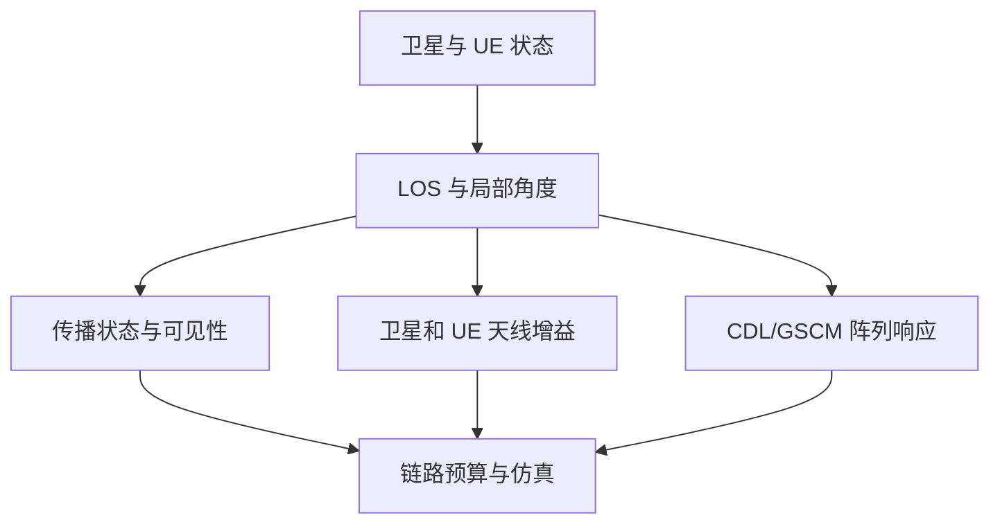

# 卫星轨道时间与链路几何学习笔记

> 本笔记把历元、轨道状态、坐标变换和星地几何连成一条可执行计算链，输出位置、速度、方向、斜距、时延和公共多普勒。波束覆盖判定由第三篇完成，TA/HARQ 等协议后果由第五篇完成。

| 主章节 | 核心对象 | 主要来源 |
|---|---|---|
| 1 轨道状态 | 六根数、传播、位置和速度 | 轨道力学资料 |
| 2 坐标与姿态 | PQW、ECI、ECEF、LLA、ENU、星体坐标 | 轨道/大地测量资料 |
| 3 链路方向量 | 仰角、天底角、地心角与可见性 | TR 38.811 Clause 5.3 |
| 4 时间参考 | 历元、计算时刻、发射/接收时刻 | IERS、TR 38.811 Clause 5.3 |
| 5 时延、多普勒与接口 | 绝对/差分时延、公共/差分多普勒、更新周期 | TR 38.811 Clause 5.3、本文归纳 |

## 1 六根数与卫星状态

### 1.1 轨道、位置与状态的关系

“卫星在某条轨道上”和“卫星此刻位于哪里”是两个不同问题：

- 轨道的大小、形状和空间朝向决定卫星可能经过的空间曲线；
- 卫星在轨道上的相位决定卫星在给定时刻的具体位置；
- 卫星位置和速度共同构成该时刻的轨道状态。

因此，完整确定卫星状态至少需要：

1. 一组六根数，用来描述轨道和卫星在参考时刻的位置；
2. 轨道根数对应的历元 \(t_0\)；
3. 从历元传播到目标时刻 \(t\) 的轨道模型；
4. 明确的参考坐标系和时间尺度。

如果只有“轨道高度为 600 km”，只能近似确定圆轨道半径，不能确定轨道倾角、轨道平面方向以及卫星此刻所在的位置。

### 1.2 经典开普勒六根数

经典开普勒六根数可以写成：

\[
\left\{a_{\mathrm{orb}},e,i,\Omega,\omega,\nu_0\right\}
\]

其中：

| 轨道根数 | 名称 | 物理作用 |
|---|---|---|
| \(a_{\mathrm{orb}}\) | 半长轴 | 决定轨道尺度和轨道周期 |
| \(e\) | 偏心率 | 决定轨道形状，\(e=0\) 为圆轨道 |
| \(i\) | 轨道倾角 | 决定轨道平面相对赤道面的倾斜程度 |
| \(\Omega\) | 升交点赤经 | 决定升交线在赤道面内的方向 |
| \(\omega\) | 近地点幅角 | 决定近地点在轨道平面内的方向 |
| \(\nu_0\) | 历元处真近点角 | 决定卫星在历元 \(t_0\) 时位于轨道上的哪个位置 |

前三个量 \(a_{\mathrm{orb}},e,i\) 主要描述轨道的大小、形状和倾斜程度；\(\Omega,\omega\) 确定轨道在三维空间中的朝向；最后的 \(\nu_0\) 确定卫星在该轨道上的瞬时相位。

在轨道传播中，第六个量经常改用历元处的平均近点角 \(M_0\)：

\[
\left\{a_{\mathrm{orb}},e,i,\Omega,\omega,M_0;t_0\right\}
\]

这种写法更适合从 \(t_0\) 传播到任意时刻 \(t\)。因此，“六根数”并不意味着不需要历元；没有 \(t_0\)，就不能解释 \(M_0\) 或 \(\nu_0\) 对应的是哪个时刻。

### 1.3 六根数确定轨道的几何过程

可以将六根数的作用理解为连续完成四件事。

#### 1.3.1 确定轨道椭圆

半长轴和偏心率决定椭圆的大小与形状。半通径为：

\[
p=a_{\mathrm{orb}}\left(1-e^2\right)
\]

当卫星真近点角为 \(\nu\) 时，地心距为：

\[
r=\frac{p}{1+e\cos\nu}
\]

对于半径近似不变的圆轨道，\(e\approx 0\)，于是 \(r\approx a_{\mathrm{orb}}\)。若地球平均半径为 \(R_{\mathrm E}\)，圆轨道高度近似为：

\[
h\approx a_{\mathrm{orb}}-R_{\mathrm E}
\]

#### 1.3.2 确定轨道平面

轨道倾角 \(i\) 和升交点赤经 \(\Omega\) 共同确定轨道平面：

- \(i\) 表示轨道平面相对赤道面的倾斜角；
- \(\Omega\) 表示卫星从南向北穿过赤道时，升交点相对参考方向的位置。

仅给出倾角不能唯一确定轨道平面，因为具有相同倾角的轨道可以绕地轴旋转到不同方向。

#### 1.3.3 确定近地点方向

近地点幅角 \(\omega\) 从升交点开始，在轨道平面内量到近地点。它确定椭圆长轴在轨道平面中的方向。

对于严格圆轨道，近地点不存在唯一方向，此时 \(\omega\) 和 \(\nu\) 会退化。工程上常使用纬度幅角：

\[
u=\omega+\nu
\]

直接描述卫星相对升交点的轨道内角位置。

#### 1.3.4 确定卫星轨道相位

真近点角 \(\nu\) 或平均近点角 \(M\) 确定卫星当前位于轨道的哪个位置。前五个根数相同而第六个根数不同的两颗卫星，可以位于同一轨道的不同位置。

星座设计中的相位配置，本质上就是为多颗卫星安排不同的轨道平面和轨道内位置。

### 1.4 从历元传播到目标时刻

在二体模型下，平均角速度为：

\[
n=\sqrt{\frac{\mu}{a_{\mathrm{orb}}^3}}
\]

其中 \(\mu\) 为地球标准引力参数。目标时刻 \(t\) 的平均近点角为：

\[
M(t)=M_0+n(t-t_0)
\]

对椭圆轨道，平均近点角 \(M\)、偏近点角 \(E\) 和真近点角 \(\nu\) 之间满足：

\[
M=E-e\sin E
\]

\[
\nu=2\operatorname{atan2}\!\left(
\sqrt{1+e}\sin\frac{E}{2},
\sqrt{1-e}\cos\frac{E}{2}
\right)
\]

计算时通常先由 \(M\) 数值求解开普勒方程得到 \(E\)，再得到 \(\nu\) 和地心距 \(r\)。对于 NTN 基础仿真，牛顿迭代即可完成开普勒方程求解。

### 1.5 轨道近焦坐标系中的位置和速度

轨道近焦坐标系 PQW 固定在轨道平面内：

- \(P\) 轴指向近地点；
- \(Q\) 轴位于轨道平面内，与 \(P\) 轴正交；
- \(W\) 轴沿轨道角动量方向。

卫星在 PQW 坐标系中的位置为：

\[
\boldsymbol r_{\mathrm{PQW}}
=
\frac{p}{1+e\cos\nu}
\begin{bmatrix}
\cos\nu\\
\sin\nu\\
0
\end{bmatrix}
\]

速度为：

\[
\boldsymbol v_{\mathrm{PQW}}
=
\sqrt{\frac{\mu}{p}}
\begin{bmatrix}
-\sin\nu\\
e+\cos\nu\\
0
\end{bmatrix}
\]

这一步只在轨道自身的二维平面内计算，不涉及地球经纬度。

### 1.6 轨道平面、惯性坐标与地固坐标

由开普勒方程得到的位置和速度首先在轨道近焦坐标系 PQW 中表达。PQW 只服务于当前轨道平面，不能直接与固定在地球表面的 UE、其他轨道平面或地球自转统一比较。地心惯性坐标系（Earth-Centered Inertial，ECI）提供共同的三维惯性参考，使轨道平面的姿态和速度传播可以在同一框架下描述；地面用户通常固定在地心地固坐标系（Earth-Centered Earth-Fixed，ECEF）中，因此还必须依据计算时刻把 ECI 状态变换到 ECEF，才能形成卫星—UE 相对几何。

这里不是把卫星从一个物理空间“搬到”另一个空间，而是让**同一个卫星状态先在便于求解轨道运动的 PQW 中表达，再旋转到便于统一描述三维惯性运动的 ECI，最后依据地球自转表达为 ECEF**。

在本文采用的旋转约定下，位置和速度使用同一个变换：

\[
\boldsymbol r_{\mathrm{ECI}}
=
\boldsymbol C_{\mathrm{ECI}\leftarrow\mathrm{PQW}}
\boldsymbol r_{\mathrm{PQW}}
\]

\[
\boldsymbol v_{\mathrm{ECI}}
=
\boldsymbol C_{\mathrm{ECI}\leftarrow\mathrm{PQW}}
\boldsymbol v_{\mathrm{PQW}}
\]

其中：

\[
\boldsymbol C_{\mathrm{ECI}\leftarrow\mathrm{PQW}}
=
\boldsymbol R_3(\Omega)
\boldsymbol R_1(i)
\boldsymbol R_3(\omega)
\]

本文采用主动右手旋转约定：

\[
\boldsymbol R_1(\theta)=
\begin{bmatrix}
1&0&0\\
0&\cos\theta&-\sin\theta\\
0&\sin\theta&\cos\theta
\end{bmatrix},
\qquad
\boldsymbol R_3(\theta)=
\begin{bmatrix}
\cos\theta&-\sin\theta&0\\
\sin\theta&\cos\theta&0\\
0&0&1
\end{bmatrix}.
\]

旋转顺序对应：先在轨道平面内确定近地点方向，再设置轨道倾角，最后将升交线旋转到升交点赤经 \(\Omega\) 对应的方向。

令纬度幅角 \(u=\omega+\nu\)，位置分量也可以直接写成：

\[
\begin{aligned}
x_{\mathrm I}
&=r\left(\cos\Omega\cos u-\sin\Omega\sin u\cos i\right),\\
y_{\mathrm I}
&=r\left(\sin\Omega\cos u+\cos\Omega\sin u\cos i\right),\\
z_{\mathrm I}
&=r\sin u\sin i.
\end{aligned}
\]

这组公式直观地表明：\(u\) 决定卫星沿轨道运动的位置，\(i\) 和 \(\Omega\) 决定该位置如何嵌入三维空间。

不同资料对基本旋转矩阵 \(\boldsymbol R_1,\boldsymbol R_3\) 的主动/被动旋转定义可能不同，因而会出现矩阵转置、符号或相乘次序差异。实现时必须统一约定，并用一个已知轨道点同时检查位置和速度，不能只比较公式外观。

卫星的物理位置本身不天然属于某个坐标系。同一个空间点可以用 ECI、ECEF 或其他坐标系表示。轨道状态通常先在 ECI 或近似惯性坐标系中计算，原因是：

1. 二体引力方程在惯性系中形式最简单；
2. ECI 不随地球表面共同旋转，便于描述轨道平面；
3. 由开普勒根数构造的 PQW 状态可以直接旋转到惯性系。

因此，准确说法应是：**轨道传播通常选择在惯性参考系中完成，而不是卫星位置天然处于 ECI。**

还需要注意，SGP4 根据 TLE 输出的常见参考系为 TEME（True Equator, Mean Equinox），它是惯性型参考系，但不能在高精度处理中无条件等同于 J2000、GCRF 或笼统的“ECI”。NTN 教学仿真可以把它作为惯性状态入口，但坐标转换必须采用与 SGP4/TEME 匹配的实现。

### 1.7 TLE 与 SGP4 的使用边界

TLE 中保存的是与 SGP4 模型配套的平均轨道根数，不是可以任意代入纯二体开普勒公式的瞬时密切根数。其平均运动、阻力相关参数和其他字段共同服务于 SGP4 传播。

实际 NTN 仿真建议采用两条路线之一：

- **理论路线：**人为设置圆轨道或经典六根数，使用二体模型传播，用于理解几何、时延和多普勒；
- **实际星历路线：**读取 TLE，使用经过验证的 SGP4 库得到卫星位置和速度，再进行坐标变换和链路计算。

不建议读取 TLE 后只取出几个字段，再使用简单开普勒公式长期外推。TLE 的生成和使用都与 SGP4 模型相关。

> **来源定位：**Vallado et al., *Revisiting Spacetrack Report #3*, AIAA 2006-6753 Rev. 3，Section II 与 Appendix C；前者说明 TLE/SGP4 的模型配套关系，后者给出 TEME 与惯性/地固坐标转换。

---

## 2 坐标变换与卫星—UE 几何

### 2.1 坐标变换的总体计算链

第 1 章已经从六根数得到了卫星在惯性空间中的位置和速度：

\[
\left(\boldsymbol r_{s,\mathrm I}(t),
\boldsymbol v_{s,\mathrm I}(t)\right)
\]

但这两个状态量还不能直接回答通信链路中的问题。地面 UE 通常用经纬高表示，并随地球共同旋转；卫星波束又定义在卫星本体或天线坐标系中。只有把不同对象统一到适合的坐标系，才能进一步得到：

- 卫星是否在 UE 的可见范围内；
- 卫星—UE 的斜距和传播时延；
- UE 观察卫星的方位角和仰角；
- UE 位于哪个卫星波束内，以及对应的离轴增益；
- 卫星—UE 距离变化多快，以及由此产生多大的多普勒频移。

因此，坐标变换不是单纯为了改变一组三维数字的表达形式，而是把“轨道状态”转换成“通信链路所需的几何量”。对于给定卫星、UE 和计算时刻 \(t\)，地面链路几何可以按以下主链计算：

\[
\boxed{
\text{轨道根数与历元}
\rightarrow
\left(\boldsymbol r_{s,\mathrm I},\boldsymbol v_{s,\mathrm I}\right)
\rightarrow
\left(\boldsymbol r_{s,\mathrm E},\boldsymbol v_{s,\mathrm E}\right)
\rightarrow
\boldsymbol\rho_{u\rightarrow s,\mathrm E}
\rightarrow
\boldsymbol\rho_{u\rightarrow s,\mathrm{ENU}}
}
\]

其中下标 \(s\) 表示卫星，\(u\) 表示 UE，\(\mathrm I\) 表示 ECI，\(\mathrm E\) 表示 ECEF。这条链依次完成：

1. 将卫星轨道状态传播到目标时刻；
2. 将卫星位置转换到随地球旋转的 ECEF；
3. 将 UE 的经纬高转换到同一个 ECEF；
4. 在共同坐标系中构造卫星—UE 视距向量；
5. 转到 UE 局部 ENU，得到方位角、仰角和斜距。

若还要判断 UE 落在哪个卫星波束中，则需要进一步引入卫星姿态和波束指向：

\[
\boldsymbol\rho_{s\rightarrow u}
\rightarrow
\text{卫星本体坐标系}
\rightarrow
\text{与各波束中心方向比较}
\]

最终得到的几何量与通信模型之间具有直接对应关系：

| 几何量 | 获得方式 | 后续用途 |
|---|---|---|
| 斜距 \(d\) | 卫星与 UE 的位置差 | 传播时延、自由空间损耗、链路预算 |
| 方位角 \(A\) | LOS 转到 UE 局部 ENU | UE 天线指向、可见卫星跟踪 |
| 仰角 \(\varepsilon\) | LOS 转到 UE 局部 ENU | 可见性、最低仰角、大气损耗和场景参数选择 |
| 卫星本体坐标方向 | LOS 与姿态/安装矩阵 | 供第三篇结合各波束中心轴计算真实离轴角和方向增益 |
| 距离变化率 \(\dot d\) | LOS 上的相对速度投影 | 多普勒频移和多普勒变化率 |

后续各小节按照这条链展开，每一次坐标变换都对应一个明确的通信输出量。

### 2.2 ECI 与 ECEF

ECI 的坐标轴不随地球表面共同旋转，适合轨道传播。ECEF 与地球固连，地面固定 UE 的 ECEF 坐标在忽略板块运动时近似不变。

这里首先进行 ECI 到 ECEF 的变换，是因为第 1 章得到的卫星状态通常位于惯性系，而 UE、网关、服务区边界和地面波束脚印通常用经纬度或 ECEF 表示。把卫星转换到 ECEF 后，卫星和地面对象才能在同一幅“随地球旋转的地图”上比较。

在仅考虑地球自转的简化模型中，ECI 到 ECEF 的位置变换可写为：

\[
\boldsymbol r_{\mathrm E}(t)
=
\boldsymbol C_{\mathrm E\leftarrow\mathrm I}(t)
\boldsymbol r_{\mathrm I}(t)
\]

本文显式采用：

\[
\boldsymbol C_{\mathrm E\leftarrow\mathrm I}(t)
=
\begin{bmatrix}
\cos\theta(t) & \sin\theta(t) & 0\\
-\sin\theta(t) & \cos\theta(t) & 0\\
0 & 0 & 1
\end{bmatrix}
\]

其中 \(\theta(t)\) 为计算时刻对应的地球自转角。显式写出矩阵可以避免不同教材对 \(\boldsymbol R_3(\theta)\) 正负号定义不同造成的混淆。

速度不能只套用同一个旋转矩阵。由于 ECEF 自身在旋转，有：

\[
\boldsymbol v_{\mathrm E}
=
\boldsymbol C_{\mathrm E\leftarrow\mathrm I}
\left(
\boldsymbol v_{\mathrm I}
-\boldsymbol\omega_{\mathrm E}\times\boldsymbol r_{\mathrm I}
\right)
\]

其中 \(\boldsymbol\omega_{\mathrm E}\) 为地球自转角速度向量。位置变换的输出用于计算卫星相对 UE 的斜距和观察角；速度变换的输出用于计算距离变化率和多普勒。若只关心某一时刻的静态覆盖，可以先计算位置；若要分析多普勒，则位置和速度必须同时保持坐标系一致。

高精度 ECI/ECEF 转换还会包括岁差、章动、极移和地球定向参数。普通 NTN 链路级仿真可先采用“地球绕固定 \(z\) 轴旋转”的简化模型；若使用 TLE/SGP4 或高精度星历，应直接调用与数据参考系匹配的坐标转换库。

### 2.3 LLA 到 ECEF

卫星已经转换到 ECEF，但 UE 的原始输入通常是纬度 \(\phi\)、经度 \(\lambda\) 和椭球高 \(h_u\)。经纬高是便于描述地理位置的曲线坐标，不能直接与卫星的三维笛卡尔坐标相减。因此，需要先把 UE 也转换到 ECEF。

采用 WGS-84 椭球时，定义卯酉圈曲率半径：

\[
N(\phi)
=
\frac{a_{\mathrm E}}
{\sqrt{1-e_{\mathrm E}^2\sin^2\phi}}
\]

其中 \(a_{\mathrm E}\) 为地球椭球长半轴，\(e_{\mathrm E}\) 为地球椭球第一偏心率。UE 的 ECEF 坐标为：

\[
\begin{aligned}
x_u&=\left[N(\phi)+h_u\right]\cos\phi\cos\lambda,\\
y_u&=\left[N(\phi)+h_u\right]\cos\phi\sin\lambda,\\
z_u&=\left[N(\phi)(1-e_{\mathrm E}^2)+h_u\right]\sin\phi.
\end{aligned}
\]

这里的精确 ECEF 链使用 WGS-84 椭球；第 3 章和第 5.1 节为解释量级而给出的闭式仰角、地心角与斜距例子，则明确采用球形地球半径 \(R_E\)。两类模型可以分别用于精确计算和直觉校验，但不能在同一次计算中把 WGS-84 椭球坐标与球形地球闭式关系无说明地混用。

> **来源定位：**NGA.STND.0036_1.0.0_WGS84，WGS 84 坐标系统与椭球定义；高精度天球—地球参考系转换见 IERS Conventions (2010), Chapter 5。

这些公式来自参考椭球几何：赤道方向和极轴方向的曲率不同，因此不能简单地把地球半径 \(R_{\mathrm E}\) 同时乘到三个球坐标分量上。

需要区分两个容易混淆的量：

- \(a_{\mathrm{orb}}\)：卫星轨道半长轴；
- \(a_{\mathrm E}\)：WGS-84 地球椭球长半轴。

二者在部分教材中都写成 \(a\)，但物理含义完全不同。

### 2.4 UE 到卫星的相对向量

完成卫星 ECI 到 ECEF 的转换，并把 UE 的 LLA 转换为 ECEF 后，两者处于同一坐标系。UE 指向卫星的视距向量为：

\[
\boldsymbol\rho_{u\rightarrow s,\mathrm E}
=
\boldsymbol r_{s,\mathrm E}
-
\boldsymbol r_{u,\mathrm E}
\]

斜距为：

\[
 d
=
\left\|\boldsymbol\rho_{u\rightarrow s,\mathrm E}\right\|
\]

相对向量是后续几何计算的共同入口：向量长度给出斜距，单位方向给出 LOS，位置差随时间的变化给出距离变化率。斜距进一步决定最基本的传播量：

\[
\tau_{\mathrm{abs}}=\frac{d}{c}
\]

\[
L_{\mathrm{FS}}
=
\left(\frac{4\pi d}{\lambda_c}\right)^2
\]

其中 \(\tau\) 为单程自由空间传播时延，\(L_{\mathrm{FS}}\) 为自由空间路径损耗的线性值，\(\lambda_c\) 为载波波长。因此，同一个斜距同时进入时间模型和链路预算。

这里并不需要“先构造 \(\boldsymbol\rho_{\mathrm{ECI}}\)”才能计算 UE 几何。只要卫星和 UE 处于同一个参考系，相对向量就可以直接相减。对于地面观察角，ECEF 是最自然的中间坐标系。

也可以先把 UE 从 ECEF 转到 ECI，再在 ECI 中相减，但这通常会增加不必要的转换步骤。两种方法理论上等价，前提是使用相同的时刻和一致的坐标定义。

### 2.5 ECEF 到 UE 局部 ENU

ECEF 适合做全球位置相减，但不便于直接解释“卫星在 UE 的哪个方向”。UE 侧的天线指向、最低仰角和可见性判断都以当地水平面为参考，因此要把 LOS 转换到 UE 的局部 ENU 坐标系：

\[
\boldsymbol\rho_{u\rightarrow s,\mathrm{ENU}}
=
\boldsymbol C_{\mathrm{ENU}\leftarrow\mathrm E}
\boldsymbol\rho_{u\rightarrow s,\mathrm E}
\]

其中：

\[
\boldsymbol C_{\mathrm{ENU}\leftarrow\mathrm E}
=
\begin{bmatrix}
-\sin\lambda & \cos\lambda & 0\\
-\sin\phi\cos\lambda & -\sin\phi\sin\lambda & \cos\phi\\
\cos\phi\cos\lambda & \cos\phi\sin\lambda & \sin\phi
\end{bmatrix}
\]

令：

\[
\boldsymbol\rho_{u\rightarrow s,\mathrm{ENU}}
=
\begin{bmatrix}E&N&U\end{bmatrix}^{\mathrm T}
\]

则方位角和仰角分别为：

\[
A=\operatorname{atan2}(E,N)
\]

\[
\varepsilon
=
\operatorname{atan2}
\left(U,\sqrt{E^2+N^2}\right)
\]

方位角通常从正北方向开始顺时针计量，计算后可映射到 \([0,2\pi)\)。方位角用于 UE 天线或跟踪机构的水平指向；仰角用于判断卫星是否可见，并进一步选择与仰角相关的大气损耗、阴影衰落和信道参数。当 \(\varepsilon\) 小于系统设定的最小仰角时，即使不存在纯几何地球遮挡，链路也可能不被纳入可服务范围。

### 2.6 UE 仰角与卫星波束方向

UE 观察卫星时使用：

\[
\boldsymbol\rho_{u\rightarrow s}
=
\boldsymbol r_s-\boldsymbol r_u
\]

卫星向 UE 发射或接收波束时使用相反方向：

\[
\boldsymbol\rho_{s\rightarrow u}
=
\boldsymbol r_u-\boldsymbol r_s
=
-\boldsymbol\rho_{u\rightarrow s}
\]

这两个向量长度相同，但方向相反：

- 计算 UE 的方位角和仰角，应使用 UE 指向卫星的向量；
- 判断 UE 位于卫星哪个波束内，应使用卫星指向 UE 的向量。

因此，波束判定不是简单复用 UE 的 ENU 角度，而是需要把卫星到 UE 的 LOS 方向转换到卫星本体坐标系或卫星天线坐标系。

### 2.7 Nadir、卫星姿态与多个波束

UE 侧 ENU 已经给出了“UE 如何看到卫星”，但波束判定需要回答相反的问题：“卫星天线如何看到 UE”。因此需要一个随卫星姿态运动的本体坐标系，把卫星到 UE 的 LOS 与各个波束中心方向放在同一个坐标系中比较。

Nadir 是从卫星指向地心附近的方向：

\[
\hat{\boldsymbol z}_{\mathrm{nadir}}
=
-\frac{\boldsymbol r_s}{\|\boldsymbol r_s\|}
\]

“卫星采用 nadir pointing”通常表示卫星平台或天线参考轴大致保持对地，而不是所有波束都指向地心。多波束卫星可以通过馈源阵列或相控阵，在 nadir 周围形成多个不同离轴方向的波束：

- 中心波束的波束中心可能接近 nadir；
- 其他波束具有不同的离轴角和方位；
- 电子扫描可以使波束脚印随星移动，也可以近似保持对地固定；
- 卫星本体姿态、天线安装矩阵和电子波束权值共同决定实际波束方向。

在简化的对地姿态模型中，可以构造一个卫星局部本体坐标系。例如：

\[
\hat{\boldsymbol z}_{\mathrm B}
=
-\frac{\boldsymbol r_s}{\|\boldsymbol r_s\|}
\]

\[
\hat{\boldsymbol y}_{\mathrm B}
=
-\frac{\boldsymbol r_s\times\boldsymbol v_s}
{\|\boldsymbol r_s\times\boldsymbol v_s\|}
\]

\[
\hat{\boldsymbol x}_{\mathrm B}
=
\hat{\boldsymbol y}_{\mathrm B}
\times
\hat{\boldsymbol z}_{\mathrm B}
\]

在近圆轨道下，\(\hat{\boldsymbol x}_{\mathrm B}\) 近似沿飞行方向，\(\hat{\boldsymbol z}_{\mathrm B}\) 指向地面，三者构成右手坐标系。具体工程项目可能采用不同的本体轴定义，因此仿真配置中必须明确轴方向。

### 2.8 LOS 距离变化率与方向变化率

斜距回答“卫星离 UE 多远”，距离变化率回答“这个距离变化得多快”，LOS 单位向量变化率回答“视线方向转得多快”。前者决定公共径向多普勒和传播时延变化率，后者决定方位角、仰角、离轴角和波束指向的更新速率。

所有位置和速度必须在**同一坐标系、同一参考时刻**下计算。定义

\[
\boldsymbol\rho=\boldsymbol r_s-\boldsymbol r_u,
\qquad
\boldsymbol v_{\mathrm{rel}}=\boldsymbol v_s-\boldsymbol v_u,
\qquad
d=\|\boldsymbol\rho\|,
\qquad
\hat{\boldsymbol\ell}_{u\rightarrow s}=\frac{\boldsymbol\rho}{d}.
\]

对距离求导：

\[
\dot d
=
\frac{\boldsymbol\rho^{\mathsf T}\dot{\boldsymbol\rho}}{\|\boldsymbol\rho\|}
=
\hat{\boldsymbol\ell}_{u\rightarrow s}^{\mathsf T}\boldsymbol v_{\mathrm{rel}}.
\]

这一步只保留相对速度的径向分量。再对单位 LOS 向量使用商法则：

\[
\dot{\hat{\boldsymbol\ell}}_{u\rightarrow s}
=
\frac{1}{d}
\left(
\boldsymbol I-
\hat{\boldsymbol\ell}_{u\rightarrow s}
\hat{\boldsymbol\ell}_{u\rightarrow s}^{\mathsf T}
\right)
\boldsymbol v_{\mathrm{rel}}.
\]

投影矩阵 \(\boldsymbol I-\hat{\boldsymbol\ell}\hat{\boldsymbol\ell}^{\mathsf T}\) 去掉径向速度，只保留横向速度。两类导数的职责因此不同：

| 相对速度分量 | 直接输出 | 主要下游影响 |
|---|---|---|
| 径向分量 | \(\dot d\) | 距离、绝对传播时延、公共多普勒 |
| 横向分量 | \(\dot{\hat{\boldsymbol\ell}}\) | 方位角/仰角、天底角、波束离轴角、波束跟踪速率 |

对于载频 \(f_c\)，采用“距离增大为正”的约定时，多普勒频移可以写为：

\[
f_{D,\mathrm{common}}
=
-\frac{f_c}{c}\dot d
\]

如果 \(\dot d<0\)，卫星与 UE 接近，接收频率升高；如果 \(\dot d>0\)，两者远离，接收频率降低。由此可见，轨道速度不能直接代入多普勒公式，必须先投影到 LOS 方向。不同通信模型可能采用相反的多普勒符号约定，实现时应同时检查复指数定义。

---

## 3 UE 仰角、天底角与地心角

同一条星地射线会产生三个不同顶点的角度：

| 几何量 | 顶点 | 两条边 | 工程含义 |
|---|---|---|---|
| 地面仰角 \(\varepsilon\) | 地面点 \(P\) | 当地水平线与 \(P\rightarrow S\) | UE 看卫星有多高 |
| 天底角 \(\theta_{\mathrm{nadir}}\) | 卫星 \(S\) | \(S\rightarrow O\) 与 \(S\rightarrow P\) | LOS 相对天底方向偏离多少 |
| 地心角 \(\psi\) | 地心 \(O\) | \(O\rightarrow N\) 与 \(O\rightarrow P\) | 地面点离星下点 \(N\) 多远 |

这三个角不能互换。特别是“地面仰角为 \(45^\circ\)”并不表示卫星天线偏离天底 \(45^\circ\)。

完整 NTN 模型中的角度进入不同计算层，并非只有仰角有用：

| 角度 | 参考方向 | 主要影响 | 可弱化的条件 |
|---|---|---|---|
| UE 仰角 \(\varepsilon\) | UE 局部水平面 | 可见性、斜距、LOS 概率、阴影衰落和 LSP 选择 | NTN 几何与传播模型中不能整体省略 |
| UE 方位角 | UE 局部北/东轴 | UE 阵列响应、极化、本地散射方向和波束扫描 | UE 为各向同性标量天线时 |
| 天底角 \(\theta_{\mathrm{nadir}}\) | 卫星指向地心/星下点方向 | 覆盖几何、地面交点和天底波束关系 | 已有等价一般波束轴描述时 |
| 波束离轴角 \(\theta_{\mathrm{off},k}\) | 第 \(k\) 个波束中心轴 | 波束增益、3 dB 轮廓、服务判定和邻波束干扰 | 把卫星增益简化为常数时 |
| 地心夹角 \(\psi\) | 地心处两条半径 | 地表距离、覆盖范围和可见弧段 | 已知等价地表几何量时 |
| AOA/AOD/ZOA/ZOD | 收发端局部阵列坐标 | CDL/GSCM 阵列响应、空间相关、极化和 MIMO 信道 | 纯 SISO/TDL 等效模型时 |

令从地面点 \(P\) 指向卫星的单位向量为 \(\widehat{\mathbf l}\)。由于仰角 \(\varepsilon\) 是视线相对当地水平面的夹角，地面径向量与视线的点积为

\[
\mathbf r_p^{\mathsf T}\widehat{\mathbf l}
=R_E\sin\varepsilon.
\]

卫星位置可写为 \(\mathbf r_s=\mathbf r_p+d\widehat{\mathbf l}\)。令 \(R_s=R_E+h\)，对其模平方可得

\[
R_s^2
=\|\mathbf r_p+d\widehat{\mathbf l}\|^2
=R_E^2+d^2+2R_Ed\sin\varepsilon.
\]

这是关于 \(d\) 的二次方程。取能够给出 \(d>0\) 的根，斜距为

\[
d
=-R_E\sin\varepsilon
+\sqrt{R_s^2-R_E^2\cos^2\varepsilon},
\]

所以根号前的 \(-R_E\sin\varepsilon\) **不是笔误**。它来自二次方程求根；若改成正号，会把卫星沿视线方向的位置重复加上一段地球半径投影。两个极端情况也能校验该符号：当 \(\varepsilon=90^\circ\) 时，\(d=R_s-R_E=h\)；当 \(\varepsilon=0^\circ\) 时，\(d=\sqrt{R_s^2-R_E^2}\)，正好是地平线切线距离。

并有

\[
\sin\theta_{\mathrm{nadir}}=\frac{R_E}{R_s}\cos\varepsilon,
\qquad
\psi=90^\circ-\varepsilon-\theta_{\mathrm{nadir}}.
\]

以 GEO 基线为例，取 \(R_E=6371\ \mathrm{km}\)、\(R_s=42157\ \mathrm{km}\)、地面目标仰角 \(\varepsilon=45^\circ\)，则

\[
d\approx37411\ \mathrm{km},
\qquad
\theta_{\mathrm{nadir}}\approx6.13^\circ,
\qquad
\psi\approx38.87^\circ.
\]

于是中心波束在 UV 平面中的径向坐标为

\[
\sqrt{u_0^2+v_0^2}=\sin\theta_{\mathrm{nadir}}\approx0.1069.
\]

若选择 \(u\) 轴朝向该地面目标，则得到 TR 38.821 Table 6.1.1.1-6 中的 \((u_0,v_0)=(0.107,0)\)。这说明表中的 \(0.107\) 是方向余弦，\(45^\circ\) 是 UE 仰角，\(6.13^\circ\) 是相对天底方向的 \(\theta_{\mathrm{nadir}}\)。只有当该波束中心轴指向天底时，它才同时等于波束离轴角；LEO 天底波束面向星下点时 \(\theta_{\mathrm{nadir}}=0\)，中心坐标为 \((0,0)\)。

## 4 NTN 相关时间

### 4.1 时间作为几何状态的共同索引

第 2 章说明了如何在某一个时刻得到斜距、方位角、仰角、波束离轴角和距离变化率。但 LEO 卫星持续高速运动，这些量都不是固定参数，而是随时间变化的函数：

\[
\left\{
\boldsymbol r_s(t),
\boldsymbol v_s(t),
d(t),
A(t),
\varepsilon(t),
\alpha_k(t),
\dot d(t)
\right\}
\]

因此，时间的首要作用是把轨道传播、地球旋转和链路几何放到同一个时刻上。具体包括：

1. **确定卫星状态：**由轨道历元 \(t_0\) 传播到目标时刻 \(t\)，得到 \(\boldsymbol r_s(t)\) 和 \(\boldsymbol v_s(t)\)；
2. **确定地球姿态：**根据同一个 \(t\) 计算地球自转角，完成 ECI/ECEF 转换；
3. **确定链路几何：**在 \(t\) 时刻计算卫星与 UE 的相对位置、波束归属和距离变化率；
4. **描述信号传播：**区分信号离开发射端的 \(t_{\mathrm{tx}}\)、到达接收端的 \(t_{\mathrm{rx}}\) 以及二者之差 \(\tau\)。

这四个过程共同解释了为什么 NTN 几何模型不能只有轨道和坐标，还必须具有统一的时间基准。若不同步骤使用了不一致的时刻，即使每个空间公式本身正确，最终得到的波束、时延和多普勒仍可能错误。

### 4.2 NTN 几何需要的时间尺度

| 时间尺度 | 是否连续 | NTN 中的主要用途 | 学习深度 |
|---|---|---|---|
| TAI | 连续 | 连续原子时间基准 | 知道其与 UTC 的关系即可 |
| UTC | 含闰秒调整 | 星历时间戳、日志和跨系统时间交换 | 必须掌握 |
| GPS/GNSS 系统时间 | 通常连续，不插入 UTC 闰秒 | GNSS 定位、时间辅助和设备内部计算 | 必须掌握 |
| UT1 | 反映地球实际自转 | 高精度 ECI/ECEF 变换 | 理解用途，简单仿真可近似 |
| TT | 连续理论时间尺度 | 精密星历和天文学计算 | 普通 NTN 仿真不展开 |

#### 4.2.1 UTC、TAI 与 GNSS 时间

TAI 是连续的原子时间尺度。UTC 以原子秒为基础，但通过闰秒保持与地球自转时间接近，因此 UTC 时间轴可能出现闰秒。

GPS Time 等 GNSS 系统时间通常保持连续，不随 UTC 插入闰秒。GNSS 接收机通过导航消息或系统提供的参数获得 GNSS 时间与 UTC 的当前偏移关系。

工程实现中不应在代码里长期写死“GPS 时间与 UTC 固定相差多少秒”。正确做法是由时间库、导航数据或有效配置提供当前偏移量。

#### 4.2.2 UT1 与地球自转

UT1 根据地球的实际自转确定。严格的地球自转角以及高精度 ECI/ECEF 变换需要 UT1 和地球定向参数。

对于以链路预算、毫秒级时延和大尺度多普勒为主的 NTN 基础仿真，可以使用 UTC 近似生成地球自转角，或者直接使用成熟库完成转换。对于窄波束精确指向、长时间轨道预测和高精度定位，应使用与 UT1/EOP 一致的坐标转换模型。

### 4.3 轨道历元、计算时刻与星历有效性

轨道数据总是在某个历元 \(t_0\) 下给出。给定目标时刻 \(t\)，首先计算：

\[
\Delta t=t-t_0
\]

然后使用二体模型、SGP4 或其他轨道传播器得到：

\[
\left(
\boldsymbol r_s(t),
\boldsymbol v_s(t)
\right)
\]

这要求 \(t\) 和 \(t_0\) 使用一致的时间尺度。把本地时区时间、UTC、GPS Time 或 Unix 时间戳直接相减，而不先统一定义，会导致固定秒偏差甚至闰秒附近的不连续。

对 NTN 而言，星历误差会进一步转化为通信误差。若卫星位置误差为 \(\delta\boldsymbol r_s\)，其 LOS 投影引起的时延误差近似为：

\[
\delta\tau
\approx
\frac{1}{c}
\hat{\boldsymbol\ell}_{u\rightarrow s}^{\mathrm T}
\delta\boldsymbol r_s
\]

若速度误差为 \(\delta\boldsymbol v_s\)，其引起的多普勒误差近似为：

\[
\delta f_{\mathrm D}
\approx
-\frac{f_c}{c}
\hat{\boldsymbol\ell}_{u\rightarrow s}^{\mathrm T}
\delta\boldsymbol v_s
\]

因此，星历不仅用于显示卫星轨迹，还直接影响波束指向、传播时延预测和多普勒预测精度。

### 4.4 计算时刻与 ECI/ECEF 转换

卫星惯性坐标转换到地固坐标时，必须明确“在哪个时刻旋转地球”。正确关系是：

\[
\boldsymbol r_{s,\mathrm E}(t)
=
\boldsymbol C_{\mathrm E\leftarrow\mathrm I}(t)
\boldsymbol r_{s,\mathrm I}(t)
\]

位置状态和旋转矩阵必须对应同一个计算时刻 \(t\)。常见错误包括：

- 使用目标时刻的卫星 ECI 位置，却使用历元时刻的地球旋转角；
- 卫星位置使用 UTC，地球旋转角使用未经转换的 GPS Time；
- 只更新时间而没有重新传播卫星位置；
- 将经度角直接当作地球自转角。

对系统级仿真，可以统一设置一个仿真绝对起始时刻 \(t_{\mathrm{start}}\)，再用仿真时间 \(t_{\mathrm{sim}}\) 推进：

\[
t=t_{\mathrm{start}}+t_{\mathrm{sim}}
\]

每个仿真步使用同一个 \(t\) 更新轨道状态、地球旋转、UE 几何、波束归属、时延和多普勒。

### 4.5 发射时刻、接收时刻与传播时延

在最简单的同时刻几何模型中，单程传播时延为：

\[
\tau(t)
=
\frac{\|\boldsymbol r_s(t)-\boldsymbol r_u(t)\|}{c}
=
\frac{d(t)}{c}
\]

它适合多数 NTN 链路预算、时延曲线和系统级抽象。

更严格地说，信号在发射时刻 \(t_{\mathrm{tx}}\) 离开发射端，在接收时刻 \(t_{\mathrm{rx}}\) 到达接收端：

\[
t_{\mathrm{rx}}=t_{\mathrm{tx}}+\tau
\]

对于卫星发射、UE 接收的链路，应写成：

\[
\tau
=
\frac{
\left\|
\boldsymbol r_u(t_{\mathrm{rx}})
-
\boldsymbol r_s(t_{\mathrm{tx}})
\right\|
}{c}
\]

由于 \(t_{\mathrm{tx}}=t_{\mathrm{rx}}-\tau\)，可以迭代求解。这个处理有时称为发射时刻修正或迟滞时间计算。

例如，若某一时刻斜距为 1200 km，则单程传播时延约为：

\[
\tau\approx\frac{1200\times10^3}{3\times10^8}=4\ \mathrm{ms}
\]

若 LEO 卫星速度约为 \(7.5\ \mathrm{km/s}\)，4 ms 内卫星移动约 30 m。这对一般覆盖分析影响有限，但在高精度波束指向、多普勒预测或定位中可能需要考虑。

### 4.6 用户链路、馈电链路与总时延

NTN 时延取决于网络架构。

#### 4.6.1 再生载荷

如果卫星上集成 gNB 或具有再生处理能力，UE 与卫星之间的用户链路传播时延是无线接入侧的主要空间传播项：

\[
\tau_{\mathrm{service}}
=
\frac{d_{\mathrm{UE-SAT}}}{c}
\]

业务端到端时延还可能包括星间链路、核心网传输和处理时延，但这些不应全部混入“用户链路传播时延”。

#### 4.6.2 透明转发载荷

如果卫星进行透明转发，gNB 位于地面，空口信号路径通常包含用户链路和馈电链路：

\[
\tau_{\mathrm{space}}
\approx
\frac{d_{\mathrm{UE-SAT}}}{c}
+
\frac{d_{\mathrm{SAT-GW}}}{c}
\]

还需要叠加卫星转发、网关和地面网络处理时延。上下行路径相似时，RTT 近似为两个方向空间传播及处理时延之和，但不能在所有架构中简单写成某一条用户链路时延的两倍。

至此，单个时刻的空间链路时延已经可以由用户链路、馈电链路和处理环节组合得到。接下来只需要让计算时刻持续推进，就能得到这些物理量的时间演化。

### 4.7 时延与多普勒的时间演化

第 2 章得到的斜距 \(d\) 和距离变化率 \(\dot d\) 都以计算时刻 \(t\) 为索引。卫星持续运动，因此距离、时延和多普勒都是时间函数：

\[
d=d(t),\qquad
\tau_{\mathrm{abs}}(t)=\frac{d(t)}{c},\qquad
f_{D,\mathrm{common}}(t)=-\frac{f_c}{c}\dot d(t)
\]

多普勒变化率为：

\[
\dot f_{\mathrm D}(t)
=
-\frac{f_c}{c}\ddot d(t)
\]

“时延误差”必须先说明采用了哪一种状态更新或预测方法，不能用同一个公式覆盖不同问题。距离的泰勒展开为：

\[
d(t+\Delta t)
=d(t)+\dot d(t)\Delta t
+\frac{1}{2}\ddot d(t)\Delta t^2
+O(\Delta t^3),
\qquad
\tau_{\mathrm{abs}}(t)=\frac{d(t)}{c}.
\]

若系统在整个更新间隔内零阶保持旧时延 \(\tau_{\mathrm{abs}}(t)\)，则

\[
e_\tau^{(0)}
=\tau_{\mathrm{abs}}(t+\Delta t)-\tau_{\mathrm{abs}}(t)
\approx\frac{\dot d(t)\Delta t}{c}.
\]

若已经使用 \(d(t)+\dot d(t)\Delta t\) 做一阶距离预测，残差从二阶项开始：

\[
e_\tau^{(1)}
\approx\frac{\ddot d(t)\Delta t^2}{2c}.
\]

星历或定位状态误差属于另一类问题，其一阶时延误差为

\[
\delta\tau
\approx
\frac{\hat{\boldsymbol\ell}_{u\rightarrow s}^{\mathsf T}
(\delta\boldsymbol r_s-\delta\boldsymbol r_u)}{c}.
\]

| 误差来源 | 一阶或主导近似 | 工程含义 |
|---|---|---|
| 更新间隔内保持旧时延 | \(e_\tau^{(0)}\approx\dot d\Delta t/c\) | 零阶保持造成的时延漂移 |
| 一阶距离预测后的残差 | \(e_\tau^{(1)}\approx\ddot d\Delta t^2/(2c)\) | 忽略加速度项 |
| 卫星/UE 位置状态误差 | \(\delta\tau\approx\hat{\boldsymbol\ell}^{\mathsf T}(\delta\boldsymbol r_s-\delta\boldsymbol r_u)/c\) | 星历或定位误差在 LOS 上的投影 |
| 发射/接收时间标记不同 | 光行时方程迭代 | 高速运动下的迟滞时间问题 |

发射与接收时刻不一致时应使用第 4.5 节的光行时方程，而不应并入“更新间隔误差”。同理，多普勒零阶保持的漂移为 \(\Delta f_D\approx\dot f_D(t)\Delta t\)。这些关系解释了为什么时延、多普勒和波束归属需要周期性更新。更新周期应根据：

- 卫星轨道高度与角速度；
- UE 位置和运动；
- 载频；
- 星历误差；
- 仿真或接收机允许的时延和频偏误差；
- 波束覆盖和切换策略；

共同确定。

### 4.8 NTN 几何与时间的完整计算流程

前述轨道与坐标部分解决“卫星在什么位置”和“如何从位置得到通信几何量”，本节补充“在哪个时刻计算这些量”。三者合在一起，一个不过度复杂、但物理链条完整的 NTN 几何模块可以按以下顺序实现。

#### 4.8.1 输入

- 卫星六根数或 TLE；
- 轨道历元 \(t_0\)；
- 计算绝对时刻 \(t\)；
- UE 的 LLA 位置和速度；
- 卫星姿态模型；
- 每个波束的中心方向和边界/方向图；
- 载频和网络架构。

#### 4.8.2 计算

1. 统一 \(t_0\) 和 \(t\) 的时间尺度；
2. 使用二体模型或 SGP4 得到 \(\boldsymbol r_{s,\mathrm I}(t)\)、\(\boldsymbol v_{s,\mathrm I}(t)\)；
3. 根据同一时刻的地球自转角转换到 ECEF；
4. 将 UE 的 LLA 转换到 ECEF；
5. 计算 UE 到卫星的 LOS、斜距、方位角和仰角；
6. 反转 LOS 方向并转换到卫星本体坐标系，判断波束归属；
7. 计算距离变化率、多普勒和多普勒变化率；
8. 根据网络架构组合用户链路、馈电链路和处理时延；
9. 将时刻推进到 \(t+\Delta t\)，重复上述过程，形成连续几何轨迹。

#### 4.8.3 输出

- 同一参考时刻和坐标系下的卫星/UE 位置与速度；
- UE→卫星和卫星→UE 的 LOS 单位向量；
- 距离 \(d\)、距离变化率 \(\dot d\) 与 LOS 方向变化率 \(\dot{\hat{\boldsymbol\ell}}\)；
- UE 仰角 \(\varepsilon\)、天底角 \(\theta_{\mathrm{nadir}}\) 及局部方位角；
- 绝对传播时延 \(\tau_{\mathrm{abs}}=d/c\) 与公共多普勒 \(f_{D,\mathrm{common}}\)；
- 几何更新时刻、预测阶数和误差界。

第 \(k\) 个波束的离轴角不在本篇生成。本篇把卫星→UE LOS 向量交给[《NTN 天线波束与覆盖组织》中的“波束中心轴、UE 方向与真实离轴角”](./03_NTN天线波束与覆盖组织_学习笔记.md#22-波束中心轴ue-方向与真实离轴角)，由该篇结合波束中心轴 \(\hat{\boldsymbol b}_k\) 计算 \(\theta_{\mathrm{off},k}\)。

这组时间序列构成后续链路预算、信道建模、波束切换和系统级仿真的共同几何基础。其核心逻辑可以收敛为：

\[
\boxed{
\text{绝对时刻}
\rightarrow
\text{卫星状态与地球姿态}
\rightarrow
\text{卫星—UE 相对几何}
\rightarrow
\text{时延、增益与多普勒}
}
\]

---

## 5 时延、多普勒与更新接口

NTN 的时延问题始于链路几何，而不是只由轨道高度决定。最低仰角改变斜距和覆盖边缘；斜距再决定单程传播时延。绝对时延、波束内差分时延与 RTT 分别对应“信号何时到达”“不同 UE 能否对齐”和“控制闭环至少等待多久”三个不同尺度。

### 5.1 仰角、斜距与覆盖几何

#### 5.1.1 仰角

仰角 \(\varepsilon\) 是终端本地水平面与终端至卫星视线之间的夹角。卫星位于地平线时 \(\varepsilon=0^\circ\)，位于正上方时 \(\varepsilon=90^\circ\)。星下点用户的仰角接近 90°。

最低仰角会同时影响：

- 最大覆盖面积和一次过境的服务时间；
- 斜距、自由空间路径损耗和传播时延；
- 穿越大气层的路径长度以及雨衰、气体吸收；
- 建筑、地形和植被遮挡；
- 阵列扫描损耗和波束指向要求；
- 径向速度分量、多普勒和可见卫星数量。

TR 38.811 的传播时延计算通常采用 Gateway 最低仰角 5°、UE 参考最低仰角 10°。较低门限扩大覆盖，但通信质量通常下降。

#### 5.1.2 斜距

设地球半径为 \(R_E\)，平台高度为 \(h\)，仰角为 \(\varepsilon\)，则终端到平台的斜距为：

\[
d(\varepsilon)=
\sqrt{(R_E+h)^2-R_E^2\cos^2\varepsilon}
-R_E\sin\varepsilon.
\]

当 \(\varepsilon=90^\circ\) 时：

\[
d(90^\circ)=h.
\]

低仰角时实际传播的是斜距，不能简单用 \(h/c\) 估计传播时延。

#### 5.1.3 LEO 仰角示例

设 \(R_E=6378\ \mathrm{km}\)、\(h=600\ \mathrm{km}\)、\(\varepsilon=10^\circ\)，则：

\[
\begin{aligned}
d
&=\sqrt{6978^2-6378^2\cos^2(10^\circ)}-6378\sin(10^\circ)\\
&\approx1932.24\ \mathrm{km}.
\end{aligned}
\]

若卫星位于终端正上方，斜距仅为 600 km。两者的单程传播时延差约为：

\[
\frac{1932.24-600}{c}\approx4.44\ \mathrm{ms}.
\]

仅由距离增加造成的自由空间路径损耗差约为：

\[
20\log_{10}\left(\frac{1932.24}{600}\right)\approx10.16\ \mathrm{dB}.
\]

这解释了为什么低仰角虽然仍能“看见卫星”，链路却明显变差。

> **原文定位：**仰角与典型门限见 Clause 4.5；600 km LEO、10° 仰角斜距见 Clause 5.3.4.1、Table 5.3.4.1-1；4.44 ms 差分时延见 Clause 5.3.4.2、Table 5.3.4.2-1。

### 5.2 绝对传播时延与 RTT

#### 5.2.1 传播时延

传播时延的基本关系为：

\[
\tau=\frac{d}{c},
\qquad
c\approx3\times10^5\ \mathrm{km/s}.
\]

一个便于记忆的数量级是：

\[
300\ \mathrm{km}\approx1\ \mathrm{ms}.
\]

#### 5.2.2 透明载荷与星上 gNB 路径

透明载荷、地面 gNB 场景的一程传播时延为：

\[
\tau_{\mathrm{BP}}
=\tau_{\mathrm{UE-SAT}}+\tau_{\mathrm{SAT-GW}},
\]

物理 RTT 为：

\[
T_{\mathrm{RTT,BP}}=2\tau_{\mathrm{BP}}.
\]

若 gNB 位于星上，用户侧 NR 空口的一程传播时延为：

\[
\tau_{\mathrm{onboard}}=\tau_{\mathrm{UE-SAT}},
\]

相应物理 RTT 为：

\[
T_{\mathrm{RTT,onboard}}=2\tau_{\mathrm{UE-SAT}}.
\]

这里的物理 RTT 只计算电磁波传播，不包括星上处理、编解码、排队、调度、Gateway 转发、核心网和服务器处理时间。

#### 5.2.3 关键传播数值

| 平台 | UE-平台，10° | Gateway-平台，5° | 星下点 UE-平台，90° |
|---|---:|---:|---:|
| GEO 35,786 km | 135.286 ms | 137.088 ms | 119.286 ms |
| LEO 600 km | 6.440 ms | 7.763 ms | 2.000 ms |
| LEO 1,500 km | 12.158 ms | 13.672 ms | 5.000 ms |
| MEO 10,000 km | 46.727 ms | 48.464 ms | 33.333 ms |

| 平台 | 透明载荷一程 | 透明载荷物理RTT | 星上gNB一程 | 星上gNB物理RTT |
|---|---:|---:|---:|---:|
| GEO 35,786 km | 272.375 ms | 544.751 ms | 135.286 ms | 270.572 ms |
| LEO 600 km | 14.204 ms | 28.408 ms | 6.440 ms | 12.880 ms |
| LEO 1,500 km | 25.830 ms | 51.661 ms | 12.160 ms | 24.320 ms |
| MEO 10,000 km | 95.192 ms | 190.380 ms | 46.730 ms | 93.450 ms |

GEO 星下点单段距离为 35,786 km，对应 119.286 ms；UE 仰角降到 10° 后，斜距增至 40,586 km，对应 135.286 ms。NGSO 的结果也必须基于斜距，而不能直接写成 \(h/c\)。

HAPS 参考约 20 km 高度、最低仰角 5°时，地面终端至平台距离约 229 km。若 Gateway 侧采用相同距离，透明转发一程约 1.526 ms，物理 RTT 约 3.053 ms，星下点到覆盖边缘的差分时延约 0.697 ms。

同一轨道高度会因 NR 协议终止位置不同而对应不同的一程时延。以 600 km LEO 为例，UE 到星上 gNB 为 6.440 ms，而 UE 经透明卫星到地面 Gateway/gNB 为 14.204 ms；不能脱离链路端点简单地说“600 km LEO 的时延就是 14.2 ms”。

> **原文定位：**RTT 定义见 Clause 5.3.1.1；GEO 数值见 Clause 5.3.2.1、Table 5.3.2.1-1；HAPS 数值见 Clause 5.3.3；NGSO 数值见 Clause 5.3.4.1、Table 5.3.4.1-1。

#### 5.2.4 RTT 与协议闭环

RTT（Round-Trip Time）回答的是“一次请求与响应至少要等多久”，因此比单程时延更直接地约束协议闭环。

随机接入中，UE 发送 Msg1 后，Msg1 先传播到 gNB，gNB 处理并发送 RAR/Msg2，响应再传播回 UE：

\[
T_{\mathrm{Msg1\rightarrow Msg2}}
\ge T_{\mathrm{RTT,prop}}+T_{\mathrm{gNB,proc}}+T_{\mathrm{sched}}.
\]

因此 RTT 会影响 RAR 接收窗口、随机接入定时器、重传等待时间和 UE 判断接入失败的时刻。

HARQ 中，数据发送与 ACK/NACK 返回至少跨越一次传播闭环。RTT 越大，HARQ 进程占用越久；为了保持流水传输，需要更多并行 HARQ 进程、更大的缓存，或更灵活的反馈与重传时序。

上行调度中的“调度请求 - 上行授权 - 上行数据”也包含往返控制过程。Timing Advance 则需要补偿 UE 基于延迟到达的下行时序发射后，上行信号再次经历传播造成的到达偏移，其量级与往返传播时间相关。

> **原文定位：**Clause 7.3.3.1-7.3.3.2；随机接入窗口见 Clause 7.3.4.1；TA 见 Clause 7.3.2.2、Clause 7.3.4.2。

### 5.3 波束内差分时延

#### 5.3.1 定义与物理含义

差分时延描述同一波束内不同位置 UE 或不同传播路径之间的到达时间差。若两个 UE 到平台的斜距分别为 \(d_1\) 和 \(d_2\)，则：

\[
\Delta\tau=\frac{|d_2-d_1|}{c}.
\]

报告主要比较星下点与覆盖边缘：

\[
\Delta\tau_{\mathrm{beam}}
=\tau_{\mathrm{EOC}}-\tau_{\mathrm{nadir}},
\]

其中 EOC 是 Edge of Coverage。

透明载荷下，如果不同 UE 共享同一条卫星至 Gateway 路径，用户间差分主要来自 service link 的斜距差。共同传播分量可以整体平移接收窗口；差分分量决定窗口需要覆盖多大的到达时间范围。

#### 5.3.2 差分时延与多径时延扩展

差分时延不是：

- 一个 UE 信道内部的多径时延扩展；
- 卫星链路 RTT；
- 整个网络端到端时延；
- 两个数据包的排队时延差。

例如，600 km LEO 场景中，星下点 UE 的传播时延为 2 ms，10° 覆盖边缘 UE 的传播时延为 6.44 ms，二者相差 4.44 ms。这不表示单个 UE 的 OFDM 信道存在 4.44 ms 多径，而是两个 UE 未进行定时校正时，其上行信号到达时间可能相差 4.44 ms。

#### 5.3.3 关键差分时延

| 平台 | 星下点至覆盖边缘差分距离 | 单程差分时延 |
|---|---:|---:|
| GEO 35,786 km | 4,800 km | 16.000 ms |
| LEO 600 km | 1,332.2 km | 4.440 ms |
| LEO 1,500 km | 2,147.5 km | 7.158 ms |
| MEO 10,000 km | 4,018.16 km | 13.400 ms |
| HAPS 参考场景 | 约 209 km | 0.697 ms |

600 km LEO 的 4.44 ms 小于 GEO 的 16 ms，但它相当于该场景星上 gNB 最大用户链路时延的约 67%，相对影响很大。

Table 5.3.5-1 将 10 km 地面小区的差分时延写为 0.00333 ms，但按清楚定义的 10 km 距离计算：

\[
\frac{10\ \mathrm{km}}{3\times10^5\ \mathrm{km/s}}
=0.03333\ \mathrm{ms}.
\]

该项存在一个数量级不一致，引用时应同时说明距离定义，并以物理计算核对。

### 5.4 多普勒与 OFDM 频率同步

NTN 频率问题需要区分四个量：原始多普勒决定捕获范围，多普勒变化率决定补偿信息的时效，补偿后的残余频偏决定单 UE 的 OFDM 正交性，用户间差分多普勒决定一个公共补偿能否同时服务多个 UE。

#### 5.4.1 多普勒频移与变化率

**多普勒频移。**

一阶非相对论模型为：

\[
f_D=\frac{f_c}{c}v_r
=\frac{f_c}{c}V\cos\theta,
\]

其中 \(f_c\) 是载波频率，\(V\) 是相对速度，\(v_r=V\cos\theta\) 是沿传播方向的径向速度，\(\theta\) 是速度向量与传播方向之间的夹角。正负号取决于符号约定，工程比较通常关注绝对值。

三个基本规律为：

\[
f_D\propto f_c,
\qquad
f_D\propto v_r,
\qquad
\frac{f_D}{f_c}=\frac{v_r}{c}.
\]

因此，在相同几何和运动状态下，20 GHz 的多普勒约为 2 GHz 的 10 倍，30 GHz 约为 2 GHz 的 15 倍；相对频偏比例不随载频变化。

卫星轨道速度不是多普勒本身。只有轨道速度在收发视线方向上的投影进入公式。

> **原文定位：**Clause 5.3.1.3；Figure 5.3.1.3-1。

**多普勒变化率。**

多普勒变化率为：

\[
\dot f_D=\frac{\mathrm{d}f_D}{\mathrm{d}t}
=\frac{f_c}{c}\frac{\mathrm{d}v_r}{\mathrm{d}t}.
\]

它表示频偏变化的速度。固定的大频偏可以通过星历、位置和频偏估计进行预补偿；较大的变化率会使补偿值更快过期，需要更准确的时间戳、预测和持续跟踪。

当 LEO 从远处靠近用户时，径向速度较大；接近用户上空时，传播距离不再快速缩短，径向速度经过零点，多普勒也经过零点。但此时径向速度正在从“靠近”快速变为“远离”，所以多普勒曲线斜率可能达到最大。

> 当前多普勒接近零，不代表频率跟踪最容易；它可能正处于变化最快的阶段。

#### 5.4.2 不同平台的多普勒量级

**GEO 多普勒。**

理想 GEO 相对地面固定，因此多普勒主要由 UE 运动产生。UE 速度为 1,000 km/h 且速度方向完全沿传播方向时：

| 载频 | 理论最大UE多普勒 |
|---|---:|
| 2 GHz | 约 ±1.85 kHz |
| 20 GHz | 约 ±18.5 kHz |
| 30 GHz | 约 ±27.8 kHz |

具体路线中，500 km/h 高速列车在 2 GHz 下可能约为 -707 Hz，1,000 km/h 飞机在 2 GHz 下可能约为 -1.414 kHz。实际值还要乘以 \(\cos\theta\)。

真实 GEO 会在轨位保持框内做小幅“8 字形”运动。报告采用的典型相对切向速度约 2.74 m/s，其多普勒远小于高速 UE。若进入倾斜 GEO、倾角达到约 6°，多普勒可能达到 2 GHz 下 300 Hz、20 GHz 下 3 kHz、30 GHz 下 4.5 kHz。

Table 5.3.5-1 的 D2 一栏写成“1.851 kHz @ 20 GHz”，但 D2 使用约 2 GHz 的 S 波段，且

\[
\frac{2\times10^9}{3\times10^8}
\times\frac{1000}{3.6}
\approx1.85\ \mathrm{kHz},
\]

因此该处应按 1.851 kHz @ 2 GHz 理解。

> **原文定位：**Clause 5.3.2.3；Tables 5.3.2.3-1-5；Figures 5.3.2.3-1-4。

**HAPS 多普勒。**

报告假设 HAPS 在名义位置附近以不超过约 15 m/s 的切向速度移动，由平台运动产生的最大频偏约为：

| 载频 | HAPS平台运动最大频偏 |
|---|---:|
| 2 GHz | 100 Hz |
| 20 GHz | 1 kHz |
| 30 GHz | 1.5 kHz |

若汽车以 100 km/h 运动，在 2 GHz 下还可能增加约 ±185 Hz。报告给出的参考多普勒变化率约为 -0.0025 Hz/s，通常不会成为解调的主要困难。

> **原文定位：**Clause 5.3.3。

**NGSO 多普勒。**

圆轨道参考速度为：

| 轨道高度 | 轨道速度 |
|---|---:|
| LEO 600 km | 7.5622 km/s |
| LEO 1,500 km | 7.1172 km/s |
| MEO 10,000 km | 4.9301 km/s |

这些速度远高于飞机的 0.278 km/s，因此 NGSO 多普勒主要由卫星运动产生，UE 运动通常作为附加项叠加在上下边界。

| 轨道 | 2 GHz最大频移/变化率 | 20 GHz最大频移/变化率 | 30 GHz最大频移/变化率 |
|---|---|---|---|
| LEO 600 km | ±48 kHz；544 Hz/s | ±480 kHz；5.44 kHz/s | ±720 kHz；8.16 kHz/s |
| LEO 1,500 km | ±40 kHz；180 Hz/s | ±400 kHz；1.8 kHz/s | ±600 kHz；2.7 kHz/s |
| MEO 10,000 km | ±15 kHz；6 Hz/s | ±150 kHz；60 Hz/s | ±225 kHz；90 Hz/s |

报告中的最大变化率带负号，只反映所选过境方向；比较系统压力时通常看绝对值。以 15 kHz 子载波间隔为参照，600 km LEO 在 2 GHz 下的 48 kHz 原始频偏已经超过 3 个子载波间隔，20 GHz 下的 480 kHz 更需要宽范围捕获和预补偿。

> **原文定位：**Clause 5.3.4.3-5.3.4.4；Table 5.3.4.3.2-7；Table 5.3.5-1。

#### 5.4.3 差分多普勒与补偿时效

**差分多普勒。**

同一卫星对不同 UE 的速度相同，但各 UE 的视线方向不同，因此径向速度投影不同：

\[
f_{D,i}
=\frac{f_c}{c}
(\mathbf v_{\mathrm{sat}}-\mathbf v_{\mathrm{UE},i})^T
\mathbf u_i.
\]

两个 UE 的差分多普勒为：

\[
\Delta f_{D,ij}=f_{D,i}-f_{D,j}.
\]

在多 UE 上行中，如果 gNB 只做一个公共频偏补偿，就不能同时使所有 UE 的残差为零。每个 UE 的残余频偏不仅产生自身 ICI，还可能向相邻用户资源泄漏形成用户间干扰。

因此，常见思路是：UE 利用自身位置和卫星星历做 UE 级预补偿，网络提供卫星位置、速度和公共辅助信息，gNB 再估计每个 UE 的小范围残余频偏。下行中，每个 UE 只需校正自身接收频偏，用户之间的差分多普勒通常不会在同一接收机内直接叠加成多用户干扰。

### 5.5 几何计算的输入、输出和更新周期

| 类型 | 变量 | 典型更新依据 | 主要消费者 |
|---|---|---|---|
| 输入 | 星历/轨道状态、历元、EOP、UE LLA、载频、链路端点 | 星历有效期、时钟和场景 | 本篇 |
| 快速输出 | 星地 LOS、斜距、距离变化率、时延、公共多普勒 | 波形/补偿时间尺度 | [信道](./04_NTN传播损耗与信道模型_学习笔记.md)、[协议](./05_NTN空口时频与协议适配_学习笔记.md) |
| 中速输出 | 仰角、天底角、星体坐标方向、可见性 | 波束/调度时间尺度 | [波束](./03_NTN天线波束与覆盖组织_学习笔记.md)、[系统仿真](./06_NTN链路系统与多星仿真_学习笔记.md) |
| 慢速状态 | 星历、姿态、地球定向和场景参数 | 轨道/场景时间尺度 | 全系统 |

更新周期必须由允许误差反推，不能把所有状态统一为一个仿真步长。波形级相位可由距离变化率外推，波束和调度状态可以较慢更新，星历则应在其有效性边界内刷新。由此可推得，多速率实现既减少计算量，也能避免把慢变量的离散更新误当成真实突变。
