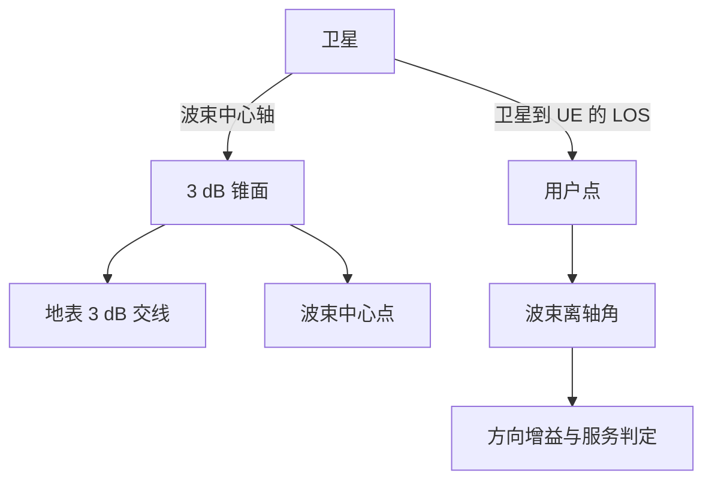

# NTN 天线波束与覆盖组织学习笔记

> 本笔记以方向图和空间响应为起点，说明波束如何形成波束足迹并映射到 NR 波束、频域资源和小区。几何方向由第二篇输入，传播信道由第四篇生成，联合 TA/多普勒时序由第五篇解释。

| 主章节 | 核心对象 | 主要来源 |
|---|---|---|
| 参考天线 | 卫星、HAPS、手持 UE、VSAT | TR 38.811 Clause 6 |
| 波束与覆盖 | 视轴、离轴角、足迹、多波束 | TR 38.811 Clauses 4.6、6 |
| NR 波束管理 | SSB、CSI-RS、SRS、QCL/TCI | TR 38.821 Clause 6.2 |
| 资源映射 | 波束、BWP、CC、小区、卫星 | TR 38.821 Clause 6.2.4 |

## 1 NTN 天线

本部分只回答天线怎样把一个空间方向变成增益、相位和极化响应。轨道和 LOS 推导由[《卫星轨道时间与链路几何》](./02_卫星轨道时间与链路几何_学习笔记.md)负责，信道簇和径的生成由[《NTN 传播损耗与信道模型》](./04_NTN传播损耗与信道模型_学习笔记.md)负责。

### 1.1 天线投影与信道接口

NTN 天线不是替换 GSCM 的独立信道，而是把每条路径从空间方向投影到实际阵元、端口和波束。TR 38.811 一方面给出卫星/HAPS 和终端的参考方向图，另一方面继续复用 TR 38.901 的球坐标、极化场、阵列组合与 CDL 系数生成。

| 对照项 | TR 38.901 通用/地面基线 | TR 38.811 NTN 处理 |
|---|---|---|
| 基站/平台阵元 | 通用单阵元场方向图与阵列面板 | 卫星参考模型可用圆形孔径 Bessel 方向图；HAPS 给出抛物线、圆形孔径、线阵或平面阵等候选 |
| 终端 | UE 单元与阵列由评估配置定义 | Class 3 UE 可用 0 dBi 准全向或双阵元同相模型；Ka 回传使用高增益 VSAT |
| 方向变量 | AOD/AOA/ZOD/ZOA 与阵元局部坐标 | 几何侧实际仰角和传播方向决定离轴角；平台侧簇角扩展常近似为零 |
| 阵列与端口 | 阵元场 × 空间相位 × 极化矩阵形成端口系数 | 方法不变，但代入 NTN 方向图、波束指向和线/圆极化组合 |
| 波束增益 | 可在端口权重中形成 | 若已在波束权重中体现，就不能在链路预算重复加同一方向增益 |
| TDL 投影 | CDL 经空间滤波得到等效抽头 | 标准 NTN-TDL 采用各向同性 UE 基线；方向性 UE/VSAT 应先在 CDL 应用方向图再重新滤波 |

本节的逻辑不是把天线与 TDL 并列，而是沿着实际生成顺序展开：

\[
\boxed{
\text{参考方向图}
\rightarrow
\text{阵元、端口与波束}
\rightarrow
\text{CDL 路径空间加权}
\rightarrow
\text{等效 TDL}
\rightarrow
\text{目标参数重构}
}
\]

因此，TDL 本身不是天线模型；它是固定天线和波束条件下对角度信道进行空间滤波后的低维输出。

### 1.2 卫星与 HAPS 的参考方向图

TR 38.811 Clause 6.4.1 采用典型圆形孔径反射面天线的归一化增益方向图描述卫星参考波束。直径为 \(D=2a\) 的均匀圆形孔径，其归一化功率方向图为：

\[
P_{\mathrm{circ}}(\theta)
=
\left|
\frac{2J_1(u)}{u}
\right|^2,
\qquad
u=ka\sin\theta
=\frac{\pi D}{\lambda}\sin\theta,
\]

其中 \(\theta\) 为相对波束轴 boresight 的偏离角，\(J_1(\cdot)\) 为第一类一阶贝塞尔函数。第一零点和半功率波束宽度近似为：

\[
\theta_{\mathrm{null}}
\approx1.22\frac{\lambda}{D},
\qquad
\mathrm{HPBW}
\approx1.03\frac{\lambda}{D}\ \mathrm{rad}.
\]

峰值增益近似为：

\[
G_{\max}
\approx
\eta\left(\frac{\pi D}{\lambda}\right)^2,
\]

其中 \(\eta\) 为孔径效率。孔径越大或频率越高，主瓣通常越窄、峰值增益越高，同时对姿态、机械误差和指向误差更敏感。“归一化方向图峰值为 1”只描述相对形状，不表示绝对增益为 0 dBi。

HAPS 可以采用两种参考形式：上述圆形孔径贝塞尔方向图，或 TR 38.901 Clause 7.3 的双线极化矩形面板阵列模型。

> **原文定位：**TR 38.811 Clause 6.4.1、Figure 6.4.1-1 给出圆形孔径方向图；HAPS 还可采用 TR 38.901 Clause 7.3 的基站面板阵列。

### 1.3 终端参考天线与部署条件

#### 1.3.1 手持 UE 参考天线

TR 38.811 Clause 6.4.2 为快衰落建模采用三类 UE 参考方向图：

| UE 参考天线 | 极化 | 典型空间性质 |
|---|---|---|
| 准全向天线 | 线极化 | 一个平面内近似全向，接收较多方向的局部散射 |
| 同相阵列 | 双线极化 | 具有阵列增益和方向选择性 |
| VSAT 型天线 | 圆极化，固定或跟踪 | 高增益、窄波束，面向卫星方向 |

报告只在满足平坦衰落条件的部署中采用 VSAT 型参考方向图。这是该参考模型的适用限定，不表示物理 VSAT 只能工作在平坦衰落信道。宽带 VSAT、低仰角 VSAT 或处于强反射环境中的 VSAT 仍可能需要 TDL/CDL。

> **原文定位：**TR 38.811 Clause 6.4.2 列出 Quasi Isotropic、Co-phased array 和 “VSAT type - circular polarization: fixed or tracking” 三类参考 UE 天线，并限定 VSAT 参考模式用于平坦衰落部署。

#### 1.3.2 VSAT 参考天线

甚小口径终端（Very Small Aperture Terminal，VSAT）不是一种独立的信道分布，而是一组天线和部署条件。TR 38.811 中的参考 VSAT 采用圆极化和固定或跟踪波束，通常还具有较高增益、较窄波束并部署于屋顶或开阔位置。

| 天线与部署性质 | 直接作用 | 对局部信道的影响 |
|---|---|---|
| 高增益、窄波束 | 能量集中到卫星方向 | 抑制偏轴散射径，改变有效 PDP 和 DS |
| 固定或跟踪波束 | 维持卫星方向增益 | 指向误差直接形成增益损失 |
| 圆极化 | 降低姿态变化与法拉第旋转的敏感性 | 仍需考虑轴比和极化失配 |
| 屋顶或开阔地部署 | 周围遮挡和散射通常较少 | 更容易出现准 LOS 和较大相干带宽 |
| 宽带或回传业务 | 业务带宽可能很大 | 即使方向性很强，也不能自动假设整体平坦 |

> **原文定位：**TR 38.811 Clause 6.4.2 定义圆极化、固定或跟踪的 VSAT 参考天线；Clause 6.7 说明相干带宽取决于环境、天线方向图和仰角。

### 1.4 阵元、端口、波束与接收投影

#### 1.4.1 圆形孔径、端口、波束与数据流

“圆形孔径”描述物理口径及其方向图，不直接规定馈源数、射频链数、天线端口数或数据流数。

| 概念 | 所在层次 | 与数据流的关系 |
|---|---|---|
| 圆形孔径 | 物理辐射口径 | 不直接决定流数 |
| 馈源或阵元 | 激励孔径的物理单元 | 可以形成一个或多个端口 |
| 天线端口 | 基带可独立控制或观测的维度 | 限制可用空间维度 |
| 射频链 | 独立上/下变频通道 | 限制同时处理的流数 |
| 波束 | 对空间方向的加权响应 | 与端口、流数不一一对应 |
| 数据流或层 | 相互独立的数据序列 | 受端口、射频链和信道秩共同限制 |

同一个反射面可以采用单馈源、双极化馈源、多馈源或相控阵馈源。可支持的数据流数满足：

\[
N_{\mathrm{stream}}
\leq
\min\!\left(
N_{\mathrm{RF,t}},
N_{\mathrm{RF,r}},
\operatorname{rank}(\mathbf H)
\right).
\]

如果仿真仅把圆形孔径公式实现为一个标量增益 \(G(\theta)\)，该具体实现等效于标量端口。这是建模选择造成的单流限制，不是圆形孔径本身的物理限制。

方向也要分层理解：方向图相对于自身 boresight 固定；反射面若固定安装，boresight 在卫星本体坐标系中通常固定；但卫星姿态、多馈源切换、电子扫描和数字波束赋形均可改变它在地球坐标系中的覆盖方向。LEO 波束若相对卫星本体固定，会随平台运动扫过地面；对地固定波束则需要持续指向控制或波束切换。

> **原文定位：**TR 38.811 Clause 6.4.1 只规定归一化功率方向图与 boresight 偏离角，并未规定馈源、端口、射频链或空间层数；波束和数据流能力需由额外阵列架构确定。

#### 1.4.2 接收波束的导向矢量表示

对离散阵列，令到达方向为 \(\boldsymbol{\Omega}=(\phi,\theta)\)，其中 \(\phi\) 为 AOA，\(\theta\) 为 ZOA。单位方向向量可写为：

\[
\mathbf u(\phi,\theta)
=
\begin{bmatrix}
\sin\theta\cos\phi\\
\sin\theta\sin\phi\\
\cos\theta
\end{bmatrix}.
\]

若第 \(m\) 个接收阵元位置为 \(\mathbf p_m\)，窄带导向矢量为：

\[
\mathbf a_r(\phi,\theta)
=
\frac{1}{\sqrt M}
\begin{bmatrix}
e^{-j\frac{2\pi}{\lambda}\mathbf p_1^T\mathbf u}\\
\vdots\\
e^{-j\frac{2\pi}{\lambda}\mathbf p_M^T\mathbf u}
\end{bmatrix}.
\]

第 \(b\) 个接收波束由合并向量 \(\mathbf v_b\) 表示：

\[
z_b=\mathbf v_b^H\mathbf y,
\qquad
G_b^{\mathrm{rx}}(\phi,\theta)
=
\left|
\mathbf v_b^H\mathbf a_r(\phi,\theta)
\right|^2.
\]

对于连续圆形孔径，导向矢量可推广为孔径导向函数：

\[
A(\boldsymbol{\Omega})
=
\int_{\mathcal A}
w^*(\boldsymbol{\rho})
e^{-jk\boldsymbol{\rho}^T\mathbf u(\boldsymbol{\Omega})}
\,\mathrm d\boldsymbol{\rho}.
\]

对均匀圆形孔径积分后可得到贝塞尔函数形式的远场方向图。但 TR 38.811 给出的 \(G(\theta)\) 只有标量功率响应，缺少阵元位置、端口复相位、馈电网络和极化端口结构，因此不能仅凭该公式唯一反推出多端口导向矢量。

> **原文定位：**TR 38.811 Clause 6.4.1 提供标量参考方向图；离散阵列的球坐标、阵元场响应和阵列组合参见 TR 38.901 Clauses 7.1-7.3。

## 2 NTN 波束

本部分把第 1 部分的天线响应与地表覆盖连接起来。输入是同一时刻、同一坐标系下的卫星→UE LOS 向量和每个波束的中心轴；输出是波束离轴角、方向增益、覆盖轮廓及服务候选。

### 2.1 波束足迹与波束运动

#### 2.1.1 波束、波束足迹与小区

| 概念 | 含义 |
|---|---|
| Beam | 天线在三维空间中的辐射方向图 |
| Beam footprint | 波束与地表相交形成的覆盖区域，常译为波束足迹或波束地面覆盖区 |
| Cell | 网络和协议层定义的小区 |

Beam footprint 通常近似为椭圆，尤其在波束斜照低仰角区域时更明显。覆盖边缘不是功率突然变为零的硬边界，可按天线增益下降、最低接收功率、最低业务可用率或最低仰角定义。

| 平台 | 典型波束足迹直径 |
|---|---:|
| GEO | 约 200-1,000 km |
| NGSO | 约 100-500 km |
| 空中平台 | 约 5-200 km |

#### 2.1.2 对地移动波束与对地固定波束

移动波束随平台运动扫过地面。即使 UE 静止，也会经历进入波束、靠近波束中心和离开波束，因此可能发生波束、小区或卫星切换。

对地固定波束通过机械或电子波束控制补偿平台运动，使 footprint 在一段时间内相对地面固定。它并不表示卫星静止，也不表示 UE 到卫星的传播距离和多普勒不再变化。对于 LEO，同一地理区域还可能在不同卫星之间交接。

> **原文定位：**Clause 4.6；Table 4.6-1；Figure 4.6-1。

### 2.2 波束中心轴、UE 方向与真实离轴角

第 \(i\) 个波束首先指定一个波束中心 \(C_i\)。从卫星 \(S\) 指向 \(C_i\) 的单位射线是波束视轴 \(\mathbf b_i\)，也就是天线最大增益方向。实际 UE 位于 \(U\) 时，从卫星指向 UE 的单位射线记为 \(\mathbf d\)：

\[
\mathbf b_i=
\frac{\mathbf r_{c,i}-\mathbf r_s}
{\|\mathbf r_{c,i}-\mathbf r_s\|},
\qquad
\mathbf d=
\frac{\mathbf r_u-\mathbf r_s}
{\|\mathbf r_u-\mathbf r_s\|}.
\]

如果 UE 正好位于波束中心，两条射线重合；如果 UE 偏离中心，两条射线在卫星处形成夹角 \(\theta_{\mathrm{off},i}\)。这个角才是第 \(i\) 个天线方向图的输入。

真实波束离轴角由单位向量点积计算。为与几何篇统一，以下将第 \(i\) 个波束中心轴记为 \(\hat{\boldsymbol b}_i\)，卫星→UE 的 LOS 单位向量记为 \(\hat{\boldsymbol\ell}_{s\rightarrow u}\)：

\[
\theta_{\mathrm{off},i}
=\arccos\!\left(\operatorname{clip}
\left(\hat{\boldsymbol b}_i^{\mathsf T}
\hat{\boldsymbol\ell}_{s\rightarrow u},-1,1\right)\right).
\]

几何篇还定义了相对天底方向 \(\hat{\boldsymbol n}\) 的天底角：

\[
\theta_{\mathrm{nadir}}
=\arccos\!\left(
\hat{\boldsymbol n}^{\mathsf T}
\hat{\boldsymbol\ell}_{s\rightarrow u}
\right).
\]

二者只有在 \(\hat{\boldsymbol b}_i=\hat{\boldsymbol n}\)，也就是第 \(i\) 个波束正好指向天底时相同。偏置波束或可转向波束通常满足 \(\theta_{\mathrm{off},i}\ne\theta_{\mathrm{nadir}}\)。因此全文只用“天底角”指前者的几何参考，只用“波束离轴角”指方向图输入，不再把两者统称为离轴角。

其中 \(\operatorname{clip}\) 只用于避免浮点误差使点积略超出 \([-1,1]\)。若把两条方向都写成卫星本地坐标

\[
\mathbf b_i^{(L)}=
\begin{bmatrix}u_i&v_i&w_i\end{bmatrix}^{\mathsf T},
\qquad
\mathbf d^{(L)}=
\begin{bmatrix}u&v&w\end{bmatrix}^{\mathsf T},
\]

则完全等价地有

\[
\cos\theta_{\mathrm{off},i}
=u_i u+v_i v
+\sqrt{1-u_i^2-v_i^2}\sqrt{1-u^2-v^2}.
\]

因此计算过程可以直观地理解为：**先把“波束中心”和“UE”分别变成从卫星出发的两条单位射线，再求两条射线之间的夹角。**这里没有把地面距离直接当成天线离轴角。

UV 平面距离

\[
\Delta\rho_{\mathrm{UV}}
=\sqrt{(u-u_i)^2+(v-v_i)^2}
\]

只是两个方向余弦点之间的平面距离。只有在**靠近天底且角度间隔很小**时，才可使用 \(\theta_{\mathrm{off},i}\approx\Delta\rho_{\mathrm{UV}}\)；一般情况下应使用上面的点积公式。若希望在任意中心附近做一阶近似，令 \(\Delta u=u-u_i\)、\(\Delta v=v-v_i\)、\(w_i=\sqrt{1-u_i^2-v_i^2}\)，则

\[
\theta_{\mathrm{off},i}^2
\approx
(\Delta u)^2+(\Delta v)^2
+\frac{(u_i\Delta u+v_i\Delta v)^2}{w_i^2}.
\]

例如中心视轴为 \((u_i,v_i)=(0.107,0)\)，某 UE 方向为 \((u,v)=(0.110,0.003)\)。简单 UV 距离为 \(0.004243\)，若按小角度弧度近似换算为 \(0.2431^\circ\)；精确点积得到 \(\theta_{\mathrm{off},i}=0.2438^\circ\)。两者在这个 GEO 中心附近非常接近，是因为中心离天底不远且 UE 偏移很小，而不是因为 UV 距离在所有位置都等于球面夹角。

### 2.3 方向图、3 dB 轮廓与服务边界

TR 38.811 Clause 6.4.1 采用圆孔径参考方向图。设 \(a\) 为孔径半径、\(k=2\pi/\lambda\)，把上一节得到的波束离轴角 \(\theta_{\mathrm{off},i}\) 代入，则归一化功率增益为

\[
g(\theta_{\mathrm{off},i})=
\begin{cases}
1, & \theta_{\mathrm{off},i}=0,\\
4\left|\dfrac{J_1(ka\sin\theta_{\mathrm{off},i})}{ka\sin\theta_{\mathrm{off},i}}\right|^2,
& \theta_{\mathrm{off},i}\ne0,
\end{cases}
\]

\[
G_i(\theta_{\mathrm{off},i})_{\mathrm{dBi}}
=G_{\max,i,\mathrm{dBi}}+10\log_{10}g(\theta_{\mathrm{off},i}).
\]

这就形成一条完整几何链：

\[
\text{ECEF 位置}
\rightarrow
\text{卫星到地面点的单位方向}
\rightarrow
\text{波束离轴角 }\theta_{\mathrm{off},i}
\rightarrow
\text{天线增益 }G_i
\rightarrow
\text{RSRP、接入与干扰}.
\]

第 \(i\) 个波束在地表上的 3 dB 轮廓定义为天线增益等值线

\[
\mathcal C_{3\mathrm{dB},i}
=\left\{\boldsymbol p:
G_i\bigl(\theta_{\mathrm{off},i}(\boldsymbol p)\bigr)
=G_{\max,i}-3\ \mathrm{dB}
\right\},
\]

轮廓内部通常满足

\[
G_i\bigl(\theta_{\mathrm{off},i}(\boldsymbol p)\bigr)
\geq G_{\max,i}-3\ \mathrm{dB}.
\]

| 边界或范围 | 定义依据 | 直接用途 | 不应等同于 |
|---|---|---|---|
| 3 dB 轮廓 | 峰值增益下降 3 dB | 主瓣宽度和波束足迹 | 业务可用覆盖边界 |
| 服务门限轮廓 | RSRP、SINR 或链路预算门限 | 可服务区域判断 | 固定天线几何轮廓 |
| 波束足迹 | 波束与地表相交区域 | 描述空间覆盖 | 逻辑小区 |
| 小区范围 | 接入和移动性配置 | 小区选择、重选和切换 | 必然与单一波束一一对应 |

斜视波束的锥面与曲面地球相交后，3 dB 轮廓通常不再是规则圆形，可能近似椭圆或更一般的曲线。

UV 平面中的六边形不是天线方向图的硬边界。方向图在六边形外仍连续存在；UE 也可能因实际 RSRP 而接入另一个波束。这正是系统级仿真必须对“每个波束—每个 UE”计算真实方向增益的原因。

### 2.4 19 波束布局与 NTN wrap-around

TR 38.821 定义 UV 平面相邻波束间距（Adjacent Beam Spacing，ABS）为

\[
d_{\mathrm{ABS}}
=\sqrt{3}\sin\left(\frac{\mathrm{HPBW}}{2}\right),
\]

其中 HPBW 是完整的 3 dB 波束宽度。小角度下

\[
d_{\mathrm{ABS}}\approx\frac{\sqrt{3}}{2}\mathrm{HPBW}.
\]

用六边形轴坐标 \((q,r)\) 生成波束中心：

\[
u(q,r)=u_0+d_{\mathrm{ABS}}\left(q+\frac{r}{2}\right),
\qquad
v(q,r)=v_0+d_{\mathrm{ABS}}\frac{\sqrt{3}}{2}r.
\]

内层 19 波束满足

\[
\max\bigl(|q|,|r|,|q+r|\bigr)\le2,
\]

即中心 1 个、第一圈 6 个、第二圈 12 个。

传统地面蜂窝 wrap-around 依赖平移或镜像对称性。NTN 中，非天底波束的地面投影会受到地球曲率、斜距和仰角影响，因此 TR 38.821 要求独立生成外围波束：

- FRF = 1：在 19 波束外增加 2 圈，总计 61 个波束；
- FRF > 1：增加 4 圈，总计 127 个波束；
- 外围波束只用于形成干扰，性能统计只使用内层 19 波束中的 UE；
- 与服务资源同频、同极化且同时活动的波束才进入实际干扰集合。

因此 wrap-around 的接口是“内层 19 波束负责取样与统计，外围独立波束只扩展干扰集合”。外围波束不能由平面周期平移复制；每个波束仍需独立计算地球曲率下的几何、方向增益和资源活动状态。

**原文定位：**TR 38.821 Table 6.1.1.1-4～6、Figure 6.1.1.1-1～2；TR 38.811 Clause 6.4.1。Table 6.1.1.1-4 直接给出 UV 平面约定、19 波束基线和 ABS 公式；地固位置到单位方向、真实离轴角以及一阶 UV 度量是对仿真实现过程的展开说明。

---

## 3 小区范围、小区配置与波束管理

本部分区分物理波束、地面足迹、参考信号方向、资源配置和逻辑小区。它们可以联动变化，但不是同一个事件。

### 3.1 波束足迹、服务覆盖与逻辑小区

NTN 中需要区分三类相关但不等同的对象：

| 对象 | 含义 | 主要层面 |
|---|---|---|
| 卫星天线波束 | 阵列形成的物理主瓣和方向图 | 天线与射频 |
| 波束足迹 | 物理波束在地面的覆盖区域 | 地理空间 |
| NR 波束 | 与 SSB、CSI-RS、SRS 或 TCI 状态关联的收发方向 | PHY、MAC 与 RRC |

地面网络（Terrestrial Network，TN）中，基站固定，覆盖范围通常较稳定，波束动态主要来自 UE 移动、姿态和遮挡。低轨 NTN 中，即使 UE 静止，卫星高速运动也会使最佳波束持续变化。

| 维度 | TN | LEO NTN |
|---|---|---|
| 网络平台 | 基站固定 | 卫星高速运动 |
| 静止 UE 的最佳波束 | 通常较稳定 | 仍可能持续变化 |
| 波束足迹 | 通常固定 | 可对地移动或暂时对地固定 |
| 波束预测 | 主要依赖测量 | 可结合星历、位置和时间 |
| 闭环反馈 | RTT 较短 | 报告到达时可能已老化 |
| 切换联动 | 空间波束和 QCL 状态 | 还可能涉及 TA、多普勒、频率和极化 |

### 3.2 对地移动与对地固定波束

对地移动波束通常保持相对卫星平台的指向，地面足迹随卫星飞行扫过地面：

\[
\text{平台坐标系中方向近似不变}
\rightarrow
\text{地面足迹移动}
\]
对地固定波束通过电子或机械转向，使足迹在一段时间内保持在目标区域：

\[
\text{地面足迹暂时固定}
\rightarrow
\text{卫星阵列方向持续变化}
\]
因此“对地固定”不表示卫星侧波束控制静止。随着卫星离开可见区，服务仍需转交给下一物理波束或下一颗卫星。GEO 的几何关系更接近固定基站，但传播时延、覆盖面积和链路预算仍与 TN 显著不同。

> **原文定位：**TR 38.821 Clause 7.4。

### 3.3 静止 UE 的波束管理时间序列

即使 UE 固定在同一个地理位置，卫星运动也会改变 LOS、最佳波束、传播时延和公共多普勒。把一次服务过程按时间展开，可以看清三个不同层次的变化：

| 时刻 | 几何或网络变化 | 可能动作 | 是否必然切换小区 |
|---|---|---|---|
| \(t_0\) | 波束 A 最优 | 使用波束 A 及相应 TCI 状态 | 否 |
| \(t_1\) | 波束 B 变优，但仍属于同一逻辑小区 | 切换波束，更新 TCI/QCL 关系 | 否 |
| \(t_2\) | 服务卫星或物理波束改变，逻辑小区保持 | 更新波束、TA、多普勒和测量参考 | 否 |
| \(t_3\) | 逻辑小区身份或上下文也改变 | 小区重选或切换并转移上下文 | 是 |

测量、报告和执行之间还隔着 NTN RTT，因此不能把报告时刻的最优波束直接当作执行时刻的最优波束。波束管理需要结合 SSB/CSI-RS 测量、QCL/TCI 状态以及可选的星历预测；小区移动性则由 PCI、系统信息和 RRC 上下文是否变化判断。

NTN 波束管理不仅是选择最大 RSRP 的方向，还要处理以下联动：

- **几何预测：**星历、UE 位置和时间可用于预测可见卫星、仰角与候选波束，减少完全依赖滞后测量的切换。
- **反馈老化：**测量报告经长传播时延到达网络时，原最佳波束可能已经变化，需要更早触发或预配置目标波束。
- **时频补偿：**不同波束可能采用不同参考点，切换时可能同时出现 $\Delta TA$、$\Delta f_{\mathrm{Doppler}}$ 和 $K_{\mathrm{offset}}$ 变化。
- **终端能力：**S 频段手持 UE 的终端波束较宽；Ka 频段 VSAT 或相控阵终端波束较窄，需要持续跟踪卫星。
- **频率与极化：**相邻波束可能使用不同频率颜色或 RHCP/LHCP，切换可能同时改变频率资源和极化模式。

由此，NTN 波束切换往往是空间方向、参考信号、TA、多普勒、频率资源和服务卫星的联合状态变化。

### 3.4 PCI、载波、BWP 与参考信号配置

#### 3.4.1 CC 与 BWP 的频域层级

分量载波（Component Carrier，CC）是载波聚合（Carrier Aggregation，CA）的组成单位。每个 CC 具有中心频率、载波带宽和资源块网格。带宽部分（Bandwidth Part，BWP）是一个 CC 内连续的频率工作窗口：

\[
\mathcal B_i\subseteq\mathcal C_m
\]
$\mathcal C_m$ 表示第 $m$ 个 CC，$\mathcal B_i$ 表示该 CC 内配置的第 $i$ 个 BWP。一个 BWP 不能跨越两个 CC。

| 维度 | BWP 切换 | CC/载波聚合 |
|---|---|---|
| 范围 | 同一个 CC 内 | 不同 CC 之间 |
| 作用 | 调整 UE 当前工作窗口 | 增加可同时使用的载波 |
| 是否增加载波数 | 否 | 是 |
| 同时工作关系 | 一个方向通常一个激活 BWP | 多个 CC 可同时激活 |

可以记为：CA 决定 UE 同时使用多少个载波；BWP 决定 UE 在每个载波内部实际监听和收发哪一部分。DL 与 UL BWP 在配对频谱中可以独立切换，在非配对频谱中同步切换。

TR 38.821 Clause 6.2.4 讨论了频率复用因子大于 1 时“一波束一 BWP”或“一波束一 CC”等候选映射，也提出用单条 DCI 同时切换 DL/UL BWP。它们是系统方案，不是 BWP 的固有定义，也未在该研究报告中收敛为唯一规则。

> **原文定位：**TR 38.821 Clause 6.2.4；TS 38.300 Clause 5.1、6.10 和 7.8。

#### 3.4.2 SSB/CSI-RS、波束与小区的管理层级

波束描述空间收发方向，小区描述一套接入、广播、调度和移动性管理配置。一个小区可以包含多个 SSB 或 CSI-RS 波束；同一小区内的 SS/PBCH blocks 共享 PCI 和服务小区的 MIB/RRC 广播上下文，但各 SS/PBCH block 仍携带 SSB index、定时相关信息以及相应的 PBCH/DM-RS 内容，不能笼统表述为“所有基本系统信息完全相同”。UE 从一个 SSB 波束切到另一个波束，只要 PCI 和服务小区上下文不变，通常属于小区内波束切换。

| UE 观察到的主要变化 | 操作性质 |
|---|---|
| SSB/CSI-RS/TCI 状态改变，PCI 不变 | 小区内波束切换 |
| 激活 BWP 改变，服务小区不变 | BWP 切换 |
| SCell 激活或去激活 | CA/服务小区操作 |
| PCI、系统信息和 RRC 上下文改变 | 小区切换或重选 |
| 服务卫星改变，但小区身份保持 | 服务链路切换，不一定是小区切换 |

物理波束也可承载多个 CC、BWP 或频率层小区，因此物理波束、波束足迹和 NR 小区之间不存在固有的一一对应关系。

> **原文定位：**TS 38.211 Clauses 7.4.1.4、7.4.3；TS 38.300 Clause 9.2.4。

#### 3.4.3 NTN 小区映射与联合状态

NTN 中常见三种小区映射：

1. **多波束对应一个小区：**减少 RRC handover，但共同定时、多普勒参考、随机接入和频率复用管理更复杂。
2. **一个波束对应一个小区：**波束和 PCI 容易映射，但对地移动 LEO 波束可能引起频繁小区切换。
3. **对地固定逻辑小区由不同卫星接续：**网络保持逻辑小区身份，后台更换服务卫星、物理波束或馈电链路；能否对 UE 无感取决于时频连续性和网络架构。

一次 NTN 服务状态可抽象为：

\[
\mathcal S=
\{\mathrm{Cell},\mathrm{Satellite},\mathrm{Beam},\mathrm{CC},\mathrm{BWP},
\mathrm{TA},\mathrm{Doppler},K_{\mathrm{offset}}\}
\]
这些状态量不必同时变化。判断一次操作属于波束切换、BWP 切换、载波操作还是小区切换，关键不在地面覆盖图是否改变，而在 UE 的波束标识、PCI、RRC 上下文、服务载波和激活 BWP 是否改变。

全篇关系可归纳为：TA 修正波形到达时刻，$K_{\mathrm{offset}}$ 修正跨 DL-UL 逻辑时序；Layer 3 滤波通过路径损耗估计影响上行功率；波束属于空间层，BWP 和 CC 属于频域层，小区属于接入与移动性管理层。NTN 系统需要协调这些不同层次，不能把波束切换、BWP 切换和小区切换相互等同。

> **原文定位：**TR 38.821 Clause 7.3.2、7.4 和 8.3。

### 3.5 波束状态的输出接口

| 输出 | 含义 | 下游使用方式 |
|---|---|---|
| \(G_{\mathrm{tx}}(\theta,\phi)\)、\(G_{\mathrm{rx}}(\theta,\phi)\) | 给定方向上的发射/接收增益 | [链路预算和端口投影](./04_NTN传播损耗与信道模型_学习笔记.md) |
| 服务波束、候选波束和边缘判据 | 覆盖与切换候选 | [移动性与联合补偿](./05_NTN空口时频与协议适配_学习笔记.md)、[服务选择](./06_NTN链路系统与多星仿真_学习笔记.md) |
| 端口、数据流、QCL/TCI 状态 | 空间滤波和参考信号关系 | [等效信道](./04_NTN传播损耗与信道模型_学习笔记.md)、[信道估计](./05_NTN空口时频与协议适配_学习笔记.md) |
| Beam/CC/BWP/Cell/Satellite 联合状态 | 资源与接入上下文 | [调度和切换状态机](./06_NTN链路系统与多星仿真_学习笔记.md) |

本篇只产生方向图与覆盖组织，不把波束增益再次并入路径损耗，也不把波束切换直接等同于小区、BWP 或卫星切换。接收空间滤波作用于多径端口信道后的等效 CDL/TDL 重构见第四篇。
