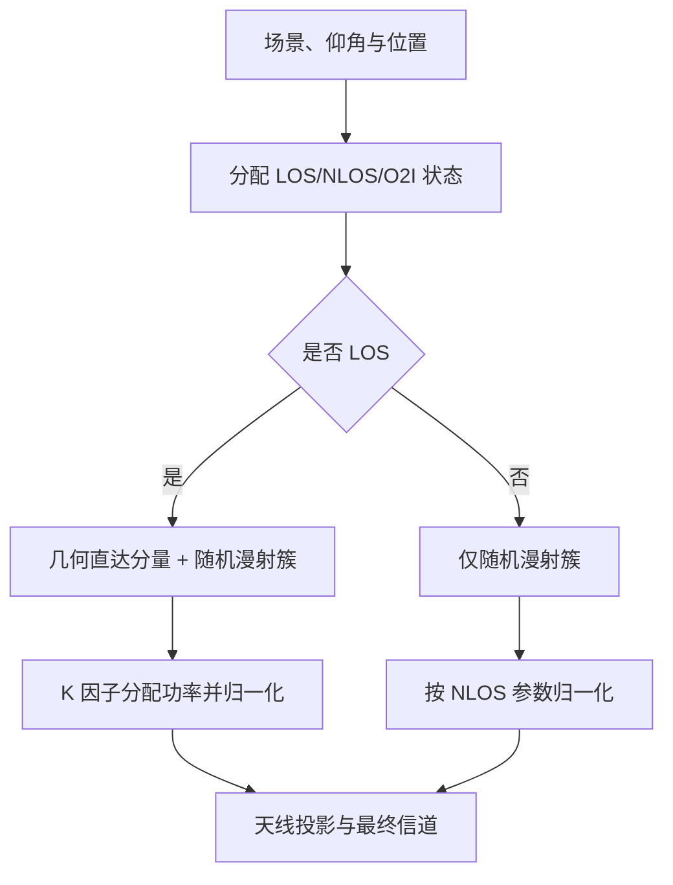

# NTN 传播损耗与信道模型学习笔记

> 正文按“GSCM 总览 → NTN 外部接口 → 大尺度传播 → LSP/簇/径 → CDL/TDL”重建；几何和天线响应通过稳定标题引用，不在本篇重复推导。

| 主章节 | 核心对象 | 主要来源 |
|---|---|---|
| GSCM 总览 | 条件化传播状态、LSP、簇、径和 LOS 分量 | TR 38.901 Clause 7.5 |
| NTN 外部接口 | 几何、天线、公共时间和多普勒 | TR 38.811/38.901 |
| 大尺度传播 | EIRP、Coupling Loss、FSPL、杂波、阴影、建筑和大气 | TR 38.811 Clauses 5-6 |
| 局部与降阶模型 | LSP、簇、子径、CDL、TDL 和平坦衰落 | TR 38.901 Clause 7.7 |

## 1 信道建模目标与 GSCM 总览

### 1.1 模型层级与信息保留关系

本文采用 GSCM（Geometry-based Stochastic Channel Model）这一常见缩写；有些资料也写 GBSM。其“几何”表示每条子径通过收发方向、阵列位置和运动速度进入信道系数；其“随机”表示时延、功率、角度和极化等参数通常从场景统计分布产生，而不是逐一对应真实地图中的散射体。

不限定地面或非地面场景时，通用生成器可抽象为：

\[
\boxed{
\mathcal H_{\mathrm{GSCM}}
=
\mathcal G
\left(
\mathcal X,\,
\boldsymbol\Lambda,\,
\mathcal A_{\mathrm{Tx/Rx}},\,
\mathcal M
\right)
}
\]

其中 \(\mathcal X\) 是链路布局和传播方向，\(\boldsymbol\Lambda\) 是场景的路径损耗与 LSP 统计参数，\(\mathcal A_{\mathrm{Tx/Rx}}\) 是阵列、方向图和极化，\(\mathcal M\) 是收发端及散射体运动。四类输入经由同一生成器形成时变宽带 MIMO 信道。

| 模型层级 | 参数如何得到 | 显式保留的结构 | 典型用途 |
|---|---|---|---|
| 完整 GSCM | 每个 drop 按场景统计量生成 LSP、簇和子径 | 时延、功率、四类角度、阵列、极化、子径、多普勒及空间相关 | 系统级、多用户、波束管理、移动轨迹 |
| CDL | 采用标准化簇时延、功率和中心角度骨架，再缩放并生成子径系数 | 宽带 MIMO、角度、阵列、极化和多普勒 | 可复现链路级 MIMO/波束仿真 |
| TDL | 采用标准化抽头时延和功率，直接生成抽头过程或由 CDL 空间滤波 | 频率选择性和时间选择性 | OFDM、均衡、信道估计、编码 |
| 平坦衰落 | 把不可分辨的多径合并成一个复系数或矩阵 | 窄带时间衰落、Ricean/Loo 状态 | 窄带链路、覆盖和简化系统级仿真 |
| 仅大尺度/AWGN | 只保留平均功率衰减和噪声 | 路径损耗、阴影和环境附加损耗等 | 链路预算、可用率和极简基线 |

> **原文定位：**TR 38.901 Clause 7.5 给出完整随机信道生成流程，Clause 7.7 给出 CDL/TDL 及其缩放方法。

### 1.2 统一的时变宽带 MIMO 表达

连续时间宽带 MIMO 基带模型为：

\[
\mathbf y(t)
=
\int
\mathbf H(t,\tau)\,
\mathbf x(t-\tau)
\,\mathrm d\tau
+\mathbf n(t).
\]

完整 GSCM 将信道写成簇和簇内子径之和：

\[
\mathbf H_{\mathrm{GSCM}}(t,\tau)
=
\sum_{n=1}^{N}
\sum_{m=1}^{M_n}
\mathbf H_{n,m}(t)\,
\delta(\tau-\tau_n).
\]

这里 \(n\) 是簇，\(m\) 是簇内子径；标准基线通常令同一簇的子径共享簇时延 \(\tau_n\)，而以不同 AOD、AOA、ZOD、ZOA、极化相位和多普勒形成空间与时间结构。若模型使用簇内时延扩展或强簇拆分，则可进一步写成 \(\tau_{n,m}\)。

总信道可以分成大尺度幅度、公共相位和归一化局部信道：

\[
\mathbf H_{\mathrm{total}}(t,\tau)
=
10^{-PL(t)/20}
e^{j\phi_{\mathrm{common}}(t)}
\mathbf H_{\mathrm{local}}(t,\tau).
\]

这一区分非常重要：

- \(PL\) 处理确定性距离损耗、阴影和其他慢变环境损耗等功率尺度；
- \(\phi_{\mathrm{common}}\) 处理在局部多径间近似共享的公共传播相位或公共频移；
- \(\mathbf H_{\mathrm{local}}\) 处理簇、子径、阵列、极化和局部散射造成的相干起伏。

### 1.3 GSCM 的十二步生成流程

TR 38.901 Clause 7.5 的十二步可归纳为四个阶段。前四步决定“这个 drop 属于什么统计环境”，第 5～7 步建立簇骨架，第 8～10 步补齐簇内随机性，第 11～12 步把路径投影到实际天线端口并施加大尺度损耗。

#### 1.3.1 阶段一：场景、传播状态与相关大尺度参数（步骤 1～4）

**步骤 1：设置场景、网络和天线。**

给出载频 \(f_c\)、带宽、收发端位置与速度、阵列单元坐标、方向图、极化和仿真时间。

**步骤 2：分配传播状态。**

根据场景模型判断 LOS/NLOS；若有室内用户，还需判断室内/室外及穿透条件。通用写法为：

\[
S
\sim
\mathrm{Bernoulli}\!\left(
p_{\mathrm{LOS}}(\mathcal X,\text{场景})
\right).
\]

状态不是一个装饰标签，它决定路径损耗、K 因子、时延扩展、角扩展和簇参数使用哪组统计量。

**步骤 3：计算路径损耗。**

\[
PL
=
FSPL(d,f_c)
+CL
+SF
+PL_{\mathrm{gas}}
+A_{\mathrm{rain}}
+A_{\mathrm{cloud}}
+PL_{\mathrm{scint}}
+BEL.
\]

具体项按频段、部署和模型路径开关，不能无条件全部叠加。

**步骤 4：联合生成大尺度参数。**

典型大尺度参数向量为：

\[
\boldsymbol\ell
=
[
SF,\ K,\ \log_{10}DS,\ \log_{10}ASD,\ \log_{10}ASA,\
\log_{10}ZSD,\ \log_{10}ZSA
]^{\mathsf T}.
\]

设场景给出的均值为 \(\boldsymbol\mu\)、标准差对角阵为 \(\mathbf D_\sigma\)、相关矩阵为 \(\mathbf C\)，且

\[
\mathbf C=\mathbf L\mathbf L^{\mathsf T},
\qquad
\mathbf z\sim\mathcal N(\mathbf 0,\mathbf I),
\]

则一次联合抽样可写为：

\[
\boldsymbol\ell
=
\boldsymbol\mu
+
\mathbf D_\sigma\mathbf L\mathbf z.
\]

DS、ASD、ASA、ZSD、ZSA 通常在对数域生成，\(K\) 和 \(SF\) 按表中规定的单位处理。空间一致性仿真还需把独立的 \(\mathbf z\) 替换为随位置相关的随机场，例如：

\[
R_q(\Delta d)
=
\exp\!\left(-\frac{\Delta d}{d_{\mathrm{corr},q}}\right).
\]

因此，drop-based GSCM 的“每次随机抽一个信道”与连续轨迹中的“信道平滑演化”是两个层次；后者不能靠在相邻位置独立重抽参数实现。

#### 1.3.2 阶段二：生成簇时延、功率和角度（步骤 5～7）

**步骤 5：生成簇时延。**

一种概括性写法为：

\[
\tau_n'
=
-r_\tau DS\ln X_n,
\qquad
X_n\sim\mathcal U(0,1),
\]

\[
\tau_n
=
\operatorname{sort}
\left(
\tau_n'-\min_k\tau_k'
\right).
\]

LOS 情况下还会根据 \(K\) 因子对时延轴作规定的压缩或修正。这里的 \(\tau_n\) 是相对首径的超额时延，不包含宏观链路传播时延。

**步骤 6：生成簇功率。**

簇功率由指数时延衰减和簇级阴影共同形成，概括为：

\[
P_n'
=
\exp\!\left[
-\tau_n
\frac{r_\tau-1}{r_\tau DS}
\right]
10^{-Z_n/10},
\qquad
Z_n\sim\mathcal N(0,\zeta^2),
\]

\[
P_n
=
\frac{P_n'}{\sum_k P_k'}.
\]

然后按标准门限删除相对最强簇过弱的簇。LOS 信道还要按 \(K\) 因子把确定性直达分量与散射分量分配功率。

**步骤 7：生成四类簇中心角和子径角。**

对任一角度类型

\[
\Omega
\in
\{
\phi_{\mathrm{AOD}},
\phi_{\mathrm{AOA}},
\theta_{\mathrm{ZOD}},
\theta_{\mathrm{ZOA}}
\},
\]

簇中心角可抽象写为：

\[
\Omega_n
=
\Omega_{\mathrm{LOS}}
+
s_n\,G_\Omega(P_n,AS_\Omega,K)
+
Y_{\Omega,n},
\]

其中 \(G_\Omega\) 表示标准中由簇相对功率反推角偏移的映射，\(s_n\in\{-1,+1\}\) 随机决定两侧，\(Y_{\Omega,n}\) 是簇级角扰动。簇内第 \(m\) 条子径采用规定的归一化偏移 \(\alpha_m\)：

\[
\Omega_{n,m}
=
\Omega_n
+
c_{\Omega} \alpha_m.
\]

这一步使 DS 与功率谱、角扩展与空间相关不是彼此独立拼接的统计量，而是在同一个簇结构中共同出现。

#### 1.3.3 阶段三：簇内耦合、XPR 与初相位（步骤 8～10）

**步骤 8：随机耦合簇内四类角度。**

同一个簇内分别生成的 AOD、AOA、ZOD、ZOA 子径列表，通过独立随机置换进行配对。简记为：

\[
m
\longmapsto
\bigl(
\pi_{\mathrm{AOD}}(m),
\pi_{\mathrm{AOA}}(m),
\pi_{\mathrm{ZOD}}(m),
\pi_{\mathrm{ZOA}}(m)
\bigr).
\]

这保留每类角度的边缘分布，但避免人为地把“最大偏移”总与其他端点的“最大偏移”绑定。

**步骤 9：生成交叉极化功率比。**

\[
XPR_{n,m,\mathrm{dB}}
\sim
\mathcal N(\mu_{XPR},\sigma_{XPR}^2),
\qquad
\kappa_{n,m}
=
10^{XPR_{n,m,\mathrm{dB}}/10}.
\]

\(\kappa\) 控制共极化和交叉极化分量的相对功率。

**步骤 10：生成初始随机相位。**

对四种极化耦合分别生成：

\[
\Phi_{n,m}^{pq}
\sim
\mathcal U(-\pi,\pi),
\qquad
p,q\in\{\theta,\phi\}.
\]

这些相位与 XPR 共同形成子径的 \(2\times2\) 极化耦合矩阵。若另有环境引起的极化旋转，应在明确的极化基下加入相应矩阵，并避免与经验极化损耗重复。

#### 1.3.4 阶段四：端口系数、LOS 分量与大尺度缩放（步骤 11～12）

**步骤 11：生成每个收发天线端口对的信道系数。**

设发射端口 \(s\)、接收端口 \(u\) 的双极化场方向图为：

\[
\mathbf F_{\mathrm{Tx},s}(\Omega^t)
=
\begin{bmatrix}
F_{\mathrm{Tx},s,\theta}\\
F_{\mathrm{Tx},s,\phi}
\end{bmatrix},
\qquad
\mathbf F_{\mathrm{Rx},u}(\Omega^r)
=
\begin{bmatrix}
F_{\mathrm{Rx},u,\theta}\\
F_{\mathrm{Rx},u,\phi}
\end{bmatrix}.
\]

子径极化矩阵为：

\[
\mathbf M_{n,m}
=
\begin{bmatrix}
e^{j\Phi_{n,m}^{\theta\theta}}
&
\kappa_{n,m}^{-1/2}
e^{j\Phi_{n,m}^{\theta\phi}}
\\
\kappa_{n,m}^{-1/2}
e^{j\Phi_{n,m}^{\phi\theta}}
&
e^{j\Phi_{n,m}^{\phi\phi}}
\end{bmatrix}.
\]

令 \(\widehat{\mathbf r}^{\,t}_{n,m}\)、\(\widehat{\mathbf r}^{\,r}_{n,m}\) 为出发和到达单位方向，\(\mathbf d_{\mathrm{Tx},s}\)、\(\mathbf d_{\mathrm{Rx},u}\) 为单元位置，则一条子径对端口对 \((u,s)\) 的贡献可概括为：

\[
\begin{aligned}
H_{u,s,n,m}(t)
={}&
\sqrt{\frac{P_n}{M_n}}\,
\mathbf F_{\mathrm{Rx},u}^{\mathsf T}(\Omega^r_{n,m})
\mathbf M_{n,m}
\mathbf F_{\mathrm{Tx},s}(\Omega^t_{n,m})
\\
&\times
\exp\!\left[
j\frac{2\pi}{\lambda}
\left(
\widehat{\mathbf r}^{\,r}_{n,m}\!\cdot\mathbf d_{\mathrm{Rx},u}
+
\widehat{\mathbf r}^{\,t}_{n,m}\!\cdot\mathbf d_{\mathrm{Tx},s}
\right)
\right]
\\
&\times
\exp\!\left(j2\pi\nu_{n,m}t\right).
\end{aligned}
\]

这一式同时说明 GSCM 为什么适合阵列和波束问题：角度通过方向图、阵列相位和速度投影三次进入系数，而不是只作为输出标签。

LOS 场景中，确定性直达分量与散射分量按 \(K\) 因子组合：

\[
\mathbf H_{\mathrm{LOS\ total}}
=
\sqrt{\frac{K}{K+1}}\,
\mathbf H_{\mathrm{specular}}
+
\sqrt{\frac{1}{K+1}}\,
\mathbf H_{\mathrm{diffuse}}.
\]

**步骤 12：施加路径损耗和阴影。**

若前 11 步生成的是单位平均功率的小尺度信道，则最终复幅度缩放为：

\[
\mathbf H_{\mathrm{final}}(t,\tau)
=
10^{-[PL_{\mathrm{det}}(t)+SF(t)]/20}
\mathbf H_{\mathrm{small}}(t,\tau).
\]

功率域应使用 \(10^{-PL/10}\)，复幅度域使用 \(10^{-PL/20}\)。SF 若已经作为相关 LSP 联合抽样，就必须在路径损耗装配时复用同一个样本，不能再次独立抽取。

### 1.4 完整 GSCM 隐含的简化与适用边界

GSCM 比 CDL/TDL 通用，但仍不是“把真实世界所有散射体都建出来”。常见简化包括：

| GSCM 基线假设 | 简化了什么 | 可能需要的扩展 |
|---|---|---|
| 随机簇而非真实地图散射体 | 不给出可对应到具体建筑物的反射路径 | 射线追踪、地图混合模型 |
| 有限簇、有限子径 | 连续散射场离散化 | 增加子径或采用连续角谱 |
| 簇内子径通常共享时延 | 忽略细粒度簇内时延结构 | 簇内时延扩展、强簇拆分 |
| 阵列处局部平面波 | 忽略超大阵列近场球面波 | 近场/球面波模型 |
| 单个 drop 内 LSP 固定 | 忽略长轨迹中 LSP 演化 | 空间一致性、状态转移、簇生灭 |
| 参数来自场景统计表 | 忽略某一具体地点的确定性地貌 | 测量校准或场景专用参数 |
| 标准化极化与 XPR | 不等同于完整电磁传播求解 | 频率/材料相关极化模型 |

因此，“最通用”应理解为：在 3GPP 统计信道模型家族中，完整 GSCM 保留的自由度最多；若研究具体街区、山谷、海面或超大阵列近场，它仍可能不如地图射线追踪或电磁模型贴近特定场景。

### 1.5 传播状态是条件化模型选择

“分配传播状态”首先判断链路属于 LOS、NLOS，适用时还要区分室外到室内（O2I）等条件；它同时选择路径损耗、附加损耗、LSP 分布、Ricean \(K\) 因子、簇数以及簇时延和角度统计，而不是只回答“有没有一条 LOS 径”。

LOS 与 NLOS 的外层流程相同：都要完成场景选择、大尺度参数、天线/极化投影和归一化。内层生成不同：LOS 直达分量的时延和角度由几何确定，漫射簇按随机 GSCM 流程生成，二者按 \(K\) 因子合成；NLOS 状态没有独立镜面直达分量，也不使用 LOS \(K\) 因子。

---

## 2 NTN 几何、大尺度与时间演化接口

### 2.1 标准分工：保留生成器，替换场景参数

TR 38.811 没有为 NTN 另造一套与 TR 38.901 无关的信道方程。它保留 TR 38.901 的坐标、阵列、极化、十二步 GSCM 生成以及 CDL/TDL 缩放方法，再替换为 NTN 的部署几何、天线、大尺度传播和仰角相关统计参数：

\[
\boxed{
\mathcal H_{\mathrm{NTN}}
=
\mathcal G_{38.901}
\left(
\mathcal X_{\mathrm{geo}},
\boldsymbol\Lambda_{\mathrm{NTN}},
\mathcal A_{\mathrm{NTN}},
\mathcal M_{\mathrm{NTN}}
\right)
}
\]

其中：

- \(\mathcal G_{38.901}\) 是通用 GSCM/CDL/TDL 数学骨架；
- \(\mathcal X_{\mathrm{geo}}\) 是外部提供的仰角、斜距、传播方向、几何时延和宏观多普勒；
- \(\boldsymbol\Lambda_{\mathrm{NTN}}\) 是环境、频段、LOS/NLOS 和仰角对应的路径损耗与 LSP 参数；
- \(\mathcal A_{\mathrm{NTN}}\) 是卫星、HAPS、手持 UE 或 VSAT 的方向图、阵列与极化；
- \(\mathcal M_{\mathrm{NTN}}\) 是公共卫星运动、UE 运动和局部子径运动的组合。

因此，TR 38.901 主要回答“如何生成”，TR 38.811 主要回答“NTN 场景应向生成器填什么参数、增加哪些边界条件”。TR 38.811 Clause 6.7.2 是 NTN 系统级 GSCM 的入口，Clause 6.9 的 NTN-CDL/TDL 是链路级参考实现。

### 2.2 几何侧输入接口与内容边界

本文从[《卫星轨道时间与链路几何》中的“NTN 几何与时间的完整计算流程”](./02_卫星轨道时间与链路几何_学习笔记.md#48-ntn-几何与时间的完整计算流程)接收下列量，不再重复 ECEF/局部坐标变换、距离、绝对传播时延和公共多普勒推导：

\[
\mathcal X_{\mathrm{geo}}(t)
=
\left\{
\varepsilon(t),\,
d(t),\,
\tau_{\mathrm{abs}}(t),\,
\hat{\boldsymbol\ell}_{s\rightarrow u}(t),\,
f_{D,\mathrm{common}}(t)
\right\}.
\]

这些量在本文中的用途分别是：

| 几何侧输入 | 在信道模型中的用途 |
|---|---|
| UE 仰角 \(\varepsilon(t)\) | 选择/映射 LOS、杂波、SF 和 LSP 参数，并设置 ZOD/ZOA 的几何中心 |
| 斜距 \(d(t)\) | 计算 FSPL；不在局部 CDL/TDL 中再次产生 |
| 绝对传播时延 \(\tau_{\mathrm{abs}}(t)\) | 平移所有局部超额时延，形成绝对到达时延 |
| LOS 方向 \(\hat{\boldsymbol\ell}_{s\rightarrow u}(t)\) | 交给天线篇形成波束离轴角，并作为阵列角度基准 |
| 公共多普勒 \(f_{D,\mathrm{common}}(t)\) | 作为全部局部路径近似共享的相位旋转，与局部子径多普勒分开 |

一个避免重复计数的端到端接口可写成：

\[
\mathbf H_{\mathrm{link}}(t,\tau)
=
10^{-L_{\mathrm{prop}}(t)/20}
e^{j\phi_{\mathrm{common}}(t)}
\mathbf F_r^H(t)
\mathbf H_{\mathrm{local}}
\left(t,\tau-\tau_{\mathrm{abs}}(t)\right)
\mathbf F_t(t),
\]

\[
\phi_{\mathrm{common}}(t)
=
2\pi\int_{t_0}^{t}f_{D,\mathrm{common}}(\xi)\,\mathrm d\xi .
\]

\(L_{\mathrm{prop}}\) 只放传播损耗；发射/接收方向增益若已通过 \(\mathbf F_t,\mathbf F_r\) 进入端口信道，就不能在链路预算中重复加入同一增益。

### 2.3 各建模层的逐项对照

| 建模层 | 通用地面 GSCM 的处理 | TR 38.811 的 NTN 修改或约束 | 主要输出 | 原文入口 |
|---|---|---|---|---|
| 几何输入 | BS/UT 位置、二维/三维距离和四类角度 | 平台轨道或高度、UE 仰角、长斜距、绝对传播时延和公共多普勒；具体推导由几何篇承担 | \(d,\varepsilon,\tau_{\mathrm{abs}},\hat{\boldsymbol\ell},f_{D,\mathrm{common}}\) | Clauses 4-5、6.3 |
| 链路预算 | 距离相关路径损耗、LOS/NLOS、SF 和 O2I | 以 FSPL 为底座，增加仰角相关 LOS/杂波/SF，并按频段装配气体、雨云、闪烁、BEL 和法拉第旋转 | \(L_{\mathrm{prop}}\)、传播状态 | Clauses 6.6、6.8、6.10 |
| LSP | 从场景表联合生成 DS、ASD、ASA、ZSD、ZSA、SF、K | 参数改为环境、S/Ka 频段、LOS/NLOS 和参考仰角的函数；卫星端角扩展在基线中近似为零 | 相关 LSP 向量 | Clause 6.7.2 |
| 簇与子径 | 生成时延、功率、角度、XPR、相位和多普勒 | 散射主要集中在 UE 周围；平台侧方向高度集中，UE 侧保留局部角扩展 | \(\tau_n,P_n,\Omega_{n,m},\varphi_{n,m}\) | Clause 6.7.2 + TR 38.901 7.5 |
| 天线与极化 | 使用通用阵元场、阵列、端口和极化矩阵 | 卫星可用圆形孔径 Bessel 方向图，HAPS 可用多种候选方向图；UE 区分准全向、双阵元、VSAT，且需处理线/圆极化关系 | 端口/波束响应 | Clauses 6.3-6.4 |
| 链路级降阶 | 通用 CDL/TDL 骨架和缩放规则 | 提供 NTN-CDL/TDL-A～D 的 50° 参考剖面，再按目标 DS、ASA、ZSA、K、实际仰角和多普勒重构 | 可复现 CDL/TDL | Clause 6.9 |
| 时间演化 | 空间一致性、相关距离和路径多普勒 | 短窗口可冻结仰角/LSP；长过境需连续更新状态、参数和公共多普勒相位 | \(\mathbf H(t,\tau)\) | Clauses 6.7、6.9 |

### 2.4 NTN 的核心建模假设

NTN 与地面蜂窝的差异不是“改一个路径损耗公式”，而是以下假设同时作用：

1. **远端平台、近端散射。**主要散射体通常位于 UE 周围，平台侧角扩展远小于 UE 侧角扩展；卫星下行基线常令 ASD、ZSD 近似为零。
2. **仰角是跨层控制量。**实际仰角既进入链路预算，也决定 LSP 参数映射、天线离轴增益和 CDL 角度中心；几何值连续变化，而表格参数可能只能按离散参考角选择。
3. **公共运动与局部运动分离。**卫星运动形成大公共多普勒，UE 与局部散射形成路径间多普勒扩展；前者可以整体补偿，后者保留在局部信道中。
4. **绝对时延与超额时延分离。**毫秒级 \(\tau_{\mathrm{abs}}\) 影响同步和协议，纳秒至微秒级 \(\tau_{n,\mathrm{excess}}\) 决定频率选择性；CDL/TDL 表只描述后者。
5. **慢变与快变分离。**路径损耗、天气、LSP、状态和波束属于较慢层；簇内相位和局部多普勒属于快变层。长轨迹必须保持空间与相位连续。
6. **模型口径互斥。**若 Loo 已表示遮挡与平坦快衰落，就不能再无条件叠加同口径的 \(CL+SF\)；天线增益、极化损耗、雨衰余量也各自只能计入一次。

> **原文定位：**TR 38.811 Clauses 6.3-6.10；TR 38.901 Clauses 7.1-7.7。

### 2.5 几何与天线的稳定输入接口

| 输入 | 稳定来源 | 在信道模型中的作用 |
|---|---|---|
| 距离、绝对传播时延、公共多普勒、LOS 向量 | [《卫星轨道时间与链路几何》“LOS 距离变化率与方向变化率”](./02_卫星轨道时间与链路几何_学习笔记.md#28-los-距离变化率与方向变化率) | 大尺度传播、公共相位/频移和角度基准 |
| 波束中心轴、波束离轴增益、阵列和极化响应 | [《NTN 天线波束与覆盖组织》“波束中心轴、UE 方向与真实离轴角”](./03_NTN天线波束与覆盖组织_学习笔记.md#22-波束中心轴ue-方向与真实离轴角) | 每条径或等效链路的天线投影 |
| 场景、频率、仰角和传播状态 | 本篇与仿真配置 | 选择路径损耗、LSP、簇统计和 CDL/TDL 参数 |

本篇不重复轨道坐标推导，也不复制完整天线章节。几何篇输出 \(\tau_{\mathrm{abs}}\) 和 \(f_{D,\mathrm{common}}\)；天线篇输出方向响应；本篇只负责把这些量与传播状态、LSP、簇和径组合为信道。

---

## 3 路径损耗、传播状态与大尺度建模

### 3.1 终端射频能力与链路预算

#### 3.1.1 EIRP：发射能力

EIRP（Equivalent Isotropically Radiated Power，等效全向辐射功率）把发射功率、发射侧损耗和天线在目标方向上的增益合在一起：

\[
\mathrm{EIRP}=P_{\mathrm{TX}}-L_{\mathrm{TX}}+G_{\mathrm{TX}}.
\]

EIRP 与方向有关。“等效全向”并不表示实际天线向所有方向发出相同功率，而是表示在指定方向上，理想全向天线需要多大发射功率才能产生相同功率密度。

手持 UE 的例子为：

\[
23\ \mathrm{dBm}+0\ \mathrm{dBi}=23\ \mathrm{dBm}=-7\ \mathrm{dBW}.
\]

若再考虑线极化 UE 与圆极化卫星天线之间的 3 dB 理想失配，链路预算中的等效 EIRP 为：

\[
-7\ \mathrm{dBW}-3\ \mathrm{dB}=-10\ \mathrm{dBW}.
\]

> **原文定位：**Clause 4.4；Table 4.4-1；NOTE 2。

#### 3.1.2 \(G/T\)：接收品质

\(G/T\) 是接收系统品质因数。\(G\) 是信号来向上的接收天线增益，\(T\) 是系统等效噪声温度：

\[
\frac{G}{T}=G_a-10\log_{10}(T_{\mathrm{sys}})\quad [\mathrm{dB/K}].
\]

接收增益越高、系统噪声温度越低，\(G/T\) 越大，弱信号接收能力越强。噪声系数 \(NF\) 表示接收机使 SNR 恶化的程度，常用换算为：

\[
F=10^{NF/10},
\]

\[
T_{\mathrm{sys}}=T_a+(F-1)T_0,
\]

其中 \(T_a\) 是天线噪声温度，\(T_0\) 通常取 290 K。对手持 UE，Table 4.4-1 给出 \(G_a=0\ \mathrm{dBi}\)、\(NF=9\ \mathrm{dB}\)、\(T_a=T_0=290\ \mathrm{K}\)，于是：

\[
F=10^{9/10}\approx7.943,
\]

\[
T_{\mathrm{sys}}=290+(7.943-1)\times290\approx2303.6\ \mathrm{K},
\]

\[
\frac{G}{T}=0-10\log_{10}(2303.6)\approx-33.6\ \mathrm{dB/K}.
\]

再计入 3 dB 极化失配，等效 \(G/T\) 为 \(-36.6\ \mathrm{dB/K}\)。

Table 4.4-1 中 VSAT 的 \(G/T=18.5\ \mathrm{dB/K}\) 需要按参考场景给定值使用。若严格代入同表的 \(G_a=39.7\ \mathrm{dBi}\)、\(NF=1.2\ \mathrm{dB}\)、\(T_a=150\ \mathrm{K}\)，会得到 \(T_{\mathrm{sys}}\approx242.3\ \mathrm{K}\) 和 \(G/T\approx15.9\ \mathrm{dB/K}\)。这表明表列 18.5 dB/K 隐含了不同的有效噪声温度或其他接收假设。复现 TR 场景时应采用表中给定值；自建链路预算时应保证增益、噪声系数和噪声温度假设一致。

> **原文定位：**Clause 4.4；Table 4.4-1；NOTE 1、NOTE 2。

#### 3.1.3 \(C/N_0\)：端到端链路结果

\(C/N_0\) 是载波功率与噪声功率谱密度之比。链路预算中常写成：

\[
\frac{C}{N_0}=\mathrm{EIRP}-L_{\mathrm{total}}+\frac{G}{T}+228.6
\quad [\mathrm{dB\!\cdot\!Hz}],
\]

其中 \(L_{\mathrm{total}}\) 可包含自由空间损耗、大气和雨衰、阴影、指向损失、极化损失及实现余量；228.6 来自玻尔兹曼常数的 dB 表达。

假设卫星下行 EIRP 为 50 dBW，总损耗为 185 dB，手持 UE 已考虑极化失配后的 \(G/T=-36.6\ \mathrm{dB/K}\)，则：

\[
\frac{C}{N_0}=50-185-36.6+228.6=57.0\ \mathrm{dB\!\cdot\!Hz}.
\]

若接收带宽 \(B=180\ \mathrm{kHz}\)，带宽内载噪比为：

\[
\frac{C}{N}=\frac{C}{N_0}-10\log_{10}(B)
=57.0-10\log_{10}(180000)
\approx4.45\ \mathrm{dB}.
\]

这里的 50 dBW 和 185 dB 只用于说明计算关系，不是 TR 38.811 某个完整参考场景的规定值。

> **原文定位：**Clause 4.4 提供 EIRP、\(G/T\)、噪声系数和极化参数；\(C/N_0\) 公式属于常规链路预算关系。

#### 3.1.4 极化

极化描述电场矢量随时间的变化方式，与天线“全向或定向”不是同一个维度。

| 极化方式 | 电场特征 | 优势 | 注意事项 |
|---|---|---|---|
| 线极化 | 电场沿固定方向振动 | 天线结构简单、适合终端集成 | 终端旋转会引起极化失配 |
| 圆极化 | 电场方向随时间旋转，分右旋和左旋 | 对绕视线方向的姿态旋转不敏感 | 收发旋向需要匹配 |

两个线极化天线夹角为 \(\psi\) 时，理想接收功率比例为：

\[
\frac{P_r(\psi)}{P_r(0)}=\cos^2\psi.
\]

夹角 45° 时损失 3 dB，90° 时理想情况下完全失配；圆极化与线极化组合时，理想失配损失为 3 dB。

> **原文定位：**Clause 4.4；Table 4.4-1；NOTE 2。

### 3.2 Coupling Loss 与链路预算的接口

耦合损耗（Coupling Loss，CL）是发射天线端口到接收天线端口之间的总长期信号损失。采用一致的端口参考点时，一条“发射源 \(j\) 到 UE \(u\)”的链路可写为

\[
CL_{u,j,\mathrm{dB}}
=L_{\mathrm{FS}}+L_{\mathrm{A}}+L_{\mathrm{shadow}}
+L_{\mathrm{penetration}}+L_{\mathrm{pol}}+\cdots
-G_{\mathrm T,j}(\alpha_{u,j})-G_{\mathrm R,u},
\]

\[
P_{\mathrm r,u,j,\mathrm{dBm}}
=P_{\mathrm t,j,\mathrm{dBm}}-CL_{u,j,\mathrm{dB}}.
\]

其中 \(L_{\mathrm{FS}}\) 是自由空间路径损耗，\(L_{\mathrm A}\) 汇总大气、雨衰等附加传播损耗，\(G_{\mathrm T,j}(\alpha_{u,j})\) 是第 \(j\) 个波束在 UE 方向上的发射增益。CL 不包含发射功率、接收机噪声、同频干扰、编码增益或基带合并增益；这些量属于完整链路预算或接收处理的其他部分。

若资源 \(k\) 上的噪声功率为 \(N_{u,k,\mathrm{dBm}}\)，则

\[
\mathrm{CNR}_{u,k,\mathrm{dB}}
=P_{\mathrm t,0,k,\mathrm{dBm}}
-CL_{u,0,\mathrm{dB}}-N_{u,k,\mathrm{dBm}}.
\]

所以 CL 可以由端口一致、量项完整的链路预算换算出来；反过来，有了 \(P_{\mathrm t}\)、CL 和噪声也能得到 CNR。但若只给最终 \(C/N_0\) 或把接收增益与噪声温度合成 \(G/T\)，而未分别给出接收增益、噪声温度和参考端口，就不能唯一反推出 CL。

例如 \(P_{\mathrm t}=30\ \mathrm{dBm}\)、\(CL=134\ \mathrm{dB}\)，则 \(P_{\mathrm r}=-104\ \mathrm{dBm}\)。若接收带宽内噪声为 \(-109\ \mathrm{dBm}\)，对应 \(\mathrm{CNR}=5\ \mathrm{dB}\)。

### 3.3 路径损耗、传播状态与附加损耗

通用宽带信道先确定平均接收功率，再生成单位平均功率的局部快衰落。NTN 仍遵循这一分工，但把地面小区距离模型换成“斜距 FSPL + 仰角/环境相关附加项”，并增加大气、电离层和降雨等长路径效应。

| 组件 | 地面模型中的常见处理 | NTN 中的处理重点 |
|---|---|---|
| 距离损耗 | 场景化路径损耗公式，常以二维/三维距离和基站高度为变量 | 用几何侧输入的斜距计算 FSPL |
| LOS/NLOS | 场景和距离相关概率 | 环境与仰角相关概率 |
| 杂波与 SF | 地面场景的附加损耗及阴影标准差 | 环境、S/Ka 频段、LOS/NLOS、参考仰角联合查表 |
| BEL/O2I | 室内 UE 场景的重要组成 | D1～D4 基线为室外；D5/HAPS 可选 |
| 大气与天气 | 短地面链路常弱化或另行处理 | 气体、雨、云、闪烁按频段、仰角、纬度和可用率按需装配 |
| 极化传播 | 通常由天线极化或固定失配处理 | 还需考虑法拉第旋转；矩阵实现与标量损耗不能重复 |
| 输出接口 | 平均路径增益与 SF | \(L_{\mathrm{prop}}\) 乘到局部 GSCM/CDL/TDL 外部 |

#### 3.3.1 LOS 概率与环境状态

大尺度模型首先决定链路处于视距（Line-of-Sight，LOS）还是非视距（Non-Line-of-Sight，NLOS）。TR 38.811 直接按 UE 环境和地面终端仰角给出 LOS 概率：

具体 LOS 概率不在本文重复抄表，按环境和最近参考仰角从 Table 6.6.1-1 读取。

一次 drop 的状态生成步骤为：

1. 把实际仰角 \(\alpha\) 映射到最近的 \(10^\circ,20^\circ,\ldots,90^\circ\) 参考角，超出表格范围时先限制到表格边界；
2. 根据环境和参考角查得 \(P_{\mathrm{LOS}}\)；
3. 生成 \(U_{\mathrm{LOS}}\sim\mathcal U(0,1)\)；
4. 若 \(U_{\mathrm{LOS}}\leq P_{\mathrm{LOS}}\)，令链路为 LOS，否则为 NLOS。

例如，城市环境、仰角 \(34^\circ\) 使用 \(30^\circ\) 表项，因此

\[
P_{\mathrm{LOS}}=0.493.
\]

若一次抽样得到 \(U_{\mathrm{LOS}}=0.62\)，则该 drop 为 NLOS。LOS/NLOS 状态随后决定杂波损耗、阴影衰落标准差、Ricean K 因子以及快衰落参数。

这一抽样是 drop-based 的空间统计实现。若 UE 连续移动，不能在每个时间采样点独立重抽 LOS/NLOS，否则状态会产生不连续跳变；此时需要为状态设置空间一致性或使用连续状态模型。

> **原文定位：**TR 38.811 Clause 6.6.1、Table 6.6.1-1 给出不同环境和仰角的 LOS 概率；实际角度使用最近的参考仰角值。

#### 3.3.2 基本路径损耗、杂波与阴影衰落

TR 38.811 把基本路径损耗写为：

\[
PL_b
=FSPL(d,f_c)
+SF
+CL(\alpha,f_c),
\]

其中自由空间路径损耗为：

\[
FSPL(d,f_c)
=32.45
+20\log_{10}(f_c)
+20\log_{10}(d),
\]

式中 \(f_c\) 以 GHz、\(d\) 以 m 计。为避免单位误用，等价形式可以写为：

\[
\begin{aligned}
FSPL
&=32.45+20\log_{10}f_{\mathrm{GHz}}
       +20\log_{10}d_{\mathrm{m}},\\
&=92.45+20\log_{10}f_{\mathrm{GHz}}
       +20\log_{10}d_{\mathrm{km}},\\
&=32.45+20\log_{10}f_{\mathrm{MHz}}
       +20\log_{10}d_{\mathrm{km}}.
\end{aligned}
\]

这三种写法不能交叉混用；最稳妥的校验式为：

\[
FSPL
=20\log_{10}\left(\frac{4\pi d f_c}{c}\right),
\]

其中 \(d\) 与 \(c\) 使用相同长度单位，\(f_c\) 使用 Hz。

- \(FSPL\) 由斜距和载频决定；
- 阴影衰落 \(SF\) 在 dB 域中采用零均值高斯随机变量；
- 杂波损耗 \(CL\) 描述地面建筑和物体造成的平均附加衰减，依赖环境、频率和仰角；
- LOS 条件下，基线模型把杂波损耗置为 0 dB。

##### 3.3.2.1 阴影衰落与杂波损耗查表

表中 \(\sigma_{\mathrm{SF}}\) 是阴影衰落标准差，\(CL\) 只在 NLOS 分支使用。

具体的 \(\sigma_{\mathrm{SF}}\) 与 \(CL\) 不在本文重复抄表，应按密集城市、城市、郊区/农村，结合 S/Ka 频段、LOS/NLOS 状态和最近参考仰角，从 Tables 6.6.2-1 至 6.6.2-3 读取。所有数值单位均为 dB。具体计算步骤为：

1. 使用第 3.1 节得到的 LOS/NLOS 状态；
2. 将实际仰角映射到最近的参考仰角；
3. 按环境、频段、状态和参考仰角查得 \(\sigma_{\mathrm{SF}}\)；NLOS 同时查得 \(CL\)，LOS 令 \(CL=0\)；
4. 生成 \(Z_{\mathrm{SF}}\sim\mathcal N(0,1)\)，定义附加损耗符号下

\[
SF_{\mathrm{loss}}
=\sigma_{\mathrm{SF}}Z_{\mathrm{SF}};
\]

5. 计算

\[
PL_b
=FSPL+CL+SF_{\mathrm{loss}}.
\]

\(SF_{\mathrm{loss}}\) 可以为负，表示该位置比中位路径损耗更有利。TR 38.901 的相关大尺度参数生成过程常使用“正 \(SF\) 表示接收功率增加”的增益符号；若与第 4.1 节的相关矩阵共同实现，应令

\[
SF_{\mathrm{gain}}=-SF_{\mathrm{loss}},
\]

并在整个程序中只保留一种符号约定。

##### 3.3.2.2 基本路径损耗例子

设 LEO 高度 \(h_0=600\ \mathrm{km}\)、仰角 \(30^\circ\)、载频 \(2\ \mathrm{GHz}\)、城市环境。由“基础架构与时频特性”笔记的链路几何模型输入（此处不再重复推导）：

\[
d=1075.09\ \mathrm{km},
\qquad
\tau_{\mathrm{abs}}=3.586\ \mathrm{ms}.
\]

自由空间路径损耗为：

\[
\begin{aligned}
FSPL
&=92.45+20\log_{10}2
+20\log_{10}(1075.09)\\
&=159.10\ \mathrm{dB}.
\end{aligned}
\]

若第 3.1 节抽到 NLOS，则城市 S 波段 \(30^\circ\) 表项给出：

\[
CL=29.0\ \mathrm{dB},
\qquad
\sigma_{\mathrm{SF}}=6\ \mathrm{dB}.
\]

若本次 \(Z_{\mathrm{SF}}=0.7\)，则：

\[
SF_{\mathrm{loss}}=4.2\ \mathrm{dB},
\qquad
PL_b=159.10+29.0+4.2=192.30\ \mathrm{dB}.
\]

需要区分杂波损耗和局部快衰落：前者是大尺度平均附加衰减，后者描述多径相干叠加造成的快速幅相变化。

> **原文定位：**TR 38.811 Clause 6.6.2、式 (6.6-2) 至 (6.6-4)；Tables 6.6.2-1 至 6.6.2-3 给出不同环境、频段、LOS/NLOS 与参考仰角下的参数。

#### 3.3.3 建筑进入损耗

建筑进入损耗（Building Entry Loss，BEL）描述室外传播路径进入建筑后产生的附加损耗。TR 38.811 的卫星基准场景只考虑室外 UE；Table 6.10.1-1 中 D1～D4 的 O2I 均为 No，只有 D5 HAPS 场景为 Possible。因此，BEL 是卫星/HAPS 共用框架中的可选组件，不是每条卫星链路都要加入。

给定建筑类型、频率 \(f\)、建筑立面处仰角 \(\theta\) 和不超过概率 \(P\)，BEL 分位数为：

\[
L_{\mathrm{BEL}}(P)
=10\log_{10}
\left(
10^{0.1A(P)}
+10^{0.1B(P)}
+10^{0.1C}
\right),
\]

\[
\begin{aligned}
A(P)&=F^{-1}(P)\sigma_1+\mu_1,\\
B(P)&=F^{-1}(P)\sigma_2+\mu_2,\\
C&=-3,\\
\mu_1&=L_h+L_e,\\
L_h&=r+s\log_{10}f+t(\log_{10}f)^2,\\
L_e&=0.212|\theta|,\\
\sigma_1&=u+v\log_{10}f,\\
\mu_2&=w+x\log_{10}f,\\
\sigma_2&=y+z\log_{10}f.
\end{aligned}
\]

其中 \(f\) 的单位为 GHz，\(\theta\) 的单位为度，\(F^{-1}\) 是标准正态分布的逆 CDF。系数为：

传统建筑与高热效率建筑的 \(r\) 至 \(z\) 系数不在本文重复抄表，计算时从 TR 38.811 Clause 6.6.3 所引用的 BEL 参数表读取。

\(P\) 表示“损耗不超过 \(L_{\mathrm{BEL}}(P)\) 的概率”，不是 UE 在室内的概率、LOS 概率或通信成功概率。典型使用方式为：

- 中位损耗：固定 \(P=0.5\)；
- 保守链路预算：根据目标覆盖分位数取 \(P=0.9\) 或 \(0.95\)；
- drop-based Monte Carlo：对每个室内 UE 生成 \(U\sim\mathcal U(0,1)\)，再令 \(P=U\)；
- 连续移动：不能在每个时间采样点独立重抽 \(P\)，需要额外的空间相关模型。

例如 \(f=2\ \mathrm{GHz}\)、\(\theta=30^\circ\)、\(P=0.5\) 时，\(F^{-1}(0.5)=0\)。传统建筑得到：

\[
\begin{aligned}
L_h&=13.85\ \mathrm{dB},&
L_e&=6.36\ \mathrm{dB},\\
A&=20.21\ \mathrm{dB},&
B&=8.20\ \mathrm{dB},
\end{aligned}
\]

\[
L_{\mathrm{BEL},50\%}=20.49\ \mathrm{dB}.
\]

相同频率和仰角下，高热效率建筑得到：

\[
L_{\mathrm{BEL},50\%}=35.13\ \mathrm{dB}.
\]

\(A\)、\(B\)、\(C\) 不能直接在 dB 域相加；式 (6.6-5) 要求先转到线性功率域求和。

> **原文定位：**TR 38.811 Clause 6.6.3、式 (6.6-5) 至 (6.6-7)、Table 6.6.3-1；Table 6.10.1-1 规定 D1～D4 不使用 O2I，D5 HAPS 可使用。

#### 3.3.4 大气气体吸收

大气气体吸收主要由氧气和水汽引起，依赖频率、仰角、海拔、气压、温度和水汽密度。TR 38.811 的判断准则为：

- \(f<10\ \mathrm{GHz}\) 时通常可忽略；
- 若仰角低于 \(10^\circ\)，则 \(f>1\ \mathrm{GHz}\) 时也建议计算；
- 系统级基线采用 ITU-R P.676 Annex 2 的近似方法；
- UE 海拔高于 10 km，或载频距离吸收谱线中心小于 0.5 GHz 时，不使用该简化基线，应采用更完整的方法。

系统级参考大气取海平面和年平均全球大气：

\[
T=288.15\ \mathrm K,\qquad
p=1013.25\ \mathrm{hPa},\qquad
\rho=7.5\ \mathrm{g/m^3},
\]

对应水汽分压约为：

\[
e\approx 9.98\ \mathrm{hPa}.
\]

先由 ITU-R P.676 得到目标频率的天顶衰减 \(A_{\mathrm{zenith}}(f)\)，再按倾斜路径近似：

\[
PL_g(\alpha,f)
=\frac{A_{\mathrm{zenith}}(f)}{\sin\alpha}.
\]

例如，若某频率处天顶衰减为 \(0.5\ \mathrm{dB}\)，则 \(30^\circ\) 仰角下：

\[
PL_g=\frac{0.5}{\sin30^\circ}=1.0\ \mathrm{dB}.
\]

该 \(1/\sin\alpha\) 关系解释了低仰角为何更敏感，但它不能替代吸收谱线附近的完整大气积分。

> **原文定位：**TR 38.811 Clause 6.6.4、式 (6.6-8)；天顶衰减与完整/近似算法来自 ITU-R P.676。

#### 3.3.5 雨衰与云衰

TR 38.811 认为 \(6\ \mathrm{GHz}\) 以下的雨云衰减可忽略。系统级默认采用晴空条件，即：

\[
A_{\mathrm{rain}}=A_{\mathrm{cloud}}=0.
\]

若研究恶劣天气、链路可用率或 Ka 波段覆盖，则：

1. 根据 UE 地理位置、频率、仰角、极化和目标时间百分比，分别由 ITU-R P.618 与 ITU-R P.840 得到雨衰和云衰的 CDF；
2. 对每个 drop 和每个 UE 生成 \(U\sim\mathcal U(0,1)\)；
3. 通过逆 CDF 得到该 UE 的 \(A_{\mathrm{rain}}\) 与 \(A_{\mathrm{cloud}}\)；
4. TR 38.811 的简化 drop 流程不考虑不同 UE 之间的雨云空间相关性。

雨衰和云衰如果已经作为可用率余量计入系统尺寸设计或链路预算，就不应在信道实现中再次叠加。

> **原文定位：**TR 38.811 Clause 6.6.5；Table 6.10.1-1 Note 3 指定雨衰使用 ITU-R P.618、云衰使用 ITU-R P.840，并要求避免与系统尺寸设计重复计算。

#### 3.3.6 电离层与对流层闪烁

闪烁是接收信号幅度和相位的快速波动。TR 38.811 在系统级路径损耗中主要把它简化为一个额外幅度衰减 \(PL_s\)，并未给出完整的复数时域闪烁生成器。

##### 3.3.6.1 闪烁指标与频率缩放

幅度闪烁指数为：

\[
S_4
=\frac{\sqrt{\mathbb E[I^2]-\mathbb E[I]^2}}
{\mathbb E[I]},
\]

其中 \(I\) 是接收强度。相位闪烁指数为：

\[
\sigma_\phi
=\sqrt{\mathbb E[\phi^2]-\mathbb E[\phi]^2}.
\]

两者通常在约 60 s 的窗口内统计。弱、中、强闪烁的参考范围为：

弱、中、强闪烁分别由幅度闪烁指数 \(S_4\) 和相位标准差 \(\sigma_\phi\) 的区间划分；具体阈值应按报告引用的闪烁模型读取，不在本文重复列数值表。

从参考频率 \(f_1\) 缩放到 \(f_2\) 时：

\[
S_{4,f_2}
=S_{4,f_1}
\left(\frac{f_2}{f_1}\right)^{-n},
\qquad n=1.5\ \text{（L 波段推荐）},
\]

\[
\sigma_{\phi,f_2}
=\sigma_{\phi,f_1}
\left(\frac{f_2}{f_1}\right)^{-n},
\qquad n=1\ \text{（L 波段推荐）}.
\]

该幂律主要适用于弱散射、较高仰角和 \(S_4<0.6\) 的弱到中等闪烁；强闪烁饱和时 \(n\rightarrow0\)。

##### 3.3.6.2 电离层闪烁损耗

电离层传播在系统级基线中用于 \(f<6\ \mathrm{GHz}\)。Gigahertz 闪烁模型的计算流程为：

1. 从 4 GHz、相应季节和太阳活动曲线读取峰峰值波动 \(P_{\mathrm{fluc},4}\)；
2. 缩放到目标频率：

\[
P_{\mathrm{fluc}}(f)
=P_{\mathrm{fluc},4}
\left(\frac f4\right)^{-1.5};
\]

3. 将峰峰值换成链路预算衰减：

\[
A_{\mathrm{IS}}
=\frac{P_{\mathrm{fluc}}(f)}{\sqrt{2}}.
\]

按地磁纬度绝对值 \(|\lambda_m|\) 选择：

\[
PL_s=
\begin{cases}
A_{\mathrm{IS}}, & |\lambda_m|\leq20^\circ,\\
0, & 20^\circ<|\lambda_m|\leq60^\circ,\\
0\ \text{（仅指幅度损耗基线）}, & |\lambda_m|>60^\circ.
\end{cases}
\]

\(|\lambda_m|\) 是地磁纬度绝对值，不是波长或特征值。高纬度置 \(PL_s=0\) 只表示该基线忽略附加幅度损耗；高纬地区仍可能存在明显相位闪烁。

系统级默认在 \(|\lambda_m|\leq20^\circ\) 的区域采用 P3 曲线 99% 时间点。若 4 GHz 曲线上读得 \(1.1\ \mathrm{dB}\)，缩放到 2 GHz：

\[
A_{\mathrm{IS}}
=1.1\left(\frac24\right)^{-1.5}\frac1{\sqrt2}
=2.2\ \mathrm{dB}.
\]

##### 3.3.6.3 对流层闪烁损耗

对流层闪烁在系统级基线中用于 \(f>6\ \mathrm{GHz}\)，尤其在 10 GHz 以上和低仰角时更显著。TR 38.811 给出的 20 GHz、Toulouse、圆极化 99% 参考衰减为：

20 GHz、Toulouse、圆极化条件下的 99% 对流层闪烁衰减随仰角降低而增大。各参考仰角的数值从 Figure 6.6.6.2.1-1 及相应表项读取，本文不重复列数值表。

系统级可固定使用对应仰角的 99% 值，也可以按 Figure 6.6.6.2.1-1 的 CDF 为每个 UE 抽样；基线假设不同 UE 的闪烁相互独立。

##### 3.3.6.4 复信道实现边界

若要研究闪烁对跟踪环、信道估计或相干合并的影响，应使用：

\[
h_{\mathrm{sci}}(t)
=a_{\mathrm{sci}}(t)e^{j\phi_{\mathrm{sci}}(t)},
\qquad
a_{\mathrm{sci}}(t)
=10^{-L_{\mathrm{sci}}(t)/20}.
\]

幅度项会造成瞬时 SNR 波动、深衰落和中断；相位项会造成星座旋转与扩散、信道估计老化和相干合并损失。但 TR 38.811 只给出 \(S_4\)、\(\sigma_\phi\)、频率缩放和幅度余量，没有给出相位过程的功率谱、相关时间或完整时序生成算法。因此仅按报告基线实现时，应把 \(PL_s\) 解释为闪烁衰落余量，而不是完整的时变相位噪声。

> **原文定位：**TR 38.811 Clauses 6.6.6.1.1-6.6.6.1.4、式 (6.6-9) 至 (6.6-14)，以及 Clause 6.6.6.2.1、Table 6.6.6.2.1-1。

#### 3.3.7 法拉第旋转

法拉第旋转描述线极化电磁波穿过地磁场中的电离介质后，极化方向发生旋转。TR 38.811 在每条子径的双极化耦合中加入：

\[
\mathbf F_r(\psi)
=
\begin{bmatrix}
\cos\psi & -\sin\psi\\
\sin\psi & \cos\psi
\end{bmatrix},
\qquad
\psi=\frac{108}{f^2}\ \mathrm{degree},
\]

其中 \(f\) 的单位为 GHz。若发射信号原为第一种线极化：

\[
\mathbf e_{\mathrm{tx}}
=
\begin{bmatrix}1\\0\end{bmatrix},
\qquad
\mathbf e_{\mathrm{rx}}
=
\begin{bmatrix}\cos\psi\\\sin\psi\end{bmatrix}.
\]

原同极化端口获得 \(\cos^2\psi\) 的功率，正交极化端口获得 \(\sin^2\psi\) 的功率。旋转矩阵本身不耗散能量；损失来自接收机只接收一个固定线极化端口。

在 2 GHz：

\[
\psi=27^\circ,
\qquad
L_{\mathrm{pol}}
=-10\log_{10}(\cos^2 27^\circ)
\approx1.0\ \mathrm{dB}.
\]

约 20.6% 的功率进入正交极化端口。在 20 GHz 时 \(\psi=0.27^\circ\)，该效应通常很小。

仿真实现分为两类：

- 双极化 CDL：把 \(\mathbf F_r\) 右乘到每条子径的极化耦合矩阵，再与收发天线场响应组合；
- 单线极化标量模型：近似使用 \(h_{\mathrm{eff}}=h\cos\psi\)，或加入 \(L_{\mathrm{pol}}\)，但无法观察正交端口泄漏。

双极化接收机若同时估计两个端口，通常可以恢复大部分旋转后的能量；圆极化是法拉第介质的本征极化，主要表现为附加相位，因此卫星系统常用圆极化降低法拉第旋转和姿态误差的敏感性。

> **原文定位：**TR 38.811 Clause 6.8.2、式 (6.8-1) 至 (6.8-2)；报告要求在 TR 38.901 的极化信道系数生成中右乘法拉第旋转矩阵。

#### 3.3.8 总路径损耗与重复计数边界

对于使用 Clause 6.6 宽带大尺度模型的链路，可按场景写成：

\[
PL
=PL_b
+PL_g
+PL_s
+PL_e
+A_{\mathrm{rain}}
+A_{\mathrm{cloud}}.
\]

其中：

- \(PL_b=FSPL+CL+SF_{\mathrm{loss}}\)；
- \(PL_e=L_{\mathrm{BEL}}\)，仅室内场景启用；
- \(PL_g\) 为气体吸收；
- \(PL_s\) 为电离层或对流层闪烁幅度余量；
- \(A_{\mathrm{rain}}\) 与 \(A_{\mathrm{cloud}}\) 按天气和可用率选择。

接收功率为：

\[
P_{\mathrm{rx}}
=P_{\mathrm{tx}}
+G_{\mathrm{tx}}(\Omega)
+G_{\mathrm{rx}}(\Omega)
-PL
-L_{\mathrm{point}}
-L_{\mathrm{impl}},
\]

其中 \(L_{\mathrm{point}}\) 是指向误差损耗，\(L_{\mathrm{impl}}\) 是馈线、极化失配和实现损耗等未在传播模型中包含的项。

不同快衰落模型的叠加规则为：

| 所用模型 | 基本路径损耗 | 是否另加 \(CL+SF\) | 局部衰落 |
|---|---|---|---|
| Clause 6.6 + CDL/TDL | \(FSPL+CL+SF\) | 已包含，不再另加 | CDL/TDL |
| Clause 6.6 + 单抽头 Rice | \(FSPL+CL+SF\) | 已包含，不再另加 | Rice |
| Clause 6.7.1 ITU 两状态 Loo | 仅 \(FSPL\) | 否；Loo 已含杂波与阴影 | GOOD/BAD Loo |
| 纯链路预算、无随机快衰落 | 按所需分位数装配 | 每项只计一次 | 无或固定余量 |

雨云衰减若已经在系统尺寸设计中计入，同样不再进入 \(PL\)。法拉第旋转若已用双极化矩阵实现，也不应再额外加入同一极化失配损耗。

继续使用第 3.2.2 节的 600 km LEO、2 GHz、城市 NLOS 例子。若 UE 为室外、中纬度、晴空，且按报告准则忽略该频率和仰角下的气体吸收，则：

\[
PL_e=PL_g=PL_s=A_{\mathrm{rain}}=A_{\mathrm{cloud}}=0,
\]

\[
PL=PL_b=192.30\ \mathrm{dB}.
\]

若同一链路位于地磁赤道附近，并采用前述 \(PL_s=2.2\ \mathrm{dB}\) 的闪烁基线，则：

\[
PL=194.50\ \mathrm{dB}.
\]

> **原文定位：**TR 38.811 Clause 6.6、式 (6.6-1)；Clause 6.7.1、式 (6.7-1) 规定 ITU 两状态模型只与 FSPL 组合；Table 6.10.1-1 Note 3 规定雨云损耗的重复计数边界。

---

## 4 LSP、簇、子径与时间演化

链路预算确定平均功率后，局部信道还要回答“功率如何分布到时延、角度、极化和多普勒”。NTN 保留 TR 38.901 的相关 LSP 与簇/子径生成方法，但把统计参数改为环境、频段、状态和仰角的函数，并采用“平台端方向集中、UE 端局部散射展开”的基线：

\[
\boldsymbol\mu_{\mathrm{LSP}}(t),
\mathbf C_{\mathrm{LSP}}(t)
=
\mathcal L
\bigl(
\varepsilon(t),f_c,\text{环境},S(t)
\bigr).
\]

卫星下行基线中，平台侧 ASD/ZSD 近似为零；上行时应把同一物理假设解释为“卫星接收侧到达角扩展近似为零”，不能机械沿用下行参数名称。

### 4.1 相关大尺度参数与 NTN-CDL 空间结构

TR 38.811 Clause 6.7.2 的“大尺度参数”（Large-Scale Parameters，LSP）与第 3 节的总路径损耗相关，但作用不同：

| 参数 | 决定的信道性质 |
|---|---|
| \(SF\) | 局部平均接收功率相对中位路径损耗的偏移 |
| \(DS\) | 局部功率时延谱的 RMS 宽度 |
| \(ASA,ASD\) | 到达/出发方位角扩展 |
| \(ZSA,ZSD\) | 到达/出发天顶角扩展 |
| \(K\) | LOS 确定性功率与弥散功率之比 |

这些量不是每条子径的参数，而是先生成簇和子径所需的一组相关统计尺度。参数表按环境、LOS/NLOS、S/Ka 频段和 \(10^\circ\) 步进仰角给出：

\[
\mu_{\lg X}=\mathbb E[\log_{10}X],
\qquad
\sigma_{\lg X}
=\operatorname{std}[\log_{10}X].
\]

#### 4.1.1 相关 LSP 抽样

设表中需要联合生成的高斯变量向量为：

\[
\mathbf z
=
\begin{bmatrix}
z_{\mathrm{SF}}&
z_K&
z_{\mathrm{DS}}&
z_{\mathrm{ASD}}&
z_{\mathrm{ASA}}&
z_{\mathrm{ZSD}}&
z_{\mathrm{ZSA}}
\end{bmatrix}^{T}.
\]

按对应表格中的交叉相关系数组成相关矩阵 \(\mathbf C\)，求分解：

\[
\mathbf C=\mathbf L\mathbf L^T.
\]

先生成独立标准高斯向量：

\[
\mathbf u\sim\mathcal N(\mathbf 0,\mathbf I),
\]

再令：

\[
\mathbf z=\mathbf L\mathbf u.
\]

这样才能保留例如 DS 与 K、ASA 与 SF 之间的统计相关性。随后计算：

\[
\begin{aligned}
DS&=10^{\mu_{\lg DS}+\sigma_{\lg DS}z_{\mathrm{DS}}}\ \mathrm s,\\
ASA&=10^{\mu_{\lg ASA}+\sigma_{\lg ASA}z_{\mathrm{ASA}}}\ \mathrm{degree},\\
ZSA&=10^{\mu_{\lg ZSA}+\sigma_{\lg ZSA}z_{\mathrm{ZSA}}}\ \mathrm{degree},\\
K_{\mathrm{dB}}&=\mu_K+\sigma_K z_K,\\
SF_{\mathrm{gain}}&=\sigma_{\mathrm{SF}}z_{\mathrm{SF}}.
\end{aligned}
\]

ASD 和 ZSD 在需要时同样由对数正态式生成。生成后应按 TR 38.901 的上限约束：

\[
\mathrm{ASA}=\min(\mathrm{ASA},104^\circ),\quad
\mathrm{ASD}=\min(\mathrm{ASD},104^\circ),
\]

\[
\mathrm{ZSA}=\min(\mathrm{ZSA},52^\circ),\quad
\mathrm{ZSD}=\min(\mathrm{ZSD},52^\circ),
\]

随后再按角度域规则截断或折返。

若第 3.2 节已经独立生成了 \(SF_{\mathrm{loss}}\)，这里不能再生成第二个 SF。完整 GSCM 应在本步骤一次性生成相关 LSP，并使用：

\[
SF_{\mathrm{loss}}=-SF_{\mathrm{gain}}
\]

进入路径损耗。只研究固定链路级 CDL/TDL 时，也可以直接指定 \(DS,ASA,ZSA,K\)，不再随机抽取。

以城市、LOS、S 波段、\(30^\circ\) 为例，Table 6.7.2-3a 给出：

\[
\begin{aligned}
\mu_{\lg DS}&=-8.21,& \sigma_{\lg DS}&=0.68,\\
\mu_{\lg ASA}&=0.41,& \sigma_{\lg ASA}&=1.30,\\
\mu_{\lg ZSA}&=0.54,& \sigma_{\lg ZSA}&=1.10,\\
\mu_K&=10.49\ \mathrm{dB},&
\sigma_K&=10.42\ \mathrm{dB}.
\end{aligned}
\]

若只观察各变量的中位值，即令相应 \(z=0\)，则：

\[
DS_{\mathrm{median}}
=10^{-8.21}\ \mathrm s
=6.17\ \mathrm{ns},
\]

\[
ASA_{\mathrm{median}}=10^{0.41}=2.57^\circ,
\qquad
ZSA_{\mathrm{median}}=10^{0.54}=3.47^\circ,
\]

\[
K_{\mathrm{median}}=10.49\ \mathrm{dB}.
\]

若 \(z_{\mathrm{DS}}=0.5\)，则本次：

\[
DS=10^{-8.21+0.68\times0.5}\ \mathrm s
=13.49\ \mathrm{ns}.
\]

这个例子只演示从表格参数到实际 LSP 的变换；正式联合抽样必须使用相关矩阵，而不能让所有 \(z\) 独立。

#### 4.1.2 簇级角度参数的具体实现

本节把上述“平台侧方向集中、UE 侧局部散射展开”落实到簇系数。对卫星下行基线，可令同一簇乃至不同簇的出发方向近似等于 LOS 出发方向，而每条子径在 UE 端保留独立的 AOA/ZOA 偏移：

\[
\Omega^{t}_{n,m}
\approx
\Omega^{t}_{\mathrm{LOS}},
\qquad
\Omega^{r}_{n,m}
=
\Omega^{r}_{n}
+c_{\Omega}\alpha_m.
\]

这样，卫星阵列响应主要由波束指向和 UE 大尺度位置决定；UE 阵列响应仍随簇和子径改变。

CDL 基带信道为：

\[
\mathbf H_{\mathrm{CDL}}(t,\tau)
=
\sum_{n=1}^{N_{\mathrm{cl}}}
\sum_{m=1}^{M_n}
\alpha_{n,m}(t)
\mathbf a_r(\Omega^r_{n,m})
\mathbf a_t^H(\Omega^t_{n,m})
\delta(\tau-\tau_n).
\]

同一子径同时携带时延、出发/到达角、多普勒、极化和随机相位，所以 CDL 保留这些参数的联合结构，适合研究波束、MIMO 秩、空间相关性和宽带阵列信道估计。

> **原文定位：**TR 38.811 Clause 6.7.2 的 Tables 6.7.2-1 至 6.7.2-8 给出 LSP 分布、交叉相关、簇数和相关距离；Clauses 6.9.1 给出 NTN-CDL-A 至 D；具体簇系数生成继承 TR 38.901 Clause 7.5 与 7.7.1。

### 4.2 簇与子径的物理含义

一个簇表示一组传播时延、到达角、出发角和多普勒相近的有效路径。它们经常来自同一片或相邻散射区域，例如一栋建筑的立面、屋顶边缘、窗口及附近附属结构。

建筑遮挡本身更接近 LOS/NLOS 状态：它可能削弱或移除 LOS；建筑立面和边缘才进一步产生反射、绕射与散射路径。一个建筑可能形成一个簇，也可能形成多个可分辨簇；一个统计簇也可能汇总多个无法逐一辨认的物理散射过程。

子径是簇内不同的有效散射分量，可能对应不同散射点，也可能是大量微小散射的等效射线。簇内子径经常共用簇代表时延 \(\tau_n\) 和簇总平均功率 \(P_n\)，再在子径间分配功率并赋予不同角度、相位、极化和多普勒。其依据是：

\[
\Delta\tau_{\mathrm{intra-cluster}}
\ll
\Delta\tau_{\mathrm{inter-cluster}},
\]

且簇内差异小于模型或系统的时延分辨率。“共用”是模型分辨率下的簇级简化，不表示所有物理子径具有完全相同的真实时延与瞬时功率。

> **原文定位：**TR 38.901 Clause 7.7.1 的 CDL 生成过程使用 cluster 与 ray 的两级结构；TR 38.811 Clause 6.9.1 在此基础上给出 NTN 专用角度和时延剖面。

### 4.3 公共运动与局部时延的接口

#### 4.3.1 公共卫星多普勒与局部子径多普勒

在一个 UE 的局部多径簇尺度内，所有路径共享近似相同的卫星—UE 宏观相对速度，因此可把第 \((n,m)\) 条径的多普勒写成：

\[
\nu_{n,m}(t)
=
f_{D,\mathrm{common}}(t)
+\nu_{n,m}^{\mathrm{local}}(t).
\]

相应信道为：

\[
\mathbf H(t,\tau)
=
e^{j2\pi\int_{t_0}^{t}f_{D,\mathrm{common}}(\xi)\,\mathrm d\xi}
\sum_{n,m}
\widetilde{\mathbf H}_{n,m}(t)
\delta(\tau-\tau_n),
\]

其中 \(\widetilde{\mathbf H}_{n,m}(t)\) 保留 UE 运动方向与各子径到达角产生的差分多普勒：

\[
\nu_{n,m}^{\mathrm{local}}
\approx
\frac{1}{\lambda}
\mathbf v_{\mathrm{UE}}
\cdot
\widehat{\mathbf r}^{\,r}_{n,m}.
\]

“公共”是指同一 UE 的本地多径近似共享该项，不表示不同 UE、不同波束或长时间内的卫星多普勒完全相同。实际接收机通常先估计或预补偿大公共频移，再由信道模型保留残余频偏和局部多普勒扩展。

#### 4.3.2 绝对传播时延与局部超额时延

卫星链路的总时延应写成：

\[
\tau_{n}^{\mathrm{total}}(t)
=
\tau_{\mathrm{abs}}(t)
+\tau_{n}^{\mathrm{excess}}(t).
\]

前者是毫秒至百毫秒量级，随轨道几何变化并影响定时和协议；后者通常是纳秒至微秒量级，决定相干带宽、CP 和均衡。CDL/TDL 表中的归一化时延描述后者，不能用来替代 \(\tau_{\mathrm{abs}}\)。

这里的 \(\tau_{\mathrm{abs}}(t)\) 与 \(f_{D,\mathrm{common}}(t)\) 由[《卫星轨道时间与链路几何》](./02_卫星轨道时间与链路几何_学习笔记.md)提供；本节只规定它们如何与局部多径组合。

### 4.4 平坦衰落与 ITU 两状态模型

TR 38.811 Clause 6.7 允许窄带 SISO 在平坦条件成立时采用简化模型，并使用 95% RMS 时延扩展估计相干带宽：

\[
B_c\approx\frac{1}{10\tau_{\mathrm{rms},95\%}}.
\]

报告引用的测量结果表明，对准全向 UE，ITU 两状态模型至少可在以下条件同时满足时作为简化备选：

- S 波段；
- 最低仰角不低于 \(20^\circ\)；
- 准 LOS，衰落余量约不超过 5 dB；
- 信道带宽不超过 5 MHz；
- 农村、郊区或城市环境。

ITU 两状态模型用 GOOD 状态表示 LOS 或轻微遮挡，用 BAD 状态表示严重遮挡；状态持续距离采用半马尔可夫过程。与第 3.1 节的宽带模型不同，选择两状态平坦模型后，不再使用 Table 6.6.1-1 的 LOS 概率，而是由该模型自身的 GOOD/BAD 状态概率和持续距离控制传播状态。

每个状态内部采用 Loo 分布：

\[
h(t)
=A(t)e^{j\phi_D(t)}+g(t),
\]

其中：

- \(A(t)e^{j\phi_D(t)}\) 为直达或准直达分量；
- \(20\log_{10}A\) 在 dB 域服从正态分布，因此 \(A\) 在线性域为对数正态；
- \(g(t)=g_I(t)+jg_Q(t)\) 为局部弥散多径，通常令

\[
g_I,g_Q\sim\mathcal N(0,\sigma_g^2),
\qquad
\mathbb E[|g|^2]=2\sigma_g^2.
\]

Loo 模型由三个量决定：

| 参数 | 物理含义 | 主要作用 |
|---|---|---|
| \(M_A\) | 一个状态事件内直达分量的平均 dB 电平 | 决定直达分量典型强度 |
| \(\Sigma_A\) | 直达分量 dB 电平的标准差 | 描述树木、建筑等对直达径的慢阴影 |
| \(MP\) | 弥散多径平均功率，dB | 决定随机多径背景强度 |

在一个足够短的局部时间内固定 \(A=a\) 后：

\[
h(t)\mid A=a
=ae^{j\phi_D(t)}+g(t)
\]

是普通 Rice 信道，其瞬时 K 因子为：

\[
K=\frac{a^2}{2\sigma_g^2},
\qquad
K_{\mathrm{dB}}
=P_{D,\mathrm{dB}}-MP_{\mathrm{dB}}.
\]

更长时间观察时，\(A\) 又受对数正态阴影调制，因此：

\[
p_R(r)
=\int_0^\infty
p_{\mathrm{Rice}}(r\mid A=a)
p_{\mathrm{LN}}(a)\,\mathrm da.
\]

因此 Loo 可以理解为“直达分量由对数正态过程调制的 Rice 信道”。GOOD 与 BAD 状态使用不同的 \(M_A,\Sigma_A,MP\)：GOOD 通常直达分量更强、K 因子更大；BAD 中直达分量被严重遮挡，信道可能接近 Rayleigh。

drop-based 短时生成步骤为：

1. 设定载频、LMS 环境、最近可用仰角、UE 位置、姿态和速度；
2. 从 ITU-R P.681 参数表读取 GOOD/BAD 的状态持续距离参数、\(M_A\) 分布参数以及线性关系系数；
3. 在选定状态 \(i\in\{G,B\}\) 内抽取 \(M_{A,i}\)；
4. 计算

\[
\Sigma_{A,i}=g_{1,i}M_{A,i}+g_{2,i},
\qquad
MP_i=h_{1,i}M_{A,i}+h_{2,i};
\]

5. 再抽取直达分量电平 \(P_D\sim\mathcal N(M_{A,i},\Sigma_{A,i}^2)\)，并计算

\[
K_{\mathrm{dB}}=P_D-MP_i;
\]

6. 用该 K 因子生成单抽头 Rice 快衰落。

这一短时流程只适用于持续几个 TTI、状态不切换且 K 因子近似不变的仿真。长时间演化见第 4.5 节。

该模型已经包含杂波损耗和阴影衰落，因此基础路径损耗只使用：

\[
PL_b=FSPL(d,f_c).
\]

若再叠加 Clause 6.6.2 的 \(CL+SF\)，会重复计数。

> **原文定位：**TR 38.811 Clauses 6.7、6.7.1，式 (6.7-1)、(6.7-6) 至 (6.7-8)；两状态参数来源为 ITU-R P.681。平坦条件取决于环境、天线方向图和仰角，不是只由带宽决定。

### 4.5 短时与长时信道演化

TR 38.811 用“几个 TTI”描述可以冻结状态、速度和仰角的短时范围，但没有给出一个固定毫秒数。传输时间间隔（Transmission Time Interval，TTI）在 NR 中可对应 slot 或 mini-slot。普通循环前缀下，一个 14 符号 slot 的典型时长为：

普通循环前缀下，slot 时长由下式统一给出，不再单独列 numerology 数值表：

\[
T_{\mathrm{slot}}=\frac{1\ \mathrm{ms}}{2^\mu}.
\]

mini-slot 还可以只占 2、4 或 7 个 OFDM 符号。因此，“几个 TTI”应理解为亚毫秒到几毫秒量级的局部仿真假设，而不是协议规定的统一时间阈值。真正的判断是：这段时间内状态、K 因子、仰角、速度投影和大尺度参数能否近似不变。

#### 4.5.1 短时抽头过程

在经典各向同性散射假设下，Rayleigh 抽头的时间自相关函数常写为：

\[
R_g(\Delta t)
=J_0(2\pi f_D\Delta t).
\]

Ricean LOS 抽头可以表示为：

\[
g_0(t)
=
\sqrt{\frac{K}{K+1}}
e^{j\phi_{\mathrm{LOS}}(t)}
+
\sqrt{\frac{1}{K+1}}
g_{\mathrm{diff}}(t).
\]

短时仿真可以固定 \(K\)、仰角和多普勒值，但快衰落样本和多普勒相位仍随时间变化。“几何参数固定”不等于“信道相位固定”。

#### 4.5.2 长时参数更新

| 信道量 | 几个 TTI 的短时仿真 | 长时间仿真 |
|---|---|---|
| GOOD/BAD 或 LOS/NLOS 状态 | 固定 | 按持续距离和状态过程切换 |
| Loo 直达分量与 K | 固定局部抽样 | 相关变化，K 不再视为常数 |
| 卫星仰角 | 常数 | 随轨道位置更新 |
| 斜距与几何时延 | 常数 | 由 \(d(t)\) 持续更新 |
| 公共多普勒 | 固定频移 | 随径向速度变化，可能过零 |
| 多普勒相位 | 线性旋转 | 对瞬时多普勒积分 |
| 路径损耗与大气损耗 | 通常固定 | 随距离、仰角和天气按需更新 |
| \(DS,ASA,ZSA,SF,K\) | 一个 drop 内固定 | 按相关距离与空间一致性更新 |
| 局部快衰落 | 按多普勒相关变化 | 与上述慢变量连续联合演化 |

Loo 状态持续参数以距离为单位。若某状态持续距离为 \(D_{\mathrm{state}}\)，UE 速度为 \(v_{\mathrm{UE}}\)，则状态持续时间为：

\[
T_{\mathrm{state}}
=\frac{D_{\mathrm{state}}}{v_{\mathrm{UE}}}.
\]

长时间仿真中，不能在每个采样点独立重抽 \(K\)、SF 或状态；应按各参数的相关距离生成空间一致的随机过程，并在状态转换区间保持连续。

#### 4.5.3 时变多普勒相位

几何时延与多普勒的数值由[卫星轨道时间与链路几何](./02_卫星轨道时间与链路几何_学习笔记.md)给出；在长时信道中，两者的接口关系为：

\[
\tau_{\mathrm{abs}}(t)=\frac{d(t)}{c},
\qquad
\nu_{\mathrm{geo}}(t)
=-f_c\frac{\mathrm d\tau_{\mathrm{abs}}(t)}{\mathrm dt}.
\]

固定多普勒时：

\[
\phi(t)=2\pi\nu_D(t-t_0).
\]

长时间情况下必须使用：

\[
\phi(t)
=2\pi\int_{t_0}^{t}
\nu_D(\tilde t)\,\mathrm d\tilde t.
\]

若：

\[
\nu_D(t)=\nu_0+\dot\nu_Dt,
\]

则：

\[
\phi(t)
=2\pi
\left(
\nu_0t+\frac12\dot\nu_Dt^2
\right).
\]

不能直接写成 \(2\pi\nu_D(t)t\)，否则会把多普勒变化率对应的二次相位项放大一倍。

因此，长时间 NTN 信道演化的核心为：

\[
\boxed{
\text{状态与阴影演化}
+
\text{几何量演化}
+
\text{相关 LSP 演化}
+
\text{多普勒累积相位}
}
\]

> **原文定位：**TR 38.811 Clause 6.7.1 规定短时两状态流程仅适用于几个 TTI、长仿真中 K 不能视为常数；Clause 6.8.1 给出时变多普勒相位积分；Clauses 6.9.1-6.9.2 允许几个 TTI 内固定速度和仰角。NR slot 时长关系来自 TS 38.211 的 numerology。

---

## 5 NTN 中 CDL/TDL 的选择、使用与复现

### 5.1 为什么已有 GSCM 仍需要 CDL/TDL

可以把 CDL 理解为对完整 GSCM 的**中后段链路级固化**，但不能简单说“只把某一个步骤删掉”。更准确地说，CDL 用标准表固定了一套代表性的簇骨架，从而跳过或冻结每个 drop 重新生成簇时延、簇功率和簇中心角的主要随机过程；随后仍执行阵列、极化、随机相位、子径耦合和多普勒相关的系数生成。

设完整 GSCM 在第 \(d\) 个 drop 的簇骨架为：

\[
\mathcal C_{\mathrm{GSCM}}^{(d)}
=
\mathcal F
\left(
\boldsymbol\ell^{(d)},
\boldsymbol\xi_{\tau}^{(d)},
\boldsymbol\xi_P^{(d)},
\boldsymbol\xi_{\Omega}^{(d)}
\right),
\]

CDL 则采用：

\[
\mathcal C_{\mathrm{CDL}}
=
\mathcal S_{DS,AS,K}
\left(
\mathcal C_{\mathrm{table}}
\right),
\]

其中 \(\mathcal C_{\mathrm{table}}\) 给出归一化簇时延、功率和四类中心角，\(\mathcal S\) 按目标 DS、角扩展及 LOS \(K\) 因子进行缩放或修正。

| GSCM 环节 | CDL 的处理 |
|---|---|
| 场景布局、LOS/NLOS 概率、相关 LSP 随机场 | 通常由测试条件直接指定，不再完整随机生成 |
| 簇时延与簇功率 | 由 CDL 表的归一化剖面固定，再按目标 DS/K 缩放 |
| 簇中心 AOD/AOA/ZOD/ZOA | 由 CDL 表固定，再按目标角扩展和平均角调整 |
| 簇内子径角偏移 | 保留标准化子径偏移 |
| 四类子径角随机耦合 | 保留 |
| XPR 与初始相位 | 仍可随机生成 |
| 阵列、方向图与极化投影 | 完整保留 |
| 多普勒与时间演化 | 保留，并由目标场景的运动模型赋值 |
| 大尺度路径损耗 | 通常在 CDL 外单独装配 |

所以 CDL **不是确定性信道**。固定的是代表性功率—时延—角度骨架；一次实现中的子径耦合、XPR、初相位、天线投影和时间变化仍可随机。其代价是失去跨 drop 的真实场景分布、LSP 相关性和多用户空间一致性。

> **原文定位：**TR 38.901 Clauses 7.7.1-7.7.3 给出 CDL 的系数生成、缩放与使用方法。

### 5.2 CDL 与 TDL 保留的信息

CDL 信道可写为：

\[
\mathbf H_{\mathrm{CDL}}(t,\tau)
=
\sum_n\sum_m
\alpha_{n,m}(t)
\mathbf a_r(\Omega^r_{n,m})
\mathbf a_t^H(\Omega^t_{n,m})
\delta(\tau-\tau_n).
\]

给定发射波束 \(\mathbf w\) 和接收波束 \(\mathbf v\)，有效冲激响应为：

\[
h_{\mathrm{eff}}(t,\tau)
=
\mathbf v^H
\mathbf H_{\mathrm{CDL}}(t,\tau)
\mathbf w.
\]

将同一簇或相近时延内的子径合并：

\[
g_n(t)
=
\sum_m
\alpha_{n,m}(t)
\mathbf v^H\mathbf a_r(\Omega^r_{n,m})
\mathbf a_t^H(\Omega^t_{n,m})\mathbf w,
\]

得到：

\[
h_{\mathrm{TDL}}(t,\tau)
=
\sum_n g_n(t)\delta(\tau-\tau_n).
\]

\[
\boxed{
\mathrm{CDL}
\xrightarrow{\text{固定天线与波束后空间滤波}}
\mathrm{TDL}
}
\]

TDL 保留抽头时延、平均功率、Ricean 首抽头和时间相关性，但不再显式保存每条径从什么方向到达、由什么极化和阵列相位形成。MIMO TDL 若需要多端口，只能通过另行规定的相关矩阵生成端口相关性，不能恢复原始角度几何。TDL 到 CDL 的逆过程通常不唯一。

因此，TDL 的抽头功率隐含生成它时采用的天线、波束和空间滤波条件。若目标天线配置改变，应先判断原 TDL 是否仍代表目标链路；场景专用处理放在第 5 章说明。

### 5.3 TDL 与平坦衰落的边界

TDL 接收模型为：

\[
y(t)
=
\sum_n g_n(t)x(t-\tau_n)+n(t).
\]

若：

\[
B_{\mathrm{sig}}\ll B_c,
\]

或近似满足：

\[
B_{\mathrm{sig}}\sigma_{\tau,\mathrm{eff}}\ll1,
\]

则 \(x(t-\tau_n)\approx x(t-\tau_0)\)，所有抽头合并为：

\[
h_{\mathrm{flat}}(t)
=
\sum_n g_n(t),
\]

\[
y(t)
=
h_{\mathrm{flat}}(t)x(t-\tau_0)+n(t).
\]

完成公共定时补偿后：

\[
y(t)
=
h_{\mathrm{flat}}(t)x(t)+n(t).
\]

平坦衰落只表示业务带宽内无法分辨相对时延，不表示没有多径，也不表示信道恒为 1。若保留多天线端口，它仍可写成矩阵：

\[
\mathbf y(t)
=
\mathbf H_{\mathrm{flat}}(t)\mathbf x(t)
+\mathbf n(t).
\]

从完整模型逐级降阶的关系为：

\[
\boxed{
\mathrm{GSCM}
\xrightarrow{\text{固定代表性簇骨架}}
\mathrm{CDL}
\xrightarrow{\text{空间滤波与去角度化}}
\mathrm{TDL}
\xrightarrow{B_{\mathrm{sig}}\sigma_{\tau,\mathrm{eff}}\ll1}
\text{平坦衰落}
}
\]

这是一条信息逐步丢失的链，并非每个标准 TDL 都存在唯一的 CDL 原像，也不能从平坦单抽头唯一恢复多径。

天线与波束会先改变有效 PDP，再改变 TDL 能否继续合并为平坦模型。因此，平坦化必须使用空间滤波后的 \(\sigma_{\tau,\mathrm{eff}}\)，不能只根据物理环境或天线类型直接判定。

> **原文定位：**TR 38.811 Clause 6.7 的平坦判据与方向性天线说明；Clauses 6.7.2、6.9 给出频率选择性路径模型。

### 5.4 OFDM 下应区分的尺度条件

TDL 采样后为多抽头卷积：

\[
y[q]
=
\sum_{\ell=0}^{L_h-1}
h[q,\ell]x[q-\ell]+n[q].
\]

若循环前缀覆盖有效多径时延，且信道在一个 OFDM 符号内近似不变，则：

\[
Y[k]=H[k]X[k]+N[k],
\]

\[
H[k]
=
\sum_\ell
h[\ell]e^{-j2\pi k\ell/N}.
\]

| 条件 | 数学判断 | 含义 |
|---|---|---|
| 整体信号平坦 | \(B_{\mathrm{sig}}\ll B_c\) | 全业务带宽近似同一复系数 |
| 子载波内平坦 | \(\Delta f\ll B_c\) | 整体可频率选择性，但每个子载波可单抽头均衡 |
| CP 足够长 | \(T_{\mathrm{CP}}>\tau_{\max}\) | 维持循环卷积并抑制相邻符号干扰 |
| 符号内近似时不变 | \(T_{\mathrm{sym}}\ll T_c\) | 忽略明显 ICI；否则还需时变信道模型 |

例如 20 MHz 信号可能整体频率选择性，但每个 15 kHz 子载波内部仍近似平坦。子载波内单抽头均衡不等于把整个系统简化成平坦衰落。若模型存在可补偿的大公共频移，应把补偿后的残余频偏与局部多普勒用于相干时间和 ICI 判断。

### 5.5 模型选择：先问题、再 LOS/NLOS、最后参数

| 研究目标 | 推荐模型 | 主要原因 |
|---|---|---|
| 多用户调度、波束覆盖、移动轨迹与空间一致性 | 完整 GSCM | 需要随位置相关的 LSP、状态、角度和多普勒 |
| 链路级波束赋形、阵列和 MIMO 秩 | CDL | 需要显式四类角度、极化和阵列响应，且结果易复现 |
| OFDM CP、均衡、导频和编码交织 | TDL | 直接控制抽头时延、功率和时间统计 |
| 固定波束后的接收机测试 | 波束滤波后的等效 TDL | 用指定阵列和波束先把 CDL 投影成标量或低维信道 |
| 窄带遮挡和状态衰落 | Ricean/Loo 平坦模型 | 业务带宽低于相干带宽，重点是状态与时间起伏 |
| 链路预算、覆盖和可用率 | 仅大尺度传播模型 | 重点是距离损耗、方向图、阴影和环境附加损耗 |
| 具体地形/建筑物或确定性反射路径 | 射线追踪或地图混合模型 | 标准统计 GSCM 不对应真实散射体 |
| 超大阵列近场 | 近场 GSCM 或球面波模型 | 远场平面波阵列响应可能失效 |

模型选择应遵循“只保留研究问题需要的自由度”。大尺度模型、GSCM/CDL/TDL 和单抽头可以组合，但描述同一效应的模块不能重复叠加。

> **原文定位：**TR 38.901 Clauses 7.5 和 7.7 分别给出完整生成器与 CDL/TDL；具体场景再决定应填入哪些统计参数和附加传播项。

#### 5.5.1 NTN 中使用 CDL 的完整流程

1. 从几何篇取得当前 LOS、绝对传播时延 \(\tau_{\mathrm{abs}}\) 和公共多普勒 \(f_{D,\mathrm{common}}\)；
2. 选择场景、仰角及 LOS/NLOS/O2I 传播状态；
3. 取得目标 DS、ASD、ASA、ZSD、ZSA 和适用的 \(K\) 因子；
4. 选择与传播状态匹配的 CDL 参考模型，不把某个字母模型永久绑定到“城市”或“农村”；
5. 按目标 DS 缩放归一化簇时延，并按目标角扩展恢复或调整簇角度；
6. LOS 模型按 \(K\) 因子合成几何直达分量与漫射簇，随后重新检查总功率和 DS；
7. 应用天线篇给出的发射/接收阵列、极化和波束响应；
8. 把公共卫星运动与局部散射多普勒分层注入，输出时变 MIMO 信道。

#### 5.5.2 NTN 中使用 TDL 的完整流程

1. 先声明 TDL 位于阵列/波束合成之前还是之后；本文默认它是波束合成后的等效信道；
2. 根据传播状态选择 LOS 或 NLOS 抽头模型；
3. 按目标 DS 缩放抽头超额时延 \(\tau_n^{\mathrm{excess}}\)；
4. LOS 情况按 \(K\) 因子处理首抽头中的镜面与漫射功率，并重新归一化；
5. 在 TDL 外部加入 \(\tau_{\mathrm{abs}}\)、路径损耗和 \(f_{D,\mathrm{common}}\)；
6. 明确角度、极化和空间相关已被折叠，不能用该 TDL 支撑波束选择或 MIMO 秩结论。

#### 5.5.3 选择与参数记录

模型记录至少包含仿真问题、CDL/TDL 类型、LOS/NLOS/O2I 状态、频率、场景、仰角、目标 DS、角扩展、\(K\) 因子、阵列/波束位置、公共多普勒注入位置和随机种子。调整 \(K\) 因子后必须再次检查总功率与 DS，而不是只修改首径功率。

### 5.6 NTN-A～D 参考剖面不是完整链路

#### 5.6.1 归一化时延与实际超额时延

CDL/TDL 表格中的归一化时延 \(\widehat\tau_p\) 不是纳秒、微秒或毫秒，而是功率时延谱的无量纲形状模板。令归一化功率为：

\[
p_p=\frac{P_p}{\sum_iP_i},
\]

功率加权平均归一化时延为：

\[
\overline{\widehat\tau}
=\sum_p p_p\widehat\tau_p.
\]

若剖面归一化为单位 RMS 时延扩展，则：

\[
\sqrt{
\sum_p p_p
\left(
\widehat\tau_p-\overline{\widehat\tau}
\right)^2
}=1.
\]

选择目标 RMS 时延扩展 \(DS_{\mathrm{target}}\) 后，实际局部超额时延为：

\[
\tau_{p,\mathrm{excess}}
=\widehat\tau_p DS_{\mathrm{target}}.
\]

例如 \(\widehat\tau_p=2.5\)、\(DS_{\mathrm{target}}=100\ \mathrm{ns}\)，则该抽头局部超额时延为 \(250\ \mathrm{ns}\)。这仍不包含[《卫星轨道时间与链路几何》“发射时刻、接收时刻与传播时延”](./02_卫星轨道时间与链路几何_学习笔记.md#45-发射时刻接收时刻与传播时延)定义的毫秒级绝对传播时延。

> **原文定位：**TR 38.811 Clauses 6.9.1-6.9.2 给出归一化 NTN-CDL/TDL 剖面；TR 38.901 Clause 7.7.3 规定按目标 RMS delay spread 缩放归一化抽头时延。

#### 5.6.2 NTN-A～D 参考剖面

“剖面”表示一组标准化的平均功率—时延结构；同字母 CDL 与 TDL 共享相应的簇/抽头功率—时延骨架，CDL 还保留角度、极化和簇内子径。它不是地形剖面，也不是一次瞬时信道实现。

协议数值表不在本文重复抄录，只保留结构关系：

- NTN-A、NTN-B 是两种 NLOS 参考形状，由多个 Rayleigh 弥散抽头构成；
- NTN-C、NTN-D 是两种 LOS 参考形状，首抽头由镜面分量和同时延弥散分量共同构成 Rice 抽头，其余为弥散尾径；
- 同字母 CDL 与 TDL 共用相应的平均功率—时延骨架，CDL 另外保留角度、极化和簇内子径。

二元组表示：

\[
(\text{归一化时延},\ \text{平均功率/dB}).
\]

LOS 首抽头在表中进一步拆为同一时延上的镜面分量和弥散分量：

C、D 的镜面分量、同时延弥散分量与参考 K 因子见 Tables 6.9.1-3、6.9.1-4、6.9.2-3 和 6.9.2-4。两部分位于同一首径时延，在线性功率域相加后得到首抽头总功率。

例如 C 的第一抽头总功率为：

\[
10\log_{10}
\left(
10^{-0.394/10}
+10^{-10.618/10}
\right)
\approx0\ \mathrm{dB}.
\]

因此不能把“镜面功率 -0.394 dB”和“首抽头平均功率 0 dB”理解为两个不相干的抽头；它们位于同一时延并共同构成 Rice 首抽头。

A/B 是两种不同形状的 NLOS 剖面，不表示 A 优于 B；C/D 是两种不同形状的 LOS 剖面，也没有固定的“城市/农村”一一映射。TR 38.811 的 NTN-A～D 也不能按字母直接等同于 TR 38.901 的通用 CDL/TDL-A～E。

> **原文定位：**TR 38.811 Clauses 6.9.1-6.9.2，Tables 6.9.1-1 至 6.9.1-4、Tables 6.9.2-1 至 6.9.2-4。

### 5.7 参数重构与归一化顺序

#### 5.7.1 参考剖面与目标链路参数

TR 38.811 的 NTN-CDL-A～D 采用：

\[
\alpha_{\mathrm{model}}=50^\circ
\]

作为参考仰角。这不表示模型只能在 \(50^\circ\) 使用。Clause 6.5.2 将链路级 CDL/TDL 定义为系统级基线模型的一次代表性实现；Clause 6.9 再通过时延、角度、K 因子和多普勒重构，把固定参考剖面用于不同频段、环境和仰角。

标准没有给出 \(50^\circ\) 具有特殊传播物理意义的说明。可将其理解为 \(10^\circ\sim90^\circ\) 参数范围中的统一参考锚点：归一化簇形状只需定义一次，目标链路的主要差异由 Clause 6.7.2 的大尺度参数和实际几何注入。

重构首先明确：

\[
\mathcal X_{\mathrm{target}}
=
\{
f_c,\ \text{环境},\ \mathrm{LOS/NLOS},\
\alpha_{\mathrm{desired}},\
DS_{\mathrm{desired}},\
ASA_{\mathrm{desired}},\
ZSA_{\mathrm{desired}},\
K_{\mathrm{desired}}
\}.
\]

A/B 是两种 NLOS 参考形状，C/D 是两种 LOS 参考形状。标准没有规定 A/B 或 C/D 与密集城市、城市、郊区、农村的一一对应关系；它们是同一传播状态下的替代剖面，可按研究目的选择或同时评估。

目标 DS、ASA、ZSA 和 LOS 时的 K 因子，应从 Clause 6.7.2 对应频段、环境、传播状态和参考仰角的参数表获得。若使用中位链路：

\[
DS_{\mathrm{desired}}
=
10^{\mu_{\lg DS}}\ \mathrm{s},
\]

\[
ASA_{\mathrm{desired}}
=
10^{\mu_{\lg ASA}}\ ^\circ,
\qquad
ZSA_{\mathrm{desired}}
=
10^{\mu_{\lg ZSA}}\ ^\circ,
\]

\[
K_{\mathrm{desired}}
=
\mu_K\ \mathrm{dB}.
\]

若需要随机链路实现，则应按第 4.1.1 节联合抽取相关 LSP，而不是分别独立抽取：

\[
\lg DS
=
\mu_{\lg DS}
+
\sigma_{\lg DS}z_{DS},
\]

其他对数域角扩展同理，K 因子在 dB 域生成。

对于非表格仰角，Clause 6.6 对 LOS 概率、杂波和阴影明确采用最近参考仰角；Clause 6.7.2/6.9 没有为 LSP 规定统一的连续插值公式。离散评估可以采用最近列；连续轨迹若选择插值，应明确这是实现约定，并在参数原始定义域内插值：DS、ASA、ZSA 的均值在 \(\log_{10}\) 域处理，K 在 dB 域处理。几何角度和公共多普勒仍使用实际仰角，不应随 LSP 查表角度一起量化。

#### 5.7.2 归一化时延重构

CDL/TDL 表中的 \(\widehat\tau_n\) 是单位 RMS DS 的归一化超额时延。NLOS 模型或已完成 K 调整与重新归一化的 LOS 模型按 TR 38.901 Clause 7.7.3 重构为：

\[
\boxed{
\tau_{n,\mathrm{excess}}
=
\widehat\tau_{n,\mathrm{model}}
DS_{\mathrm{desired}}
}
\]

其中 \(DS_{\mathrm{desired}}\) 与 \(\tau_{n,\mathrm{excess}}\) 必须使用相同时间单位。

例如 \(DS_{\mathrm{desired}}=100\ \mathrm{ns}\) 时，NTN-TDL-A 的归一化时延

\[
0,\qquad1.0811,\qquad2.8416
\]

重构为：

\[
0,\qquad108.11\ \mathrm{ns},\qquad284.16\ \mathrm{ns}.
\]

这些仍是局部多径超额时延。绝对到达时延应另加几何传播项：

\[
\tau_n^{\mathrm{total}}(t)
=
\tau_{\mathrm{abs}}(t)
+
\tau_{n,\mathrm{excess}}.
\]

#### 5.7.3 CDL 出发角与到达角重构

卫星到 UE 的距离远大于 UE 附近散射区尺度，因此下行参考模型令卫星侧 ASD、ZSD 近似为零。坐标系可选成所有簇：

\[
\phi_{n,\mathrm{AOD}}=0^\circ.
\]

目标仰角为 \(\alpha_{\mathrm{desired}}\) 时，所有簇的卫星侧 ZOD 直接由几何设定：

\[
\boxed{
\theta_{n,\mathrm{ZOD,desired}}
=
90^\circ+\alpha_{\mathrm{desired}}
}
\]

参考仰角 \(50^\circ\) 对应：

\[
\theta_{n,\mathrm{ZOD,model}}
=
140^\circ.
\]

因此 ZOD 不是按参考值乘比例，而是使用目标仰角重新设置。

UE 侧 AOA 需要同时改变平均方向和 RMS ASA。其基本结构可概括为：

\[
\phi_{n,\mathrm{AOA,scaled}}
\sim
s_\phi\,
\operatorname{Wrap}_{180}
\left(
\phi_{n,\mathrm{AOA,model}}
-\mu_{\mathrm{AOA,model}}
\right)
+
\mu_{\mathrm{AOA,desired}},
\]

其中尺度 \(s_\phi\) 由 \(ASA_{\mathrm{desired}}\) 和参考模型实际 ASA 决定。严格实现应使用 TR 38.901 Clause 7.7.5.1 的圆周角度平移与缩放流程，因为该流程还计入簇内 ray offset，不能简单地把所有 AOA 乘以 \(ASA_{\mathrm{desired}}/ASA_{\mathrm{model}}\)。

ZOA 除了按目标 ZSA 缩放，还要补偿参考仰角与目标仰角之差。TR 38.811 Equation (6.9-2) 给出：

\[
\boxed{
\theta_{n,\mathrm{ZOA,scaled}}
=
\frac{ZSA_{\mathrm{desired}}}
     {ZSA_{\mathrm{model}}}
\left(
\theta_{n,\mathrm{ZOA,model}}
-\mu_{\mathrm{ZOA,model}}
\right)
+
\mu_{\mathrm{ZOA,desired}}
-
\Delta\alpha
}
\]

\[
\Delta\alpha
=
\alpha_{\mathrm{desired}}
-
\alpha_{\mathrm{model}},
\qquad
\alpha_{\mathrm{model}}=50^\circ.
\]

第一项改变相对均值的角度离散程度，\(\mu_{\mathrm{ZOA,desired}}\) 设置目标角度中心，\(-\Delta\alpha\) 负责 NTN 仰角变化造成的整体几何平移。

例如从 \(50^\circ\) 映射到 \(30^\circ\)：

\[
\Delta\alpha=-20^\circ.
\]

若暂不改变 ZSA，也不引入额外平均角旋转，则整个 ZOA 分布增加 \(20^\circ\)。NTN-CDL-C 的 LOS 参考 ZOA 为 \(40^\circ\)，映射后：

\[
40^\circ-(-20^\circ)
=
60^\circ
=
90^\circ-30^\circ.
\]

缩放后若天顶角超出 \([0^\circ,180^\circ]\)，需按 TR 38.901 规则折返。例如：

\[
200^\circ
\longmapsto
360^\circ-200^\circ
=
160^\circ.
\]

式中的 \(-\Delta\alpha\) 已经承担仰角平移；实现时不能先把平均 ZOA 按仰角移动一次，再重复减去 \(\Delta\alpha\)。

#### 5.7.4 LOS K 因子与簇功率重构

NTN-CDL/TDL-C、D 的表格功率分别对应固定参考 K 因子。若目标链路需要 \(K_{\mathrm{desired}}\)，TR 38.901 Clause 7.7.6 保持 LOS 镜面分量不变，并统一调整 CDL 的 Laplacian 簇或 TDL 的 Rayleigh 抽头。对弥散分量的 dB 功率：

\[
\boxed{
P_{n,\mathrm{scaled,dB}}
=
P_{n,\mathrm{model,dB}}
-
K_{\mathrm{desired}}
+
K_{\mathrm{model}}
}
\]

因此：

- \(K_{\mathrm{desired}}>K_{\mathrm{model}}\) 时，弥散簇功率降低；
- \(K_{\mathrm{desired}}<K_{\mathrm{model}}\) 时，弥散簇功率提高；
- LOS 镜面路径功率保持参考值。

改变 K 后，功率加权 RMS DS 已不再等于归一化值 1。正确次序为：

1. 按目标 K 调整所有弥散簇或抽头功率；
2. 用调整后的功率重新计算当前 RMS DS；
3. 将归一化时延除以该 RMS DS，使其重新满足单位 DS；
4. 再乘以 \(DS_{\mathrm{desired}}\)。

由此可见，LOS 模型不能先缩放实际时延，再在最后单独修改 K；否则最终 RMS DS 会偏离目标值。

除 K 调整外，标准链路级重构通常保留 A/B/C/D 的归一化相对功率—时延形状。它不会把 \(50^\circ\) 参考剖面的簇功率重新变成目标仰角下的一次全新随机 GSCM 实现。

#### 5.7.5 TDL 参数重构与公共多普勒

TDL 已删除显式 AOD、AOA、ZOD、ZOA，因此不执行 ASA/ZSA 和平均角重构。目标 TDL 主要由三部分得到：

\[
\boxed{
\text{TDL 重构}
=
\text{目标 DS 时延缩放}
+
\text{LOS 目标 K 调整}
+
\text{目标几何公共多普勒}
}
\]

具体流程为：

1. 选择 A/B（NLOS）或 C/D（LOS）抽头剖面；
2. LOS 时先调整目标 K，并重新归一化时延；
3. 用 \(DS_{\mathrm{desired}}\) 将归一化时延变成实际超额时延；
4. 按 UE 速度和局部散射生成每个抽头的本地时间过程；
5. 按实际卫星轨道、载频和仰角计算公共卫星多普勒，并作用到全部抽头。

\[
g_p(t)
\longrightarrow
g_p^{\mathrm{local}}(t)
\exp\left[
j2\pi
\int_{t_0}^{t}
f_{D,\mathrm{common}}(\xi)\,\mathrm d\xi
\right].
\]

所以最终多普勒谱是“公共卫星频移 + 其周围的局部多普勒扩展”，而不是只对 LOS 抽头增加频偏。

TR 38.811 的标准 NTN-TDL 由 NTN-CDL 在各向同性 UE 天线条件下空间滤波得到。若目标 UE 使用高增益、窄波束或 VSAT 天线，方向图会改变各簇有效功率及有效 DS；此时应先在目标 CDL 上应用实际方向图，再生成新的等效 TDL，而不是只对标准 TDL 做时延缩放。

#### 5.7.6 参数重构的保留量与边界

| 对象 | 重构后如何处理 |
|---|---|
| A/B/C/D 剖面类型 | 保持所选参考形状 |
| 归一化相对功率 | 通常保持；LOS 时随目标 K 调整弥散部分 |
| 归一化时延 | 按 K 重新归一化后，用目标 DS 缩放 |
| CDL AOD | 卫星下行参考坐标系中统一为 \(0^\circ\) |
| CDL ZOD | 直接设为 \(90^\circ+\alpha_{\mathrm{desired}}\) |
| CDL AOA/ZOA | 按目标 ASA/ZSA、平均方向和仰角平移重构 |
| TDL 角度 | 已删除，不再重构 |
| 公共卫星多普勒 | 按实际几何重新计算并作用于全部路径/抽头 |
| 几何时延和大尺度路径损耗 | 在 CDL/TDL 外单独装配 |

完整链路级重构顺序可概括为：

\[
\boxed{
\begin{aligned}
&\text{确定频段、环境、状态与目标仰角}\\
&\rightarrow
\text{选择 A/B 或 C/D 参考剖面}\\
&\rightarrow
\text{取得目标 }DS,ASA,ZSA,K\\
&\rightarrow
\text{LOS 时调整 K 并重新归一化时延}\\
&\rightarrow
\text{重构时延与 CDL 角度}\\
&\rightarrow
\text{应用目标天线、局部时间过程和公共多普勒}
\end{aligned}
}
\]

这种方法重构的是参考剖面的尺度和角度中心，不重新生成簇数、归一化相对功率和跨 drop 的场景随机性。若研究不同仰角下簇结构、功率分布、LSP 相关性或多用户空间一致性，应使用 Clause 6.7.2 的完整 GSCM，而不是继续缩放固定 CDL/TDL。

> **原文定位：**TR 38.811 Clauses 6.5.2、6.7.2、6.9.1-6.9.2，Equations (6.9-1) 至 (6.9-2)；TR 38.901 Clauses 7.7.3、7.7.5.1、7.7.6。

### 5.8 输出接口与最小可复现实例

| 输出层 | 输出量 | 使用边界 |
|---|---|---|
| 链路预算 | 接收功率、噪声、Coupling Loss、\(C/N_0\) | 必须统一参考点和带宽 |
| 大尺度状态 | LOS/NLOS、路径增益、LSP、附加损耗 | 更新周期慢于抽头相位 |
| 波形信道 | \(\mathbf{H}(t,\tau)\)、TDL/CDL 抽头、公共/局部多普勒 | 供 [LLS](./06_NTN链路系统与多星仿真_学习笔记.md) 在线卷积 |
| 链路抽象输入 | BLER 曲线标定所需 SINR/有效 SINR 状态 | 不能把不同层次 SINR 混用 |

路径增益中已包含的天线增益、阴影/杂波、雨云损耗、极化损耗和接收投影不得在仿真装配时重复加入。绝对传播时延只平移接收窗口，局部超额时延决定频率选择性与 CP 压力；公共多普勒只平移整体载频，局部多普勒决定抽头时间选择性。

#### 5.8.1 CDL 最小实例

| 项目 | 可复现配置 |
|---|---|
| 研究问题 | 2×2 MIMO 波束赋形与信道估计 |
| 标准表内参数 | 选定 LOS CDL 剖面、归一化簇时延/功率/角度 |
| 场景输入 | \(f_c=2\ \mathrm{GHz}\)、目标 \(DS=30\ \mathrm{ns}\)、给定 ASD/ASA/ZSD/ZSA 与 \(K\) |
| 外部注入 | \(\tau_{\mathrm{abs}}=4\ \mathrm{ms}\)、路径损耗、\(f_{D,\mathrm{common}}\) |
| 天线输入 | 发射/接收阵列、极化和波束权重 |
| 输出 | \(2\times2\) 时变冲激响应 \(\mathbf H(t,\tau)\) |
| 随机性 | 固定种子 20260826 |
| 验证 | 总功率为 1、目标 DS/K 因子、维度、公共多普勒与局部展宽分层 |

#### 5.8.2 TDL 最小实例

| 项目 | 可复现配置 |
|---|---|
| 研究问题 | 单流 OFDM BLER 与 CP 充足性 |
| 标准表内参数 | 选定 LOS 或 NLOS TDL 抽头延迟/功率 |
| 场景输入 | 目标 \(DS=30\ \mathrm{ns}\)、局部最大多普勒、LOS 时的 \(K\) |
| 外部注入 | \(\tau_{\mathrm{abs}}\)、路径损耗和 \(f_{D,\mathrm{common}}\) |
| 空间位置 | 明确为波束合成后的等效单流信道 |
| 输出 | \(1\times1\) 时变抽头向量 \(\boldsymbol h(t)\) |
| 随机性 | 固定种子 20260826 |
| 验证 | 抽头总功率、目标 DS/K 因子、频率响应和 BLER 基线 |

CDL/TDL 表中的归一化超额时延只描述本地多径形状，**不会自动提供**绝对传播时延、路径损耗或公共卫星多普勒。调整 \(K\) 因子后必须重新归一化总功率并复核目标 DS；TDL 已折叠角度和空间信息，不能据此得出波束级或 MIMO 秩结论。
