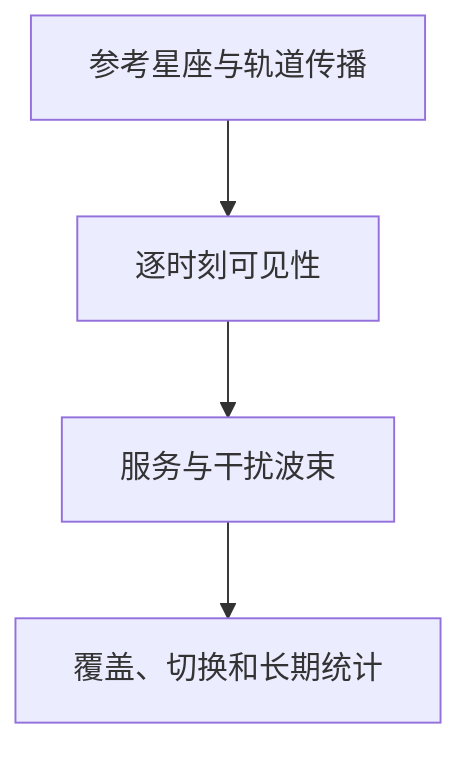
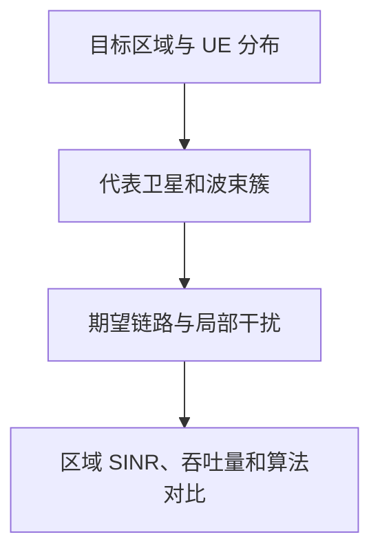

# NTN 链路系统与多星仿真学习笔记

> 本笔记把前五篇输出装配为链路级、单星系统级和多星系统级仿真，明确离线曲线、在线几何、信道状态、调度状态和统计输出的边界。

| 主章节 | 核心对象 | 主要来源 |
|---|---|---|
| 仿真接口 | 几何、波束、信道、协议状态 | 前五篇 |
| 链路级 | 波形、同步、接入、BLER | TR 38.821 Clause 6 |
| 单星系统级 | drop、调度、干扰、吞吐 | TR 38.821 Clause 6 |
| 多星 | 可见性、选择、切换和星间干扰 | 工程建模 |

## 0 仿真范围、公共输入与评估方法

### 0.1 仿真层级与问题边界

链路级仿真（Link-Level Simulation，LLS）显式生成波形、信道和接收机，回答同步、接入和译码在给定损伤下的成功概率。系统级仿真（System-Level Simulation，SLS）运行用户落点、波束、调度、干扰和业务队列，通过链路抽象调用 LLS 曲线。多星仿真再加入可见性、候选服务、卫星切换和星间干扰。

### 0.2 公共场景与终端类型

Clause 6.1 主要使用以下场景：

| 场景 | 轨道与载荷 | 服务链路特征 | 评估意义 |
|---|---|---|---|
| Scenario A | GEO、透明转发载荷 | 卫星相对地面近似静止，RTT 长 | GEO 覆盖、长时延和链路预算 |
| Scenario C2 | LEO、透明转发载荷、移动波束 | gNB 位于地面，卫星转发波形 | LEO 多普勒、时变覆盖与馈电链路 |
| Scenario D2 | LEO、再生载荷、移动波束 | 部分或全部 gNB 功能位于星上 | LEO 服务链路及星上处理 |

S-band 基线终端是手持 UE，载频约 2 GHz，发射功率 23 dBm、天线增益约 0 dBi；Ka-band 基线终端是 60 cm 等效口径 VSAT，下行 20 GHz、上行 30 GHz，发射功率 33 dBm，收发天线增益约 40 dBi。比较两种频段结果时，实际比较的是“频段 + 终端 + 天线 + 带宽”的整体配置，不能把差异只归因于载频。

系统级仿真用 Set-1 和 Set-2 表示两套卫星能力假设。Set-1 通常具有更大口径、更窄波束、更高 EIRP 密度和更高 G/T；Set-2 的波束更宽，但链路预算更弱。它们是参数集合，不是两种算法。

### 0.3 公共输入及其来源

| 模块 | 在线/离线输入 | 输出到仿真 |
|---|---|---|
| [系统与场景](./01_NTN系统架构与部署场景_学习笔记.md) | 平台、载荷、频段、终端、业务 | 拓扑与参数集 |
| [轨道与几何](./02_卫星轨道时间与链路几何_学习笔记.md) | 星历、时间、UE 位置 | 可见性、斜距、方向、时延、多普勒 |
| [天线与波束](./03_NTN天线波束与覆盖组织_学习笔记.md) | 方向和波束配置 | 增益、服务/候选波束、资源映射 |
| [传播与信道](./04_NTN传播损耗与信道模型_学习笔记.md) | 几何、天线和场景 | 路径增益、时变信道、噪声、抽象输入 |
| [空口与协议](./05_NTN空口时频与协议适配_学习笔记.md) | 时延、多普勒、测量和配置 | TA、时序、反馈、HARQ、切换状态 |

每个量必须带参考点、单位、时间戳和更新周期。离线 LLS 曲线不能读取未来在线状态；在线 SLS 也不能用未校准的 SINR 直接假定 BLER。

### 0.4 公共假设与多速率时间尺度

场景配置必须同时声明星座或代表卫星、频段、带宽、UE 空间分布、业务负载以及理想信息与延迟/误差信息的边界。不同模块按不同时间尺度更新：

| 时间尺度 | 更新对象 | 典型输出 |
|---|---|---|
| 轨道/几何周期 | 卫星状态、可见性、距离、角度、时延和公共多普勒 | 带时间戳的几何接口 |
| 信道周期 | 传播状态、LSP、簇/抽头与局部多普勒 | 时变链路状态 |
| 测量/报告周期 | SSB/CSI-RS 测量、CSI 量化和反馈 | 带老化时间的报告 |
| 调度周期 | PRB、功率、MCS、HARQ 和队列 | 执行时刻的资源状态 |

任何模块消费上游量时都要检查其时间戳，不能把不同参考时刻的几何、波束和 CSI 拼成同一个瞬时 SINR。

### 0.5 校准、性能评估与统计输出

校准阶段先固定场景、链路预算参考点、方向图、噪声带宽、干扰合并位置和链路抽象曲线，并对齐 Coupling Loss、Geometry SIR/SINR 等中间量；性能评估阶段再比较同步器、接收机、调度器或波束算法。统一输出至少包括覆盖/接入成功率、同步检测概率、BLER、SINR、吞吐量、频谱效率、时延、队列长度、切换或波束失败率、服务中断和干扰分布，并报告样本数、随机种子、置信区间或分位数。

结论必须随模型层级解释：LLS 只证明给定链路假设下的收发机性能；单星 SLS 证明给定负载、调度和复用下的网络性能；多星结果还依赖星座、服务选择和星间协调。

## 1 单星链路仿真

单星 LLS 把一颗服务卫星与一个或少数地面终端之间的物理链路单独取出，显式生成基带波形、信道和接收机。它不追求复现整个多波束网络，而是在受控条件下回答 SSB 能否同步、PRACH 能否检测、PDSCH/PUSCH 能否解码，以及残余 NTN 损伤会使性能曲线移动多少。

### 1.1 波形级蒙特卡洛流程

LLS 的核心是：固定一个链路场景，在一系列 SNR/SINR 点上重复生成真实基带信号，通过信道和射频损伤，再运行接收机并统计成功率。一次数据传输试验通常包含以下步骤：

1. 生成传输块或已知序列；
2. 完成 CRC、信道编码、速率匹配、调制、层映射、参考信号插入和 OFDM 调制；
3. 施加 TDL/CDL 多径、MIMO 信道、公共与差分多普勒、频率漂移、相位噪声、时偏和 AWGN；
4. 运行同步、信道估计、均衡、软解调、译码或相关检测；
5. 比较发送与接收结果，记录检测错误、估计误差或传输块错误；
6. 在同一 SNR 点重复大量随机信道和噪声 realization，再扫到下一个 SNR 点。

一个包含 NTN 主要损伤的等效接收模型可写为

\[
r(t)=e^{j\left(2\pi\Delta f t+\pi\dot f t^2+\phi_{\mathrm{PN}}(t)\right)}
\sum_{\ell=0}^{L-1}h_\ell(t)
s\!\left(t-\tau_\ell-\Delta\tau\right)+n(t),
\]

这条式子把两类时间变化分开：指数项描述整段接收波形共同经历的载波相位误差，\(h_\ell(t)\) 描述各条多径自身的快衰落。若残余瞬时频率按线性规律变化

\[
f_{\mathrm{res}}(t)=\Delta f+\dot f t,
\]

则共同载波相位是频率对时间的积分：

\[
\phi_{\mathrm c}(t)
=2\pi\int_0^t f_{\mathrm{res}}(\xi)\,\mathrm d\xi
=2\pi\Delta f t+\pi\dot f t^2.
\]

因此，当 \(\dot f\) 的单位是 \(\mathrm{Hz/s}\) 时，原式中的二次相位项 \(\pi\dot f t^2\) 是正确的；其中的 \(1/2\) 已经由积分产生，并与外面的 \(2\pi\) 相乘。若直接把二次相位系数定义成另一个变量，写法才会不同。

| 符号 | 物理含义 | 在接收信号中的作用 |
|---|---|---|
| \(\Delta f\) | 在参考时刻 \(t=0\) 的残余公共频偏，单位 Hz | 产生线性相位旋转 \(2\pi\Delta f t\) |
| \(\dot f\) | 残余频率漂移率，单位 Hz/s | 产生二次相位，固定 CFO 估计会随时间老化 |
| \(\phi_{\mathrm{PN}}(t)\) | 本振相位噪声 | 产生随机相位扰动及频谱扩展 |
| \(h_\ell(t)\) | 第 \(\ell\) 条路径的时变复增益 | 表示路径功率、初相位以及 Jakes 等局部多普勒演化 |
| \(\tau_\ell\) | 第 \(\ell\) 条路径相对参考路径的多径时延 | 形成频率选择性；若已采用绝对时延，则不应再重复加入公共量 |
| \(\Delta\tau\) | 全部路径共同平移的公共时偏，或某一 UE 相对参考点的差分时偏 | 移动整段波形的到达位置，不改变各路径间的相对时延 |
| \(n(t)\) | 接收噪声 | 决定 SNR，并与干扰共同决定 SINR |

具体试验只启用与评估对象相关的损伤。例如 SSB 试验重点加入初始频偏、漂移、相位噪声与衰落；PRACH 在公共时延/公共多普勒补偿后重点保留差分时偏、差分频偏和碰撞；PDSCH/PUSCH 则重点评估同步后的残余频偏、漂移、信道估计和译码。实现时还要避免重复计入：若 Jakes 多普勒已经写入 \(h_\ell(t)\)，就不应再把同一局部多普勒作为公共指数项施加一次。

对数据传输，传输块错误率（Block Error Rate，BLER）为

\[
\mathrm{BLER}=\frac{N_{\mathrm{error}}}{N_{\mathrm{trial}}}.
\]

若每次成功传输承载 \(N_{\mathrm{bit}}\) 个有效比特，试验周期为 \(T\)，不考虑额外队列和调度等待，则链路级有效吞吐量可近似写为

\[
R_{\mathrm{LLS}}
=\frac{N_{\mathrm{bit}}}{T}\bigl(1-\mathrm{BLER}\bigr).
\]

这仍是“给定资源和 MCS 的单链路吞吐量”，不是多用户网络中的 UE 吞吐量。

### 1.2 下行同步与 SSB

下行同步 LLS 研究 UE 能否从同步信号块（Synchronization Signal Block，SSB）完成小区搜索，并把残余定时和频率误差压到后续接收可用的范围。一个 SSB 占连续 4 个 OFDM 符号和 240 个子载波，内部包含主同步信号（Primary Synchronization Signal，PSS）、辅同步信号（Secondary Synchronization Signal，SSS）、物理广播信道（Physical Broadcast Channel，PBCH）及其解调参考信号（Demodulation Reference Signal，DM-RS）。卫星可在不同波束方向依次发送 SSB，UE 因而还需要在候选时刻、频率假设和接收波束之间搜索。

NR PSS 是长度 127 的 BPSK m 序列，不应沿用 LTE PSS 的 Zadoff-Chu 叙述。令 \(d_u[n]\) 为第 \(u\in\{0,1,2\}\) 个 PSS 候选，联合定时和频偏搜索可以概括为

\[
C_{u,\nu}(m)=
\left|
\sum_n r[n]d_u^*[n-m]
e^{-j2\pi\nu nT_s}
\right|^2,
\]

\[
(\hat u,\hat\nu,\hat m)
=\arg\max_{u,\nu,m}C_{u,\nu}(m).
\]

星历预补偿或公共多普勒预测用于缩小 \(\nu\) 的搜索窗，不会消除残余多普勒、差分多普勒、长时延和低 SNR 对相关峰的影响。

TR 38.821 Table 6.1.2-1 的主要设置包括：

- S-band 载频 2 GHz，SCS 为 15/30 kHz；Ka-band 载频 20 GHz，SCS 为 120/240 kHz；
- GEO/LEO 使用 TR 38.811 的 TDL/CDL 模型及相应时延扩展、角度扩展和 K 因子；
- 加入 UE 晶振误差、卫星多普勒、UE 运动多普勒、频率漂移和可选相位噪声；
- SNR 范围应根据链路预算确定。

TR 38.821 的下行初始同步试验可以按以下接收链理解：

1. **候选 SSB 搜索。** UE 在规定的 SSB 时间位置和可能的载波频率范围内取样；若 LEO 未预补偿公共多普勒，接收机需要增加频率假设或扩大捕获范围。
2. **PSS 检测与粗同步。** UE 对 3 个 PSS 候选执行相关搜索，获得 OFDM 符号的粗定时、\(N_{\mathrm{ID}}^{(2)}\) 和粗频偏。频偏过大时，相关峰会下降并发生相位旋转，因此工程接收机常把频率栅格搜索与 PSS 相关结合；具体算法不是 SSB 标准的一部分。
3. **SSS 检测与 PCID 判决。** 在 PSS 给出的候选时频位置上检测 SSS，得到 \(N_{\mathrm{ID}}^{(1)}\)，进而计算

   \[
   N_{\mathrm{ID}}^{\mathrm{cell}}
   =3N_{\mathrm{ID}}^{(1)}+N_{\mathrm{ID}}^{(2)}.
   \]

   PSS/SSS 的联合结果同时用于排除虚警并继续细化定时和频率估计。
4. **PBCH DM-RS 信道估计与精同步。** UE 利用已知 DM-RS 估计 SSB 所在资源上的复信道，细化残余频偏/定时，并辅助区分 SSB 索引或波束候选。
5. **PBCH 解调与 MIB 恢复。** 完成均衡、软解调、Polar 译码和 CRC 校验，获得主信息块（Master Information Block，MIB）及系统帧/后续控制信道接收所需的基本参数。完成这一步后，UE 才从“检测到一个相关峰”进入“获得可用小区同步与广播信息”的状态。

TR 38.821 Table 6.1.2-1 并不强制统一上述每一步的接收机实现，而是用 PCID 检测与残余误差来比较不同实现。试验中的最终公共频偏可表示为

\[
\Delta f
=\left(A_{\mathrm{UE}}+D_{\mathrm{sat}}+D_{\mathrm{UE}}\right)
10^{-6}f_{\mathrm{DL}},
\]

其中 \(A_{\mathrm{UE}}\) 是 UE 晶振误差（ppm），\(D_{\mathrm{sat}}\) 和 \(D_{\mathrm{UE}}\) 分别是卫星与 UE 运动产生的多普勒（ppm）。仿真在 \([-\Delta f_{\max},+\Delta f_{\max}]\) 内均匀抽取频偏；公共卫星多普勒可以假设按波束中心预补偿或在接收端后补偿。

#### 1.2.1 公共频移与 Jakes 多普勒谱

公共多普勒和局部多径多普勒描述的是两个不同现象：

| 项目 | 公共多普勒/残余 CFO | Jakes 多普勒谱 |
|---|---|---|
| 作用对象 | 整个接收波形近似共同平移 | 每个 Rayleigh 多径抽头的复增益 \(h_\ell(t)\) |
| 频域表现 | 频谱整体平移一个中心频率 | 围绕中心频率形成多普勒展宽 |
| 主要来源 | 卫星与 UE 的视距径向运动、晶振误差 | UE 附近散射、多径到达角分布及终端运动 |
| 补偿方式 | 一个 NCO/频偏估计可消除大部分共同旋转 | 不能用一个 CFO 数值消除，需要信道跟踪、导频与均衡 |

经典各向同性散射假设下，第 \(\ell\) 个 Rayleigh 抽头的归一化 Jakes 功率谱可写为

\[
S_{h_\ell}(\nu)
=
\begin{cases}
\dfrac{1}{\pi\sqrt{f_{D,\ell}^{2}-\nu^2}},
& |\nu|<f_{D,\ell},\\[6pt]
0,&\text{其他},
\end{cases}
\]

其时间自相关近似为

\[
R_{h_\ell}(\Delta t)
=J_0\!\left(2\pi f_{D,\ell}\Delta t\right).
\]

这里的 \(f_{D,\ell}\) 是该抽头的最大局部多普勒，\(J_0(\cdot)\) 是第一类零阶贝塞尔函数。它表示同一抽头并非只有一个确定频移，而是由许多具有不同到达角的散射分量叠加而成。因此，即使公共多普勒已被精确移回零频，\(h_\ell(t)\) 仍会随时间起伏，跨 SSB 或后续符号的信道估计仍会老化；时间选择性较强时还会造成 OFDM 子载波间干扰。

TR 38.821 Table 6.1.2-1 明确要求：Rayleigh 衰落抽头的 Jakes 谱应在公共多普勒之外另行考虑，并至少采用 1 Hz 的多普勒。这个 1 Hz 是避免把散射抽头冻结成静态信道的评估下限，不是说 NTN 的公共多普勒只有 1 Hz。

每次试验中，仿真器生成 SSB，经信道和上述损伤后交给 UE 接收机，并将检测结果与已知发送参数比较。输出包括：

- 一次性 PCID 正确检测概率；
- PCID 虚警率，基线要求为 1%；
- 在 PCID 检测概率达到 90% 的 SINR 点上，残余定时和频率误差的 CDF。

因此，同步 LLS 不只判断“能否找到 SSB”，还检验找到以后留下的残余误差能否支持 PBCH 和后续数据解调。TR 38.821 Clause 6.3.2 的研究结论是：采用波束特定的公共频移预补偿时，Rel-15 SSB 可为 GEO/LEO 提供稳健的初始同步；LEO 若不做该预补偿，则通常需要提高 UE 搜索复杂度，但研究阶段没有认定必须修改 SSB 波形。

### 1.3 PRACH 随机接入

PRACH LLS 研究 gNB 能否在差分时延、差分频偏、近远效应和多用户碰撞下检测前导，并估计到达时间与频率偏差。TR 38.821 Table 6.1.2-2～3 采用以下关键假设：

- 公共传播时延已理想补偿，剩余时偏在 \([0,\Delta\tau_{\max}]\) 内均匀抽取；
- 网络可进行公共多普勒预补偿和后补偿，仍保留同步残差、波束内差分多普勒和 UE 运动多普勒；
- 一个随机接入时机（Random Access Occasion，RO）中基线有 2 个 UE 同时接入；
- 两个 UE 的接收功率固定相差 3 dB；
- 前导池不小于 64，PRACH 格式、SCS、\(N_{\mathrm{CS}}\) 和检测器由各公司报告，新格式不被排除。

一次 PRACH 试验可按以下过程实现：

1. 从前导池为两个 UE 选择前导，并分别随机生成时偏和频偏；
2. 生成两路 PRACH 波形，经各自 TDL/CDL 信道和功率缩放后在卫星/gNB 接收端叠加；
3. 接收机执行频偏假设搜索、相关或匹配滤波，检测前导索引和相关峰；
4. 由峰位置估计定时，由跨符号或跨序列相位关系估计频偏；
5. 统计漏检、误检、虚警以及定时/频率估计误差。

四组研究场景分别施加：小延时/大频偏、中延时/中频偏、大延时/小频偏，以及完成开环定时和频率补偿后的“小延时/小频偏”。它们是在分离检验 PRACH 的频偏鲁棒性、搜索窗口和补偿收益。

### 1.4 PDSCH/PUSCH 数据传输

数据传输 LLS 使用 NR 信道编码、现实信道估计和频率选择性 TDL/CDL 模型。TR 38.821 Table 6.1.2-4 列出评估参数：

- S-band 采用 15/30 kHz SCS；Ka-band 采用 60/120 kHz SCS；
- 同步后残余频率误差基线为 0.1 ppm，并假设上行预补偿；
- 分别研究多普勒漂移已预补偿与未预补偿；
- Ka-band 加入 TR 38.803 的相位噪声模型；
- 输出 BLER 和吞吐量。

数据 LLS 通常对每个 MCS 分别得到一条 S 形 BLER 曲线：低 SNR 区接近 1，高 SNR 区接近 0，中间的瀑布区决定接收门限。更高阶调制和更高码率曲线通常向右移动，意味着需要更高 SINR。

HPA 非线性不属于这一 LLS 基线；TR 38.821 也记录了至少对 Rel-17 不需要规定 NTN 专用的下行 PAPR 优化。该结论只表示基线评估没有纳入该损伤，不表示卫星功放不存在回退或非线性问题。

### 1.5 链路级结果的可靠性

在每个 SNR 点只运行少量试验，会使低 BLER 区的统计误差很大。工程实现通常采用“累计到足够错误块数，或达到最大试验数”作为停止条件，并报告置信区间。还需要固定随机种子、信道 realization、接收机版本和全部参数，否则不同算法的差异可能被随机波动或未声明假设掩盖。

**原文定位：**TR 38.821 Clause 6.1.2，Table 6.1.2-1～4；Table 6.1.1.1-8。

---

## 2 单星系统级仿真

单星 SLS 复用“公共输入及其来源”和“单星链路仿真”的输出，把一颗卫星的多波束、UE、同频干扰、调度和业务放入同一个网络时间循环。它先校准长期几何量，再通过链路抽象把每个调度资源上的 SINR 转换为 BLER 和吞吐量。

### 2.1 校准阶段与性能评估阶段

SLS 首先生成“网络”，再让网络随时间运行。TR 38.821 把它分成两个复杂度层次：

```{=latex}
\begingroup
\small
\renewcommand{\arraystretch}{1.05}
```

| 阶段 | 模型范围 | 主要输出 |
|---|---|---|
| 校准 | 卫星几何、方向图、大尺度传播、UE 分布、接入和完整干扰集合；不运行详细业务与快衰落，电离层闪烁置零 | Coupling Loss、Geometry SIR/SINR |
| 性能评估 | 校准模型加频率选择性快衰落、现实信道估计、Rel-15 CSI、RTT、MMSE-IRC、调度和 FTP-3 | UE 吞吐量 5%/50%/95% 分位 |

```{=latex}
\endgroup
```

校准的目的不是评价某个调度器，而是让不同公司的仿真器先在几何、天线、路径损耗和干扰计算上对齐。只有校准一致后，吞吐量差异才可以解释为接收机、CSI、调度或业务假设的影响。

### 2.2 网络初始化与一次用户落点

一次 Monte Carlo 用户落点（drop）可按以下顺序构造：

1. **建立卫星和地球几何。** 设置 GEO/LEO 位置、中心波束目标仰角和本地坐标系。
2. **生成波束视轴。** 由 HPBW 计算 ABS，生成内层 19 波束和外围附加波束。
3. **生成 UE。** 在每个内层波束的 Voronoi 区域至少均匀放置 10 个 UE，并设置终端类型、朝向和室内外状态。
4. **计算长期链路量。** 对每个“卫星波束—UE”组合计算离轴增益、斜距、自由空间损耗、大气吸收、阴影衰落和终端天线增益。
5. **执行 UE attachment。** UE 根据参考信号接收功率（Reference Signal Received Power，RSRP）选择服务波束：

\[
i_u^*=\arg\max_i \mathrm{RSRP}_{u,i}.
\]

6. **建立干扰图。** 根据 FRF、极化、上下行方向和资源活动状态，为每个 UE 列出同频候选干扰波束或 UE。
7. **输出校准指标。** 若只做校准，到这里即可统计 Coupling Loss、SIR 和 SINR；若做性能评估，则进入时间循环。

UE 的 Voronoi 区域用于初始生成，最终服务波束由 RSRP 决定。在倾斜覆盖、不同斜距或非均匀功率下，这两个区域不一定完全重合。

### 2.3 调度时间循环与干扰计算

性能评估会以时隙、调度周期或若干传输时间间隔为步长推进。每个时间步通常包含：

1. 根据 FTP-3 模型生成文件到达，更新各 UE 缓存；
2. 更新卫星/UE 位置、慢衰落、快衰落和可用 CSI；
3. 调度器选择本时隙服务的 UE、PRB、层数、功率和 MCS；
4. 依据所有同频波束的同时调度结果计算每个 PRB 的信号、干扰和噪声；
5. 应用 MMSE-IRC 等接收处理，得到后合并 SINR；
6. 通过链路抽象得到传输块 BLER，并随机判定成功或失败；
7. 更新 HARQ 进程、ACK/NACK、重传队列和成功交付比特；
8. 经过足够长的仿真时间和多个 drop 后，汇总 UE 吞吐量与资源利用率。

#### 2.3.1 Coupling Loss 与链路预算的接口

耦合损耗（Coupling Loss，CL）是发射天线端口到接收天线端口之间的总长期信号损失。采用一致的端口参考点时，一条“发射源 \(j\) 到 UE \(u\)”的链路可写为

\[
CL_{u,j,\mathrm{dB}}
=L_{\mathrm{FS}}+L_{\mathrm{A}}+L_{\mathrm{shadow}}
+L_{\mathrm{penetration}}+L_{\mathrm{pol}}+\cdots
-G_{\mathrm T,j}(\alpha_{u,j})-G_{\mathrm R,u},
\]

\[
P_{\mathrm r,u,j,\mathrm{dBm}}
=P_{\mathrm t,j,\mathrm{dBm}}-CL_{u,j,\mathrm{dB}}.
\]

其中 \(L_{\mathrm{FS}}\) 是自由空间路径损耗，\(L_{\mathrm A}\) 汇总大气、雨衰等附加传播损耗，\(G_{\mathrm T,j}(\alpha_{u,j})\) 是第 \(j\) 个波束在 UE 方向上的发射增益。CL 不包含发射功率、接收机噪声、同频干扰、编码增益或基带合并增益；这些量属于完整链路预算或接收处理的其他部分。

若资源 \(k\) 上的噪声功率为 \(N_{u,k,\mathrm{dBm}}\)，则

\[
\mathrm{CNR}_{u,k,\mathrm{dB}}
=P_{\mathrm t,0,k,\mathrm{dBm}}
-CL_{u,0,\mathrm{dB}}-N_{u,k,\mathrm{dBm}}.
\]

所以 CL 可以由端口一致、量项完整的链路预算换算出来；反过来，有了 \(P_{\mathrm t}\)、CL 和噪声也能得到 CNR。但若只给最终 \(C/N_0\) 或把接收增益与噪声温度合成 \(G/T\)，而未分别给出接收增益、噪声温度和参考端口，就不能唯一反推出 CL。

例如 \(P_{\mathrm t}=30\ \mathrm{dBm}\)、\(CL=134\ \mathrm{dB}\)，则 \(P_{\mathrm r}=-104\ \mathrm{dBm}\)。若接收带宽内噪声为 \(-109\ \mathrm{dBm}\)，对应 \(\mathrm{CNR}=5\ \mathrm{dB}\)。

#### 2.3.2 CIR、SIR 与信道建模层次

仿真器应先按来源保存每一类功率，再组成 SINR：

\[
\gamma_{u,k}=
\frac{P^{\mathrm{des}}_{u,k}}
{I^{\mathrm{same\ sat}}_{u,k}
+I^{\mathrm{other\ sat}}_{u,k}
+I^{\mathrm{adj}}_{u,k}
+N_{u,k}}.
\]

| 项 | 典型来源 | 建模所需信息 |
|---|---|---|
| 期望信号 \(P^{\mathrm{des}}\) | 服务卫星的服务波束 | 发射功率、服务增益、路径损耗、衰落和资源占用 |
| 同卫星干扰 \(I^{\mathrm{same\ sat}}\) | 同一卫星其他共频波束 | 邻波束离轴增益、FRF、时频重叠和活动度 |
| 异卫星干扰 \(I^{\mathrm{other\ sat}}\) | 其他可见卫星或相邻星座 | 可见性、波束指向、频率重叠、旁瓣和传播损耗 |
| 邻道干扰 \(I^{\mathrm{adj}}\) | 相邻载波或系统泄漏 | ACLR、ACS 和频谱重叠；基线不建模时明确设为 0 |
| 噪声 \(N\) | 接收机热噪声 | 带宽、噪声系数和温度；噪声不称为干扰 |

每一条干扰链路都使用同一基本结构：

\[
P_{i\rightarrow u}
=P_{\mathrm{tx},i}
G_{\mathrm{tx},i}(\theta_{i,u})
G_{\mathrm{rx},u}(\phi_{i,u})
L_{i,u}^{-1}H_{i,u}A_{i,u}O_{i,u},
\]

其中 \(A_{i,u}\) 是业务活动度，\(O_{i,u}\) 是时频资源重叠。下行干扰源是卫星波束；上行干扰源是实际被调度 UE，还需加入 UE 功控、终端天线指向和调度同步差异。

载干比（Carrier-to-Interference Ratio，CIR）与信干比（Signal-to-Interference Ratio，SIR）分别写为

\[
\mathrm{CIR}=\frac{C}{I},
\qquad
\mathrm{SIR}=\frac{S}{I}.
\]

在同一带宽、同一接收参考点且 \(C\) 与 \(S\) 都表示同一个有用信号功率时，两者数值相同；卫星链路预算更常写 CIR，蜂窝 SLS 更常写 SIR。若二者采用不同测量带宽、不同合并位置或不同时间平均方式，则不能仅凭名称直接等同。

对资源 \(k\)，先由每条链路的 CL 计算线性接收功率：

\[
C_{u,k}
=10^{\left(P_{\mathrm t,0,k,\mathrm{dBm}}-CL_{u,0,\mathrm{dB}}\right)/10},
\]

\[
I_{u,k}
=\sum_{j\ne0}\chi_{j,k}
10^{\left(P_{\mathrm t,j,k,\mathrm{dBm}}-CL_{u,j,\mathrm{dB}}\right)/10},
\]

其中 \(\chi_{j,k}=1\) 表示第 \(j\) 个波束在资源 \(k\) 上同频、同极化且同时活动。干扰必须在线性功率域相加，随后计算

\[
\mathrm{SIR}_{u,k}=\frac{C_{u,k}}{I_{u,k}},
\qquad
\mathrm{SINR}_{u,k}=\frac{C_{u,k}}{I_{u,k}+N_{u,k}}.
\]

若只有一个等功率干扰源，则

\[
\mathrm{SIR}_{\mathrm{dB}}
=CL_{\mathrm{int},\mathrm{dB}}-CL_{\mathrm{des},\mathrm{dB}}.
\]

例如期望链路和干扰链路的 CL 分别为 130 dB 和 140 dB，则 SIR 为 10 dB；若有两个同样强的干扰源，总干扰增加约 3 dB，SIR 降为约 7 dB。CNR 与 CIR 还可合成为

\[
\frac{1}{\mathrm{CNIR}}
=\frac{1}{\mathrm{CNR}}
+\frac{1}{\mathrm{CIR}},
\]

其中 CNIR 在该参考点上对应含噪声的 SINR。

计算 CIR/SIR 至少需要大尺度信道，但是否需要快衰落取决于指标层次：

| 指标层次 | 必需模型 | 快衰落与接收机处理 |
|---|---|---|
| Geometry CIR/SIR | 几何、方向图、CL、大尺度传播、FRF 和资源活动 | 不需要 TDL/CDL 快衰落 |
| 瞬时 CIR/SIR | 上述模型加时变多径信道 | 需要快衰落 realization |
| 后合并 SIR/SINR | MIMO 信道、干扰协方差和合并向量 | 需要建模接收机 |
| 吞吐量 | 上述结果加调度、MCS、BLER、HARQ 与业务负载 | 通过链路抽象和时间循环体现 |

单星下行中，不同波束从同一颗卫星到同一个 UE 的斜距、自由空间损耗和部分传播损耗近似相同，这些公共项会在 Geometry SIR 中抵消。因此其主要差异来自波束离轴增益、发射功率、FRF、极化与活动状态。上行干扰来自不同位置的 UE，多星链路具有不同斜距和入射角，阴影/穿透状态也可能不同，因此不能再使用这一抵消关系。

若显式模拟接收天线和快衰落，后合并 SINR 为

\[
\gamma_{u,k}=
\frac{P_{0,k}|\mathbf w_{u,k}^{\mathsf H}\mathbf h_{u,0,k}|^2}
{\sum_{j\ne0}\chi_{j,k}P_{j,k}
|\mathbf w_{u,k}^{\mathsf H}\mathbf h_{u,j,k}|^2
+\sigma^2\|\mathbf w_{u,k}\|^2}.
\]

MMSE-IRC 合并方向与

\[
\mathbf w_{u,k}\propto
\mathbf R_{I+N,k}^{-1}\mathbf h_{u,0,k}
\]

一致，其中 \(\mathbf R_{I+N,k}\) 是干扰加噪声协方差矩阵。它利用多个接收维度抑制具有不同空间特征的干扰；若接收维度不足、干扰方向与有用信号重合或协方差估计不准，抑制能力会下降。

### 2.4 上行与下行干扰的差异

下行时，每个干扰源是卫星上的另一个波束，发射方向和功率由波束配置决定。上行时，干扰源是其他波束中被同时调度的 UE，其位置、终端天线方向和功率控制均会变化。因此上行仿真还要为每个波束选择实际活动 UE，干扰分布通常比下行更分散，不能把“干扰波束中心”直接等效成上行 UE 的固定位置。

### 2.5 链路抽象与 LLS/SLS 接口

SLS 在一个传输块内可能得到数十或数百个 PRB/子载波 SINR，但不能为每个资源都重新运行完整 OFDM 接收机。链路到系统映射（Link-to-System Mapping，L2S）先把频率选择性 SINR 压缩为有效 SINR，再查询“单星链路仿真”生成的 LLS BLER 曲线。

一种常用工程方法是指数有效 SINR 映射（Exponential Effective SINR Mapping，EESM）：

\[
\gamma_{\mathrm{eff}}
=-\beta\ln\left[
\frac{1}{N}\sum_{n=1}^{N}
\exp\left(-\frac{\gamma_n}{\beta}\right)
\right],
\]

其中 \(\gamma_n\) 是第 \(n\) 个资源上的后处理 SINR，\(\beta\) 是针对 MCS、信道和接收机用 LLS 校准的参数。SLS 随后计算

\[
p_{\mathrm{fail}}
=F_{\mathrm{LLS}}
\!\left(\gamma_{\mathrm{eff}},m,\boldsymbol\zeta\right),
\]

其中 \(m\) 是 MCS，\(\boldsymbol\zeta\) 是 LLS 曲线的状态索引，可包含 LOS/NLOS 信道、SCS、残余频偏、频率漂移率、局部多普勒扩展和接收机版本。并非每个 SLS 都需要保留全部维度；只应保留对当前信号和算法有显著影响、且已由 LLS 校准的状态。

互信息有效 SINR 映射（Mutual Information Effective SINR Mapping，MIESM）是另一类常用方法。TR 38.821 规定评估参数和指标，但没有指定所有实现必须采用某一种 L2S 方法；因此映射方法、校准数据、状态维度和适用 MCS 必须随结果报告。

例如，某 UE 在 4 个资源上的后处理 SINR 为 \(-2\)、0、3、5 dB。SLS 不直接取算术平均值，而是用该 MCS 的 L2S 参数得到一个 \(\gamma_{\mathrm{eff}}\)。若映射结果为 0.8 dB，LLS 曲线给出的 BLER 为 12%，则本次传输以 88% 概率成功；成功比特进入吞吐量统计，失败传输进入 HARQ。这里的数值只用于说明接口，不是 TR 38.821 的标准结果。

| 处理对象 | LLS | 单星 SLS |
|---|---|---|
| OFDM 波形、编码和译码 | 显式运行 | 用 L2S 与 BLER 曲线抽象 |
| TDL/CDL 与接收机 | 逐采样或逐符号处理 | 生成后处理 SINR 或抽象信道状态 |
| 多波束干扰、调度和队列 | 通常只保留受控干扰源 | 显式生成全部活动波束、UE 和业务状态 |
| SSB/PRACH | 直接统计检测与估计性能 | 作为覆盖或过程成功率模型 |
| 用户长期吞吐量 | 不能直接给出 | 由调度、HARQ、负载和成功比特共同统计 |

### 2.6 NTN 时变因素的系统级映射与频率复用

NTN 的时间变化在 SLS 中分为三个尺度：

| 分量 | 物理来源 | 在单星 SLS 中的处理 |
|---|---|---|
| 公共多普勒 | 卫星相对服务区域的整体径向运动 | 由星历、预补偿或接收端估计消除大部分，保留补偿误差 |
| 波束内差分多普勒 | 同一波束不同 UE 的径向速度不同 | 按 UE 几何分别计算，影响 PRACH、CSI 与数据解调 |
| 多径多普勒扩展 | UE 附近散射造成各抽头时变 | 由 TDL/CDL 的 Jakes 谱或相应快衰落抽象产生 |

例如 LEO-600、Set-1、Ka 上行 30 GHz、20 km 波束的最大差分多普勒约为 0.42 ppm，对应

\[
0.42\times10^{-6}\times30\ \mathrm{GHz}
=12.6\ \mathrm{kHz}.
\]

这已经高于 0.1 ppm 同步残差对应的 3 kHz，说明公共补偿不能让波束内所有 UE 同时回到零频偏。多普勒进入 SLS 时，通常采用“离线 LLS 建库、在线按状态查询”的两阶段方法。

#### 2.6.1 多普勒状态到 BLER 的映射

离线 LLS 对不同 MCS 和损伤组合生成曲线族：

\[
\mathrm{BLER}
=F_{\mathrm{LLS}}
\!\left(
\gamma_{\mathrm{eff}},m,
\epsilon,\dot f,f_{D,\mathrm{loc}},
\mathrm{SCS},\text{channel}
\right),
\]

其中 \(\epsilon=\Delta f_{\mathrm{res}}/\Delta f_{\mathrm{SCS}}\) 是归一化残余频偏，\(\dot f\) 是残余频率漂移率，\(f_{D,\mathrm{loc}}\) 是局部多径的最大多普勒。在线 SLS 先由几何计算卫星引起的视距多普勒：

\[
f_{\mathrm{sat},u}(t)
=-\frac{f_c}{c}\dot d_u(t),
\]

再扣除波束公共补偿并加入 UE 运动和晶振误差：

\[
\Delta f_{\mathrm{res},u}(t)
=f_{\mathrm{sat},u}(t)-f_{\mathrm{comp,beam}}(t)
+f_{\mathrm{UE},u}(t)+f_{\mathrm{osc},u}(t).
\]

于是 UE 的位置决定差分多普勒，卫星位置/速度决定公共多普勒与漂移，UE 速度和散射状态决定局部 Jakes 谱，补偿策略则决定最后留下多少残余频偏。SLS 有两种常见接口：

1. **状态曲线法。** 按当前 \(\epsilon_u\)、\(\dot f_u\)、\(f_{D,\mathrm{loc},u}\) 和信道状态选择相邻 LLS 曲线，并在离散网格之间插值；
2. **等效损失法。** 先由 LLS 标定多普勒造成的门限损失 \(\Delta\gamma_D\)，再使用

   \[
   \gamma_{\mathrm{eff,corr}}
   =\gamma_{\mathrm{eff}}-\Delta\gamma_D
   \]

   查询无损伤基准 BLER 曲线。

两种方法只能选择一种。如果已经查询包含该多普勒损伤的曲线，就不能再从有效 SINR 中扣除一次 \(\Delta\gamma_D\)，否则会重复计入损失。例如 \(\Delta f_{\mathrm{res}}=12.6\ \mathrm{kHz}\)、SCS 为 60 kHz 时，\(\epsilon=0.21\)。SLS 可以在 \(\epsilon=0.2\) 与 0.3 的 LLS 曲线之间插值，也可以使用预先标定的 \(\epsilon=0.21\) 等效 SINR 损失。

#### 2.6.2 RTT、CSI 老化与 HARQ 时间轴

长往返时延（Round-Trip Time，RTT）不能整体等效成固定 SINR 扣减。它至少影响 CSI 反馈老化、MCS 选择、ACK/NACK 返回、HARQ 进程占用、重传时刻和队列时延。

CSI 是否改变波束编号取决于控制方式：

- **星历驱动的开环波束计划：**波束中心和服务波束由位置、星历或预先计划决定，CSI 主要用于 CQI/MCS、PMI、RI 和链路自适应，不一定直接改变波束编号；
- **测量驱动的闭环波束管理：**UE 测量候选 SSB/CSI-RS 波束并上报，网络依据延迟报告选择波束或 TCI 状态，报告老化会直接改变实际方向增益和干扰集合。

闭环选择可以写成

\[
b_{\mathrm{sel}}(t)
=\arg\max_b
\widehat{\mathrm{RSRP}}_b(t-T_{\mathrm{CSI}}),
\]

\[
L_{\mathrm{beam}}(t)
=G_{\mathrm{best}}(t)-G_{b_{\mathrm{sel}}(t)}(t).
\]

实现中显式保存四个时刻：

1. \(t_{\mathrm{meas}}\)：测量候选波束；
2. \(t_{\mathrm{report}}\)：CSI/测量报告到达网络；
3. \(t_{\mathrm{action}}\)：网络执行波束或 MCS 决策；
4. \(t_{\mathrm{data}}\)：按当前几何、所选波束和当前干扰重新计算真实 SINR 与吞吐量。

因此，报告时刻 CSI 是决策输入，不是数据时刻的真实 SINR。即使开环计划不由 CSI 改变波束编号，测量误差和时延仍会影响 MCS 与最终 BLER。

若 CSI 的测量、上报和调度总老化时间为 \(T_{\mathrm{CSI}}\)，调度器在时刻 \(t\) 看到的量可写为

\[
\widehat\gamma_u(t)
=Q\!\left[\gamma_u(t-T_{\mathrm{CSI}})\right],
\]

其中 \(Q[\cdot]\) 表示量化和反馈误差。链路自适应根据旧 CSI 选择 MCS：

\[
m_u(t)
=\mathrm{LA}\!\left(
\widehat\gamma_u(t)-M_{\mathrm{aging}}
\right),
\]

但本次传输是否成功，应由当前真实信道状态判定：

\[
p_{\mathrm{fail}}(t)
=F_{\mathrm{LLS}}
\!\left(
\gamma_{\mathrm{eff}}(t),m_u(t),
\boldsymbol\zeta_u(t)
\right).
\]

因此实现逻辑是“旧 SINR 用于选择 MCS，当前 SINR 用于判定 BLER”，两者失配形成 CSI aging 损失。\(M_{\mathrm{aging}}\) 可由不同 RTT、速度和信道状态下的 LLS/SLS 校准得到，但不能不加区分地固定为统一的 1 dB 或 3 dB。

HARQ 则需要显式事件队列。若传输发生在 \(t_{\mathrm{TX}}\)，反馈到达时间为

\[
t_{\mathrm{ACK}}
=t_{\mathrm{TX}}+T_{\mathrm{HARQ}},
\]

在反馈返回前，对应 HARQ 进程保持占用。若系统希望每个时隙都能发出新的传输块，所需并行进程数可粗略估计为

\[
N_{\mathrm{HARQ}}
\gtrsim
\left\lceil
\frac{T_{\mathrm{HARQ}}}{T_{\mathrm{slot}}}
\right\rceil.
\]

实际 NR 时序还包括处理时间、调度偏移和协议配置，因而该式只用于解释数量级。SLS 应把 ACK/NACK 到达、进程释放、重传和成功比特计入调度时间循环，而不是把全部 RTT 影响塞进 \(\gamma_{\mathrm{eff}}\)。

频率复用因子（Frequency Reuse Factor，FRF）同时改变干扰与带宽。FRF 增大通常使同频波束更远、SIR 提高，但每波束可用带宽下降：

\[
R\approx B_{\mathrm{beam}}\,\eta(\mathrm{SINR})(1-\delta),
\]

其中 \(B_{\mathrm{beam}}\) 是复用后的每波束带宽，\(\eta\) 是频谱效率，\(\delta\) 是控制、参考信号和重传等开销。因此“更高 SIR”不等于“更高吞吐量”。GEO Ka 校准中，同一 FRF 下 Set-1 与 Set-2 的中位 SIR 接近，而 Set-2 的 SINR 更差，说明其主要劣势来自 EIRP、G/T 和 Coupling Loss，而不是归一化波束布局本身产生了更强的相对干扰。

### 2.7 输出指标、负载与单波束容量

校准阶段输出前述调度与干扰计算中定义的 Coupling Loss、Geometry SIR 和 Geometry SINR。CL 数值越低表示长期接收功率越强；SIR 差通常指向方向图、频率复用或同频活动干扰；SIR 尚可但 SINR 明显更差，则说明噪声或链路预算成为主要限制。性能阶段在此基础上加入快衰落、接收合并和链路抽象，输出瞬时 BLER 与长期吞吐量。

性能评估统计所有 UE 长期吞吐量的 5%、50% 和 95% 分位。50% 是中位数，不是算术平均值；5% 分位表示仅有 5% UE 的吞吐量更低，但不严格等于固定地理位置上的“小区边缘”。分位排名同时受到几何、快衰落、干扰、调度和业务到达影响。

资源利用率（Resource Utilization，RU）的分母是每个波束在复用后实际分配的带宽。若第 \(j\) 个干扰波束在某资源上活动的概率近似为 \(r_j\)，则平均干扰可粗略写为

\[
\mathbb E[I_k]\approx
\sum_j r_jP_{j,k}G_j(\alpha_j)L_j^{-1}.
\]

负载与 SINR 会形成闭环：

\[
\text{负载}\rightarrow\text{干扰}\rightarrow
\text{SINR}\rightarrow\text{MCS/BLER}\rightarrow
\text{服务速率}\rightarrow\text{新负载}.
\]

因此 RU 不能直接等同于用户数，网络容量需要迭代到稳定工作点。对给定 RU \(r\)、带宽 \(B\)、开销比例 \(\delta\) 和平均频谱效率 \(\bar\eta\)，可先估计单波束业务能力

\[
C(r)=rB(1-\delta)\bar\eta.
\]

若每个活跃 UE 要求速率 \(R_{\mathrm{UE}}\)，还要同时满足调度、控制、随机接入和 HARQ 约束：

\[
N_{\mathrm{service}}
\le
\min\left(
\frac{C}{R_{\mathrm{UE}}},
N_{\mathrm{scheduler}},
N_{\mathrm{control}}
\right).
\]

例：某波束下行带宽 200 MHz，\(r=0.6\)、\(\bar\eta=2\ \mathrm{bit/s/Hz}\)、\(\delta=0.2\)，则 \(C=192\ \mathrm{Mbit/s}\)。若每个活跃 UE 至少需要 2 Mbit/s，仅从下行速率看可支持约 96 个；最终容量仍需与上行、控制信道和 SLS 的负载固定点共同取最小值。

**原文定位：**TR 38.821 Table 6.1.1.1-5、Table 6.1.1.1-7～8、Clause 6.1.1.2～6.1.1.3、Table 6.1.1.3-1～2。CL/CIR 换算、EESM/MIESM、多普勒状态曲线插值和 RTT 事件队列是对系统级实现接口的工程化展开，不是 Clause 6.1 新增的 NTN 协议机制。

---

## 3 多星仿真

TR 38.821 Clause 6.1.4 允许复用 Table 6.1.1.1-9 中定义的单星测试场景，并建议多星评估优先考虑 LEO。单星 SLS 已经包含“一个卫星的多波束、UE、调度和同星干扰”；多星 SLS 在此基础上新增三个维度：

本章的 Option 1/2 是**仿真范围选择**，不是 3GPP 空口协议选项。

1. **轨道与可见性随时间变化。** 同一地面区域能够看到哪些卫星、各卫星的仰角和斜距都会变化；
2. **服务关系跨卫星选择和切换。** UE 不仅在同一卫星的波束之间选择，还要在不同卫星之间选择服务链路；
3. **干扰集合扩展到其他卫星。** 只要另一颗卫星的波束与服务链路同频、同极化并同时活动，就可能形成星间干扰。

因此，不能把 3 颗或 7 颗卫星简单处理成若干份完全重合的单星 19 波束图。每颗卫星必须具有独立的位置、局部坐标系、波束视轴、斜距、离轴角、传播损耗和资源活动状态。

### 3.1 Option 1：完整参考星座与较长时间演化

Option-1 以一个完整参考星座为仿真对象。至少需要定义：

| 参数组 | 需要给出的内容 | 作用 |
|---|---|---|
| 轨道结构 | 高度、轨道面数量、每轨卫星数、倾角、升交点赤经间隔和星间相位 | 决定卫星在地固坐标系中的位置与运动 |
| 星载波束 | 每星波束数、波束视轴、覆盖方式、复用和极化 | 决定每颗卫星在地面的服务区与干扰区 |
| 射频能力 | 每波束 EIRP 密度、G/T、天线方向图和带宽 | 可复用单星基线，但必须逐条链路计算 |
| 地面区域 | 经度、纬度、面积、UE 密度和业务分布 | 星座覆盖与干扰结果取决于用户位于地球何处 |
| 时间范围 | 起始历元、仿真时长和几何更新时间步长 | 决定是否覆盖完整过境、切换和短时中断 |

对每颗卫星 \(s\)，轨道传播器给出时刻 \(t\) 的地固位置与速度

\[
\mathbf r_s(t),\qquad \mathbf v_s(t).
\]

工程实现可以使用开普勒轨道传播、SGP4 或更高精度轨道模型；Clause 6.1.4 要求定义参考星座和相应参数，但没有规定必须采用哪一种传播器。若比较不同算法，必须固定传播器、地球模型、历元和星座相位，否则“同一个星座名称”也可能得到不同的可见卫星序列。

参考星座法能够回答全球或区域覆盖率、可见卫星数量、过境与切换频率、星间同频干扰以及性能随纬度和时间的变化。代价是仿真规模大：如果星座有 \(N_s\) 颗卫星、每星 \(N_b\) 个波束、区域内 \(N_u\) 个 UE，朴素地计算全部候选链路约为 \(O(N_sN_bN_u)\)。实际实现通常先用仰角和区域包围盒筛掉不可见卫星及不相交波束，再对剩余链路计算精确方向图和传播损耗。



### 3.2 Option 2：区域化代表卫星与波束布局

Option-2 不要求运行完整全球星座，而是在目标区域附近直接构造来自多颗卫星的波束簇。TR 38.821 Figure 6.1.4.2-3 用颜色区分卫星，同色波束属于同一颗卫星；可以为简化采用固定轨道倾角，并引入轨道数、每轨卫星数等参数控制区域覆盖。单星仿真的卫星 RF 参数可以直接复用。

标准给出了 7 颗卫星的示意布局，也指出面向吞吐量研究时可以简化为 3 颗卫星。两者不是新的协议配置，而是两种计算规模：

| 对比项 | 7 星区域布局 | 3 星简化布局 |
|---|---|---|
| 覆盖重叠与干扰方向 | 更丰富 | 只保留主要相邻卫星 |
| 计算量 | 较高 | 较低 |
| 适合问题 | 局部多星覆盖、较完整星间干扰 | 吞吐量算法对比、敏感性分析 |
| 主要边界 | 仍不等于完整星座的长期覆盖 | 更不能代表全球可见性和完整切换过程 |

区域布局最适合研究“某个区域在一个或少数代表性时刻受到怎样的多星干扰”。如果只给出静态波束图，它不能自然推出连续覆盖率、卫星进入/离开可见区的时间或长期切换率；若要研究这些量，仍需给每颗卫星加入一致的轨道运动和时间演化模型。



| 比较项 | Option 1 | Option 2 |
|---|---|---|
| 空间范围 | 完整或参考星座 | 局部区域 |
| 时间演化 | 长时间轨道与服务关系 | 单时刻或短时间，可选简化运动 |
| 主要输出 | 覆盖连续性、切换和长期干扰 | 局部 SINR、吞吐量和算法对比 |
| 计算复杂度 | 高 | 低至中 |
| 主要限制 | 参数量和计算成本高 | 不能自然推断全球覆盖和长期移动性 |

### 3.3 可见卫星与候选波束

对地面 UE \(u\)，位置为 \(\mathbf r_u\)，卫星 \(s\) 的视线单位向量为

\[
\widehat{\mathbf l}_{u,s}(t)
=
\frac{\mathbf r_s(t)-\mathbf r_u}
{\|\mathbf r_s(t)-\mathbf r_u\|}.
\]

令 \(\widehat{\mathbf r}_u=\mathbf r_u/\|\mathbf r_u\|\) 为 UE 当地天顶方向，则仰角满足

\[
\sin\varepsilon_{u,s}(t)
=
\widehat{\mathbf r}_u^{\mathsf T}
\widehat{\mathbf l}_{u,s}(t).
\]

只有满足最低仰角门限 \(\varepsilon_{\min}\) 的卫星才进入可见集合。之后还要检查 UE 是否位于该卫星某个活动波束的方向图范围内，并计算斜距、大气损耗、阴影衰落、终端天线指向和波束离轴增益。候选集合可写为

\[
\mathcal C_u(t)=
\left\{(s,b):
\varepsilon_{u,s}(t)\ge \varepsilon_{\min},
\ b\text{ 活动且覆盖 }u
\right\}.
\]

“卫星可见”只说明地球没有遮挡且仰角足够，并不保证链路可用。低仰角卫星可能因斜距、大气损耗或波束边缘增益而弱于另一颗卫星；反过来，高仰角卫星也可能没有在该时刻为该区域开启业务波束。

### 3.4 多速率时间循环

多星 SLS 不必在每个 OFDM 采样点更新整套星座。更合理的是采用多速率时间轴：

- **轨道/几何时间步：** 更新卫星位置、仰角、斜距、波束脚印和大尺度信道；
- **调度时间步：** 更新 PRB 分配、活动 UE、功率、MCS、CSI 和 HARQ；
- **快衰落时间步：** 按信道相干时间更新小尺度信道，或直接调用链路抽象。

```{=latex}
\begin{center}
\begin{minipage}{0.9\linewidth}
\centering
\begin{tikzpicture}[
  node distance=5.5mm,
  stepbox/.style={rounded corners,draw=deepblue,fill=softblue,
    text width=0.78\linewidth,align=center,inner sep=5.5pt,font=\small},
  flow/.style={-{Latex[length=2.2mm]},thick,deepblue}
]
\node[stepbox] (a) {轨道传播：更新每颗卫星的位置、速度和本地坐标系};
\node[stepbox,below=of a] (b) {几何筛选：可见卫星、活动波束、斜距、仰角与离轴角};
\node[stepbox,below=of b] (c) {网络状态：服务卫星/波束、切换、队列、调度与资源活动};
\node[stepbox,below=of c] (d) {链路计算：星内/星间干扰、后处理 SINR、L2S、BLER 与 HARQ};
\node[stepbox,below=of d] (e) {统计更新：覆盖、中断、切换、吞吐量与资源利用率};
\draw[flow] (a) -- (b);
\draw[flow] (b) -- (c);
\draw[flow] (c) -- (d);
\draw[flow] (d) -- (e);
\draw[flow] (e.east) -- ++(0.55,0) |- ([xshift=0.15cm]a.east);
\end{tikzpicture}
\captionof{figure}{多卫星系统级仿真的多速率时间循环}
\end{minipage}
\end{center}
```

几何时间步长需要由所研究的量决定。以 LEO 轨道速度约 \(7.5\ \mathrm{km/s}\) 为例，100 ms 内卫星沿轨移动约 750 m；对数十公里宽波束的长期覆盖统计，这可能仍可接受，但对波束边缘、快速切换或精确多普勒研究可能过粗。该数值是时间步选择的工程例子，不是 TR 38.821 规定值。正确做法是逐步减小时间步，直到覆盖率、切换次数和吞吐量等结果基本收敛。

### 3.5 服务选择、切换与星间干扰

若复用单星校准假设，UE 可按 RSRP 选择候选卫星和波束：

\[
(s_u^*,b_u^*)
=
\arg\max_{(s,b)\in\mathcal C_u(t)}
\mathrm{RSRP}_{u,s,b}(t).
\]

TR 38.821 Table 6.1.1.1-5 的单星校准基线采用 RSRP 接入和 0 dB Handover Margin。动态性能仿真通常还要加入滞回和 Time-to-Trigger，以避免两个卫星功率接近时频繁乒乓切换；这些具体参数不是 Clause 6.1.4 统一规定的，必须由仿真实现明确报告。

下行资源 \(k\) 上，多星 SINR 可写成

\[
\gamma_{u,k}(t)
=
\frac{C_{u,s_0,b_0,k}(t)}
{\displaystyle
\sum_{(s,b)\ne(s_0,b_0)}
\chi_{s,b,k}(t)I_{u,s,b,k}(t)
+N_{u,k}},
\]

其中 \((s_0,b_0)\) 是服务卫星和波束，\(\chi_{s,b,k}=1\) 表示候选干扰波束在资源 \(k\) 上同频、同极化且同时发射。干扰和可以进一步拆成：

\[
I_{u,k}=I_{u,k}^{\mathrm{intra\text{-}sat}}
+I_{u,k}^{\mathrm{inter\text{-}sat}}.
\]

单星 wrap-around 只用于补齐 \(I^{\mathrm{intra\text{-}sat}}\) 的外围同星波束；多星仿真必须另外显式生成 \(I^{\mathrm{inter\text{-}sat}}\)。不能把另一颗卫星当作同一 UV 平面上的普通外围波束，因为它具有不同的卫星位置、本地坐标系、斜距、入射方向和多普勒。

上行还要在每个干扰波束中选出实际被调度 UE。该 UE 的终端天线通常指向自己的服务卫星，但旁瓣可能被受害卫星接收，因此需要同时计算“干扰 UE 指向其服务卫星的发射增益”和“受害卫星朝向该 UE 的接收增益”。这也是多星上行干扰比简单的波束中心功率叠加更难的原因。

### 3.6 一个双星干扰例子

假设 UE 同时可见卫星 A 和 B，并选择 A 的波束为服务链路。在某一 PRB 上：

- A 提供的有用信号为 \(-100\ \mathrm{dBm}\)；
- B 的同频活动波束在 UE 处形成 \(-104\ \mathrm{dBm}\) 干扰；
- 接收噪声为 \(-110\ \mathrm{dBm}\)。

若忽略卫星 B，链路 SNR 为 \(10\ \mathrm{dB}\)。加入星间干扰后，

\[
\mathrm{SINR}
=
10\log_{10}
\frac{10^{-100/10}}
{10^{-104/10}+10^{-110/10}}
\approx 3.0\ \mathrm{dB}.
\]

这个例子说明“另一颗卫星不是服务星”并不代表它可以从仿真中删除。只要波束在相同资源上活动，其干扰就可能比噪声更强，使系统从噪声受限变成干扰受限。

### 3.7 输出指标与方法边界

```{=latex}
\enlargethispage{2\baselineskip}
\begingroup
\renewcommand{\arraystretch}{1.08}
```

多星 SLS 除了复用单星的 Coupling Loss、SIR/SINR、RU 和吞吐量分位，还应统计：

| 指标 | 含义 |
|---|---|
| 可见卫星数量分布 | 每个位置和时刻有多少颗卫星高于最低仰角 |
| 服务覆盖概率 | 至少存在一条满足 RSRP/SINR 门限的链路的时间比例 |
| 最优与次优链路差值 | 反映切换余量与多连接候选质量 |
| 连续中断时长 | 比单点 outage probability 更能反映业务影响 |
| 切换率与乒乓率 | 衡量星座运动对移动性管理的压力 |
| 星间干扰占比 | \(I^{\mathrm{inter\text{-}sat}}/(I+N)\)，区分同星与跨星瓶颈 |
| 区域吞吐量与公平性 | 判断重叠覆盖是否真正提高容量 |

```{=latex}
\endgroup
```

Option-1 适合连续覆盖与长期切换；Option-2 适合局部星间干扰和算法对比。两者均须报告 RF、波束、复用、服务选择、活动模型和仿真时间。**原文定位：**TR 38.821 Clause 6.1.4.1～6.1.4.2、Figure 6.1.4.2-1～3 与 Table 6.1.1.1-9。
